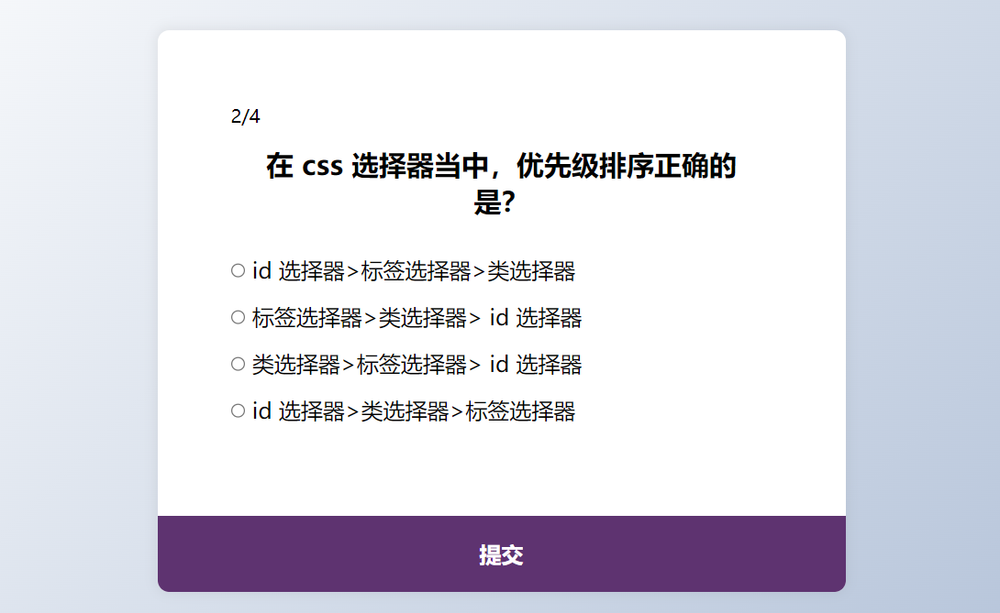
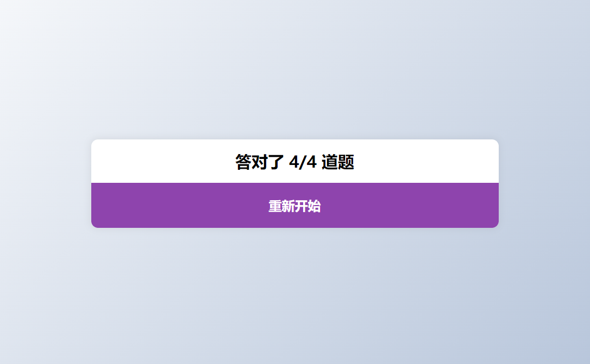

# 46-Quiz App(问答卡片)

## 效果





## 代码

```html
<div class="quiz-container" id="quiz">
  <div class="quiz-header">
    <span id="currentQuestion">1/4</span>
    <h2 id="question">问题</h2>
    <ul>
      <li>
        <input type="radio" name="answer" id="a" class="answer" />
        <label for="a" id="a_text">选项</label>
      </li>

      <li>
        <input type="radio" name="answer" id="b" class="answer" />
        <label for="b" id="b_text">选项</label>
      </li>

      <li>
        <input type="radio" name="answer" id="c" class="answer" />
        <label for="c" id="c_text">选项</label>
      </li>

      <li>
        <input type="radio" name="answer" id="d" class="answer" />
        <label for="d" id="d_text">选项</label>
      </li>
    </ul>
  </div>
  <button id="submit">提交</button>
</div>
```

```css
* {
  margin: 0;
  padding: 0;
  box-sizing: border-box;
}

body {
  display: flex;
  height: 100vh;
  background-color: #b8c6db;
  background-image: linear-gradient(315deg, #b8c6db 0%, #f5f7fa 100%);
  align-items: center;
  justify-content: center;
  overflow: hidden;
  margin: 0;
}

.quiz-container {
  background-color: #fff;
  border-radius: 10px;
  box-shadow: 0 0 10px 2px rgba(100, 100, 100, 0.1);
  width: 600px;
  overflow: hidden;
}

.quiz-header {
  padding: 4rem;
}

h2 {
  padding: 1rem;
  text-align: center;
  margin: 0;
}

ul {
  list-style: none;
  padding: 0;
}

ul li {
  font-size: 1.2rem;
  margin: 1rem 0;
}

ul li label {
  cursor: pointer;
}

button {
  background-color: #8e44ad;
  color: #fff;
  border: none;
  display: block;
  width: 100%;
  cursor: pointer;
  font-size: 1.2rem;
  font-weight: 700;
  padding: 1.3rem;
}

button:hover {
  background-color: #732d91;
}

button:focus {
  outline: none;
  background-color: #5e3370;
}
```

```js
const quizData = [
  {
    question: '哪个语言能够运行在浏览器上？',
    a: 'Java',
    b: 'C',
    c: 'Python',
    d: 'JavaScript',
    correct: 'd'
  },
  {
    question: '在 css 选择器当中，优先级排序正确的是？',
    a: ' id 选择器>标签选择器>类选择器',
    b: '标签选择器>类选择器> id 选择器',
    c: '类选择器>标签选择器> id 选择器',
    d: ' id 选择器>类选择器>标签选择器',
    correct: 'd'
  },
  {
    question: '在html中,样式表按照应用方式可以分为三种类型,其中不包括',
    a: '内嵌样式表',
    b: '行内样式表',
    c: '外部样式表文件',
    d: '类样式表',
    correct: 'd'
  },
  {
    question:
      '如果函数无明确的返回值,或调用了没有参数的return语句,那么它真正返回的值是',
    a: 'null',
    b: '-1',
    c: '0',
    d: 'undefined',
    correct: 'd'
  }
]

const quiz = document.getElementById('quiz')
const answerEls = document.querySelectorAll('.answer')
const questionEl = document.getElementById('question')
const a_text = document.getElementById('a_text')
const b_text = document.getElementById('b_text')
const c_text = document.getElementById('c_text')
const d_text = document.getElementById('d_text')
const submitBtn = document.getElementById('submit')
const currentQuestion = document.getElementById('currentQuestion')

let currentQuiz = 0
let score = 0

loadQuiz()

function loadQuiz() {
  deselectAnswers()

  const currentQuizData = quizData[currentQuiz]

  questionEl.innerText = currentQuizData.question
  a_text.innerText = currentQuizData.a
  b_text.innerText = currentQuizData.b
  c_text.innerText = currentQuizData.c
  d_text.innerText = currentQuizData.d
  currentQuestion.innerHTML = `${currentQuiz + 1}/${quizData.length}`
}

function deselectAnswers() {
  answerEls.forEach((answerEl) => (answerEl.checked = false))
}

function getSelected() {
  let answer

  answerEls.forEach((answerEl) => {
    if (answerEl.checked) {
      answer = answerEl.id
    }
  })
  return answer
}

submitBtn.addEventListener('click', () => {
  const answer = getSelected()

  if (answer) {
    if (answer === quizData[currentQuiz].correct) {
      score++
    }
    currentQuiz++
    if (currentQuiz < quizData.length) {
      loadQuiz()
    } else {
      quiz.innerHTML = `
        <h2>答对了 ${score}/${quizData.length} 道题</h2>
        <button onclick="location.reload()">重新开始</button>
      `
    }
  }
})
```

## 解析

### loadQuiz()函数

```js
currentQuestion.innerHTML = `${currentQuiz + 1}/${quizData.length}`
```

显示当前第几题


### getSelected()函数

```js
answerEls.forEach((answerEl) => {
  if (answerEl.checked) {
    answer = answerEl.id
  }
})
```

遍历所有选项，如果用户点击了选项，则将选选项的`id`传递给`answer`

