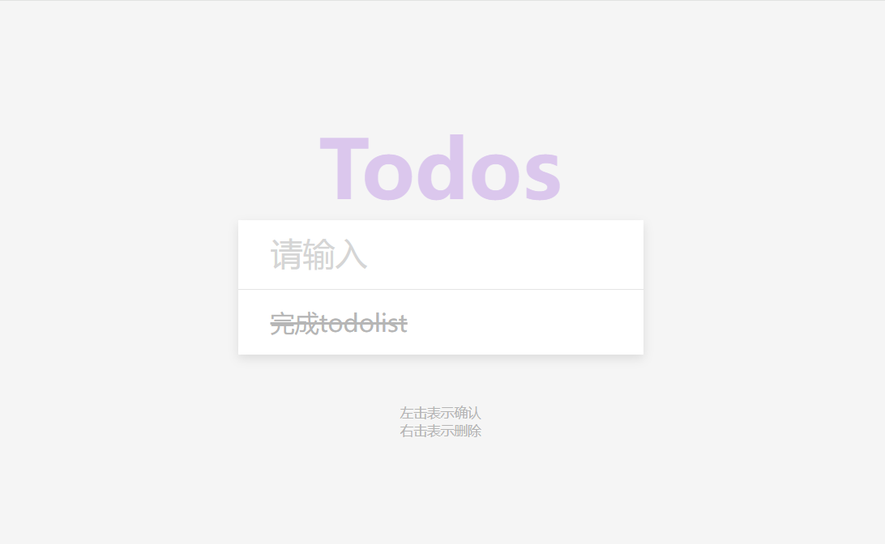

# 49-Todo List(待办事项清单)

## 效果



## 代码

```html
<h1>Todos</h1>
<form id="form">
  <input
         type="text"
         class="input"
         id="input"
         placeholder="请输入"
         autocomplete="off"
         />
  <ul class="todos" id="todos"></ul>
</form>
<small>左击表示确认<br />右击表示删除</small>
```

```css
* {
  margin: 0;
  padding: 0;
  box-sizing: border-box;
}

body {
  background-color: #f5f5f5;
  color: #444;
  display: flex;
  flex-direction: column;
  align-items: center;
  justify-content: center;
  height: 100vh;
}

h1 {
  color: rgb(179, 131, 226);
  font-size: 5rem;
  text-align: center;
  opacity: 0.4;
}

form {
  box-shadow: 0 4px 10px rgba(0, 0, 0, 0.1);
  max-width: 100%;
  width: 400px;
}

.input {
  border: none;
  color: #444;
  font-size: 2rem;
  padding: 1rem 2rem;
  display: block;
  width: 100%;
}

.input::placeholder {
  color: #d5d5d5;
}

.input:focus {
  outline-color: rgb(179, 131, 226);
}

.todos {
  background-color: #fff;
  padding: 0;
  margin: 0;
  list-style: none;
}

.todos li {
  border-top: 1px solid #e5e5e5;
  cursor: pointer;
  font-size: 1.5rem;
  padding: 1rem 2rem;
}

.todos li.completed {
  color: #b6b6b6;
  text-decoration: line-through;
}

small {
  color: #b5b5b5;
  margin-top: 3rem;
  text-align: center;
}
```

```js
const form = document.getElementById('form')
const input = document.getElementById('input')
const todosUL = document.getElementById('todos')

const todos = JSON.parse(localStorage.getItem('todos'))

if (todos) {
  todos.forEach((todo) => {
    addTodo(todo)
  })
}

form.addEventListener('submit', (e) => {
  e.preventDefault()
  addTodo()
})

function addTodo(todo) {
  let todoText = input.value

  if (todo) {
    todoText = todo.text
  }

  if (todoText) {
    const todoEl = document.createElement('li')
    if (todo && todo.completed) {
      todoEl.classList.add('completed')
    }
    todoEl.innerText = todoText

    todoEl.addEventListener('click', () => {
      todoEl.classList.toggle('completed')
      updateLS()
    })

    todoEl.addEventListener('contextmenu', (e) => {
      e.preventDefault()
      todoEl.remove()
      updateLS()
    })
    todosUL.appendChild(todoEl)

    input.value = ''
    updateLS()
  }
}

function updateLS() {
  const todosEl = document.querySelectorAll('li')

  const todos = []

  todosEl.forEach((todoEl) => {
    todos.push({
      text: todoEl.innerText,
      completed: todoEl.classList.contains('completed')
    })
  })
  localStorage.setItem('todos', JSON.stringify(todos))
}
```

