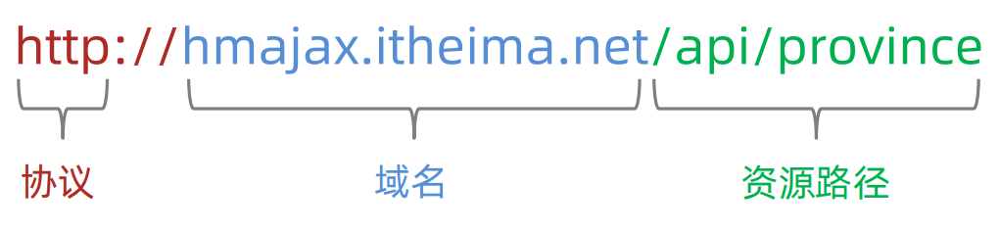
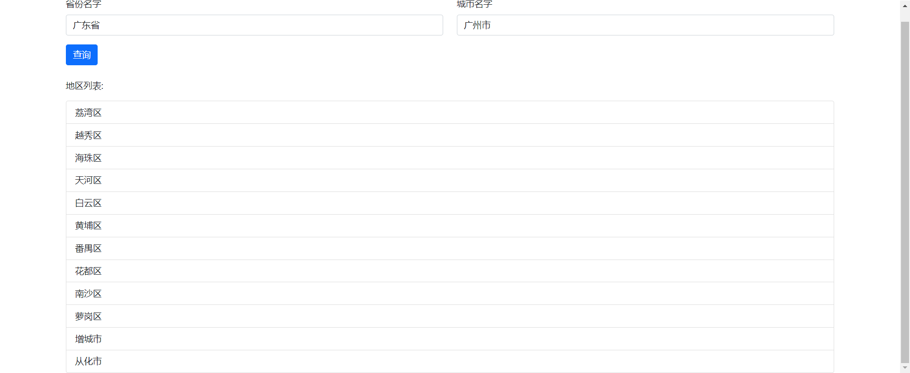
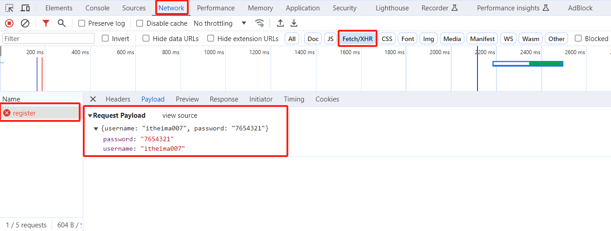

# 一、AJAX 入门

## AJAX 概念和 axios 使用

### 什么是 AJAX？

AJAX，全程是 Asynchronous JavaScript And XML，就是异步的 JavaScript和XML，其实就是浏览器于服务器进行的数据通信的技术。而且得益于它的异步特性，使得它可以在不重新刷新页面的情况下与服务器交换数据或者更新页面。

### 怎么用 AJAX？

1. 使用 axios 库
2. 手搓 XMLHttpRequest 

### axios 使用

1. 引入 axios.js: https://cdn.jsdelivr.net/npm/axios/dist/axios.min.js
2. 使用 axios 函数
   + 传入配置对象
   + 再用 `.then` 回调函数接收结果，并做后续处理

```html
<body>
  <p class="my-p"></p>
  <script src="https://cdn.jsdelivr.net/npm/axios/dist/axios.min.js"></script>
  <script>
  	axios({
      url: 'http://ajax-api.itheima.net/api/province'
    }).then(result => {
      console.log(result)
      console.log(result.data.data)
      
      document.querySelector('.my-p').innerHTML = result.data.data.join('<br>')
    })
  </script>
</body>
```

:::warning 注意

如果提示引用不了，可以点击 https://cdn.jsdelivr.net/npm/axios/dist/axios.min.js 链接直接下载下来，然后通过本地引用的方式引用axios。

:::

## 认识 URL

什么是URL？官方定义是 统一资源定位符，简称网址，即是访问网络上的资源。

### URL的组成



+ 协议：规定浏览器和服务器之间传输数据的格式
+ 域名：标记服务器在互联网中方位
+ 资源路径：标记资源在服务器下的具体位置

## URL 查询参数

一般像这种 `http://xxxx.com/xx/xxx?参数名1=值1&参数名2=值2` 这种地址，后面代表的是浏览器提供给服务器的额外信息，让服务器返回浏览器想要的数据。

因此，我们在使用 `axios` 的时候，可以通过它来查询参数。

**语法：**

```js
axios({
  url: '目标资源地址',
  params: {
    参数名: 值
  }
}).then(result => {
  // 对服务器返回的数据做后续处理
})
```

示例：

```html
<body>
  <p></p>
  <script src="./axios.min.js"></script>
  <script>
  	axios({
      url: 'http://hmajax.itheima.net/api/city',
      params: {
        pname: '河北省'
      }
    }).then(result => {
      console.log(result.data.list) // 打印出这个省份的城市
      
      document.querySelector('p').innerHTML = result.data.list.join('<br>')
    })
  </script>
</body>
```


## 小案例 - 地区查询

### 需求

根据输入的省份名字和城市名字，查询地区并渲染列表

### 代码

1. 框架

```html
<head>
  <style>
    :root {
      font-size: 15px;
    }

    body {
      padding-top: 15px;
    }
  </style>
</head>

<body>
  <div class="container">
    <form id="editForm" class="row">
      <!-- 输入省份名字 -->
      <div class="mb-3 col">
        <label class="form-label">省份名字</label>
        <input type="text" value="北京" name="province" class="form-control province" placeholder="请输入省份名称" />
      </div>
      <!-- 输入城市名字 -->
      <div class="mb-3 col">
        <label class="form-label">城市名字</label>
        <input type="text" value="北京市" name="city" class="form-control city" placeholder="请输入城市名称" />
      </div>
    </form>
    <button type="button" class="btn btn-primary sel-btn">查询</button>
    <br><br>
    <p>地区列表: </p>
    <ul class="list-group">
      <!-- 示例地区 -->
      <li class="list-group-item">东城区</li>
    </ul>
  </div>
  <script src="./axios.min.js"></script>
</body>
```

2. 逻辑代码

```html
<script>
	const btn = document.querySelector('.btn-primary.sel-btn')
  btn.addEventListener('click', () => {
    let pName = document.querySelector('.province').value
    let cName = document.querySelector('.city').value
    axios({
      url: 'http://hmajax.itheima.net/api/area',
      params: {
        pname: pName,
        cname: cName
      }
    }).then(result => {
      let list = result.data.list
      let theList = list.map(areaName => {`
				<li class="list-group-item">${areaName}</li>
			`}).join('')
      
      document.querySelector('.list-group').innerHTML = theLi
    })
  })
</script>
```



## 常用请求方法和数据提交

### 常用请求方法

对服务器资源，要执行的操作

| 请求方法 | 操作             |
| -------- | ---------------- |
| GET      | 获取数据         |
| POST     | 数据提交         |
| PUT      | 修改数据（全部） |
| DELETE   | 删除数据         |
| PATCH    | 修改数据（部分） |

**语法：**

```js
axios({
  url: '目标资源地址',
  method: '请求方法',
  data: {
    参数名: 值
  }
}).then(result => {
  // 对服务器返回的数据做后续处理
})
```

示例：

```html
<body>
  <button class="btn">注册用户</button>
  <script>
    const btn = document.querySelector('.btn')
    btn.addEventListener('click', () => {
      axios({
        url: 'http://hmajax.itheima.net/api/register',
        method: 'post',
        data: {
          username: 'itheima276',
          password: '123456'
        }
      }).then(result => {
        console.log(result);
      })
    })
  </script>
</body>
```

### axios 错误处理

以上的代码运行以后，你会发现出现了报错信息。因为这个账号已经被注册了。当然，普通用户并不会去通过 F12 打开查看报错信息，因此需要一种更加直观的方式给用户展示错误信息。

**语法：**

```js
axios({
  // 请求选项
}).then(result => {
  // 处理数据
}).catch(error => {
  // 处理错误
})
```

示例：

```html
<script>
	// 接着上面的代码继续写
  ...
  axios({
    ...
  }).then(result => {
    ....
  }).catch(error => {
    alert(error.response.data.message)
  })
</script>
```

## HTTP协议 - 报文

请求报文：浏览器按照 HTTP 协议要求的格式，发送给服务器的内容

### 组成部分

1. 请求行：请求方法，URL，协议
2. 请求头：以键值对的格式携带的附加信息，比如：Content-Type
3. 空行：分隔请求头，空行之后的是发送给服务器的资源
4. 请求体：发送的资源

### 怎么查看



### 错误排查步骤

当你在使用axios 的时候发现了错误信息，可以遵照以下顺序排查错误原因

1. 确认输入的账号和密码无误
2. 打开请求报文查看值是否传输正确

### 响应报文

1. 相应行（状态行）：协议、HTTP 响应状态码，状态信息
2. 响应头：以键值对的格式携带的附加信息，比如： Content-type
3. 空行：分隔响应头，空行之后的是服务器返回的资源
4. 响应体：返回的资源

### 响应状态码

一般用来表明请求是否成功完成

| 状态码 |    说明    |
| :----: | :--------: |
|  1xx   |    信息    |
|  2xx   |    成功    |
|  3xx   | 重定向信息 |
|  4xx   | 客户端错误 |
|  5xx   | 服务端错误 |

## 接口文档

接口文档：描述接口的文章

接口：使用AJAX和服务器通讯时，使用的 UTL，请求方法，医技参数

关于这次 [AJAX阶段接口文档](https://apifox.com/apidoc/shared-1b0dd84f-faa8-435d-b355-5a8a329e34a8)

## 案例 - 用户登录

### 需求

1. 点击登录时，判断用户名和密码长度
2. 提交数据和服务器通信
3. 提示信息

### 代码

部署前，先下载好 [bootstrap](https://getbootstrap.com/docs/4.3/getting-started/download/) 和 axios

1. 静态框架

```html
<head>
  <link rel="stylesheet" href="./bootstrap.min.css">
  <!-- 公共 -->
  <style>
    html,
    body {
      background-color: #EDF0F5;
      width: 100%;
      height: 100%;
      display: flex;
      justify-content: center;
      align-items: center;
    }

    .container {
      width: 520px;
      height: 540px;
      background-color: #fff;
      padding: 60px;
      box-sizing: border-box;
    }

    .container h3 {
      font-weight: 900;
    }
  </style>
  <!-- 表单容器和内容 -->
  <style>
    .form_wrap {
      color: #8B929D !important;
    }

    .form-text {
      color: #8B929D !important;
    }
  </style>
  <!-- 提示框样式 -->
  <style>
    .alert {
      transition: .5s;
      opacity: 0;
    }

    .alert.show {
      opacity: 1;
    }
  </style>
</head>

<body>
  <div class="container">
    <h3>欢迎-登录</h3>
    <!-- 登录结果-提示框 -->
    <div class="alert alert-success" role="alert">
      提示消息
    </div>
    <!-- 表单 -->
    <div class="form_wrap">
      <form>
        <div class="mb-3">
          <label for="username" class="form-label">账号名</label>
          <input type="text" class="form-control username">
        </div>
        <div class="mb-3">
          <label for="password" class="form-label">密码</label>
          <input type="password" class="form-control password">
        </div>
        <button type="button" class="btn btn-primary btn-login"> 登 录 </button>
      </form>
    </div>
  </div>
  <script src="./axios.min.js"></script>
</body>
```

2. 点击登录时，判断用户名和密码长度

```html
<script>
	const btn = document.querySelector('.btn-login')
  btn.addEventListener('click', () => {
    const username = document.querySelector('.username').value
    const password = document.querySelector('.password').value
    
    if (username.length < 8) {
      return
    }
    if (password.length < 6) {
      return
    }
  })
</script>
```

3. 提交数据和服务器通信

```html
<script>
	...
  axios({
    url: 'http://hmajax.itheima.net/api/login',
    method: 'post',
    data: {
      username,
      password
    }
  })
</script>
```

4. 提示信息

```html
<script>
	const myAlert = document.querySelector('.alert')
  function alertFn(msg, isSuccess) {
    myAlert.classList.add('show')
    myAlert.innerText = msg
    const bgStyle = isSuccess ? 'alert-success' : 'alert-danger'
    myAlert.classList.add(bgStyle)
    
    setTimeout(() => {
      myAlert.classList.remove('show')
      myAlert.classList.remove(bgStyle)
    }, 2000)
  }
  
  if (username.length < 8) {
      alertFn('用户名必须大于等于8位', false)
      return
    }
  if (password.length < 6) {
    alertFn('密码必须大于等于6位', false)
    return
  }

  axios({
    ...
  }).then(result => {
    alertFn(result.data.message, true)
  }).catch(error => {
    alertFn(error.response.data.message, false)
  })
</script>
```

## form-serialize 插件

作用：快速手机表单元素的值

示例：

```html
<body>
  <form action="javascript:;" class="example-form">
    <input type="text" name="username">
    <br>
    <input type="text" name="pwd">
    <br>
    <input type="button" class="btn" value="提交">
  </form>
  <!-- 
    目标：在点击提交时，使用form-serialize插件，快速收集表单元素值
  -->
  <script src="./lib/form-serialize.js"></script>
  <script>
    document.querySelector('.btn').addEventListener('click', () => {
      const form = document.querySelector('.example-form')
      // hash 设置获取数据结构
      // 	- true: JS对象(推荐)
      //  - false: 查询字符串
      // empty 设置是否获取空值
      //  - true: 获取控制(推荐)
      //  - false: 不获取空值
      const data = serialize(form, { hash: true, empty: true })
      console.log(data);
    })
  </script>
</body>
```

输出结果：


其中，里面的键是根据标签里面的 `name` 属性来决定的。


