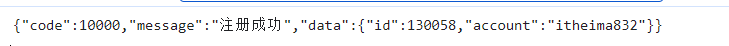
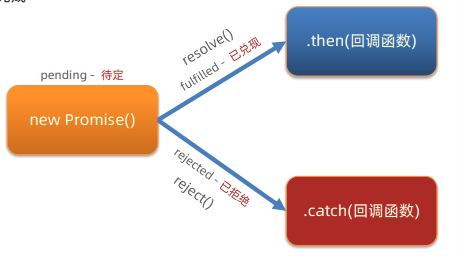
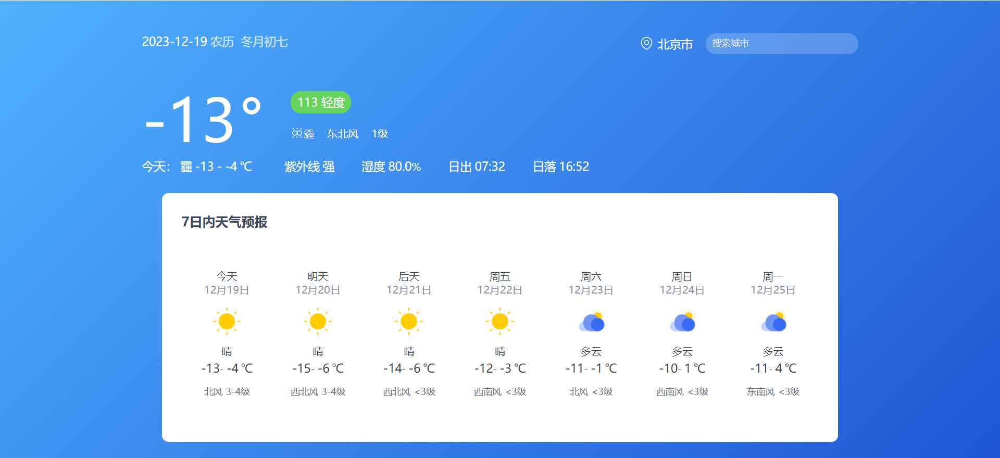
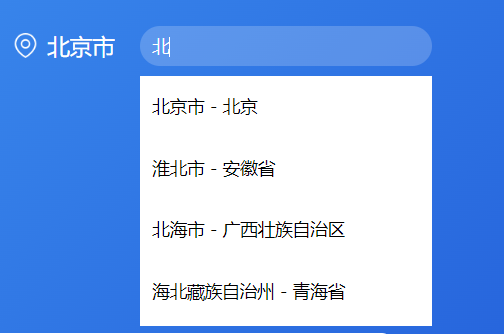
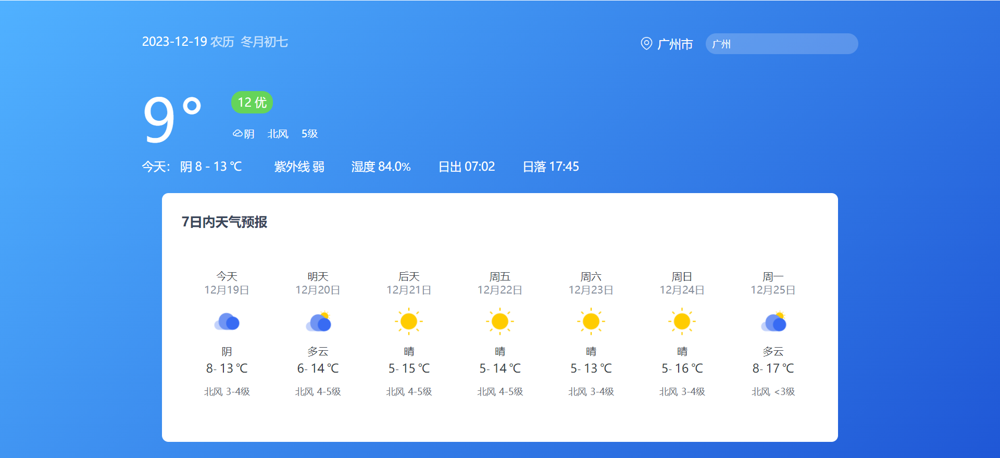

# 三、AJAX原理

## XMLHttpRequest

`XMLHttpRequet`，简称 `XHR`，可以用于与服务器交互。

`XHR` 是在 `axios` 里面的，有的时候一些静态网页并不需要那么大的代码量，发送的请求只有一两次的话，就可以直接使用 `XHR`，两三行代码就可以搞定了。

### 步骤

1. 创建 `XMLHttpRequest` 对象
2. 配置请求方法和请求 `url` 地址
3. 监听 `loadend` 事件，接收响应结果
4. 发起请求

### 语法

```js
const xhr = new XMLHttpRequest()
xhr.open('请求方法', '请求url网址')
xhr.addEventListener('loadend', () => {
  console.log(xhr.response)
})
xhr.send()
```

示例：

```html
<body>
  <p class="my-p"></p>
  <script>
    const xhr = new XMLHttpRequest()
    xhr.open('get', 'http://hmajax.itheima.net/api/province')
    xhr.addEventListener('loadend', () => {
      // console.log(xhr.response);
      const data = JSON.parse(xhr.response)
      // console.log(data.list.join('<br>'));
      document.querySelector('.my-p').innerHTML = data.list.join('<br>')
    })
    xhr.send()
  </script>
</body>
```

### XMLHttpRequest - 查询参数

#### 语法

`http://xxxx.com/xxx/xxx?参数名1=值1&参数名2=值2` 

#### 小案例 - 地区查询

```js
const selBtn = document.querySelector('.sel-btn')
selBtn.addEventListener('click', () => {
  const pname = document.querySelector('.province').value
  const cname = document.querySelector('.city').value
  
  const qObj = {
    pname,
    cname
  }
  
  const paramsObj = new URLSearchParams(qObj)
  const queryString = paramsObj.toString()
  
  const xhr = new XMLHttpRequest()
  xhr.open('get', `http://hmajax.itheima.net/api/area?${queryString}`)
  xhr.addEventListener('loadend', () => {
    const data = JSON.parse(xhr.response)
    const htmlStr = data.list.map(areaName => {
      return `<li class="list-group-item">${areaName}</li>`
    }).join('')
    document.querySelector('.list-group').innerHTML = htmlStr
  })
  xhr.send()
})
```

### XMLHttpRequest - 数据提交

> 请求头设置 Content-Type: application/json
>
> 请求体携带 JSON 字符串

#### 语法

```js
const xhr = new XMLHttpRequest()
xhr.open('请求方法', '请求url网址')
xhr.addEventListener('loadend', () => {
  console.log(xhr.response)
})

xhr.setRequestHeader('Content-Type', 'application/json')
const user = { username: 'itheima007', password: '7654321' }
const userStr = JSON.stringify(user)
xhr.send(userStr)
```

示例：

```html
<body>
  <button class="reg-btn">注册用户</button>
  <script>
    document.querySelector('.reg-btn').addEventListener('click', () => {
      const xhr = new XMLHttpRequest()
      xhr.open('post', 'http://hmajax.itheima.net/api/register')
      xhr.addEventListener('loadend', () => {
        console.log(xhr.response);
      })
      xhr.setRequestHeader('Content-Type', 'application/json')
      const userObj = {
        username: 'itheima832',
        password: '7654321'
      }
      const userStr = JSON.stringify(userObj)
      xhr.send(userStr)
    })
  </script>
</body>
```



## Promise

管理异步操作的代码，获取异步操作成功或者失败的结果。

### 步骤

1. 创建 Promise 对象
2. 执行异步任务并传递结果
   1. 成功调用：resolve（值）触发then() 执行
   2. 失败调用：reject（值）触发 catch() 执行
3. 接收结果

### 语法

```js
const p = new Promise((resolve, reject) => {
  // 执行异步任务并传递结果
	// 1. 成功调用：resolve（值）触发then() 执行
	// 2. 失败调用：reject（值）触发 catch() 执行
})
p.then(result => {
  // 成功
}).catch(error => {
  // 失败
})
```

示例

```js
const p = new Promise((resolve, reject) => {
  setTimeout(() => {
    // resolve('模拟成功结果')
    reject(new Error('模拟失败结果'))
  }, 2000);
})
p.then(res => {
  console.log(res);
}).catch(err => {
  console.log(err);
})
```


### Promise - 三种状态

一个 Promise 对象，必然处于以下几种状态之一

+ 待定 (pending)：初始状态，既没有被兑现，也没有被拒绝
+ 已兑现(fulfilled)：意味着，操作成功完成
+ 已拒绝(rejected)：意味着，操作失败



::: warning 注意

Promise 对象一旦被兑现 / 拒绝就是已敲定了，状态无法再被改变

:::

## 封装简易版 axios

### 需求

基于 Promise + XHR 封装 myAxios 函数，获取省份列表展示

### 步骤

1. 定义 myAxios 函数，接收配置对象，返回 Promise 对象
2. 发起 XHR 请求，默认请求方法位 GET
3. 调用成功/失败的处理程序
4. 使用 myAxios 函数，获取省份列表展示

### 语法

#### 简易版

```js
function myAxios(config) {
  return new Promise((res, rej) => {
    // XHR 请求
    // 调用成功/失败的处理程序
  })
}
myAxios({
  url: '目标资源地址'
}).then(res => {
  
}).catch(err => {
  
})
```

#### 较完整版

```js
function myAxios(config) {
  return new Promise((resolve, reject) => {
    const xhr = new XMLHttpRequest()

    if (config.params) {
      const paramsObj = new URLSearchParams(config.params)
      const queryString = paramsObj.toString()
      config.url += `?${queryString}`
    }
    xhr.open(config.method || 'GET', config.url)

    xhr.addEventListener('loadend', () => {
      if (xhr.status >= 200 && xhr.status < 300) {
        resolve(JSON.parse(xhr.response))
      } else {
        reject(new Error(xhr.response))
      }
    })

    if (config.data) {
      const jsonStr = JSON.stringify(config.data)
      xhr.setRequestHeader('Content-Type', 'application/json')
      xhr.send(jsonStr)
    } else {
      xhr.send()
    }
  })
}
```

示例

```js
function myAxios(config) {
  return new Promise((res, rej) => {
    const xhr = new XMLHttpRequest()
    xhr.open(config.method || 'get', config.url)
    xhr.addEventListener('loadend', () => {
      if (xhr.status >= 200 && xhr.status < 300) {
        res(JSON.parse(xhr.response))
      } else {
        rej(new Error(xhr.response))
      }
    })
    xhr.send()
  })
}
```

## 案例 - 天气预报

### 步骤

1. 默认显示-北京市天气
   1. 获取北京市天气数据
   2. 数据展示到页面
2. 搜索城市列表
   1. 绑定 input 事件，获取关键字
   2. 获取展示城市列表数据
3. 切换城市的天气
   1. 绑定城市点击事件，获取城市code值
   2. 调用获取并显示天气的函数

### 代码实现

1. 默认显示 - 北京市天气

```js
function getWeather(cityCode) {
  myAxios({
    url: 'http://hmajax.itheima.net/api/weather',
    params: {
      city: cityCode
    }
  }).then(res => {
    // console.log(res);
    const wObj = res.data
    // 阳历和农历日期
    const dateStr = `
      <span class="dateShort">${wObj.date}</span>
      <span class="calendar">农历&nbsp;
        <span class="dateLunar">${wObj.dateLunar}</span>
      </span>
    `
    document.querySelector('.title').innerHTML = dateStr
    // 城市名字
    document.querySelector('.area').innerHTML = wObj.area
    // 当天气温
    const nowWStr = `
      <div class="tem-box">
        <span class="temp">
          <span class="temperature">${wObj.temperature}</span>
          <span>°</span>
        </span>
      </div>
      <div class="climate-box">
        <div class="air">
          <span class="psPm25">${wObj.psPm25}</span>
          <span class="psPm25Level">${wObj.psPm25Level}</span>
        </div>
        <ul class="weather-list">
          <li>
            
            <span class="weather">${wObj.weather}</span>
          </li>
          <li class="windDirection">${wObj.windDirection}</li>
          <li class="windPower">${wObj.windPower}</li>
        </ul>
      </div>
    `
    document.querySelector('.weather-box').innerHTML = nowWStr
    // 当天天气
    const twObj = wObj.todayWeather
    const todayWStr = `
      <div class="range-box">
          <span>今天：</span>
          <span class="range">
            <span class="weather">${wObj.weather}</span>
            <span class="temNight">${twObj.temNight}</span>
            <span>-</span>
            <span class="temDay">${twObj.temDay}</span>
            <span>℃</span>
          </span>
        </div>
        <ul class="sun-list">
          <li>
            <span>紫外线</span>
            <span class="ultraviolet">${twObj.ultraviolet}</span>
          </li>
          <li>
            <span>湿度</span>
            <span class="humidity">${twObj.humidity}</span>%
          </li>
          <li>
            <span>日出</span>
            <span class="sunriseTime">${twObj.sunriseTime}</span>
          </li>
          <li>
            <span>日落</span>
            <span class="sunsetTime">${twObj.sunsetTime}</span>
          </li>
        </ul>
      </div>
    `
    document.querySelector('.today-weather').innerHTML = todayWStr
    // 7日天气预报数据显示
    const dayForecast = wObj.dayForecast
    const dayForecastStr = dayForecast.map(item => {
      return `
        <li class="item">
          <div class="date-box">
            <span class="dateFormat">${item.dateFormat}</span>
            <span class="date">${item.date}</span>
          </div>
          
          <span class="weather">${item.weather}</span>
          <div class="temp">
            <span class="temNight">${item.temNight}</span>-
            <span class="temDay">${item.temDay}</span>
            <span>℃</span>
          </div>
          <div class="wind">
            <span class="windDirection">${item.windDirection}</span>
            <span class="windPower">${item.windPower}</span>
          </div>
        </li>
      `
    }).join('')
    document.querySelector('.week-wrap').innerHTML = dayForecastStr
  })
}
getWeather('110100')
```



2. 搜索城市列表

```js
document.querySelector('.search-city').addEventListener('input', e => {
  // console.log(e.target.value);
  myAxios({
    url: 'http://hmajax.itheima.net/api/weather/city',
    params: {
      city: e.target.value
    }
  }).then(res => {
    const liStr = res.data.map(item => {
      return `<li class="city-item" data-code="${item.code}">${item.name}</li>`
    }).join('')
    document.querySelector('.search-list').innerHTML = liStr
  })
})
```



3. 切换城市天气

```js
document.querySelector('.search-list').addEventListener('click', e => {
  if (e.target.classList.contains('city-item')) {
    const cityCode = e.target.dataset.code
    console.log(cityCode);
    getWeather(cityCode)
  }
})
```

