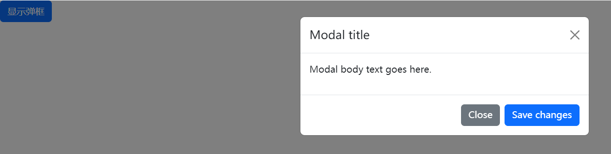
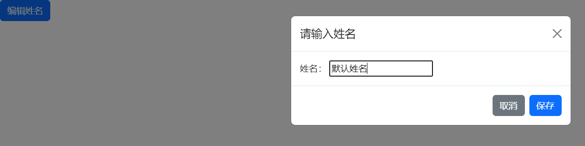
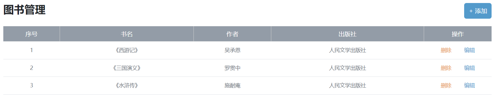
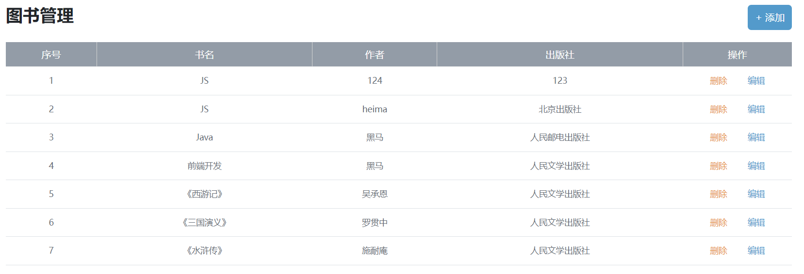
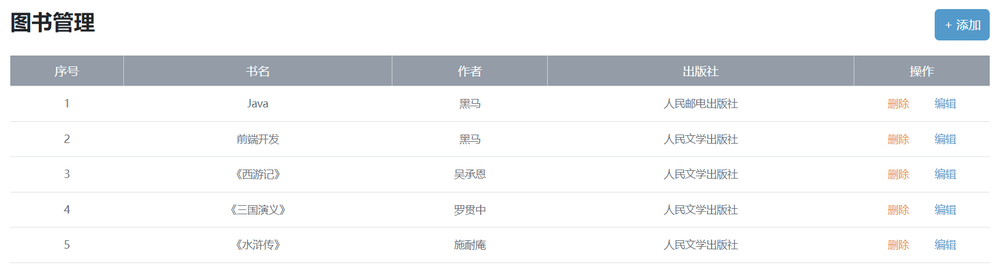
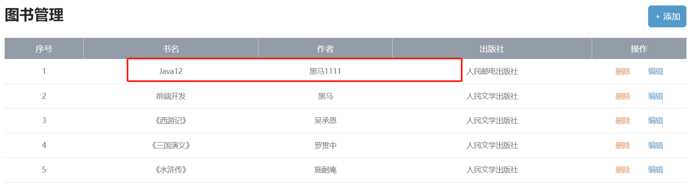
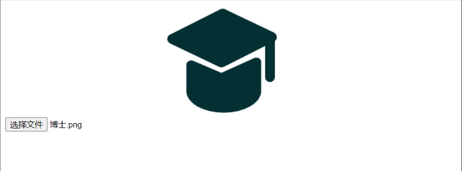
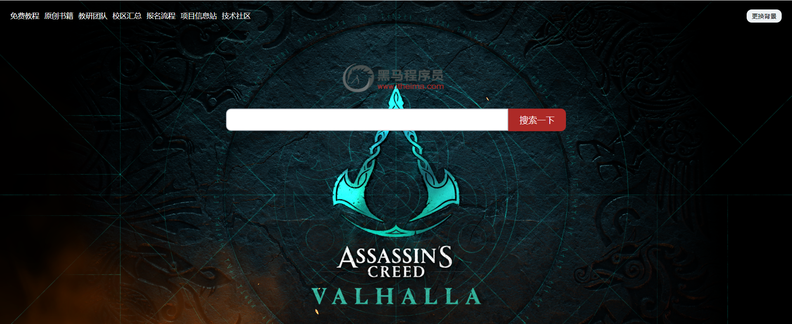
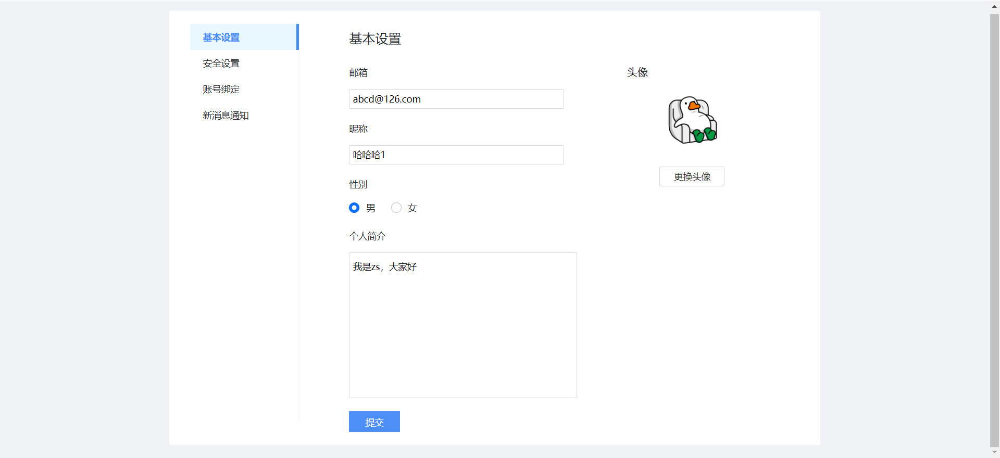

# 二、AJAX综合案例

## 案例 - 图书管理

### 步骤

1. Bootstrap 弹框
2. 渲染列表（查）
3. 新增图书（增）
4. 删除图书（删）
5. 编辑图书（改）

### Bootstrap 弹框

#### 功能

不离开当前页面，显示单独内容，供用户操作

#### 通过属性控制

##### 步骤

1. 引入 bootstrap.css 和 bootstrap.js
2. 准备弹框标签，确认结构
3. 通过自定义属性，控制弹框的显示和隐藏

##### 代码实现

```html
<head>
  <!-- 1. 引入 bootstrap.css -->
  <link href="https://cdn.jsdelivr.net/npm/bootstrap@5.2.2/dist/css/bootstrap.min.css" rel="stylesheet">
</head>

<body>
  <!-- 3. 通过自定义属性，控制弹框的显示和隐藏 -->
  <!-- data-bs-toggle="modal" 用于触发模态框的显示与隐藏 -->
  <!-- data-bs-target=".my-box" 通过赋值控制器元素的属性绑定所需要显示的弹框 -->
  <button type="button" class="btn btn-primary" data-bs-toggle="modal" data-bs-target=".my-box">
    显示弹框
  </button>
  
	<!-- 2. 准备弹框标签（上网复制） -->  
  <div class="modal my-box" tabindex="-1">
    <div class="modal-dialog">
      <div class="modal-content">
        <div class="modal-header">
          <h5 class="modal-title">Modal title</h5>
          <!-- data-bs-dismiss="modal" 控制当前弹框隐藏 -->
          <button type="button" class="btn-close" data-bs-dismiss="modal" aria-label="Close"></button>
        </div>
        <div class="modal-body">
          <p>Modal body text goes here.</p>
        </div>
        <div class="modal-footer">
          <button type="button" class="btn btn-secondary" data-bs-dismiss="modal">Close</button>
          <button type="button" class="btn btn-primary">Save changes</button>
        </div>
      </div>
    </div>
  </div>
  
  <!-- 1. 引入 bootstrap.js -->
  <script src="https://cdn.jsdelivr.net/npm/bootstrap@5.2.2/dist/js/bootstrap.min.js"></script>
</body>
```



#### 通过JS控制

##### 步骤

1. 创建弹框对象
2. 调用弹框对象内置方法
   + `show()` 显示
   + `hide()` 隐藏

##### 代码实现

```html
<script>
	// 1. 创建弹框对象
  const modalBox = document.querySelector('.name-box')
  const modal = new bootstrap.Modal(modalBox)
  
  const editBtn = document.querySelector('.edit-btn')
  editBtn.addEventListener('click', () => {
    document.querySelector('.username').value = '默认姓名'
    // 2. 调用弹框对象内置方法 show()
    modal.show()
  })
  
  const saveBtn = document.querySelector('.save-btn')
  saveBtn.addEventListener('click', () => {
    const username = document.querySelector('.username').value
    // 3. 调用弹框对象内置方法 hide()
    modal.hide()
  })
</script>
```



### 渲染列表（查）

#### 步骤

1. 获取数据
2. 渲染数据

```js
const creator = 'zs'

function getBookList() {
  axios({
    url: 'https://hmajax.itheima.net/api/books',
    params: {
      creator
    }
  }).then(result => {
    const bookList = result.data.data
    const htmlStr = bookList.map((item, index) => {
      return `
				<tr>
          <td>${index + 1}</td>
          <td>${item.bookname}</td>
          <td>${item.author}</td>
          <td>${item.publisher}</td>
          <td>
            <span class="del">删除</span>
            <span class="edit">编辑</span>
          </td>
        </tr>
			`
    }).join('')
    document.querySelector('.list').innerHTML = htmlStr
  })
}

getBookList()
```



### 新增图书（增）

#### 步骤

1. 新增弹框 => 显示和隐藏
2. 收集表单数据，并提交到服务器保存
3. 刷新图书列表

#### 代码实现

```js
const addModalDom = document.querySelector('.add-modal')
const addModal = new bootstrap.Modal(addModalDom)

const addBtn = document.querySelector('.add-btn')
addBtn.addEventListener('click', () => {
  const addForm = document.querySelector('.add-form')
  const bookObj = serialize(addForm, { hash: true, empty: true })
  axios({
    url: 'https://hmajax.itheima.net/api/books',
    method: 'post',
    data: {
      ...bookObj,
      creator
    }
  }).then(result => {
    getBooksList()
    addForm.reset()
    addModal.hide()
  })
})
```



### 删除图书（删）

#### 步骤

1. 删除元素绑定点击事件 -> 获取图书id
2. 调用删除接口
3. 刷新图书列表

#### 代码实现

```js
function getBooksList() {
  axios({
    ...
  }).then(result => {
    ...,
    const htmlStr = bookList.map((item, index) => {
    	return `
				...,
				<td data-id=${item.id}>
			`
  	})
  })
}

const list = document.querySelector('.list')
list.addEventListener('click', e => {
  const theId = e.target.parentNode.dataset.id
  axios({
    url: `https://hmajax.itheima.net/api/books/${theId}`,
    method: 'delete'
  }).then(() => {
    getBooksList()
  })
})
```



### 编辑图书（改）

#### 步骤

1. 编辑弹框 => 显示和隐藏
2. 获取当前编辑图书数据 => 回显到编辑表单中
3. 提交保存修改，并刷新列表

#### 代码实现

```js
const editDom = document.querySelector('.edit-modal')
const editModal = new bootstrap.Modal(editDom)

list.addEventListener('click', e=> {
  const theId = e.target.parentNode.dataset.id
  // 删除
  ...,
  
  // 编辑
  if (e.target.classList.contains('edit')) {
    axios({
      url: `https://hmajax.itheima.net/api/books/${theId}`,
      const keys = Object.keys(bookObj)
    	keys.forEach(key => {
        document.querySelector(`.edit-form .${key}`).value = bookObj[key]
      })
    })
    editModal.show()
  }
})

const editBtn = document.querySelector('.edit-btn')
editBtn.addEventListener('click', () => {
  const editForm = document.querySelector('.edit-form')
  const { id, bookname, author, publisher } = serialize(editForm, { hash: true, empty: true })
  
  axios({
    url: `https://hmajax.itheima.net/api/books/${id}`,
    method: 'put',
    data: {
      bookname,
      author,
      publisher,
      creator
    }
  }).then(() => {
    getBooksList()
    editmodal.hide()
  })
})
```



## 图片上传

### 步骤

1. 获取图片文件对象
2. 使用 `FormData` 携带图片文件
3. 提交表单数据到服务器，使用图片 url 网址

### 代码实现

```html
<body>
  <input type="file" class="upload">
  
  
  <script>
  	const upload = document.querySelector('.upload')
    upload.addEventListener('change', e => {
      const fd = new FormData()
      fd.append('img', e.target.files[0])
      
      axios({
        url: 'https://hmajax.itheima.net/api/uploadimg',
        method: 'post',
        data: fd
      }).then(result => {
        const imgUrl = result.data.data.url
        document.querySelector('.my-img').src = imgUrl
      })
    })
  </script>
</body>
```



## 案例 - 网站换肤

### 步骤

1. 选择图片上传，设置 `body` 背景
2. 上传成功时，保存 `url` 网址
3. 网页运行时，获取 `url` 网址使用

### 代码实现

```js
document.querySelector('.bg-ipt').addEventListener('change', e => {
  const fd = new FormData()
  fd.append('img', e.target.files[0])
  axios({
    url: 'https://hmajax.itheima.net/api/uploadimg',
    method: 'post',
    data: fd
  }).then(result => {
    const imgUrl = result.data.data.url
    document.body.style.backgroundImage = `url(${imgUrl})`
    localStorage.setItem('bgimg', imgUrl)
  })
})

const bgUrl = localStorage.getItem('bgImg')
bgUrl && (document.body.style.backgroundImage = `url(${bgUrl})`)
```



## 案例 - 个人信息设置

### 步骤

1. 信息渲染
   1. 获取用户的数据
   2. 回显数据到标签上
2. 头像修改
   1. 获取头像文件
   2. 提交服务器并更新头像
3. 提交表单
   1. 收集表单信息
   2. 提交到服务器保存
4. 结果提示
   1. 创建 toast 对象
   2. 调用 show 方法 -> 显示提示框

### 代码实现

1. 信息渲染

```js
const creator = 'zs'

axios({
  url: 'https://hmajax.itheima.net/api/settings',
  params: {
    creator
  }
}).then(result => {
  const userObj = result.data.data
  Object.keys(userObj).forEach(key => {
    if (key === 'avatar') {
      document.querySelector('.prew').src = userObj[key]
    } else if (key === 'gender') {
      const gRadioList = document.querySelectorAll('.gender')
      const gNum = userObj[key]
      gRadioList[gNum].checked = true
    } else {
      document.querySelector(`.${key}`).value = userObj[key]
    }
  })
})
```

2. 头像修改

```js
const upload = document.querySelector('.upload')
upload.addEventListener('change', e => {
  const fd = new FormData()
  fd.append('avatar', e.target.files[0])
  fd.append('creator', creator)
  
  axios({
    url: 'https://hmajax.itheima.net/api/avatar',
    method: 'put',
    data: fd
  }).then(result => {
    const imgUrl = result.data.data.avatar
    document.querySelector('.prew').src = imgUrl
  })
})
```

3. 提交表单

```js
const submit = document.querySelector('.submit')
submit.addEventListener('click', () => {
  const userForm = document.querySelector('.user-form')
  const userObj = seriallize(userForm, { hash: true, empty: true })
  userObj.creator = creator
  userObj.gender = (+userObj.gender)
  
  axios({
    url: 'https://hmajax.itheima.net/api/settings',
    method: 'put',
    data: userObj
  })
})
```

4. 结果显示 - 提示框

```js
axios({
  ...
}).then(result => {
  const toastDom = document.querySelector('.my-toast')
	const toast = new bootstrap.Toast(toastDom)
  toast.show()
})
```



