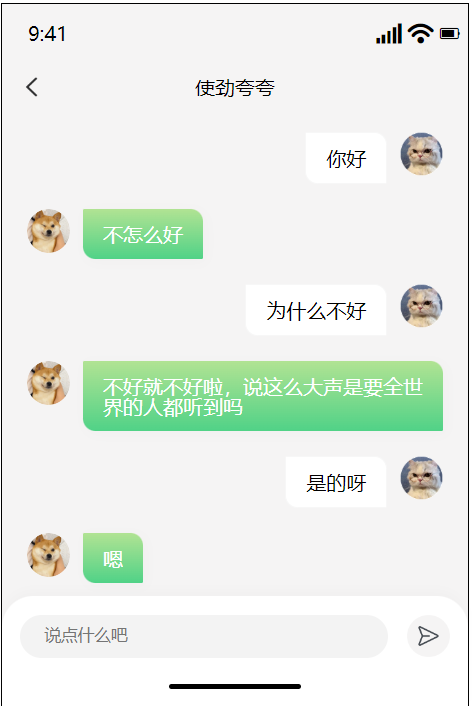
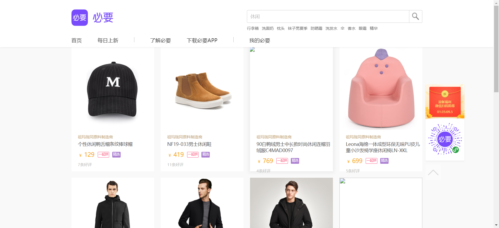

# 作业 - 1

## 客观题

https://ks.wjx.top/vm/OrYaZ1x.aspx# 

## 主观题

1. 微信聊天

#### 要求

1. 点击发送和敲击回车键，都能发送聊天消息
2. 把自己和对方消息都展示到页面上
3. 当聊天消息出现滚动条时，始终让最后一条消息出现在视口范围内

接口文档：https://apifox.com/apidoc/shared-1b0dd84f-faa8-435d-b355-5a8a329e34a8/api-82668104

#### 代码编写

1. 逻辑代码

```html
<script>
  let chatDiv = document.querySelector('.chat')
  let chatUL = document.querySelector('.chat_list')
  let sendInput = document.querySelector('.chat_input')

  let chatFn = () => {
    let sendText = sendInput.value
    chatUL.innerHTML += `
      <li class="right">
        <span>${sendText}</span>
        
      </li>
    `
    sendInput.value = ''
    chatDiv.scrollTop = chatDiv.scrollHeight
    axios({
      url: 'http://hmajax.itheima.net/api/robot',
      params: {
        spoken: sendText
      }
    }).then(result => {
      chatUL.innerHTML += `
        <li class="left">
          
          <span>${result.data.data.info.text}</span>
        </li>
      `
      chatDiv.scrollTop = chatDiv.scrollHeight
    })
  }

  const send = document.querySelector('.send_img')
  send.addEventListener('click', chatFn)

  document.querySelector('.chat_input').addEventListener('keyup', e => {
    if (e.keyCode === 13) {
      chatFn()
    }
  })
</script>
```



### 2. 必要商城搜索

#### 要求

1. 输入要搜索的关键字，点击放大镜搜索匹配商品

#### 代码

```html
<script>
  const btn = document.querySelector('#searchButton')
  btn.addEventListener('click', () => {
    let searchText = document.querySelector('#searchInp').value
    axios({
      url: 'https://hmajax.itheima.net/api-s/searchGoodsList',
      method: 'get',
      params: {
        searchText: searchText,
        page: 1,
        everyNum: 16
      }
    }).then(result => {
      // console.log(result);
      let ul = document.querySelector('.category-list')
      ul.innerHTML = result.data.list.data.map(obj => `
        <li>
          <a>
            <i>
              
            </i>
            <div class="supplier">祖玛珑同原料制造商</div>
            <div class="title">${obj.goodsName}</div>
            <div class="priceBox">
              <div class="price" price="${obj.goodsPrice}">
                <span style="color: #F7A701; font-size: 12px; padding-left: 2px;">￥<span style="font-size:18px;">
                    ${obj.goodsPrice}
                  </span>
                </span>
              </div>
              <div class="mack">
                <span style="color:#FB4C81;background:#FFFFFF; border-color:#FB4C81">一起拼</span>
                <span style="color:#FFFFFF;background:#AB7FD1; border-color:#AB7FD1">精选</span>
              </div>
            </div>
            <div class="evaluate">${obj.evalNum}条好评</div>
          </a>
        </li>
      `).join('')
    })
  })
</script>
```



## 排错题

一共有6处错误

```html
<script>
  // 获取提示框
  
  // 1. 第一个错误
  const myAlert = document.querySelector('alert')
  function alertFn(msg, isSuccess) {
    myAlert.classList.add('show')

    myAlert.innerText = msg
    const bgStyle = isSuccess ? 'alert-success' : 'alert-danger'
    myAlert.classList.add(bgStyle)

    setTimeout(() => {
      myAlert.classList.remove('show')
      myAlert.classList.remove(bgStyle)
    }, 2000)
  }

  document.querySelector('.btn-login').addEventListener('click', () => {
    // 2. 第二个错误
    const username = document.querySelector('.password').value
    const password = document.querySelector('.password').value

    if (username.length < 8) {
      alertFn('用户名必须大于等于8位', false)
      console.log('用户名必须大于等于8位')
      return
    }
    if (password.length < 6) {
      alertFn('密码必须大于等于6位', false)
      console.log('密码必须大于等于6位')
      return
    }

    axios({
      // 3. 第三个错误
      url: 'http://hmajax.itheima.net/api/lgoin',
      // 4. 第四个错误
      methods: 'POST',
      // 5. 第五个错误
      params: {
        // 6. 第六个错误
        user: username,
        password
      }
    }).then(result => {
      alertFn(result.data.message, true)
      console.log(result)
      console.log(result.data.message)
    }).catch(error => {
      alertFn(error.response.data.message, false)
      console.log(error)
      console.log(error.response.data.message)
    })
  })
</script>
```

答：

1. 类名写错了

```js
const myAlert = document.querySelector('.alert-success')
```

2. 用户名获取错误

```js
const username = document.querySelector('.username').value
```

3. 地址写错了

```js
axios({
  url: 'https://hmajax.itheima.net/api/login'
})
```

4. 单词拼写错误

```js
axios({
  url: ...,
  method: 'POST'
})
```

5. 应该用 `data` 传递参数，而不是用 `params` 查询参数

```js
axios({
  ...,
  data: {
  ...
	}
})
```

6. 键的名字错了

```js
axios({
  ...,
  data: {
  	username,
  	password
	}
})
```

## 一些面试题

https://lamphc.github.io/fe-up/#/