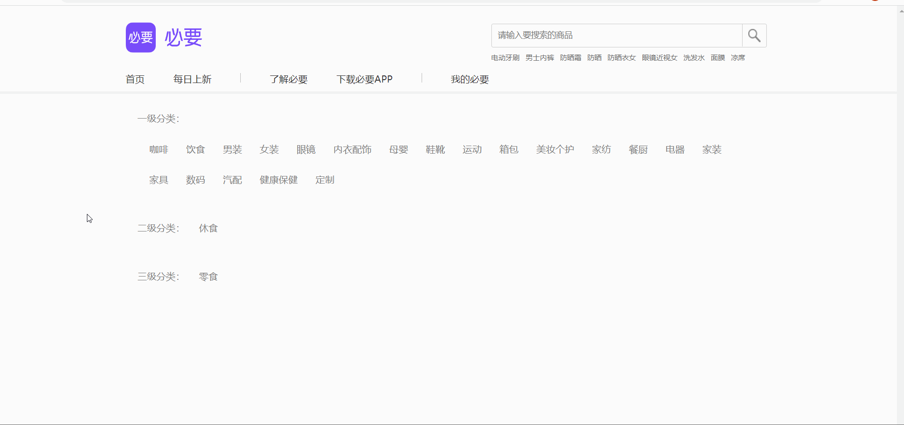
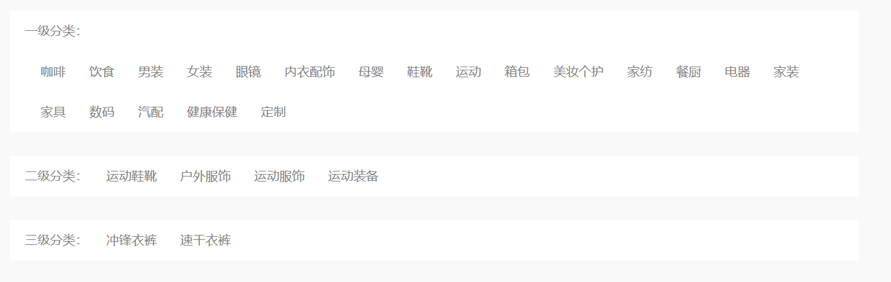

# 作业 - 2

## 客观题

https://ks.wjx.top/vm/tUvNXZ1.aspx# 

## 主观题

### 作业1 - 必要商城分类

#### 要求

1. 默认上来展示所有一级分类数据
2. 点击一级分类切换，展示下属二级分类数据
3. 点击二级分类分类，展示下属三级分类数据

#### 接口文档

https://apifox.com/apidoc/project-1937884/api-63647755

#### 接口地址

https://hmajax.itheima.net/api-s/categoryfirst

#### 效果如下



#### 实现步骤

1. 渲染一级分类
2. 监听一级分类点击事件，渲染二级列表
3. 监听二级分类点击事件，渲染三级列表

#### 代码实现

```js
const oneList = document.querySelector('#one')
const twoList = document.querySelector('#two')
const thirdList = document.querySelector('#three')

axios({
  url: 'https://hmajax.itheima.net/api-s/categoryfirst'
}).then(res => {
  oneList.innerHTML = res.data.list.map(obj => {
    return `<li data-id=${obj.firstId}>${obj.firstName}</li>`
  }).join('')
})

oneList.addEventListener('click', e => {
  if(e.target.tagName === 'LI') {
    let firstId = e.target.dataset.id
    axios({
      url: 'https://hmajax.itheima.net/api-s/categorySecond',
      params: {
        firstId
      }
    }).then(res => {
      twoList.innerHTML = res.data.list.map(obj => {
        return `<li data-id=${res.secondId}>${res.secondName}</li>`
      })
    }).join('')
  }
})

twoList.addEventListener('click', e => {
  if(e.target.tagName === 'LI') {
    let secondId = e.target.dataset.id
    axios({
      url: 'https://hmajax.itheima.net/api-s/categoryThird',
      params: {
        secondId
      }
    }).then(res => {
      thirdList.innerHTML = res.data.list.map(obj => {
        return `<li>${obj.thirdName}</li>`
      }).join('')
    })
  }
})
```



## 排错题

这个案例中有5处报错，改正后让代码正常完成更换背景图案例吧（刷新背景图也要在）

### 原代码

```js
// 第一个错误
document.querySelector('.bg-ipt').addEventListener('click', e => {
  // 1. 选择图片上传，设置body背景
  console.log(e.target.files[0])
  const fd = new FormData()
  fd.append('avatar', e.target.files[0])
  axios({
    url: 'http://hmajax.itheima.net/api/uploadimg',
    // 第二个错误
    method: 'PUT',
    data: fd
  }).then(result => {
    const imgUrl = result.data.data.url
    // 第三个错误
    document.body.style.backgroundImage = imgUrl

    // 2. 上传成功时，"保存"图片url网址
    localStorage.setItem('bgImg', imgUrl)
  })
})

// 3. 网页运行后，"获取"url网址使用
// 第四个错误
const bgUrl = localStorage.getItem('bg')
console.log(bgUrl)
// 第五个错误
bgUrl || (document.body.style.backgroundImage = `url(${bgUrl})`)
```

### 答

#### 第一个错误

这里应该是上传到服务器再去响应，所以应该改为 `change`

```js
document.querySelector('.bg-ipt').addEventListener('change', ...)
```

#### 第二个错误

查看接口文档这里应该是 `post`

```js
axios({
  url: ...,
  method: 'post'
})
```

#### 第三个错误

要改成url的形式

```js
document.body.style.backgroundImage = `url(${imgUrl})`
```

#### 第四个错误

拿缓存的名字错误

```js
const bgUrl = localStorage.getItem('bgImg')
```

#### 第五个错误

应该用逻辑与 && 判断

```js
bgUrl && (document.body.style.backgroundImage = `url(${bgUrl})`)
```

