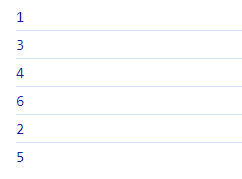
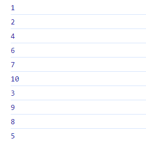
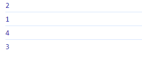
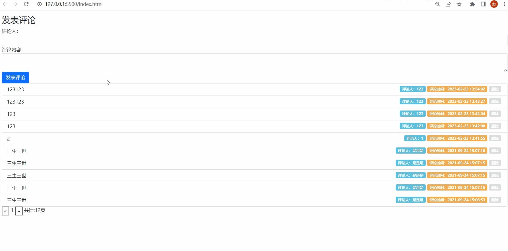
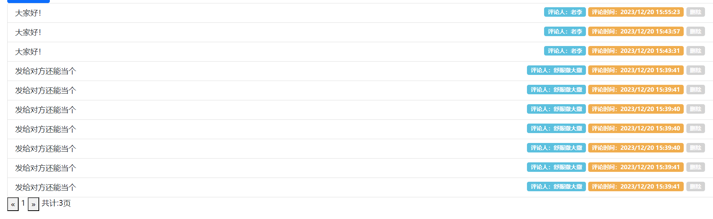
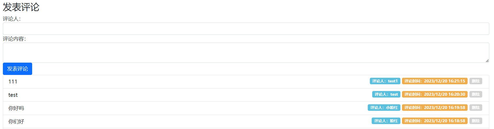
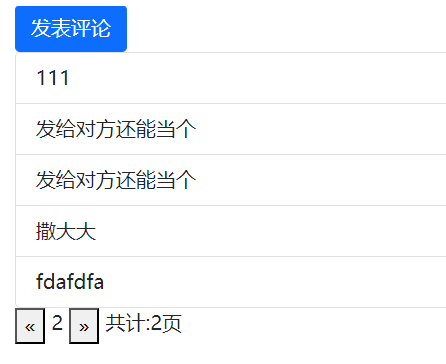

# 作业 - 4

## 客观题

https://ks.wjx.top/vm/miNp0Vr.aspx# 

## 主观题

### 事件循环面试题1

```html
<script>
  console.log(1)
  setTimeout(() => {
    console.log(2)
  }, 0)
  console.log(3)
</script>
<script>
  console.log(4)
  setTimeout(() => {
    console.log(5)
  }, 0)
  console.log(6)
</script>
```



### 事件循环面试题2

```js
console.log(1)
async function fnOne() {
  console.log(2)
  await fnTwo() // 右结合先执行右侧的代码, 然后等待
  console.log(3)
}
async function fnTwo() {
  console.log(4)
}
fnOne()
setTimeout(() => {
  console.log(5)
}, 2000)
let p = new Promise((resolve, reject) => { // new Promise()里的函数体会马上执行所有代码
  console.log(6)
  resolve()
  console.log(7)
})
setTimeout(() => {
  console.log(8)
}, 0)
p.then(() => {
  console.log(9)
})
console.log(10)
```



### 事件循环面试题3

```html
<body>
  <p>1</p>
  <script>
    // Twitter面试题-20%答对
    document.body.addEventListener('click', () => {
      let p = new Promise(resolve => resolve(1))
      p.then(result => console.log(result))
      console.log(2)
    })
    document.body.addEventListener('click', () => {
      let p = new Promise(resolve => resolve(3))
      p.then(result => console.log(result))
      console.log(4)
    })
  </script>
</body>
```



### 评论列表

#### 要求

1. 默认上来展示所有评论列表数据（注意不区分用户了）感受下大家数据互相影响，也可以看到别人评论
2. 新增评论功能
3. 删除评论功能
4. 分页切换评论列表数据功能
5. 删除最后一条评论，列表要自动回到上一页

#### 接口文档

https://apifox.com/apidoc/shared-1b0dd84f-faa8-435d-b355-5a8a329e34a8/api-87683414

#### 效果演示



#### 代码实现

1. 默认展示所有数据

```js
let page = 1
let allPage
function getCommentList() {
  axios({
    url: 'https://hmajax.itheima.net/api/cmtlist',
    params: {
      page
    }
  }).then(result => {
    allPage = result.data.allPage

    document.querySelector('.all-page').innerHTML = allPage
    document.querySelector('.my-page').innerHTML = page

    const listGroup = document.querySelector('.list-group')
    listGroup.innerHTML = ''
    const liObj = result.data.data
    const htmlStr = liObj.map(item => {
      const date = new Date(item.time)
      return `
        <li class="list-group-item">
          <span>${item.content}</span>
          <span class="badge del" style="cursor:pointer; background-color: lightgray;" data-id="${item.id}">删除</span> 
          <span class="badge" style="background-color: #F0AD4E;">评论时间：${date.toLocaleString()}</span>
          <span class="badge" style="background-color: #5BC0DE;">评论人：${item.username}</span>
        </li>
    `
    }).join('')
    listGroup.innerHTML = htmlStr
  })
}
getCommentList()
```



2. 新增评论功能

```js
const submitBtn = document.querySelector('.submit')
submitBtn.addEventListener('click', e => {
  e.preventDefault()

  const form = document.querySelector('.cmt-form')
  const data = serialize(form, { hash: true, empty: true })

  axios({
    url: 'https://hmajax.itheima.net/api/addcmt',
    method: 'post',
    data
  }).then(result => {
    // page = 1
    getCommentList()
    form.reset()
  })
})
```



3. 删除评论功能

```js
listGroup.addEventListener('click', e => {
  if (e.target.classList.contains('del')) {
    const theId = e.target.dataset.id
    console.log(theId);
    axios({
      url: `https://hmajax.itheima.net/api/delcmt?id=${theId}`
    }).then(res => {
      getCommentList()
    })
  }
})
```

4. 分页切换评论列表数据功能

```js
document.querySelector('.last').addEventListener('click', () => {
  if (page > 1) page--
  getCommentList()
})
document.querySelector('.next').addEventListener('click', () => {
  if (page < allPage) {
    page++
  }
  getCommentList()
})
```



5. 删除最后一条评论，列表要自动回到上一页

```js
listGroup.addEventListener('click', e => {
  axios({...}).then(res => {
		allPage = res.data.allPage
		if (page > allPage) page = allPage
    ...
		})
	}
})
```

## 排错题

有2处错误

```js
/**
 * 目标1：完成省市区下拉列表切换
 *  1.1 设置省份下拉菜单数据
 *  1.2 切换省份，设置城市下拉菜单数据，清空地区下拉菜单
 *  1.3 切换城市，设置地区下拉菜单数据
 */
// 1.1 设置省份下拉菜单数据
axios({
  url: 'http://hmajax.itheima.net/api/province'
}).then(result => {
  const optionStr = result.data.list.map(pname => `<option value="${pname}">${pname}</option>`).join('')
  document.querySelector('.province').innerHTML = `<option value="">省份</option>` + optionStr
})

// 1.2 切换省份，设置城市下拉菜单数据，清空地区下拉菜单
document.querySelector('.province').addEventListener('change', async e => {
  // 获取用户选择省份名字
  // console.log(e.target.value)
  const result = await axios({ url: 'http://hmajax.itheima.net/api/city', params: { pname: e.target.value } })
  // 第一个错误
  const optionStr = result.data.list.map(cname => {`<option value="${cname}">${cname}</option>`}).join('')
  // 把默认城市选项+下属城市数据插入select中
  document.querySelector('.city').innerHTML = `<option value="">城市</option>` + optionStr

  // 清空地区数据
  document.querySelector('.area').innerHTML = `<option value="">地区</option>`
})

// 1.3 切换城市，设置地区下拉菜单数据
document.querySelector('.city').addEventListener('change', async e => {
  console.log(e.target.value)
  // 第二处错误
  const result = await axios({
    url: 'http://hmajax.itheima.net/api/area', 
    data: {
      pname: document.querySelector('.province').value,
      cname: e.target.value
  }})
  console.log(result)
  const optionStr = result.data.list.map(aname => `<option value="${aname}">${aname}</option>`).join('')
  console.log(optionStr)
  document.querySelector('.area').innerHTML = `<option value="">地区</option>` + optionStr
})

/**
 * 目标2：收集数据提交保存
 *  2.1 监听提交的点击事件
 *  2.2 依靠插件收集表单数据
 *  2.3 基于axios提交保存，显示结果
 */
// 2.1 监听提交的点击事件
document.querySelector('.submit').addEventListener('click', async () => {
  // 2.2 依靠插件收集表单数据
  const form = document.querySelector('.info-form')
  const data = serialize(form, { hash: true, empty: true })
  console.log(data)
  // 2.3 基于axios提交保存，显示结果
  try {
    const result = await axios({
      url: 'http://hmajax.itheima.net/api/feedback',
      method: 'POST',
      data
    })
    console.log(result)
    alert(result.data.message)
  } catch (error) {
    console.dir(error)
    alert(error.response.data.message)
  }
  
})
```

### 第一个错误

第22行，有大括号就要有 `return` ，不然就不要大括号。

应改为

```js
const optionStr = result.data.list.map(cname => `<option value="${cname}">${cname}</option>`).join('')
```

### 第二个错误

第36行，应改为 `params` 而不是 `data` 

