# 四、AJAX 进阶

## 同步代码和异步代码

同步代码：逐行执行，需原地等待结果后，才会继续向下执行

异步代码：调用后耗时，不阻塞代码继续执行（不必原地等待），在将来完成后触发一个回调函数

## 回调函数地狱

在回调函数一直向下嵌套回调函数，形成回调函数地狱

```js
axios({ url: 'http://hmajax.itheima.net/api/province' }).then(res => {
  const pname = res.data.list[0]
  document.querySelector('.province').innerHTML = pname

  axios({ url: 'http://hmajax.itheima.net/api/city', params: { pname } }).then(res => {
    const cname = res.data.list[0]
    document.querySelector('.city').innerHTML = cname

    axios({ url: 'http://hmajax.itheima.net/api/area1', params: { pname, cname } }).then(res => {
      const areaName = res.data.list[0]
      document.querySelector('.area').innerHTML = areaName
    })
  })
}).catch(err => {
  console.dir(err)
})
```

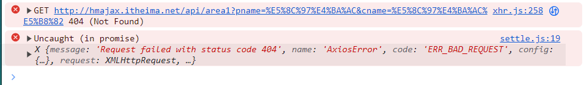

这样搞，会使得异常无法捕获，耦合性严重，牵一发动全身

## Promise - 链式调用

要想解决回调函数地狱的问题，可以试着用 Promise 的链式调用

它的原理是依靠 then() 方法返回一个新生成的 Promise 对象，继续串联下一环任务，直到结束。其中， then() 回调函数中的返回值，会直接影像新生成的 Promise 对象最终状态和结果。

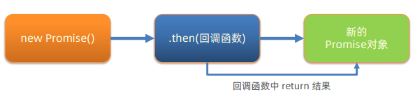

### 链式应用

使用每一个 Promise 对象中管理一个异步任务，用 then 返回 Promise 对象，串联起来

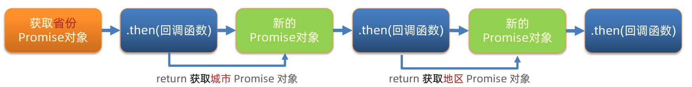

## async 和 await 使用

可以使用 `async` 和 `await` 写出基于 `Promise` 的异步行为，这样就不需要刻意调用链式 `Promise` 

怎么用？在 `async` 函数内，使用 `await` 关键字取代 `then` 函数，等待获取 `Promise` 对象成功状态的结果值。

示例：

```js
async function getData() {
  const pObj = await axios({ url: 'http://hmajax.itheima.net/api/province' })
  const pname = pObj.data.list[0]
  const cObj = await axios({ url: 'http://hmajax.itheima.net/api/city', params: { pname } })
  const cname = cObj.data.list[0]
  const areaObj = await axios({ url: 'http://hmajax.itheima.net/api/area', params: { pname, cname } })
  const areaName = areaObj.data.list[0]

  document.querySelector('.province').innerHTML = pname
  document.querySelector('.city').innerHTML = cname
  document.querySelector('.area').innerHTML = areaName
}

getData()
```

以上只是一个成功的案例，但是如果出错了，也有相应的方法捕获错误

### try...catch 捕获错误

#### 语法

```js
try {
  // 要执行的代码
} catch (error) {
  // error 接收的是错误信息
  // try里代码，如果有错误，直接进入这里执行
}
```

示例

```js
async function getData() {
  try {
    const pObj = await axios({ url: 'http://hmajax.itheima.net/api/province' })
    const pname = pObj.data.list[0]
    const cObj = await axios({ url: 'http://hmajax.itheima.net/api/city', params: { pname } })
    const cname = cObj.data.list[0]
    const aObj = await axios({ url: 'http://hmajax.itheima.net/api/area1', params: { pname, cname } })
    const areaName = aObj.data.list[0]

    document.querySelector('.province').innerHTML = pname
    document.querySelector('.city').innerHTML = cname
    document.querySelector('.area').innerHTML = areaName
  } catch (error) {
    console.dir(error)
  }
}
```

## 事件循环 - EventLoop

JavaScript 是单线程的，为了不阻塞 JS 引擎，从而设计执行的代码模型。

事件循环主要负责执行代码、收集和处理事件以及执行队列中的子任务。

太抽象了，举个代码例子看看。

```js
console.log(1)
setTimeout(() => {
  console.log(2)
}, 0)
console.log(3)
setTimeout(() => {
  console.log(4)
}, 2000)
console.log(5)
```

控制台输出

```txt
1  3  5  2  4
```

为什么是以这样的顺序输出呢？

先来明确几个概念，调用栈、宿主环境（浏览器）、任务队列。

+ 调用栈：每调用一次语句，解释器就会把这个语句或者函数添加到调用栈并开始执行
+ 宿主环境（浏览器）：JS 所能够使用的环境
+ 任务队列：不会被阻塞的环境

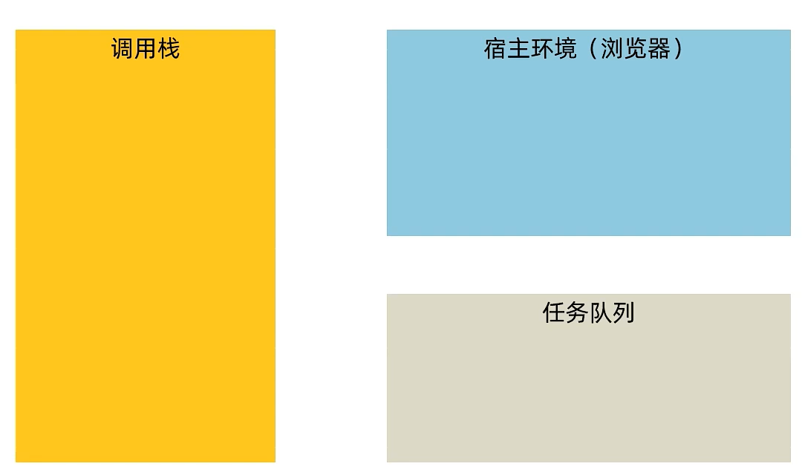

那么，从JS的特点可知，代码是从上往下执行的，当执行到 `console.log(1)` <sup>1</sup> 的时候，1 会被放到调用栈里面并立即执行出来；然后开始执行 `setTimeout(() => { console.log(2) }, 0)` <sup>2</sup> ，因为执行时间为0秒，所以 2 会先被放到宿主环境以后立即放到任务队列里面；然后以此类推，`console.log(3)` ，`console.log(5)` <sup>5</sup>  都会被放进调用栈里面并立即执行出来。当然，中间的 `setTimeout(() => { console.log(4) }, 2000)` <sup>4</sup> 因为要等待两秒，所以现在宿主环境等待两秒，这个时候因为 5 已经执行完毕了，所以就轮到 2 执行了，因此就打印出了2，接着再把4放进调用栈里面并执行。因此控制台输出的就是 `1  3  5  2  4` 。

### 宏任务与微任务

异步任务分为：

+ 宏任务：由浏览器环境执行的异步代码
+ 微任务：由 JS 引擎环境执行的异步代码

| 任务（代码）           | 执行所在环境 |
| ---------------------- | ------------ |
| JS脚本执行事件(script) | 浏览器       |
| setTimeout/setInterval | 浏览器       |
| AJAX 请求完成事件      | 浏览器       |
| 用户交互事件等         | 浏览器       |
| Promise对象.then()     | JS 引擎      |

::: warning 注意

Promise 本身是同步的，而 then 和 catch 回调函数是异步的

:::

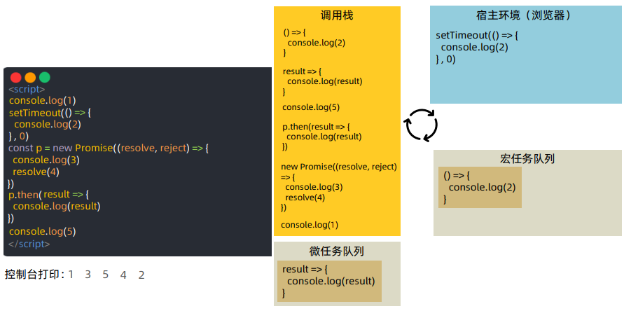

#### JS 内代码执行

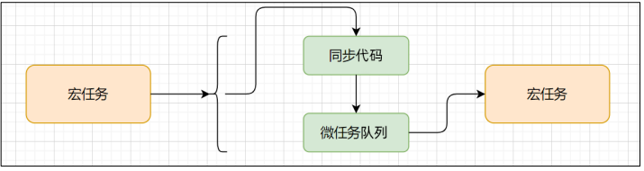

可以结合这个[视频](https://www.bilibili.com/video/BV1MN411y7pw/?p=56&spm_id_from=pageDriver&vd_source=ce2373d3d93ecee4088b1954ccc2db50)食用。

## Promise.all 静态方法

合并多个 Promise 对象，等待所有同时成功完成（或某一个失败），然后做后续逻辑。

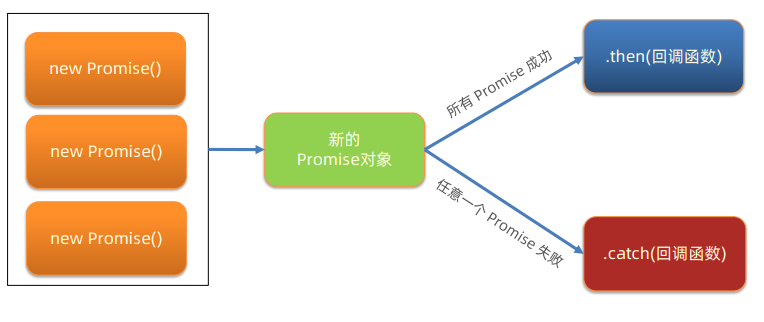

### 语法

```js
const p = Promise.all([Promise对象, Promise对象, ...])
p.then(result => {
  // result结果: [Promise对象成功结果, Promise对象成功结果, ...]
}).catch(error => {
  // 第一个失败的Promise对象，抛出异常
})
```

## 案例 - 商品分类

###  需求

尽可能同时展示所有商品分类到页面上

### 步骤

1. 获取所有的以及分类数据
2. 遍历 id，创建获取二级分类请求
3. 合并所有二级分类 Promise 对象
4. 等待同时成功，开始渲染页面

### 代码实现

```js
axios({
  url: 'http://hmajax.itheima.net/api/category/top'
}).then(result => {
  const secPromiseList = result.data.data.map(item => {
    return axios({
      url: 'http://hmajax.itheima.net/api/category/sub',
      params: {
        id: item.id // 一级分类id
      }
    })
  })
  const p = Promise.all(secPromiseList)
  p.then(result => {
    const htmlStr = result.map(item => {
      const dataObj = item.data.data
      return `
				<div class="item">
        <h3>${dataObj.name}</h3>
          <ul>
            ${dataObj.children.map(item => {
        	return `
              <li>
                <a href="javascript:;">
                  
                  <p>${item.name}</p>
                </a>
              </li>
              `
      }).join('')}
          </ul>
        </div>
			`
      document.querySelector('.sub-list').innerHTML = htmlStr
    })
  })
})
```

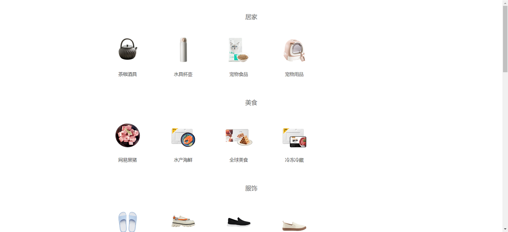

## 案例 - 学习反馈

### 需求

完成省市区切换效果

收集学习反馈数据，提交保存

### 步骤

1. 切换省市区效果
   1. 设置省份数据到下拉菜单
   2. 切换省份，设置城市数据到下拉菜单，并清空地区下来菜单
   3. 切换城市，设置地区数据到下拉菜单
2. 数据提交
   1. 监听提交按钮的点击事件
   2. 依靠插件收集表单数据
   3. 基于 axios 提交保存，显示结果

### 代码实现

1. 切换省市区效果

```js
const province = document.querySelector('.province')
const city = document.querySelector('.city')
const area = document.querySelector('.area')

axios({
  url: 'http://hmajax.itheima.net/api/province'
}).then(result => {
  const optionStr = result.data.list.map(pname => {
    return `<option value="${pname}">${pname}</option>`
  }).join('')
  province.innerHTML += optionStr
})

province.addEventListener('change', async e => {
  const result = await axios({
    url: 'http://hmajax.itheima.net/api/city',
    params: {
      pname: e.target.value
    }
  })
  const optionStr = result.data.list.map(cname => {
    return `<option value="${cname}">${cname}</option>`
  }).join('')
  city.innerHTML = `<option value="">城市</option>` + optionStr

  // 清空地区的数据
  area.innerHTML = `<option value="">地区</option>`
})

city.addEventListener('change', async e => {
  const result = await axios({
    url: 'http://hmajax.itheima.net/api/area',
    params: {
      pname: province.value,
      cname: e.target.value
    }
  })
  const optionStr = result.data.list.map(areaName => {
    return `<option value="${areaName}">${areaName}</option>`
  }).join('')
  area.innerHTML = `<option value="">地区</option>` + optionStr
})
```

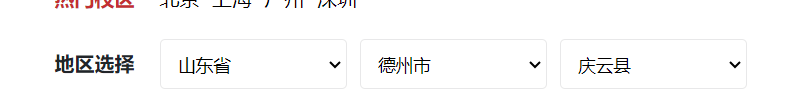

2. 数据提交

```js
const submitBtn = document.querySelector('.submit')
submitBtn.addEventListener('click', async () => {
  const form = document.querySelector('.info-form')
  const data = serialize(form, { hash: true, empty: true })

  try {
    const result = await axios({
      url: 'http://hmajax.itheima.net/api/feedback',
      method: 'post',
      data
    })
    alert(result.data.message)
  } catch (error) {
    alert(error.response.data.message)
  }
})
```

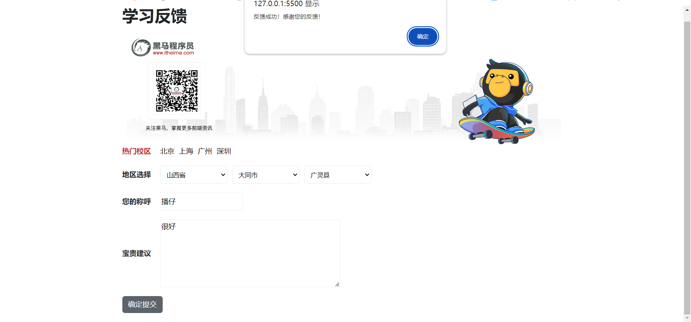

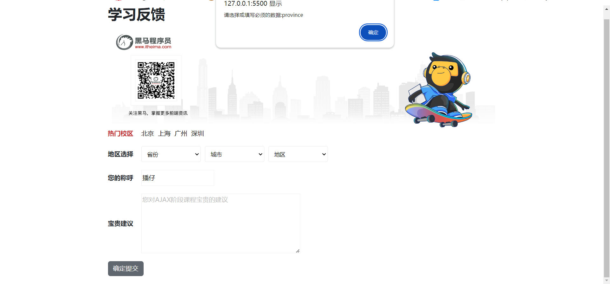