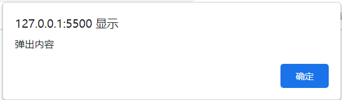
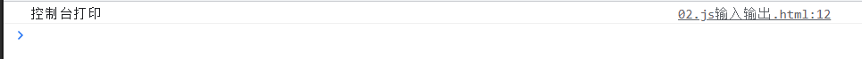
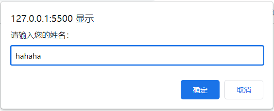
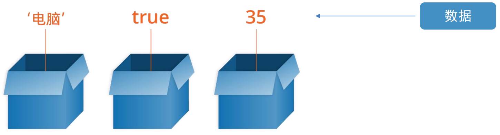
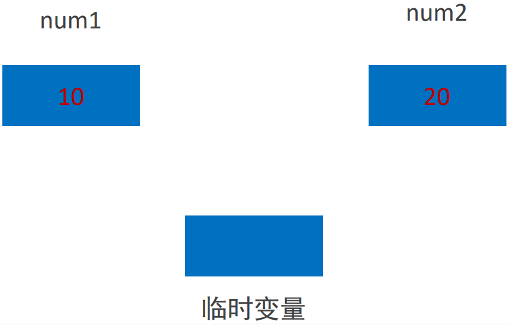
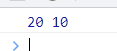
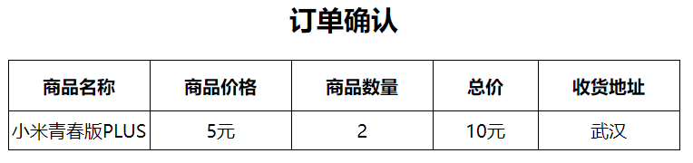

 # 一、基础语法

## 什么是JavaScript？

一种运行在客户端的编程语言，实现人机交互

### 有什么用？

+ 网页特效（监听用户行为做出反馈）
+ 表单验证（针对表单数据进行判断）
+ 数据交互（获取后端数据渲染到前端）
+ 服务端编程（node.js）

### 有什么？

+ ECMAScript
+ Web APIs: Dom + Bom

## 书写位置

+ 内部
+ 外部
+ 内联

### 内部

```html
<body>
  <script>
  	alert('内部js')
  </script>
</body>
```

### 外部

```html
<body>
  <script src="my.js"></script>
</body>
```

```js  title="./my.js"
alert('Hello, Js')
```

### 内联

```html
<body>
  <button onclick="alert('Hello JS')">
    按钮
  </button>
</body>
```

## JavaScript 输入输出语法

### 输出语法

1. 向 `body` 内输出内容

```html
<body>
  <script>
  	document.write('我是div标签')
  </script>
</body>
```


2. 页面弹出警告对话框

```html
<body>
  <script>
  	alert('弹出内容')
  </script>
</body>
```



3. 控制台输出

```html
<body>
  <script>
  	console.log('控制台打印')
  </script>
</body>
```



### 输入语法

```html
<body>
  <script>
  	prompt('请输入您的姓名：')
  </script>
</body>
```



::: tip JavaScript 代码执行顺序

1. 会按照HTML文档顺序执行代码
2.  `alert()` 和 `prompt()` 会跳过页面渲染先执行

:::

## 字面量

字面量是在计算机中描述  事/物

我们的工资是：`1000`，此时 `1000` 就是 数字字面量

`'你好'` 是 字符串字面量

`[]` 是 数组字面量

`{}` 是 对象字面量

## 变量

变量是计算机存储数据的 **“容器”**，就是一个装数据的盒子



其实本质就是程序再内存中申请的一块用来存放数据的小空间

### 基本使用

#### 声明变量

[变量详解](https://zhuanlan.zhihu.com/p/572278327)

在JavaScript中，声明变量的关键字有 `var`，`let`，声明常量的关键字是`const`

### 变量案例 - 交换变量的值（冒泡排序）

#### 核心思路

使用一个临时变量用来做中间存储



#### 步骤

1. 声明一个临时变量 temp
2. 把 num1 的值赋值给 temp
3. 把 num2 的值赋值给 num1
4. 把 temp 的值给 num2

#### 代码编写

```js
let num1 = 10
let num2 = 20
let temp = num1
num1 = num2
num2 = temp
console.log(num1, num2)
```



## 数组

### 基本使用

1. 声明语法

```js
let 数组名 = [数据1, 数据2, ..., 数据n]
```

2. 取值语法

```js
let names = ['小明', '小刚', '小红']
names[0] // 小明
names[1] // 小刚
```

3. 一些术语：

**元素：** 数组中保存的每个数据

**下标：** 数组中数据的编号

**长度：** 数组中数据的个数，通过数组 `length` 属性获取

## 常量

使用 `const` 来声明

## 常量与变量

简单点理解，`var` 关键字声明的变量是全局性的，所以现在一般不用了；`let` 关键字是块级作用域，声明之后后面还可以赋值；`const` 变量基本与 `let` 一致，只不过用 `const` 声明的是常量，即这个变量不会改变的时候就可以使用 `const` 声明，而且 `const` 只能在声明的时候赋值，后面不能再被赋值。

> `let` - 现在实际开发变量声明方式
>
> `var` - 以前的声明变量的方法，但是会有很多问题
>
> `const` - 类似于 `let` ，但是变量的值无法被修改

| 区别               | var                | let                | const              |
| ------------------ | ------------------ | ------------------ | ------------------ |
| 是否有块级作用域   | :x:                | :heavy_check_mark: | :heavy_check_mark: |
| 是否存在变量提升   | :heavy_check_mark: | :x:                | :x:                |
| 是否添加全局属性   | :heavy_check_mark: | :x:                | :x:                |
| 能否重复声明变量   | :heavy_check_mark: | :x:                | :x:                |
| 是否存在暂时性死区 | :x:                | :heavy_check_mark: | :heavy_check_mark: |
| 是否必须设置初始值 | :x:                | :x:                | :heavy_check_mark: |
| 能否改变指针指向   | :heavy_check_mark: | :heavy_check_mark: | :x:                |

::: tip 建议优先级

`const > let > var`

:::

## 数据类型

### 基本数据类型

+ number 数字型
+ string 字符串型
+ boolean 布尔型
+ undefined 未定义型
+ null 空类型

### 引用数据类型

+ object 对象

#### 基本数据类型 - 数字类型(Number)

::: tip 算术运算符的优先级

1. 优先级相同时从左到右执行
2. 乘 = 除 = 取余 > 加 = 减 (先乘除后加减)
3. 使用( )可以提升优先级

:::

NaN 代表一个计算错误。任何对 NaN 的操作都会返回 NaN

#### 基本数据类型 - 字符串类型(String)

**注意事项：**

1. 单引号双引号都行
2. 外双内单或者外单内双
3. 可以使用转义符 `\` 

##### 模板字符串

语法：

```js
document.write(`大家好，我叫${name}，今年${age}岁`)
```

#### 基本数据类型 - 布尔类型(boolean)

表示肯定或者否定

肯定是 true ，否定是 false

#### 基本数据类型 - 未定义类型(undefined)

如果只声明变量不赋值的情况下，一般变量的默认值是 undefined

#### 基本数据类型 - null (空类型)

null 和 undefined 最大的区别是null表示赋值了，但是内容为空，undefined表示没有赋值

一般情况下如果有一个变量里面存放一个对象，但是对象没有创建好的情况可以先给一个null

### 检测数据类型

可以使用 `typeof` 关键字进行检测

```js
let age = 19
let uname = '张三'
let flag = false
let buy

console.log(typeof age) // number
console.log(typeof uname) // string
console.log(typeof flag) // boolean
console.log(typeof buy) // undefined
```

## 类型转换

因为JavaScript是弱数据类型，JavaScript也不知道变量属于哪种数据类型，只有赋值了才能知道。如果这个时候使用了表单、prompt 等获取数据，那么这些数据默认是字符串类型，进行简单的加法运算就相当于把字符串结合起来了。

所以，类型转换其实就是把一种数据类型的变量转换成我们需要的数据类型

### 隐式转换

系统内部自动转换就是隐式转换

+ :heavy_plus_sign: 号两边只要有一个是字符串，都会把另一个转换成字符串

+ 除了​ :heavy_plus_sign: ，其他的算术运算符都会把数据转成数字类型

```js
console.log(11 + 11) // 22
console.log('11' + 11) // 1111
console.log(11 - 11) // 0
console.log('11' + 11) // 0
console.log(1 * 1) // 1
console.log('1' * 1) // 1
console.log(typeof '123') // string
console.log(typeof + '123') // number
console.log(+'11' + 11) // 22
```

### 显示转换

隐式转换大多数时候靠的是经验，经验这种东西就很容易出错，所以就有了显示转换，直接告诉代码你要转成什么类型

#### 转成数字型

+ Number(数据)
+ parseInt(数据)：只保留整数
+ parseFloat(数据)：可以保留小数

#### 转成字符型

+ String(数据)
+ 变量.toString (进制)

```js
// 数字型
let value
value = Number('20') // 20
value = parseInt('50.2314') // 50
value = parseFloat('50.34') // 50.34

// 字符型
value = String(1 + 2) // '3'
value = (20).toString() // '20'
```

## 用户订单信息案例

### 需求

用户输入商品价格和商品数量，以及收货地址，可以自动打印信息

### 代码编写

```html
<head>
  <style>
    h2 {
      text-align: center;
    }
    table {
      border-collapse: collapse;
      height: 80px;
      margin: 0 auto;
      text-align: center;
    }
    th {
      padding: 5px 30px
    }
    table,
    th,
    td {
      border: 1px solid #000
    }
  </style>
</head>

<body>
  <h2>
    订单确认
  </h2>

  <script>
  	let price = +prompt('请输入商品价格')
    let num = +prompt('请输入商品数量')
    let address = prompt('请输入收货地址')
    
    let total = price * num
    
    document.write(`
    <table>
      <tr>
        <th>商品名称</th>
        <th>商品价格</th>
        <th>商品数量</th>
        <th>总价</th>
        <th>收货地址</th>
      </tr>
      <tr>
        <td>小米手机青春PLUS</td>
        <td>${price}元</td>
        <td>${num}</td>
        <td>${total}元</td>
        <td>${adress}</td>
      </tr>
    </table>
		`)
  </script>
</body>
```

