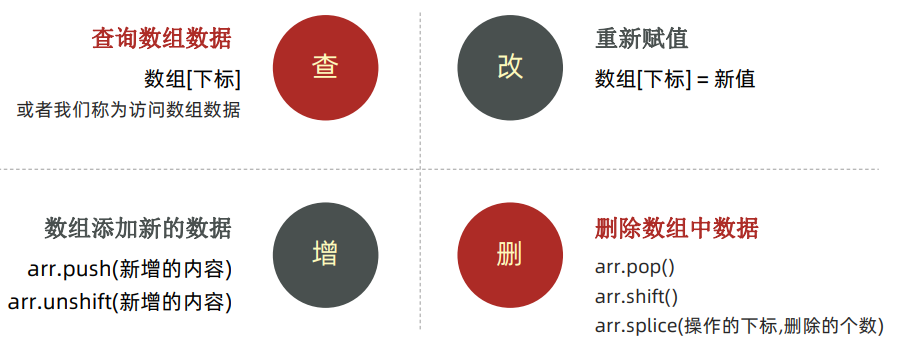
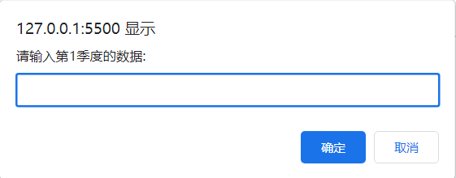
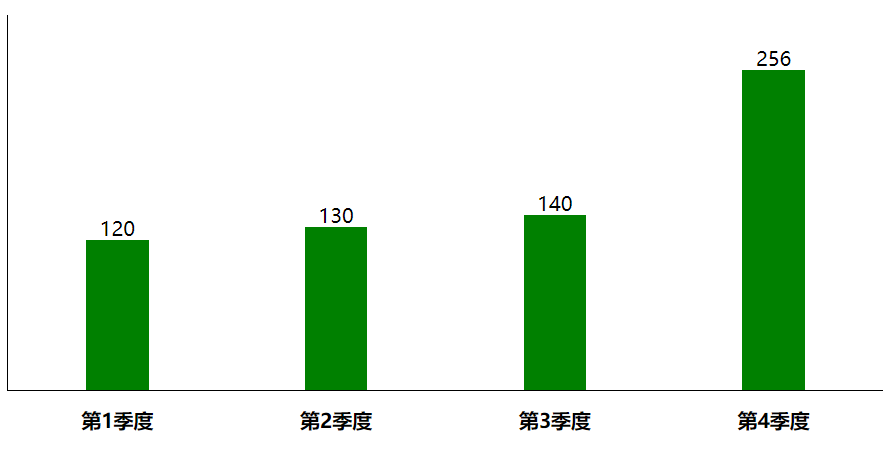
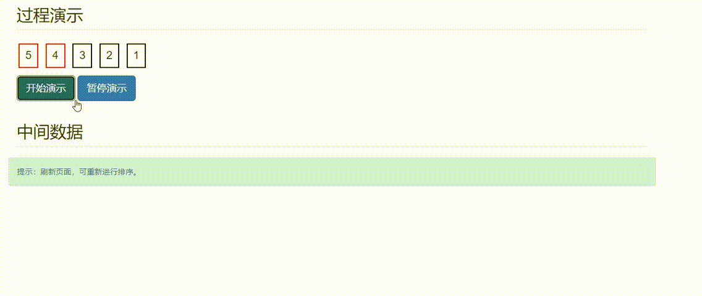

# 三、数组

## for循环

### 基本使用

#### 语法

```js
for (变量起始值; 终止条件; 变量变化量) {
  // 循环体
}
```

退出循环也是 `continue` 和 `break` 

示例：

```js
const arr = ['马超', '赵云', '张飞', '关羽', '黄忠']
for (let i = 0; i <= 4; i++) {
  console.log(arr[i]);
}
```

### for 与 while

+ 明确循环次数用 `for`
+ 不明确循环次数用 `while`

### 循环嵌套

#### 语法

```js
for (外部声明记录循环次数的变量; 循环条件; 变化值) {
  for (内部声明记录循环次数的变量; 循环条件; 变化值) {
    循环体
  }
}
```

示例：

```js
for (let i = 1; i <= 3; i++) {
  console.log(`第${i}天`);
  for (let j = 1; j <= 5; j++) {
    console.log(`记住了第${j}个单词`);
  }
}
```

### 案例

九九乘法表

```html
<head> 
	<style>
    span {
      display: inline-block;
      width: 100px;
      padding: 5px 10px;
      border: 1px solid pink;
      margin: 2px;
      border-radius: 5px;
      box-shadow: 2px 2px 2px rgb(255, 192, 203, .4);
      background-color: rgba(255, 192, 203, .1);
      text-align: center;
    }
  </style>
</head>

<body>
  <script>
    for (let i = 1; i <= 9; i++) {
      for (let j = 1; j <= i; j++) {
        document.write(`<span>${j} X ${i} = ${j * i} </span>`)
      }
      document.write('<br/>')
    }
  </script>
</body>
```

## 数组

### 数组是什么？

一种可以按顺序保存数据的数据类型

### 基本使用

声明语法

```js
let 数组名 = [数据1, 数据2, ..., 数据n]

let arr = new Array(数据1, 数据2, ..., 数据n)
```

取值语法

```js
数组名[下标]
```

### 数组遍历

语法

```js
for (let i = 0; i < 数组名.length; i++) {
  数组名[i]
}
```

示例

```js
let nums = [10, 20, 30, 40, 50]
for (let i = 0; i < nums.length; i++) {
  document.write(nums[i])
}
```

### 操作数组

操作数组无非就是增删查改



#### 修改

语法

```js
arr[0] = '你的值'
```

#### 增

语法

```js
arr.push(元素1, ..., 元素n) // 把元素添加到数组末尾

arr.unshift(元素1, ..., 元素n) // 把元素添加到开头
```

示例：

```js
let arr = ['red', 'green']
arr.push('black')
console.log(arr) // ['red', 'green', 'black']

arr.unshift('blud')
console.log(arr) // ['blud', 'red', 'green', 'black']
```

#### 删除

语法：

````js
arr.pop() //删除最后一个元素

arr.shift() // 删除第一个元素

arr.splice(start, deleteCount) // start:起始位置  deleteCount: 删除几个元素
````

示例：

```js
let arr = ['red', 'green', 'black', 'white']
arr.pop()
console.log(arr) // ['red', 'green', 'black']

arr.shift()
console.log(arr) // ['green', 'black']

arr.splice(1, 1)
console.log(arr) // ['green']
```

## 综合案例

### 需求

用户输入四个季度的数据，可以生成柱形图

### 分析

1. 需要输入4次，所以可以把4个数据放到一个数组里面
   + 利用循环，弹出4次框，同时存到数组里面
2. 遍历该数组，根据数据生成4个柱形图，渲染打印到页面中
   + 柱形图就是div盒子，设置宽度固定，高度是用户输入的数据
   + div里面包含显示的数字和第n季度

### 代码编写

```html
<head>
  <style>
    * {
      margin: 0;
      padding: 0;
    }
    .box {
      display: flex;
      width: 700px;
      height: 300px;
      bordre-left: 1px solid black;
      border-bottom: 1px solid black;
      margin: 50px auto;
      justify-content: space-around;
      align-items: flex-end;
      text-align: center;
    }
    .box>div {
      display: flex;
      width: 50px;
      background-color: green;
      flex-direction: column;
      justify-content: space-between;
    }
    .box div span {
      margin-top: -20px;
    }
    .box div h4 {
      margin-bottom: -35px;
      width: 70px;
      margin-left: -10px;
    }
  </style>
</head>

<body>
  <script>
  	let arr = []
    for (let i = 1; i<= 4; i++) {
      arr.push(prompt(`请输入第${i}季度的数据:`))
    }
    
    document.write(`<div class="box">`)
    for (let i = 0; i < arr.length; i++) {
      document.write(`
				<div style="height: ${arr[i]}px;">
					<span>${arr[i]}</span>
					<h4>第${i + 1}季度</h4>
				<div/>
			`)
    }
    document.write(`</div>`)
  </script>
</body>
```

### 演示结果





## 补充 - 冒泡排序



### 基本原理

1. 比较相邻的元素。如果第一个比第二个大，则交换它们两个。
2. 对每一对相邻元素做同样的工作，从开始第一对到结尾的最后一对。
3. 重复以上步骤。

### 代码

```js
let arr = [4, 1, 2, 5, 3]
for (let i = 0; i < arr.length; i++) {
  for (let j = 0; j < arr.length - i - 1; j++) {
    if (arr[j] > arr[j + 1]) {
      let temp = arr[j]
      arr[j] = arr[j + 1]
      arr[j + 1] = temp
    }

  }

}
console.log(arr);
```

### 数组排序

其实上面的代码实现的是排序的功能，JavaScript 里面有现成的排序方法 `sort()`

 **语法**

```js
let arr = [4, 2, 5, 1, 3]

// 升序排列写法
arr.sort(function (a, b) {
  return a - b
})
console.log(arr) // [1, 2, 3, 4, 5]

// 降序排列
arr.sort(function (a, b) {
  return b - a
})
console.log(arr) // [5, 4, 3, 2, 1]
```

