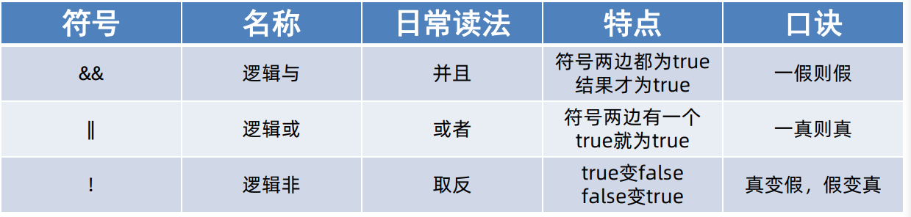
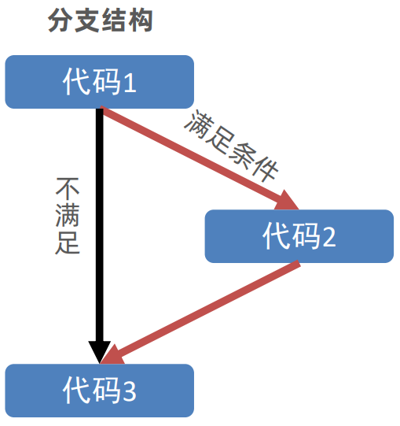
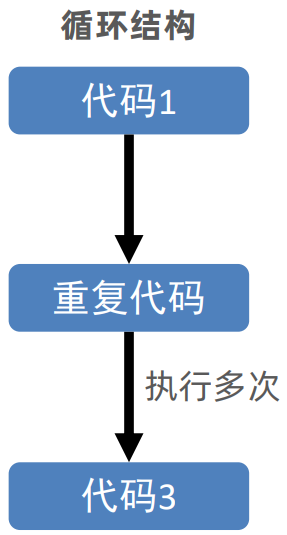
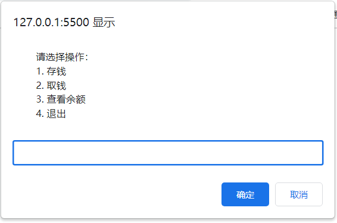

# 二、流程控制

## 运算符

### 赋值运算符

主要是用来简化代码的

常见的有： `+=` ，`-=` , `*=` , `/=` , `%=`

```js
let num = 1
// num = num + 1
num += 1
console.log(num) // 2
```

### 一元运算符

主要是自增运算

#### 前置自增 (++在前 先加)

```js
let i = 1
console.log(++i + 2) // 4
// i先自加1，变成2后，在和后面的2相加
```

#### 后置自增 (++在后 后加)

```js
let i = 1
console.log(i++ + 2) // 3
// i先和2相加，先运算输出完毕后，i再自加是2
```

但是，当两个独立使用的时候二者并没有差别，一般都是 i++ 比较多，而且还是单独使用。

### 比较运算符

比较两个数据大小、是否相等

还有很多其他的比较运算符，重要的是这几个：

`=` : 赋值

`==` : 判断，左右两边值是否相等

`===` :全等，左右两边是否 **类型** 和值相等

:::warning 注意

1. 尽量不要比较小数，小数有精度问题
2. 不同类型之间比较会发生隐式转换
3. NaN不等于任何值，包括它本身，所以比较的时候返回的是false
4. 都是从左往右比较
5. 字符串比较比较的是对应的ASCII码

:::

### 逻辑运算符

解决多重条件判断

```js
num > 5 && num < 10
```

逻辑运算符有三个： `与(&&)` , `或(||)` , `非(!)`



### 运算符优先级

| 优先级 |   运算符   |              顺序              |
| :----: | :--------: | :----------------------------: |
|   1    |   小括号   |             `( )`              |
|   2    | 一元运算符 |        `++`  `--`  `!`         |
|   3    | 算数运算符 | 先  `*`  `/` `%`  后  `+`  `-` |
|   4    | 关系运算符 |      `>`  `>=`  `<`  `<=`      |
|   5    | 相等运算符 |    `==`  `!=`  `===`  `!==`    |
|   6    | 逻辑运算符 |        先  `&&`  后  `         |  | ` |
|   7    | 赋值运算符 |              `=`               |
|   8    | 逗号运算符 |              `,`               |

+ 一元运算符里面的逻辑非优先级很高
+ 逻辑与 比 逻辑或 优先级高

## 语句

### 表达式和语句

表达式是可以被求值的代码，JavaScript 引擎会将其计算出一个结果

语句是一段可以执行的代码

#### 表达式和语句的区别

表达式可以被求值，所以它可以写在赋值语句的右侧；而语句不一定有值，所以 alert() for 和break 等语句就不能被赋值。

### 分支语句




分支语句包含：`If分支语句`  `三元运算符`  `switch语句`

#### if语句

**单分支**

```js
if (条件) {
  满足条件要执行的代码
}
```

**双分支**

```js
if (条件) {
  满足条件要执行的代码
} else {
  不满足条件执行的代码
}
```

**多分支if语法**

```js
if (条件1) {
  代码1
} else if (条件2) {
  代码2
} else if (条件3) {
  代码3
} else {
  代码n
}
```

#### 三元运算符

比if双分支更简单的写法

```js
条件 ? 满足条件执行的代码 : 不满足条件执行的代码
```

#### switch 语句

```js
switch (数据) {
  case 值1: 
    代码
    break
  case 值2:
    代码
    break
  default:
    代码n
    break
}
```

示例：

```js
let num1 = +prompt('请输入第一个数字:')
let num2 = +prompt('请输入第二个数字:')
let sp = prompt('请输入 + - * / 其中一个')

switch (sp) {
  case '+':
    alert(`两个数的加法操作是${num1 + num2}`)
    break;
  case '-':
    alert(`两个数的减法操作是${num1 - num2}`)
    break;
  case '*':
    alert(`两个数的乘法操作是${num1 * num2}`)
    break;
  case '/':
    alert(`两个数的除法操作是${num1 / num2}`)
    break;
}
```


### 循环语句



#### while 循环

```js
while (循环条件) {
  要重复执行的代码(循环体)
}
```

示例：

```js
let i = 1
while(1 <= 3) {
  document.write('我会循环三次')
  i++
}
```

如果循环需要退出，有 `break` 和 `continue` 两种模式

+ `break` : 退出循环
+ `continue` : 结束本次循环，继续下次循环

## 断点调试

在某句代码上加标记，当程序执行到这句有标记的代码时会暂停下来

### 怎么用？

1. 打开开发者工具
2. 点击Sources
3. 选择代码文件
4. 在行数那里点击一下就能打上断点了

## 综合案例 - 简易ATM取款机

### 需求：

用户可以选择存钱、取钱、查看余额和退出功能

### 分析：

1. 循环的时候，需要反复提示输入框，所以提示框写到循环里面
2. 退出的条件是用户输入了4，如果是4，则结束循环，不在弹窗
3. 提前准备一个金额预先存储一个数额
4. 取钱是减法操作，存钱是加法操作，查看余额则是直接显示金额
5. 输入不同的值，可以使用switch来执行不同的操作

### 代码编写

```js
let money = 100
while (true) {
  let re = +prompt(`
		请选择操作：
		1. 存钱
		2. 取钱
		3. 查看余额
		4. 退出
	`)
  if (re === 4) {
    break
  }
  
  switch (re) {
    case 1:
      // 存钱
      let cun = +prompt('请输入金额')
      money = money + cun
      break;
    case 2:
      // 取钱
      let qu = +prompt('请输入金额')
      money = money - qu
      break;
    case 3:
      // 查看余额
      alert(`你的银行卡余额是${money}`)
      break;
  }
}
```

### 结果演示



