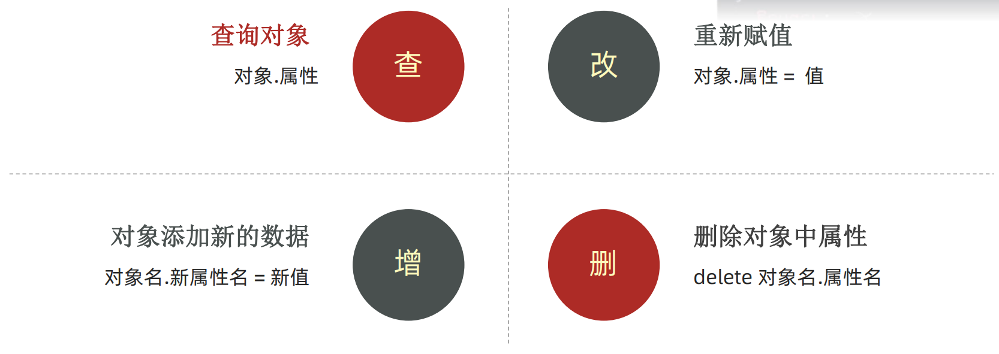
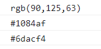
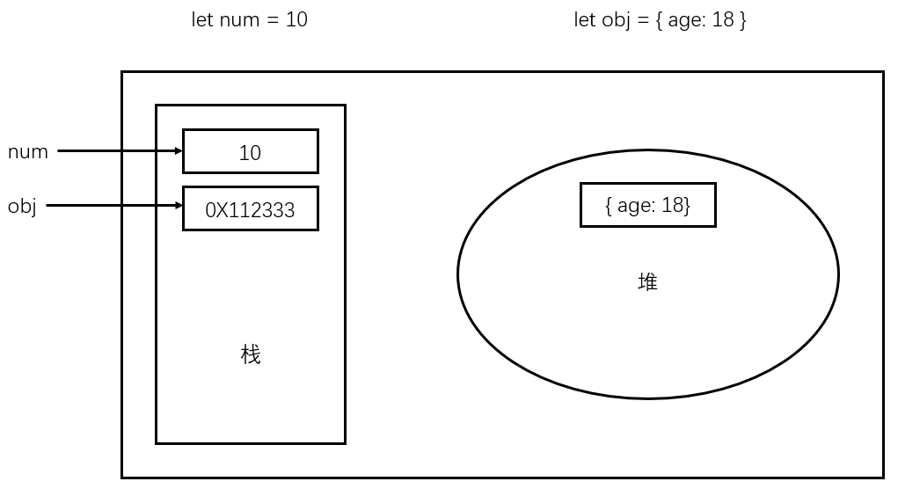

# 五、对象

## 对象

### 什么是对象

一种数据类型，一种无序的数据集合，能够详细的描述某个事物

```js
let obj = {
  uname: '张三',
  age :19,
  gender: '男'
}
```

### 怎么用？

语法：

```js
let 对象名 = {
  属性名: 属性值,
  方法名: 函数
}
let 对象名 = new Object()
```

属性：信息或特征，比如 手机尺寸、颜色、重量等

方法：功能或行为，比如 手机打电话、发短信、玩游戏

### 操作数据

对象的操作与数组的操作类似，也是增删改查



#### 查

**1. 语法：** `对象名.属性`

示例：

```js
let person = {
  uname: '张三',
  age: 19,
  gender: '男'
}
console.log(person.uname) // 张三
console.log(person.age) // 19
console.log(person.gender) // 男
```

这种写法固然简单，但是如果遇到多词属性或 `-` 等属性的话，这个操作就得改一改了。

**2. 语法：** `对象['属性']` 

示例：

```js
let person = {
  'user-name': '张三',
  age: 18,
  gender: '女'
}

console.log(person.user-name) // NaN
console.log(person['user-name']) // 张三
```


#### 改

**语法：** `对象名.属性 = 新值`

示例：

```js
let person = {
  uname: '张三',
  age: 19,
  gender: '男'
}
person.gender = '女'
console.log(person.gender) // 女
console.log(person) // { uname: '张三', age: '19', gender: '女' }
```

#### 增

**语法：** `对象名.新属性 = 新值`

示例：

```js
let person = {
  uname: '张三',
  age: 19,
  gender: '男'
}
person.adress = '中国'
console.log(person) // { uname: '张三', age: '19', gender: '女', adress: '中国' }
```

#### 删

**语法：** `delete 对象名.属性`

示例：

```js
let person = {
  uname: '张三',
  age: 19,
  gender: '男'
}
delete person.gender
console.log(person) // { uname: '张三', age: '19' }
```

### 对象中的方法

很简单，看一下示例就能明白对象中的方法怎么写了

示例：

```js
let person = {
  name: 'andy',
  // 形参
  sayHi: function() {
    console.log('hi~~~')
  }
}

// 实参
// 对象名.方法名
person.sayHi() // hi~~~
```

### 遍历对象

**语法：**`for ... in ...  `，

示例：

```js
let obj = {
  uname: 'andy',
  age: 19,
  sex: '男'
}

for (let k in obj) {
  // 获取对象的属性名
  console.log(k) // uanme、age、sex
  // 获取属性值
  console.log(obj[k]) // andy、19、男
}
```

如果是数组里面包含对象的话，应该是这样取值：

```js
let students = [
  { name: '小明', age: 18, gender: '男', hometown: '河北省' },
  { name: '小红', age: 19, gender: '女', hometown: '河南省' },
  { name: '小刚', age: 17, gender: '男', hometown: '山西省' },
  { name: '小丽', age: 18, gender: '女', hometown: '山东省' }
]

for (let i = 0; i < students.length; i++) {
  console.log(i) // 0  1  2  3
  console.log(students[i]) // Object object
  console.log(students[i].name) // 小明  小红  小刚  小丽
}
```

### 内置对象

JavaScript 内部都有提供对象，包含各种属性和方法给开发者调用，比如 `document.write()` 或者  `console.log()` 都属于内置对象。

#### 内置对象 - Math

 提供了一系列做数学运算的方法，包含：

+ `random:` 生成0-1之间的随机数，并且包括0不包括1的随即小数 [0, 1)
+ `ceil:` 向上取整
+ `floor:` 向下取整
+ `max:` 找最大数
+ `min: ` 找最小数
+ `pow:` 幂运算
+ `abs:` 绝对值

##### 内置对象 - Math - random

语法：`Math.random()` 

```js
// 生成 0-10 的随机数
Math.floor(Math.random() * (10 + 1))
```

怎么理解上面的代码？

首先，`Math.random()` 只能取 [0, 1) 之间的随机数，如果是 `Math.random() * 10` ，那就是 [0, 10) 之间的随机数，但是这样做，就取不到10了，所以得 `+1` 这样就是取 [0, 11) 之间的随机数了，这样就能取10了。（这里的前提当然是取整了，不然会取到小数的）

那么同理：

```js
// 生成 5-10 的随机数
Math.floor(Math.random() * (5 + 1)) + 5
```

`Math.random() * (5 + 1)` 是只能取 [0-6)  之间的随机数，在外层 `+5` 的话则表示  `[0+5-6+5) =  [5-11) `

所以，由此可以得出

```js
// 生成 N-M 的随机数
Math.floor(Math.random() * (M - N + 1)) + N
```

那平时怎么用？可以采用函数的形式

```js
function getRandom(N, M) {
  return Math.floor(Math.random() * (M - N + 1)) + N
}
```

### 小案例

#### 生成随机颜色

**需求：**该函数接收一个布尔类型参数，表示颜色的格式是十六进制或者rgb格式

**分析：**

16进制颜色格式为: ‘#ffffff’ 其中f可以是任意 0-f之间的字符,需要用到数组，

let arr = ['0', '1', '2', '3', '4', '5', '6', '7', '8', '9', 'a', 'b', 'c', 'd', 'e', 'f'] 

提示: rgb颜色格式为: ‘rgb(255,255,255) ’ 其中255可以是任意0-255之间的数字

```js
function getRandomColor(flag = true) {
  if (flag){
    let arr = ['0', '1', '2', '3', '4', '5', '6', '7', '8', '9', 'a', 'b', 'c', 'd', 'e', 'f'] 
    let str = '#'
    for (let i = 0; i < 6; i++) {
      let random = Math.floor(Math.random() * arr.length)
      str += arr[random]
    }
    return str
  } else {
    let r = Math.floor(Math.random() * 256)
    let g = Math.floor(Math.random() * 256)
    let b = Math.floor(Math.random() * 256)
    return `rgb(${r},${g},${b})`
  }
}

console.log(getTandomColor(false))
console.log(getTandomColor(true))
console.log(getTandomColor())
```



## 综合案例

### 需求：

根据数据渲染列表页面

### 代码编写

1. 准备静态模板

```html
<div class="box w">
  <div class="box-hd">
    <h3>精品推荐</h3>
    <a href="#">查看全部</a>
  </div>
  <div class="box-bd">
    <ul class="clearfix">
      <li>
        <a href="#">
          
          <h4>
            Think PHP 5.0 博客系统实战项目演练
          </h4>
          <div class="info">
            <span>高级</span> • <span>1125</span>人在学习
          </div>
        </a>
      </li>
    </ul>
  </div>
</div>
```

```txt
let data = [
                        {
                            src: 'images/course01.png',
                            title: 'Think PHP 5.0 博客系统实战项目演练',
                            num: 1125
                        },
                        {
                            src: 'images/course02.png',
                            title: 'Android 网络动态图片加载实战',
                            num: 357
                        },
                        {
                            src: 'images/course03.png',
                            title: 'Angular2 大前端商城实战项目演练',
                            num: 22250
                        },
                        {
                            src: 'images/course04.png',
                            title: 'Android APP 实战项目演练',
                            num: 389
                        },
                        {
                            src: 'images/course05.png',
                            title: 'UGUI 源码深度分析案例',
                            num: 124
                        },
                        {
                            src: 'images/course06.png',
                            title: 'Kami2首页界面切换效果实战演练',
                            num: 432
                        },
                        {
                            src: 'images/course07.png',
                            title: 'UNITY 从入门到精通实战案例',
                            num: 888
                        },
                        {
                            src: 'images/course08.png',
                            title: 'Cocos 深度学习你不会错过的实战',
                            num: 590
                        },
                    ]
```

2. 编写代码

```html
<body>
  ...
  <ul>
    <!-- 把模板中的<li>注释掉 -->
    <script>
    	// 把data粘贴在这个位置
      let data = [...]
      for (let i = 0; i< data.length) {
        document.write(`
          <li>
            <a href="#">
              
              <h4>
                ${data[i].title}
              </h4>
              <div class="info">
                <span>高级</span> • <span>${data[i].num}</span>人在学习
              </div>
          	</a>
          </li> 
				`)
      }
    </script>
  </ul>
</body>
```


## 拓展知识

### 术语解释

没什么，就是说起来更专业

| 术语           | 解释                                                       | 举例                                              |
| -------------- | ---------------------------------------------------------- | ------------------------------------------------- |
| 关键字         | 在JavaScript中有特殊意义的词汇                             | let、var、function、if、else、switch、case、break |
| 保留字         | 在目前的JavaScript中没意义，但未来可能会具有特殊意义的词汇 | int、short、long、char                            |
| 标识（标识符） | 变量名、函数名的另一种叫法                                 | 无                                                |
| 表达式         | 能产生值的代码，一般配合运算符出现                         | 10 + 3、age >= 18                                 |
| 语句           | 一段可执行的代码                                           | if()  for()                                       |

### 基本数据类型和引用数据类型

了解了解就行，想深入学习建议看看《数据结构》

#### 基本数据类型（简单类型、值类型）：

在存储时变量中存储的是值本身，如string, number, boolean, undefined, null

存放在栈里面

#### 引用类型（复杂数据类型）：

在存储时变量中存储的仅仅是地址（引用），通过new关键字创建的，如Object, Array, Date等

存放在堆里面



