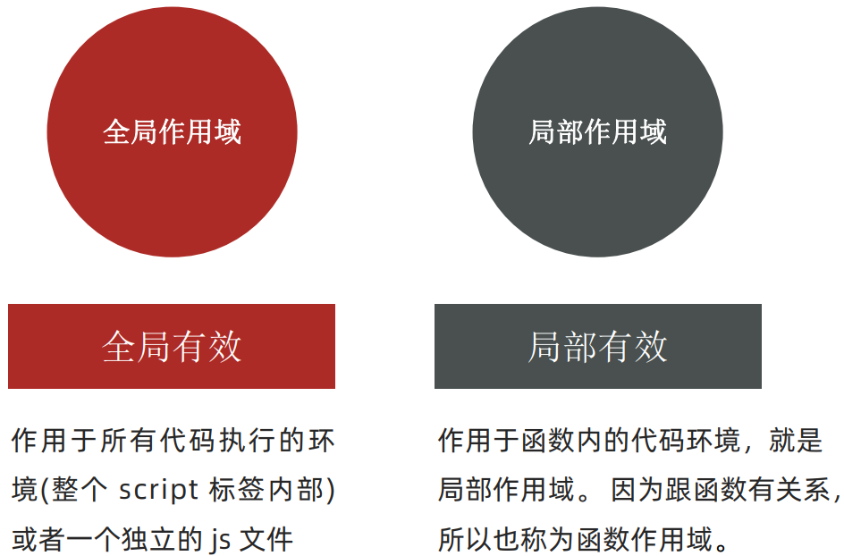
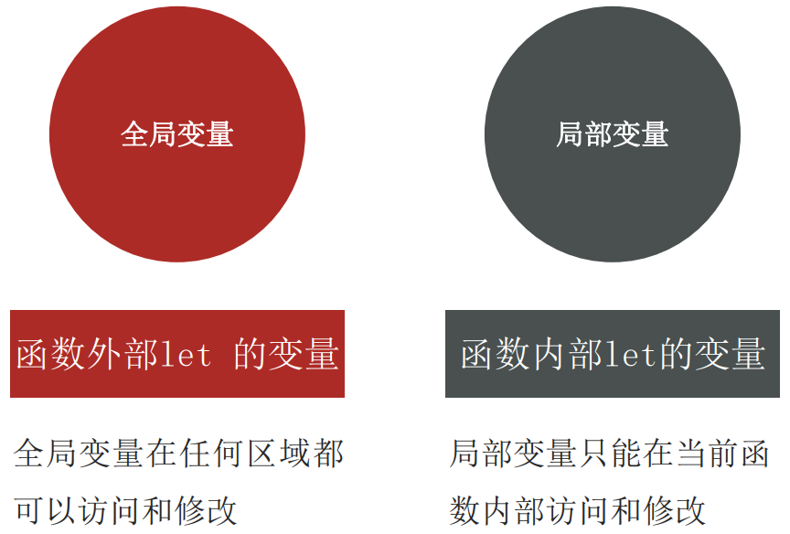

# 四、函数

## 函数

自我感觉，如果是根据知识路线的方式来学习的话，这个阶段对函数的概念确实模糊。不能理解，可以结合这个[文档](./函数分组引发的思考)看[视频](https://www.bilibili.com/video/BV1MM41197xm/?spm_id_from=333.1007.top_right_bar_window_custom_collection.content.click&vd_source=ce2373d3d93ecee4088b1954ccc2db50)，在函数的方面确实能够给人很大的思考

### 什么是函数？

函数可以把具有相同或相似逻辑的代码“包裹”起来，通过函数调用执行这些被“包裹”起来的代码逻辑，这样做是能够更加方便的 **“复用”**

### 函数的使用

语法：

```js
function 函数名() {
  函数体
}
```

示例：

```js
function sayHi() {
  document.write('hey')
}
```

函数命名的时候，使用小驼峰命名法，尽量和变量命名一致。

如果需要调用语法，使用 `函数名()` 的方式，其中，一定要用 `()` 来调用函数，例：

```js
// 每一次调用函数里面的函数代码就会重新执行一次
sayHi()
sayHi()
```

### 函数传参

我们试想一下这个场景：

```js
function getSum() {
  let num1 = 10
  let num2 = 20
  console.log(num1 + num2)
}

getSum()
```

这样做固然能把 `10+20` 加上，那如果我不想要 `10+20` 了呢？我想要 `20+30` 了呢？这个时候直接改里面的 `num1` 和 `num2` 了吗？

这个时候就需要传入数据了，这样就能灵活调用这个函数了

改造一下:

```js
function getSum(num1, num2) {
  console.log(num1 + num2)
}

getSum(10, 20)
```

这里就不得不提一下我们经常所说的 `形参` 和 `实参` 了

#### 形参 & 实参

+ 形参：声明函数时写在函数名右边小括号里的叫形参（形式上的参数）
+ 实参：调用函数时写在函数名右边小括号里的叫实参（实际上的参数）

即，在上面的函数中，`(num1, num2)` 就是 **形参**，`(10, 20)` 就是 **实参**。

形参其实可以看做一个变量，如果一个变量不给值，默认则是 `undefined` ，如果用户不输入实参，就会出现 `undefined + undefined=NaN` 。

怎么个改进？

可以给形参一个默认值，这个默认值只有在缺少实参参数传递的时候才会被执行。

```js
function getSum(x = 0, y = 0) {
  document.write(x + y)
}
getSum() // 0
getSum(1, 2) // 3
```

### 函数返回值

上面的函数其实还有一些缺陷，有的时候我们并不像那么快让函数把结果给我，我想迟一点再拿结果，这个时候就需要函数的返回值。

```js
function getSum(x, y) {
  return x + y
}
let num = getSum(10, 30)
document.write(num)
```

+ 在函数体中使用 `return` 关键字能将内部的执行结果交给函数外部使用
+ `return` 后面代码不会再被执行，会立即结束当前函数
+ `return` 函数可以没有 `return` ，这种情况函数默认返回 `undefined` 

#### 如果需要返回两个值应该怎么返回？

```js
function getArr(arr = []){
  let max = arr[0]
  let min = arr[0]
  for (let i = 0; i < arr.length; i++){
    if (max < arr.length) {
      max = arr[i]
    }
    if (min > arr.length) {
      min = arr[i]
    }
  }
  return [max, min]
}
let newArr = getArr([1, 2, 3, 4, 5, 6])
console.log(newArr)
```

### 作用域

一段代码中有全局作用域和局部作用域。



而在JavaScript中，根据作用域的不同，变量又可以分为：



:::warning 注意

如果函数内部变量没有声明，直接赋值，也会当全局变量看，但是不推荐

函数内部的形参可以看作是局部变量

:::

#### 变量访问原则

1. 在能够访问到的情况下，先局部，局部没有再找全局

2. 采取就近原则的方式查找变量最终的值

### 匿名函数

函数又分为具名函数和匿名函数


所谓匿名函数，就是没有名字的函数，它们是无法直接使用的。要用，只能是函数表达式的形式或者立即执行这个函数

#### 函数表达式

将匿名函数赋值给一个变量，并通过变量名称进行调用。

```js
let fn = function () {
  // 函数体
}

fn() //函数名()
```

#### 立即执行函数

主要为了必满全局变量之间的污染

```js
// 方式1
(function () { console.log(11) })();

// 方式2
(function () { console.log(11) }())
```

## 综合案例

### 需求

用户输入秒数，可以自动转换为时分秒

### 分析

1. 用户输入总秒数（注意默认值）
2. 计算时分秒（封装函数）里面包含数字补0
3. 打印输出

**计算公式：计算时分秒**

小时：` h = parseInt(总秒数 / 60 / 60 % 24) `

分钟：` m = parseInt(总秒数 / 60 % 60) ` 

秒数：` s = parseInt(总秒数 % 60) `

### 代码编写

```js
let second = +prompt('请输入秒数')

function getTime(time) {
  let h = parseInt(time / 60 / 60 % 24)
  let m = parseInt(time / 60 % 60)
  let s = parseInt(time % 60)
  
  h = h < 10 ? '0' + h : h
  m = m < 10 ? '0' + m : m
  s = s < 10 ? '0' + s : s

  return `转换完毕后是 ${h}小时${m}分${s}秒`
}
let str = getTime(second)
document.write(str)
```


## 补充知识

### 逻辑中断

当代码中存在 `&&` 和 `||` 时，满足一定的条件以后会让右边代码不执行

| 符号  |       条件        |
| :---: | :---------------: |
|  &&   | 左边为false就短路 |
| \|\|  | 左边为true就短路  |

就是通过左边能得到整个式子的结果，就没必要再去判断右边了。


