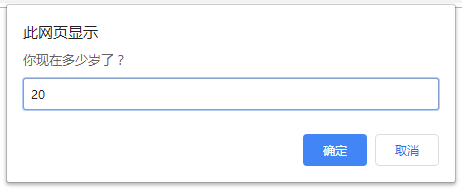
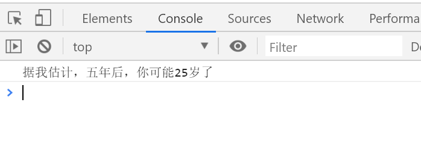

# 每日作业 - 1

## 简答题

1. 请说出变量的使用场景

```txt
存储用户输入、存储中间结果、程序状态存储、控制流程、存储配置信息
```

2. 请说出基本数据类型有哪5种？

```txt
Number、String、boolean、undefined、null
```

3. 请说出模板字符串使用方法

```txt
1. 使用 ``
2. 使用 ${} 作为占位符传递函数
3. 在模板字符串内使用反引号需要加转义符(\)
```

4. 下面代码输出的结果是( )

```js
const num = 10
console.log(num + 11) // 21
console.log(num + '11') // 1011
console.log(num + +'11') // 21
```

5. 下面代码输出的结果是( )

```js
const num = 10
console.log(typeof num + '11') // number11
console.log(typeof (num + '11')) // string
console.log(typeof (num + +'11')) // number
```

## 编程题

### 获取用户信息

#### 题目描述

依次询问并获取用户的姓名、年龄、性别，收集数据之后在控制台依次打印出来。

具体表现如下图：


#### 题目提示

+ 通过prompt来弹出提示框，收集用户信息
+ 通过变量保存数据

#### 代码编写

```html
<body>
  <script>
    let name = prompt('请输入您的姓名')
    let age = prompt('请输入您的年龄')
    let gender = prompt('请输入您的性别')

    console.log('用户的姓名:' + name);
    console.log('用户的年龄:' + age);
    console.log('用户的性别:' + gender);
  </script>
</body>
```

#### 结果演示


### 增加年龄

#### 题目描述

1、询问用户年龄，用户输入年龄后，把用户输入的年龄增加5岁

2、增加5岁后，通过弹出框提示用户 “ 据我估计，五年后，你可能XX岁了”





#### 题目提示

+ 通过prompt来弹出提示框，收集用户信息
+ 通过变量保存数据
+ 转换数据类型(需要预习第二天的数据类型转换哟)

#### 代码编写

```html
<script>
  let age = prompt('你现在多少岁了？')
  console.log(`据我估计，五年后，你可能${Number(age) + 5}岁了`);
</script>
```

#### 结果演示


### 计算银行卡余额案例

#### 题目描述

1、用户输入总的银行卡金额，依次输入本月花费的电费，水费，网费。

2、页面打印一个表格，计算出本月银行卡还剩下的余额。


#### 题目提示

+ 思路：

  1.我们需要5个变量：银行卡总额、水费、电费、网费、银行卡余额

  2.银行卡余额= 银行卡总额 – 水费 –电费  - 网费  

  3.第一步准备5个变量接受输入的数据

  4.第二步计算银行卡余额 

  5.第三步页面打印生成表格，里面填充数据即可。

  6.当然可以提前把html页面搭好。

#### 代码编写

```html
<scipt>
  <style>
    h2 {
      text-align: center;
    }

    table {
      border-collapse: collapse;
      height: 80px;
      margin: 0 auto;
      text-align: center;
    }

    th {
      padding: 5px 30px;
    }

    table,
    td,
    th {
      border: 1px solid #000;
    }
  </style>
</scipt>

<body>
  <h2>2020年12月消费支出</h2>

  <script>
    let total = +prompt('请输入银行卡总额')
    let waterPrice = +prompt('请输入水费')
    let elePrice = +prompt('请输入电费')
    let itPrice = +prompt('请输入网费')
    let balance = total - waterPrice - elePrice - itPrice

    document.write(`
    <table>
      <tr>
        <th>银行卡余额</th>
        <th>水费</th>
        <th>电费</th>
        <th>网费</th>
        <th>银行卡余额</th>
      </tr>
      <tr>
        <td>${total}元</td>
        <td>${waterPrice}元</td>
        <td>${elePrice}元</td>
        <td>${itPrice}元</td>
        <td>${balance}元</td>
      </tr>
    </table>
    `)
  </script>
</body>
```

#### 结果演示

