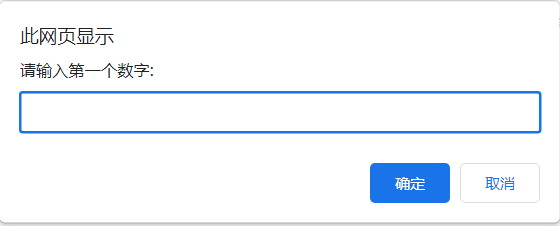
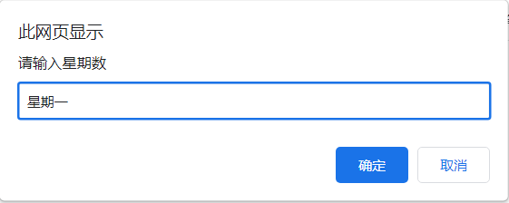
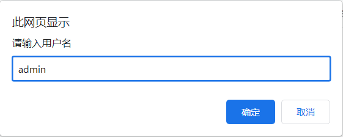

# 每日作业 - 2

## 主观题

1. 打印0-20之间的整数, 将每个数输出到控制台

   ``` js
   let i = 1
   for (let i = 0;i <= 20; i++) {
     console.log(i)
   }
   ```

   

2. 计算1-1000之间的累加和，并且打印输出到页面中

   ```js
   let i = 1
   let sum = 0
   while (i <= 1000){
     sum = sum + i
     i++
   }
   console.log(sum)
   ```

   

3. 页面依次打印 100-200之间,可以被6整除的数字

   ```js
   let i = 100
   while (i >= 100 && i <= 200) {
     if (i % 6 === 0) {
       console.log(i)
     }
     i++
   }
   ```

   

4. 用户弹窗输入两个数字，页面输出两个数字中的最大值（请使用三元运算符完成）

   ```js
   let num1 = prompt('请输入第一个数字:')
   let num2 = prompt('请输入第一个数字:')
   num1 > num2 ? document.write(num1) : document.write(num2)
   ```

   

5. **用户输入一个数，计算 1 到这个数的累加和** 

   - 比如用户输入的是 5，则计算 1~5 之间的累加和
   - 比如用户输入的是10，则计算 1~10 之间的累加和

   ```js
   let num = +prompt('请输入一个数字')
   let sum = 0
   for (let i = 1; i <= num; i++) {
     sum = sum + i
   
   }
   console.log(sum);
   ```

   

   

6. **输出成绩案例（请使用if多分支来书写程序）**

   接收用户输入的分数，根据分数输出对应的等级字母 A、B、C、D、E，

   - 90分(含)以上 ，输出：A
   - 80分(含)~ 90 分(不含)，输出：B	
   - 70分(含)~ 80 分(不含)，输出：C 
   - 60分(含)~ 70 分(不含)，输出：D   	
   - 60分(不含) 以下，输出：E

   ```js
   let score = +prompt('请输入你的分数')
   if (score >= 90) {
     alert('A')
   } else if (score >= 80 && score < 90) {
     alert('B')
   } else if (score >= 70 && score < 80) {
     alert('C')
   } else if (score >= 60 && score < 70) {
     alert('D')
   } else {
     alert('E')
   }
   ```

   

   

7. **输出星期练习（请使用switch分支语句来书写程序）**

   请用户输入1个星期数. 就将对应的英文的星期打印出来. 

   - 比如用户输入 '星期一' ， 则 页面可以打印  monday 

   ```js
   let week = prompt('请输入星期数')
   
   switch (week) {
     case '星期一':
       alert('Monday')
       break;
     case '星期二':
       alert('Tuesday')
       break;
     case '星期三':
       alert('Wednesday')
       break;
     case '星期四':
       alert('Thursday')
       break;
     case '星期五':
       alert('Friday')
       break;
     case '星期六':
       alert('Saturday')
       break;
     case '星期日':
       alert('Sunday')
       break;
   }
   ```

   

   

8. **用户登录验证**

   题目描述：

   接收用户输入的用户名和密码，若用户名为 “admin” ,且密码为 “123456” ,则提示用户登录成功!  否则，让用户一直输入。

   ```js
   while (true) {
     let user = prompt('请输入用户名')
     let password = prompt('请输入密码')
     if (user === 'admin' && password === '123456') {
       break
     }
   }
   alert('登陆成功')
   ```

   

   

   

## 综合案例

### 需求

根据用户选择计算两个数的结果

### 题目

打开页面出现一个提示框，注意是一直提示的，请您选择 + - * / ，如果输入q，则是退出结束程序

- 如果输入的是 + - * / 其中任何一个，比如用户输入是 + ，则是计算求和，如果用户输入是 *  则是计算乘积
  - 则提示第一个弹窗，提示用户：'请您输入第一个数字'
  - 输入完毕则继续提示第二个弹窗，提示用户：'请您输入第二个数字'
  - 都输入完毕，则通过警示框 alert 输出结果
- 如果输入是 q，则结束程序

提示：多分支请使用 if 多分支来完成

### 具体效果

 

### 代码编写

```js
while (true) {
  let str = prompt(`
1. 输入 + - * / 计算两个数字的结果
2. 输入q结束程序
`)

  if (str === 'q') {
    break
  } else {
    let num1 = +prompt('请输入第一个数字')
    let num2 = +prompt('请输入第二个数字')

    if (str === '+') {
      alert(num1 + num2)
    } else if (str === '-') {
      alert(num1 - num2)
    } else if (str === '*') {
      alert(num1 * num2)
    } else if (str === '/') {
      alert(num1 / num2)
    }
  }
}
```

### 结果演示


## 排错题

### 排错题1

~~~javascript
// 请问以下代码会出现什么问题，如何解决？

// 需求： 求用户输入2个数字的和
let num1 = prompt('请输入第一个值')
let num2 = prompt('请输入第二个值')
alert(num1 + num2)
~~~

答：会出现字符串拼接的问题。需要转换成数字型，在`prompt` 前面加上一个 `+` 

### 排错题2

~~~javascript
// 请问下面代码会出现什么问题，怎么去解决

// 判断用户名的案例，用户会输入用户名
// 1. 如果用户名输入'迪丽热巴'，则页面弹出 '用户名输入正确'
// 2. 如果用户名输入不是'迪丽热巴'，否则弹出'用户名输入不正确'

let username = prompt('请输入用户名:')
if (username = '迪丽热巴') {
  alert('用户名输入正确')
} else {
  alert('用户名输入不正确')
}
~~~

答：一个 `=` 代表的是赋值的意思，应该改成 `===` 

### 排错题3

~~~js
// 请问以下代码会出什么问题？如何解决？

// 需求，用户输入1~10之间的整数，则循环打印用户输入的次数
// 注意此处有2个错误，找出并且修正

let num = prompt('请输入一个1~10之间的整数')
let i = 1
while (i < num) {
  console.log(`我是第${i}句话`)
}
~~~

答：1. 从1开始要小于等于 `num` ，如果从0开始就可以直接 `<` ；2. 漏了一个 `i++`

### 排错题4

~~~js
// bug:请你找到下面代码代码穿透的原因,并找到匹配不上case里面的值的问题进行修改

// 需求： 用户输入1~4之间整数，对应输出 '春' '夏' '秋' '冬' 
// 例如用户输入 1 则输出 '春' ，用户输入 2，则输出 '夏' 以此类推
// 注意： 此处有2个错误，找出并且修正
let num = +prompt('请你输入一个1-4之间的值')
switch (num) {
  case '1':
    alert('春')
  case '2':
    alert('夏')
  case '3':
    alert('秋')
  case '4':
    alert('冬')
  default:
    alert('请输入1~4之间整数')
    break
}
~~~

答：1. `num` 是数字型，但是 `case` 里面是字符型；2. `case` 里面需要 `break`

