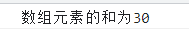

# 每日作业 - 3

## 主观题

### 练习题1

写一个程序，要求如下

+ 需求1：让用户输入五个有效年龄（0-100之间），**放入数组中**

  + 必须输入五个有效年龄年龄，如果是无效年龄，则不能放入数组中

+ 需求2：打印出所有成年人的年龄 (数组筛选)

+ 需求3：打印出所有人总年龄 （累加）

+ 需求4：打印出所有人的平均年龄 （累加）

+ 需求5：打印出最大年龄和最小年龄 （最大值）

```js
let arr = []
let sum = 0
for (let i = 0; i < 5; i++) {
  let age = +prompt(`请输入第${i + 1}个有效年龄`)
  // 需求1
  if(age >= 0 && age <= 100) {
    // 需求2
    arr.push(age)
    // 需求3
    sum = sum + arr[i]
    // 需求5
    arr.sort(function (a, b) {
      return a - b;
    })
  }
}
let min = arr[0]
let max = arr[arr.length - 1]

document.write('所有人的年龄:' + arr + '<br/>')
document.write('所有人的年龄总和:' + sum + '<br/>')
// 需求4
document.write('所有人的平均年龄:' + sum / 5 + '<br/>')
document.write('最大年龄:' + max + '<br/>')
document.write('最小年龄:' + min + '<br/>')
```


### 练习题2

找出数组中 元素为10的下标，有则打印该下标，没有则打印-1

+ 例如: [88,20,10,100,50]  打印 2

+ 例如: [88,20,30,100,50]  打印-1

```js
let arr = [88, 20, 100, 10, 50]
// 用于存储结果，默认没有
let re = -1

for (let i = 0; i < arr.length; i++) {
  if (arr[i] === 10) {
    // 如果找到就把当前索引号给 re，没有找到就默认为-1
    re = i
    break
  }
}
console.log(`元素的下标为${re}`);
```


### 练习题3

使用for循环 - 求出数组元素的和[5, 8, 9, 2, 1, 5]

```js
let arr = [5, 8, 9, 2, 1, 5]
let sum = 0
for (let i = 0; i < arr.length; i++) {
  sum += arr[i]
}
console.log(`数组元素的和为${sum}`);
```



### 练习题4

使用for循环 - 求出数组 [4, 9, 5, 20, 3, 11]里大于5的和

```js
let arr = [4, 9, 5, 20, 3, 11]
let sum = 0
for (let i = 0; i < arr.length; i++) {
  if (arr[i] > 5) {
    sum += arr[i]
  }
}
console.log(`大于5的和${sum}`);
```


### 练习题5: 

使用for循环 - 求出班级里同学们平均年龄[15, 19, 21, 33, 18, 24]

```js
let arr = [15, 19, 21, 33, 18, 24]
let sum = 0
let ave = 0
for (let i = 0; i < arr.length; i++) {
  sum += arr[i]
  ave = sum / arr.length
}
console.log(`平均年龄为${ave.toFixed(2)}岁`);
```


### 练习题6: 

计算[2, 6, 18, 15, 40] 中能被3整除的偶数的和

```js
let arr = [2, 6, 18, 15, 40]
let sum = 0
for (let i = 0; i < arr.length; i++) {
  if (arr[i] % 3 === 0 && arr[i] % 2 === 0) {
    sum += arr[i]
  }
}
console.log(`被3整除的偶数的和为${sum}`);
```


### 练习题7：

计算[2, 6, 18, 15, 40] 中能被3整除的偶数的个数

```js
let arr = [2, 6, 18, 15, 40, 30]
let count = 0
for (let i = 0; i < arr.length; i++) {
  if (arr[i] % 3 === 0 && arr[i] % 2 === 0) {
    count++
  }
}
console.log(`能被3整除的偶数的个数有${count}个`);
```


### 练习题8：

给一个数字数组，该数组中有很多数字0，将不为0的数据存入到一个新的数组中

```js
let arr = [2, 0, 6, 0, 18, 0, 14, 0, 40, 0, 30, 0]
let newArr = []
for (let i = 0; i < arr.length; i++) {
  if (arr[i] !== 0) {
    newArr.push(arr[i])
  }

}
console.log(`新数组为[${newArr}]`);
```


###  核心练习题

#### 需求：

根据用户输入的个数，页面可以渲染对应王者荣耀永雄的个数

#### 效果如下：


#### 思路分析：

1. 渲染图片比较多，我们可以把图片地址放入数组中，
2. 图片名称是有序号排列的，比如1.webp  2.webp 此处可以使用循环方式重复渲染图片
3. 渲染位置？ 可以考虑放到 box盒子里写script 即可

#### 代码编写

```html
<head>
	<style>
    * {
      margin: 0;
      padding: 0;
    }
    li {
      list-style: none;
    }
    .box {
      display: flex;
      flex-wrap: wrap;
      width: 540px;
      margin: 20px auto;
    }
    .box li {
      width: 100px;
      height: 100px;
      margin: 0 10px 10px 0;
    }
    .box li:nth-child(5n+1) {
      margin-right: 0;
    }
    .box li img {
      width: 100%;
      height: 100%;
      border: 2px solid #258DF2;
      border-radius: 10px 0 10px 0;
    }
  </style>
</head>

<body>
  <script>
    let picArr = []
    for (let i = 1; i <= 20; i++) {
      picArr.push(`./images/${i}.webp`)
    }
    let num = prompt('请输入显示的英雄个数1-20之间')

    document.write(`<ul class="box">`)
    for (let i = 0; i < num; i++) {
      document.write(`
        <li>
          
        </li>
      `)
    }
    document.write(`</ul>`)
  </script>
</body>
```


## 排错题

### 排错题1

~~~html
<body>
  <!-- 请问以下代码会出现什么问题，如何解决？ -->
  <script>
    // 需求： 求 1~100之间的累加和
    // 注意： 此处有3个错误，找出并且修正
    let sum
    for (let i = 1; i < 100; i++;) {
      sum += i
    }
    console.log(sum)
  </script>
</body>
~~~

答：1. `let sum` 要赋值，不然会出现 `NaN` ；2. `i` 要 `<=` 100，不然就只能是1-99；3.  `i++` 后面不需要 `;`

### 排错题2

~~~html
<!-- bug:请你找到下面代码的bug,把数字1打印出来 -->
<body>
  <script>
    let sum = 0
    let arr = [1, 2, 3, 4, 5]
    for (let i = 1; i < arr.length; i++) {
      console.log(arr[i])
    }
  </script>
</body>
~~~

答：`i` 要从0开始

### 排错题3

~~~html
<!-- bug:找到下面代码死循环的原因,并修改为正确的代码 -->

<body>
  <script>
    for (let i = 1; i <= 5; i++) {
      for (let j = 1; j <= 5; i++) {
        console.log(`这是双重for循环`);
      }
    }
  </script>
</body>
~~~

答：第二层循环应该是 `j++`

