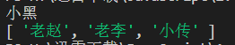
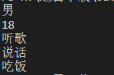
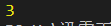
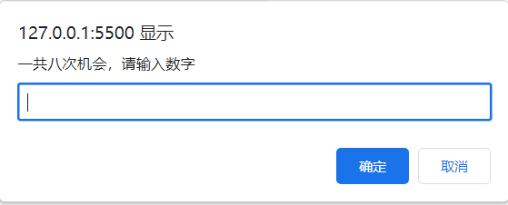
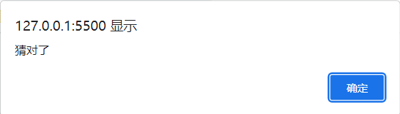
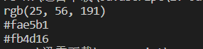
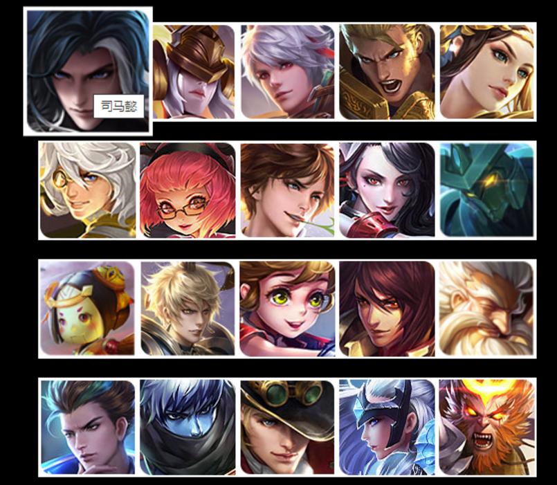
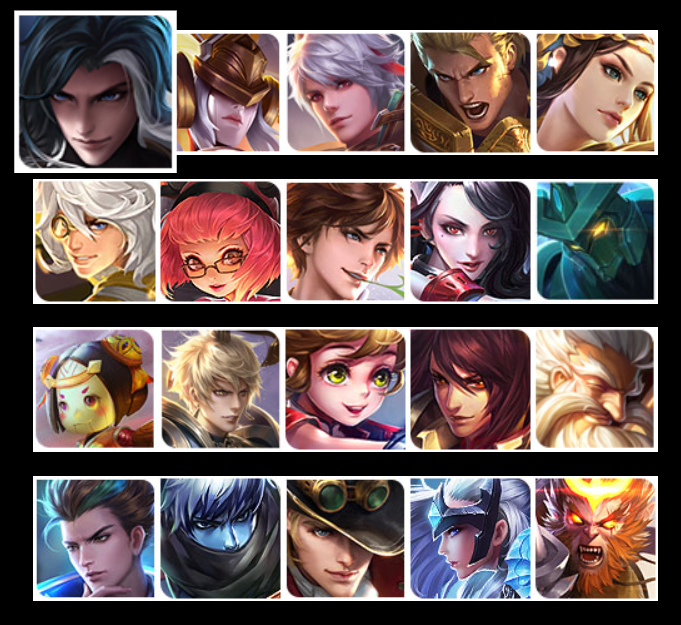
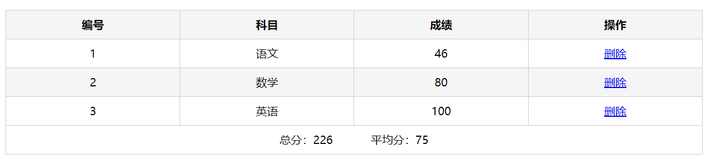

# 每日作业 - 5

## 主观题

### 练习题1：

点名：每次刷新网页运行, 在控制台随机输出一位同学的名字['老赵', '老李', '小传', '小黑']，如果输出了，则数组中删除这个名字

```js
let arr = ['老赵', '老李', '小传', '小黑']

let random = Math.floor(Math.random() * arr.length)
console.log(arr[random]);

arr.splice(random, 1)
console.log(arr);
```



### 练习题2：

声明对象

目的: 复习对象的声明

要求:

1. 声明一个变量per, 类型为对象类型
2. 该对象的属性为性别,年龄,爱好(3个)
3. 该对象的方法有 说话, 吃饭(2个)
4. 在控制台分别调用该对象的属性和方法

```js
let per = {
  gender: '男',
  age: '18',
  hobbit: '听歌',
  say: function () {
    return '说话'
  },
  eating: function () {
    return '吃饭'
  }
}

console.log(per.gender);
console.log(per.age);
console.log(per.hobbit);
console.log(per.say());
console.log(per.eating());
```



### 练习题3：

调用对象的方法

目的: 复习对象的使用

要求:

1. 对象声明完毕后, 调用对象中的吃饭的方法
2. 提示: 对象中的方法本质是函数, 调用需要加()
3. 方法也可以传递参数的

```js
let obj = {
  add: function (num1, num2) {
    return num1 + num2
  }
}

let fun = obj.add(1, 2)
console.log(fun);
```



### 练习题4：

猜数字游戏，设定次数，最多猜8次

```html
<body>
  <script>
    function getRandom(N, M) {
      return Math.floor(Math.random() * (M - N + 1)) + N
    }
    let random = getRandom(0, 20)
    let flag = true
    for (let i = 0; i < 8; i++) {
      let num = +prompt('一共八次机会，请输入数字')
      if (num > random) {
        alert('猜大了')
      } else if (num < random) {
        alert('猜小了')
      } else {
        flag = false
        alert('猜对了')
        break
      }
    }
    if (flag) {
      alert('机会已经用完')
    }
  </script>
</body>
```





### 练习题5：

完成课堂随机生成颜色的案例。

```js
function getRandom(N, M) {
  return Math.floor(Math.random() * (M - N + 1)) + N
}

function getRandomColor(flag = true) {
  if (flag) {
    let str = '#'
    let arr = ['0', '1', '2', '3', '4', '5', '6', '7', '8', '9', 'a', 'b', 'c', 'd', 'e', 'f']
    for (let i = 0; i < 6; i++) {
      let random = Math.floor(Math.random() * arr.length)
      str += arr[random]
    }
    return str
  } else {
    let r = getRandom(0, 256)
    let g = getRandom(0, 256)
    let b = getRandom(0, 256)
    return `rgb(${r}, ${g}, ${b})`
  }
}

console.log(getRandomColor(false));
console.log(getRandomColor(true));
console.log(getRandomColor());
```



### 拓展作业1

**需求：** 利用对象数组渲染英雄列表案例

**展示效果：**如下：



功能1：

1. 利用对象数组里面的数据来渲染页面，渲染多个数据
2. 鼠标经过停留会显示`英雄名字`

数据：

~~~javascript
let datas = [
  { name: '司马懿', imgSrc: '01.jpg' },
  { name: '女娲', imgSrc: '02.jpg' },
  { name: '百里守约', imgSrc: '03.jpg' },
  { name: '亚瑟', imgSrc: '04.jpg' },
  { name: '虞姬', imgSrc: '05.jpg' },
  { name: '张良', imgSrc: '06.jpg' },
  { name: '安其拉', imgSrc: '07.jpg' },
  { name: '李白', imgSrc: '08.jpg' },
  { name: '阿珂', imgSrc: '09.jpg' },
  { name: '墨子', imgSrc: '10.jpg' },
  { name: '鲁班', imgSrc: '11.jpg' },
  { name: '嬴政', imgSrc: '12.jpg' },
  { name: '孙膑', imgSrc: '13.jpg' },
  { name: '周瑜', imgSrc: '14.jpg' },
  { name: 'XXX', imgSrc: '15.jpg' },
  { name: 'XXX', imgSrc: '16.jpg' },
  { name: 'XXX', imgSrc: '17.jpg' },
  { name: 'XXX', imgSrc: '18.jpg' },
  { name: 'XXX', imgSrc: '19.jpg' },
  { name: 'XXX', imgSrc: '20.jpg' }
]
~~~

```html
<body>
  <ul class="list">
    <script>
      let datas = [...]
      for (let i = 0; i < datas.length; i++) {
        document.write(`
          <li>
            
          </li>
        `)
      }
    </script>
  </ul>
</body>
```



### 拓展作业2

需求： 根据数据完成表格渲染

效果如下：


功能需求：

1. 表格行要求 编号、科目、成绩、和 删除链接
2. 最后计算出总分 和 平均分

数据如下：

~~~javascript
let data = [
  { subject: '语文', score: 46 },
  { subject: '数学', score: 80 },
  { subject: '英语', score: 100 },
]
~~~

静态模板：

```html
<body>
    <div id="app" class="score-case">
    <div class="table">
      <table>
        <thead>
          <tr>
            <th>编号</th>
            <th>科目</th>
            <th>成绩</th>
            <th>操作</th>
          </tr>
        </thead>
        <tbody>

        </tbody>
        <tbody>
          <tr>
            <td colspan="5">
              <span class="none">暂无数据</span>
            </td>
          </tr>
        </tbody>

        <tfoot>
          <tr>
            <td colspan="5">
              <span>总分：246</span>
              <span style="margin-left: 50px">平均分：79</span>
            </td>
          </tr>
        </tfoot>
      </table>
    </div>

  </div>
</body>
```

代码编写：

```html
<body>
  <thead>...</thead>
  <script>
    let data = [
      { subject: '语文', score: 46 },
      { subject: '数学', score: 80 },
      { subject: '英语', score: 100 },
    ]
    let total = 0
    let ave = 0
    for (let i = 0; i < data.length; i++) {
    	// 页面
      document.write(`
        <tbody>
          <tr>
            <td>${i + 1}</td>
            <td>${data[i].subject}</td>
            <td>${data[i].score}</td>
						<td><a href="#">删除</a></td>
          </tr>
        </tbody>
      `)
      total += data[i].score
      ave = total / data.length
    }
    // 页脚
    document.write(`
      <tfoot>
        <tr>
          <td colspan="5">
            <span>总分：${total}</span>
            <span style="margin-left: 50px">平均分：${parseInt(ave)}</span>
          </td>
        </tr>
      </tfoot>
    `)
  </script>
</body>
```



## 排错题

### 排错题1

~~~html
<!-- bug:请你找到下面代码的2处BUG进行修改 -->

<body>
  <script>
    let obj = {
      name: '张三',
      age: 20,
      sex: '男',
      address: '中国人'
    }
    // 获取姓名
    console.log(obj.['name']);

    // 获取地址
    console.log(obj.addres);
  </script>
</body>
~~~

答：1. 获取姓名那里应该改成 `obj['name']` ；2. 获取地址那里应该改成 `obj.adress`

### 排错题2

~~~html
<!-- 请你找到下面代码的3处bug进行修改 -->

<body>
  <script>
    let obj = {
      name: '张三',
      age: 20,
      sex: '男',
      address: '中国人',
      sing: function () {
        console.log('我会唱歌')
      }
      sum: function (x, y) {
       return x + y
      }
    }

    console.log(obj.sing)
    console.log(obj.sum)
  </script>
</body>
~~~

答：1. 对象里面的 `sing()` 方法后面漏了一个逗号；2. 应该是 `obj.sing()` ；3. 应该是 `obj.sum()`

 

