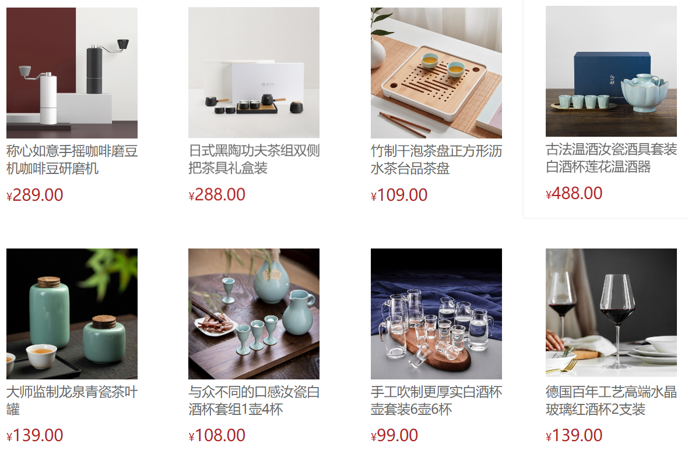
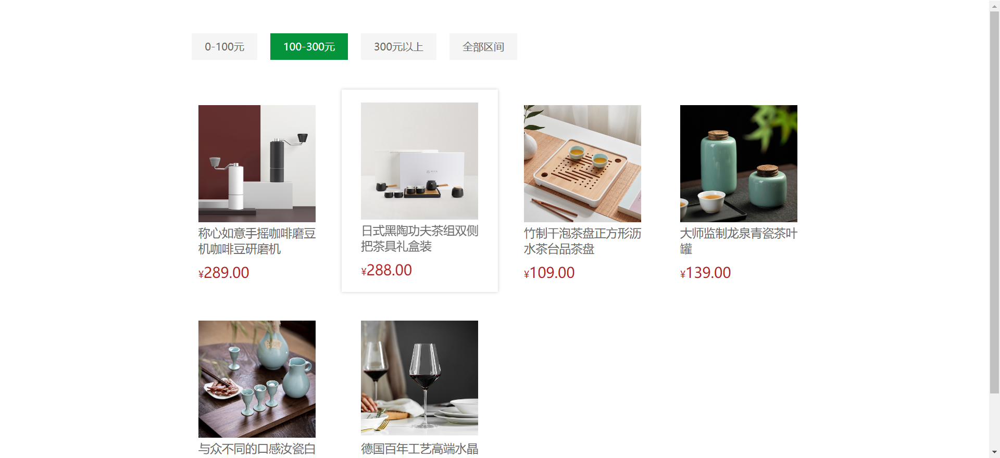

# 一、作用域&结构&箭头函数

## 作用域

### 局部作用域

+ 函数作用域
+ 块作用域

#### 函数作用域

在函数内声明的变量，只能在函数内部访问，外部无法访问

函数执行完毕后，函数内部的变量实际被清空了

```html
<script>
	function getSum() {
    const num = 10
  }
  console.log(num) // 会报错，函数外部不能使用局部作用域变量
</script>
```

#### 块作用域

代码块内部声明的变量外部一般是不能被访问的；如果是不一般的情况，那就是直接用 `var` 来声明，这个时候外部就可以访问这个变量了。

```html
<script>
	for(let i = 1; i <= 4; i++) {
    console.log(i) // 正常访问
  }
  console.log(i) // 报错

  for(var t = 1; t <= 4; t++) {
    console.log(t) // 正常访问
  }
  console.log(t) // 正常访问，因为 var 不会产生块作用域
</script>
```

那么，一般我们都是使用 `let` 或者 `const` 来声明。这两个关键字声明的变量或者常量都会产生块作用域。

### 全局作用域

那如果我想声明全局作用域应该在哪里声明呢？

`<script>标签` 和 `.js文件` ，在这些地方声明的变量在函数内部也可以被访问。

```html
<script>
	const num = 10
  function fn() {
    console.log(num)
  }
</script>
```

:::warning 注意

1. 为 window 对象动态添加的属性默认也是全局的，不推荐！
2. 函数中未使用任何关键字声明的变量为全局变量，不推荐！！！
3. 尽可能少的声明全局变量，防止全局变量被污染

:::

### 作用域链

本质上是变量查找机制

1. 当函数被执行时，会优先查找当前函数作用域中的变量

2. 如果当前作用域查找不到则会依次逐级查找父级作用域直到全局作用域

```html
<script>
	let a = 1
  let b = 1
  function f() {
    let a = 1
    function g() {
      a = 2
      console.log(a)
    }
    g()
  }
  f() // a = 2
</script>
```

即，子作用域能够访问父作用域，父级作用域无法访问子级作用域

### JS垃圾回收机制(GC)

JS中内存的分配与回收都是自动完成的，内存在不使用的时候会被垃圾回收器自动回收。如果不再用到的内存没有及时释放，就叫做**内存泄漏**。

#### 内存的生命周期

1. 内存分配：当我们声明变量、函数、对象的时候，系统会自动为他们分配内存
2. 内存使用：即读写内存，也就是使用变量、函数等
3. 内存回收：使用完毕，由垃圾回收自动不再使用的内存

:::warning 注意

全家变量一般不会回收（关闭页面回收）

一般情况下局部变量的值，不用了，会被自动回收掉

:::

#### 算法说明

常见的浏览器垃圾回收算法：引用计数法 和 标记清除法

##### 引用计数法

IE采用，定义“内存不再使用”，就看一个对象是否有指向它的引用，没有引用了就回收对象。

算法：

1. **跟踪记录被引用的次数** （核心）
2. 如果被引用了一次，那么就记录次数加1，多次引用会累加 ++
3. 如果减少一个引用就减1 --
4. 如果引用次数是0，则释放内存

但是，它有一个致命的问题：**嵌套引用**（循环引用）

如果两个对象相互引用，尽管他们已不再使用，垃圾回收器不会进行回收，导致内存泄漏。

```js
function fn() {
  let o1 = {}
  let o2 = {}
  o1.a = o2
  o2.a = o1
  return '引用计数无法回收'
}
fn()
```

由于它们互相引用，引用次数就永远都不会是0。这样的相互引用如果说很大量的存在就会导致大量的内存泄漏。

##### 标记清除法

所以，现代浏览器大多是基于**标记清除算法**的某些改进算法，总体思路是差不多的。

思路：

1. 标记清楚算法将“不再使用的对象”定义为“无法达到的对象”
2. 就是从根部（在JS中就是全局对象）出发定时扫描内存中的对象。凡是能从根部到达的对象，都是还需要使用的。
3. 那些无法由根部出发触及到的对象被标记为不再使用，稍后进行回收。

:::tip 核心思路

从根部扫描对象，能查找到的就是使用的，查找不到的就要回收

:::

### 闭包

概念：一个函数对周围状态的引用捆绑在一起，内层函数中访问到其外层函数的作用域

其实就是，闭包 = 内层函数 + 外层函数的变量

什么样的？

```js
function outer() {
  const a = 1
  function f() {
    console.log(a)
  }
  f()
}
outer()
```

就是 `函数f` 里面用到了 `外层函数a` 的变量，这样就产生了闭包

有啥用？

由前面可知我们是不能用函数里面的变量的，用了闭包以后，外部也可以访问到函数内部的变量了

```js
function outer() {
  let a = 10
  function fn() {
    console.log(a);
  }
  return fn
}
// 相当于 outer() === fn === function fn() {}
// const fun = function fn(){ }
const fun = outer()
fun() // 调用函数
```

### 变量提升

代码在执行前，内部会把当前作用域下所有用 `var` 声明的变量提升到当前作用域的最前面。只提升声明，不提升赋值

```js
console.log(num + '件') // undefined件
var num = 10
```

相当于

```js
// 1. 把所有 var 声明的变量提升到  当前作用域的最前面
// 2. 只提升声明，不提升赋值
var num 
console.log(num + '件') // undefined件
num = 10
console.log(num) // 10件
```

:::warning 注意

只有var声明之前才会存在变量提升

let / const 声明的变量不存在变量提升

变量提升出现在相同作用域当中

:::

## 函数进阶

### 函数提升

```js
fn() // 函数提升

function fn() {
  console.log('函数提升');
}
```

代码一般都是从上往下执行的，为什么这样调用函数还能打印出来？

函数也是有提升的，它会把所有函数声明提升到当前作用域的最前面，且之提升函数声明，不提升函数调用。

那要是把上面变量提升和函数提升结合在一起，是不是就是更重要了呢？🤪

```js
fun() // fun is not a function
var fun = function () {
  console.log('函数提升')
}
```

原因是，`function` 只是给了 `var fun` 赋值，而用 `var` 来提升只是提升了变量，并不会提升赋值，因此就报错了咯😞

### 函数参数

#### 动态参数

如果，有一个求和函数，不管用户传入几个实参，都要求和出来，怎么写这个函数？

```js
getSum(2, 3)
getSum(1, 2, 3)
getSum(1, 2, 3, 4, 5, 6)
```

这个时候就需要动态参数了。

`arguments` : 是函数内部内置的伪数组变量，包含了调用函数时传入的所有实参，只存在于 函数里面

```js
function getSum() {
  // console.log(arguments);
  let sum = 0
  for (let i = 0; i < arguments.length; i++) {
    sum += arguments[i]
  }
  console.log(sum);
}
getSum(2, 3, 4)
getSum(1, 2, 3, 4)
getSum(1, 2, 3, 4, 2, 2, 3, 4)
```

#### 剩余参数

能将我们一个不定数量的参数表示为一个数组

```js
function getSum(...arr) {
  console.log(arr);
}
getSum(2, 3)
getSum(1, 2, 3)
```

其中，`...` 是语法符号，至于**最末**函数形参之前，用于获取多余的实参；借助 `...` 获取的剩余实参，是个真数组。

```js
function getSum(a, b, ...arr) {
  console.log(arr);
}
getSum(2, 3) // []
getSum(1, 2, 3, 4, 5) // [3, 4, 5]
```

相比 `arguments` ，显然用剩余参数更好，毕竟一个真数组就完虐 `arguments` 了，也是多提倡使用剩余参数。

##### 展开运算符

`...` 可以将一个数组重新展开

```js
const arr = [1, 2, 3]
console.log(...arr) // 1 2 3
```

最典型的应用，就是求数组最大值最小值、合并数组等。

```js
const arr = [1, 2, 3]
console.log(Math.max(...arr)); // 3
console.log(Math.min(...arr)); // 1

const arr1 = [4, 5, 6]
const arr2 = [...arr, ...arr1]
console.log(arr2); // [1, 2, 3, 4, 5, 6]
```

### 箭头函数

1. 更简短的函数写法
2. 不绑定 `this`
3. 更适合用于那些本来就需要匿名函数的地方

#### 基本语法

1. 基本写法

```js
// 普通函数
const fn = function () {
  console.log('普通函数')
}
fn()

// 箭头函数
const fn = () => {
  console.log('箭头函数')
}
fn()
```

2. 只有一个参数可以省略小括号

```js
// 普通函数
const fn = function (x) {
  return x + x
}
console.log(fn(1)) // 2

// 箭头函数
const fn = x => {
  return x + x
}
console.log(fn(1)) // 2
```

3. 如果函数体只有一行代码，可以写到一行上且无需写 `return` 返回

```js
// 普通函数
const fn = function (x, y) {
  return x + y
}
console.log(fn(1, 2)) //3

// 箭头函数
const fn = (x, y) => x + y
console.log(fn(1, 2)) // 3
```

4. 加括号的函数体返回对象字面量表达式

```js
const fn1 = uname => ({ uname: uname })
console.log(fn1('zs')) // {uname: 'zs'}
```

#### 箭头函数参数

箭头函数没有 `arguments` 动态参数，但是有剩余参数 `...args` 

```js
const getSum = (...arr) => {
  let sum = 0
  for (let i = 0; i < arr.length; i++) {
    sum += arr[i]
  }
  return sum
}
const result = getSum(2, 3, 4)
console.log(result); // 9
```

#### 箭头函数的 this

箭头函数不会创建自己的 `this` ，它只会从自己的作用域链的上一层沿用 `this` 。就是这个 `this` 是指向父亲

```js
const obj = {
  uname: 'zs',
  sayHi: () => {
    console.log(this); // window
  }
}
obj.sayHi()
```

因此，在事件回调函数使用箭头函数时， `this` 为全局的 window ，所以DOM事件回调函数为了简便，一般不太推荐使用箭头函数

## 解构赋值

解构赋值是一种快速为变量赋值的简洁语法，本质上仍然是为变量赋值

### 数组解构

将数组的单元值快速批量赋值给一系列变量的简洁语法

**基本语法：**

```js
// 左侧[] 用于批量声明变量，右侧数组的单元值将被赋值给左侧的变量
// 变量的顺序对应数组单元值的位置依次进行赋值操作
const [a, b, c] = [1, 2, 3]
console.log(a) // 1
console.log(b) // 2
console.log(c) // 3
```

#### 典型应用交互2个变量

```js
let a = 1
let b = 2;
[b, a] = [a, b]
console.log(a, b) // 2 1
```

:::warning 注意

`let b = 2` 后面一定要加 `;`

:::


:::tip JS前面必须加分号的情况

1. 立即执行函数

```js
(function t() { })();
// 或者
;(function t() { })()
```

2. 数组解构

```js
// 数组开头的，特别是前有语句的一定注意加分号
;[b, a] = [a, b]
```

:::

示例：

```js
// 1. 解构变量
const pc = ['海尔', '联想', '小米', '方正']
const [hr, lx, mi, fz] = pc
console.log(hr); // 海尔
console.log(lx); // 联想
console.log(mi); // 小米
console.log(fz); // 方正

// 2. 解构函数
function getValue() {
  return [100, 60]
}
const [max, min] = getValue()
console.log(max); // 100
console.log(min); // 60

// 3. 变量多  单元值少的情况
const [a, b, c, d] = ['海尔', '联想', '小米']
console.log(a); // 海尔
console.log(b); // 联想
console.log(c); // 小米
console.log(d); // undefined

// 4. 利用剩余参数解决变量少，单元值多的情况
const [a4, b4, ...tel] = ['海尔', '联想', '小米', '方正', 'vivo', '格力']
console.log(a4); // 海尔
console.log(b4); // 联想
console.log(tel); // [ '小米', '方正', 'vivo', '格力' ]

// 5. 防止有 undefined 传递单元值的情况，可以设置默认值
const [a5 = '手机', b5 = '华为'] = ['小米']
console.log(a5); // 小米
console.log(b5); // 华为

// 6. 按需导入，忽略某些返回值
const [a6, , c6, d6] = ['海尔', '联想', '小米', '格力']
console.log(a6); // 海尔
console.log(c6); // 小米
console.log(d6); // 格力

// 7. 支持多维数组的结构
const [a7, [b7, c7]] = ['苹果', ['小米', '华为']]
console.log(a7); // 苹果
console.log(b7); // 小米
console.log(c7); // 华为
```

### 对象解构

对象解构是将对象属性和方法快速批量赋值给一系列变量的简洁语法

**基本语法：**

```js
const obj = {
  uname: 'zs',
  age: 18,
}
const { } = obj

// 简便写法
const { uname, age } = { uname: 'zs', age: 18 }
```

:::caution 注意

声明的变量名一定要和属性名一致才行

对象中找不到与变量名一致的属性时变量值为 `undefined` 

:::

但也不是不可以更改变量名，只需要这样就行了

```js
const { uname: username, age } = { uname: 'zs', age: 18 }

console.log(username) // zs
console.log(age) // 18
```

#### 数组对象解构

用 `[{}]` 包裹

示例：

```js
const pig = [
  {
    uname: 'zs',
    age: 8
  }
]

const [{ uname, age }] = pig
console.log(uname); // zs
console.log(age); // 8
```

#### 多级对象解构

```js
const pig = {
  name: '佩奇',
  family: {
    mother: '猪妈妈',
    father: '猪爸爸',
    sister: '乔治'
  },
  age: 6
}

const { name, family: { mother, father, sister }, age } = pig

console.log(name); // 佩奇
console.log(mother); // 猪妈妈
console.log(father); // 猪爸爸
console.log(sister); // 乔治
```

模拟JSON传递数据给前端应该如何接收

```js
const msg = {
  "code": 200,
  "msg": "获取新闻列表成功",
  "data": [
    {
      "id": 1,
      "title": "5G商用自己，三大运用商收入下降",
      "count": 58
    },
    {
      "id": 2,
      "title": "国际媒体头条速览",
      "count": 56
    },
    {
      "id": 3,
      "title": "乌克兰和俄罗斯持续冲突",
      "count": 1669
    },
  ]
}

const { data } = msg
console.log(data) // 一个数组

// 把data选出当做参数传递给 函数
function render({ data }) {
  console.log(data)
}
render()

// 改名字
function render({ data: myData }) {
  console.log(data)
}
render()
```

## 遍历数组 forEach 方法(重点)

用于调用数组的每个元素，并将元素传递给回调函数

主要使用场景：**遍历数组的每个元素**

**语法：**

```js
被遍历的数组.forEach(function (当前数组元素, 当前元素索引号)) {
  // 函数体               
}
```

示例：

```js
const arr = ['black', 'white', 'green']
arr.forEach(function (item, index) {
  console.log(`当前数组元素是: ${item}`) // 依次打印数组每一个元素
  console.log(`当前数组元素的索引是: ${index}`) // 依次打印数组每一个元素的索引
})
```

:::warning 注意

1. forEach 主要是遍历数组
2. 参数当前数组元素是必须要写的，索引号是可选的

:::

### 渲染商品列表案例

#### 核心思路

有多少条数据，就渲染多少模块，然后生成对应的 `html` 结构标签，赋值给 `list` 标签即可

1. 利用 `forEach()` 遍历数据里面的数据
2. 拿到数据，利用字符串拼接生成结构添加到页面中
3. 传递参数的时候，可以使用对象解构

#### 代码编写

```html
<head>
  <style>
    * {
      margin: 0;
      padding: 0;
      box-sizing: border-box;
    }

    .list {
      width: 990px;
      margin: 0 auto;
      display: flex;
      flex-wrap: wrap;
      padding-top: 100px;
    }

    .item {
      width: 240px;
      margin-left: 10px;
      padding: 20px 30px;
      transition: all .5s;
      margin-bottom: 20px;
    }

    .item:nth-child(4n) {
      margin-left: 0;
    }

    .item:hover {
      box-shadow: 0px 0px 5px rgba(0, 0, 0, 0.2);
      transform: translate3d(0, -4px, 0);
      cursor: pointer;
    }

    .item img {
      width: 100%;
    }

    .item .name {
      font-size: 18px;
      margin-bottom: 10px;
      color: #666;
    }

    .item .price {
      font-size: 22px;
      color: firebrick;
    }

    .item .price::before {
      content: "¥";
      font-size: 14px;
    }
  </style>
</head>

<body>
  <div class="list">
    <!-- <div class="item">
      
      <p class="name"></p>
      <p class="price"></p>
      </div> -->
  </div>
  
  <script>
    const goodsList = [
        {
          id: '4001172',
          name: '称心如意手摇咖啡磨豆机咖啡豆研磨机',
          price: '289.00',
          picture: 'https://yanxuan-item.nosdn.127.net/84a59ff9c58a77032564e61f716846d6.jpg',
        },
        {
          id: '4001594',
          name: '日式黑陶功夫茶组双侧把茶具礼盒装',
          price: '288.00',
          picture: 'https://yanxuan-item.nosdn.127.net/3346b7b92f9563c7a7e24c7ead883f18.jpg',
        },
        {
          id: '4001009',
          name: '竹制干泡茶盘正方形沥水茶台品茶盘',
          price: '109.00',
          picture: 'https://yanxuan-item.nosdn.127.net/2d942d6bc94f1e230763e1a5a3b379e1.png',
        },
        {
          id: '4001874',
          name: '古法温酒汝瓷酒具套装白酒杯莲花温酒器',
          price: '488.00',
          picture: 'https://yanxuan-item.nosdn.127.net/44e51622800e4fceb6bee8e616da85fd.png',
        },
        {
          id: '4001649',
          name: '大师监制龙泉青瓷茶叶罐',
          price: '139.00',
          picture: 'https://yanxuan-item.nosdn.127.net/4356c9fc150753775fe56b465314f1eb.png',
        },
        {
          id: '3997185',
          name: '与众不同的口感汝瓷白酒杯套组1壶4杯',
          price: '108.00',
          picture: 'https://yanxuan-item.nosdn.127.net/8e21c794dfd3a4e8573273ddae50bce2.jpg',
        },
        {
          id: '3997403',
          name: '手工吹制更厚实白酒杯壶套装6壶6杯',
          price: '99.00',
          picture: 'https://yanxuan-item.nosdn.127.net/af2371a65f60bce152a61fc22745ff3f.jpg',
        },
        {
          id: '3998274',
          name: '德国百年工艺高端水晶玻璃红酒杯2支装',
          price: '139.00',
          picture: 'https://yanxuan-item.nosdn.127.net/8896b897b3ec6639bbd1134d66b9715c.jpg',
        },
      ]
  </script>
</body>
```

2. JS 代码编写

```html
<script>
	let str = ''
  goodsList.forEach( item => {
    const { name, price, picture } = item
    str += `
      <div class="item">
        
        <p class="name">${name}</p>
        <p class="price">${price}</p>
      </div>
		`
  })
  document.querySelector('.list').innerHTML = str
</script>
```



## 筛选数组 filter 方法

主要使用场景：**筛选数组符合条件的元素**，并返回筛选之后元素的新数组

**语法：**

```js
// 1. 返回一个新的数组
// 2. currentValue 必须写，index 可选
被遍历的数组.filter(function (currentValue, index){
  return 筛选条件
})
```

示例：

```js
// 筛选数组中大于30的元素
const score = [10, 50, 3, 40, 33]
const re = score.filter(function (item) {
  return item > 30
})

// 或者改成箭头函数
const re = score.filter(item => item > 30)
console.log(re) // [50, 40, 33]
```

还不懂，看看这个吧

`🐶🐱🐶🐶.filter(🐱) => 🐱`

## 综合案例 - 商品列表价格筛选

### 需求

1. 渲染数据列表
2. 根据选择不同条件显示不同商品

### 代码编写

1. 基础框架

```html
<head>
  <style>
    * {
      margin: 0;
      padding: 0;
      box-sizing: border-box;
    }

    .list {
      width: 990px;
      margin: 0 auto;
      display: flex;
      flex-wrap: wrap;
    }

    .item {
      width: 240px;
      margin-left: 10px;
      padding: 20px 30px;
      transition: all .5s;
      margin-bottom: 20px;
    }

    .item:nth-child(4n) {
      margin-left: 0;
    }

    .item:hover {
      box-shadow: 0px 0px 5px rgba(0, 0, 0, 0.2);
      transform: translate3d(0, -4px, 0);
      cursor: pointer;
    }

    .item img {
      width: 100%;
    }

    .item .name {
      font-size: 18px;
      margin-bottom: 10px;
      color: #666;
    }

    .item .price {
      font-size: 22px;
      color: firebrick;
    }

    .item .price::before {
      content: "¥";
      font-size: 14px;
    }

    .filter {
      display: flex;
      width: 990px;
      margin: 0 auto;
      padding: 50px 30px;
    }

    .filter a {
      padding: 10px 20px;
      background: #f5f5f5;
      color: #666;
      text-decoration: none;
      margin-right: 20px;
    }

    .filter a:active,
    .filter a:focus {
      background: #05943c;
      color: #fff;
    }
  </style>
</head>

<body>
  <div class="filter">
    <a data-index="1" href="javascript:;">0-100元</a>
    <a data-index="2" href="javascript:;">100-300元</a>
    <a data-index="3" href="javascript:;">300元以上</a>
    <a href="javascript:;">全部区间</a>
  </div>
  <div class="list">
    <!-- <div class="item">
    
    <p class="name"></p>
    <p class="price"></p>
    </div> -->
  </div>
  
  <script>
    // 2. 初始化数据 
    const goodsList = [
      {
        id: '4001172',
        name: '称心如意手摇咖啡磨豆机咖啡豆研磨机',
        price: '289.00',
        picture: 'https://yanxuan-item.nosdn.127.net/84a59ff9c58a77032564e61f716846d6.jpg',
      },
      {
        id: '4001594',
        name: '日式黑陶功夫茶组双侧把茶具礼盒装',
        price: '288.00',
        picture: 'https://yanxuan-item.nosdn.127.net/3346b7b92f9563c7a7e24c7ead883f18.jpg',
      },
      {
        id: '4001009',
        name: '竹制干泡茶盘正方形沥水茶台品茶盘',
        price: '109.00',
        picture: 'https://yanxuan-item.nosdn.127.net/2d942d6bc94f1e230763e1a5a3b379e1.png',
      },
      {
        id: '4001874',
        name: '古法温酒汝瓷酒具套装白酒杯莲花温酒器',
        price: '488.00',
        picture: 'https://yanxuan-item.nosdn.127.net/44e51622800e4fceb6bee8e616da85fd.png',
      },
      {
        id: '4001649',
        name: '大师监制龙泉青瓷茶叶罐',
        price: '139.00',
        picture: 'https://yanxuan-item.nosdn.127.net/4356c9fc150753775fe56b465314f1eb.png',
      },
      {
        id: '3997185',
        name: '与众不同的口感汝瓷白酒杯套组1壶4杯',
        price: '108.00',
        picture: 'https://yanxuan-item.nosdn.127.net/8e21c794dfd3a4e8573273ddae50bce2.jpg',
      },
      {
        id: '3997403',
        name: '手工吹制更厚实白酒杯壶套装6壶6杯',
        price: '99.00',
        picture: 'https://yanxuan-item.nosdn.127.net/af2371a65f60bce152a61fc22745ff3f.jpg',
      },
      {
        id: '3998274',
        name: '德国百年工艺高端水晶玻璃红酒杯2支装',
        price: '139.00',
        picture: 'https://yanxuan-item.nosdn.127.net/8896b897b3ec6639bbd1134d66b9715c.jpg',
      },
    ]
  </script>
</body>
```

2. 渲染数据列表

```html
<script>
	function render(arr) {
    let str = ''
    arr.forEach(item => {
      const { name, price, picture } = item
      str += `
        <div class="item">
          
          <p class="name">${name}</p>
          <p class="price">${price}</p>
        </div>
			`
    })
    document.querySelector('.list').innerHTML = str
  }
  render(goodsList)
</script>
```

3. 根据不同条件选择不同商品

```html
<script>
	document.querySelector('.filter').addEventListener('click', e => {
    const { tagName, dataset } = e.target
    if (tagName === 'A') {
      let arr = goodsList
      if (dataset.index === '1') {
        arr = goodsList.filter(item => item.price > 0 && item.price <= 100)
      } else if (dataset.index === '2') {
        arr = goodsList.filter(item => item.price >= 100 && item.price <= 300)
      } else if (dataset.index === '3') {
        arr = goodsList.filter(item => item.price >= 300)
      }
      render(arr)
    }
  })
</script>
```



