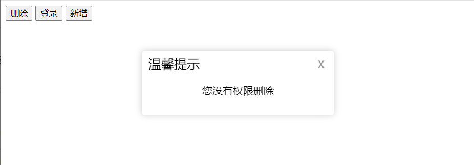

# 三、深入面向对象

## 编程思想

### 面向过程介绍

面向过程就是列出解决问题的每一个步骤，然后用函数把这些步骤一步一个脚印的实现，使用的时候再一个一个依次调用就可以了。

之前所写的就是面向过程的方法。

### 面向对象介绍

面向对象就是把事务分解成一个一个对象，然后由对象之间分工与合作。

举个栗子：

比如说，盖浇饭，那肯定是先正好饭，然后码子分别做好，需要哪些码子盖上去就好了。


所以，面向对象是以对象功能来划分问题，而不是步骤。

公司越大，面向对象就越需要

### 两者对比

|      | 面向过程编程                                                                 | 面向对象编程                                                                                                         |
| ---- | ---------------------------------------------------------------------------- | -------------------------------------------------------------------------------------------------------------------- |
| 优点 | 性能比面向对象高，适合跟硬件联系很紧密的东西，例如单片机就采用面向过程编程。 | 易维护、易复用、易扩展、由于面向对象有封装、继承、多态性的特性，可以设计出低耦合的系统，使系统更加灵活、更加易于维护 |
| 缺点 | 没有面向对象易维护、易复用、易扩展                                           | 性能比面向过程低                                                                                                     |

两者没有谁比谁更优，只有更适合。于前端而言，面向过程会更多；而JAVA则面向对象更多。

## 构造函数

封装是面向对象思想比较重要的一部分；

JS面向对象可以通过构造函数实现封装。

构造函数虽然好用，但是会存在 **浪费内存** 的问题

比如：

```js
function Star(uname, age) {
  this.uname = uname
  this.age = age
  this.sing = function () {
    console.log('唱歌');
  }
}

const ldh = new Star('刘德华', 55)
const zxy = new Star('张学友', 58)
// console.log(ldh === zxy);
console.log(ldh.sing === zxy.sing); // false
```

你会发现，明明都是同一个函数 `Star` ，但是两个的 `sing` 就是不一样，这是因为创建的时候在内存空间开辟了两个不一样的内存地址去引用，所以就会造成浪费内存的问题。

既然对象里面的函数是同一个，能否够用一个呢？

## 原型

原型，其实就是构造函数里面的一个 `prototype` 属性，但是就是以一个对象的形式存在的，所以也会称为原型对象。

因此，通过原型分配的函数是所有对象所共享的。

所以，要想节省内存，提高性能，上面的代码应该改成：

```js
function Star(uname, age) {
  this.uname = uname
  this.age = age
  // this.sing = function () {
  //   console.log('唱歌');
  // }
}
Star.prototype.sing = function () {
  console.log('唱歌');
}

const ldh = new Star('刘德华', 55)
const zxy = new Star('张学友', 58)
ldh.sing() // 唱歌
zxy.sing() // 唱歌
console.log(ldh.sing === zxy.sing); // true
```

:::tip 所以，以后写代码要注意：

1. 公共的属性要写到 构造函数里面
2. 公共的方法写到 原型对象身上

:::

而对于 `this` 的指向：构造函数和原型对象中的this

### constructor 属性

每个原型对象里面都会有一个 `constructor` 属性，这个属性指向原型对象的构造函数。但是不是指向调用这个原型的对象哦

```js
function Star() {

}
const ldh = new Star()
console.log(Star.prototype.constructor === ldh); // false
console.log(Star.prototype.constructor === Star); // true
```

#### 使用场景

如果有多个对象的方法，我们可以给原型对象采取对象形式赋值

```js
function Star(uname) {
  this.uname = uname
}
Star.prototype = {
  sing: function () { console.log('唱歌') }
  dance: function () { console.log('跳舞') }
}
console.log(Stat.prototype.constructor) // 指向 Object
```

这样的话 `constructor` 就不知道指向谁了，因为 `prototype` 的操作更像是重新赋值而不是以追加的形式进行，因此我们可以在修改后的原型对象中，添加一个 `constructor` 指向原来的构造函数。

```js
function Star(uname) {
  this.uname = uname
}
Star.prototype = {
  constructor: Star,
  sing: function () { console.log('唱歌') }
  dance: function () { console.log('跳舞') }
}
console.log(Stat.prototype.constructor) // 指向 Star
```

下一个问题：

构造函数可以创建实例对象，构造函数还有一个原型对象，一些公共的属性或者方法放到这个原型对象身上，但是为什么实例对象可以访问原型对象里面的属性和方法？


### 对象原型

答案就是，对象都会有一个属性 `__proto__` 指向构造函数 `prototype` 原型对象，之所以对象可以使用构造函数 `prototype` 原型对象的属性和方法，就是因为对象有 `__proto__` 原型的存在。


这三个，对象原型 `__proto__` 指向 该构造函数的原型对象

对象原型里面的 `constructor` 指向 构造函数 `Star` 


### 原型继承

继承是面向对象编程的另一个特性，通过继承进一步提升代码封装的程度。JavaScript中大多是借助原型对象实现继承的特性。

示例：

```html
<script>
	const Person = {
    eyes: 2,
    head: 1
  }
  
  function Woman() {}
  Woman.prototype = Person
  Woman.prototype.constructor = Woman
  const red = Woman()
  console.log(red)
</script>
```

输出结果：


这个就是原型继承

当然，男人也是人，一样也可以继承人类的属性。但是，毕竟男女有别，现在想要给女人加多一个属性方法：

```html
<script>
  const Person = {
    eyes: 2,
    head: 1
  }
  
  function Woman() {}
  Woman.prototype = Person
  Woman.prototype.constructor = Woman
  // 加多一个baby
  Woman.prototype.baby = function () {
    console.log('宝贝')
  }
  const red = Woman()
  console.log(red)
  
  function Man() {}
  Man.prototype = Person
  Man.prototype.constructor = Man
  const blue = Man()
  console.log(blue)
</script>
```

结果：


出现这个问题的原因是因为男人和女人同时使用了同一个对象 `Person` ，根据引用类型的特点，他们都指向同一个对象，修改一个就会都影响。

怎么解决？也不难

```html
<script>
  function Person() {
    this.eyes = 2
    this.head = 1
  }

  function Woman() {}
  Woman.prototype = new Person()
  Woman.prototype.constructor = Woman
  Woman.prototype.baby = function () {
    console.log('宝贝');
  }

  const red = new Woman()
  console.log(red);

  function Man() {}
  Man.prototype = new Person()
  Man.prototype.constructor = Person
  const blue = new Man()
  console.log(blue);
</script>
```

结果：


其实也不难理解，因为 `new` 每次都会创建一个新的对象，因此 `Woman.prototype = new Person()` 和  `Man.prototype = new Person()` 相当于指向了两个不同的内存地址的 `Person` ，所以，这样就能很好解决了引用了同一个对象的问题。

### 原型链（高频面试题）

这个知识点如果难以理解，可以结合这个[视频](https://www.bilibili.com/video/BV1Y84y1L7Nn/?p=184&vd_source=ce2373d3d93ecee4088b1954ccc2db50)

基于原型对象的继承使得不同构造函数的原型对象关联在一起，并且这种关联的关系是一种链状的结构，这几种关系称为原型链。


::: tip 总结一下

1. 只要是对象都有原型 `__proto__` ， `__proto__` 指向原型对象
2. 只要是原型对象里面就有 `constructor` ，指向创造我的构造函数

:::

原型链其实只是一个查找规则。如果想要理解平时的使用场景，可以点击查看[这里]( https://www.bilibili.com/video/BV1Y84y1L7Nn/?p=184&share_source=copy_web&vd_source=1d915d270b1683048b8999b2b3802333&t=1128)

`__proto__` 的意义存在在于为对象成员查找机制提供一个方向，或者一条路线。

当然，也可以使用 `instaceof` 运算符用于检测构造函数的 `prototype` 属性是否出现在某个实例对象的原型链上。

## 综合案例

### 消息提示对象封装

#### 需求

1. 定义模态框 `Modal` 构造函数，用来创建对象
2. 模态框具备打开功能 `open` 方法（按钮点击可以打开模态框）
3. 模态框具备关闭功能 `close` 方法

#### 代码编写

1. 框架

```html
<head>
  <style>
    .modal {
      width: 300px;
      min-height: 100px;
      box-shadow: 0 0 10px rgba(0, 0, 0, 0.2);
      border-radius: 4px;
      position: fixed;
      z-index: 999;
      left: 50%;
      top: 50%;
      transform: translate3d(-50%, -50%, 0);
      background-color: #fff;
    }

    .modal .header {
      line-height: 40px;
      padding: 0 10px;
      position: relative;
      font-size: 20px;
    }

    .modal .header i {
      font-style: normal;
      color: #999;
      position: absolute;
      right: 15px;
      top: -2px;
      cursor: pointer;
    }

    .modal .body {
      text-align: center;
      padding: 10px;
    }

    .modal .footer {
      display: flex;
      justify-content: flex-end;
      padding: 10px;
    }

    .modal .footer a {
      padding: 3px 8px;
      background: #ccc;
      text-decoration: none;
      color: #fff;
      border-radius: 2px;
      margin-right: 10px;
      font-size: 14px;
    }

    .modal .footer a.submit {
      background-color: #369;
    }
  </style>
</head>

<body>
  <button id="delete">删除</button>
  <button id="login">登录</button>
  <button id="add">新增</button>

  <!-- <div class="modal">
    <div class="header">温馨提示 <i>x</i></div>
    <div class="body">您没有删除权限操作</div>
  </div> -->
</body>
```

2. `Modal` 构造函数制作

```html
<script>
	function Moadl(title = '', message = '') {
    this.modalBox = document.createElement('div')
    this.modalBox.className = 'modal'
    this.modalBox.innerHTML = `
			<div class="header">${title} <i>x</i></div>
      <div class="body">${message}</div>
		`
  }
</script>
```

3. `open` 方法

```html
<script>
	Modal.prototype.open = function () {
    const box = document.querySelector('.modal')
    box && box.remove()
  }
  
  document.querySelector('#delete').addEventListener('click', () => {
    const del = new Modal('温馨提示', '您没有权限删除')
    del.open()
  })
  document.querySelector('#login').addEventListener('click', () => {
    const login = new Modal('友情提示', '您没有登录')
    login.open()
  })
</script>
```

4. `close` 方法

```html
<script>
	Modal.prototype.open = function () {
    ...
    document.body.append(this.modalBox)
    this.modalBox.querySelector('i').addEventListener('click', () => {
      this.close()
    })
  }
  
  Modal.prototype.close = function () {
    this.modalBox.remove()
  }
</script>
```




