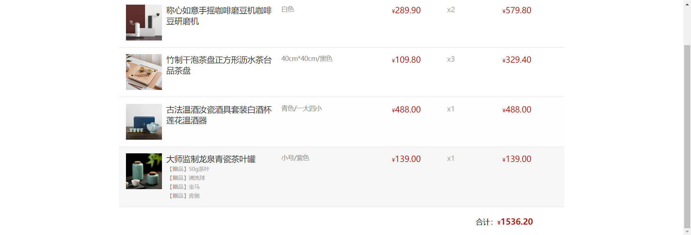

# 二、构造函数&数据常用函数

## 深入对象

### 创建对象三种方法

1. 利用对象字面量创建对象

```js
const o = {
  name: 'zs'
}
```

2. 利用 `new Object` 创建对象

```js
const o = new Object({ name: 'zs' })
console.log(o) // {name: 'zs'}
```

3. 利用构造函数创建对象

### 构造函数

一种特殊的函数，主要用来初始化对象

设想一个这样的场景，我们需要创建几个对象，但是对象里面的属性都是一样的，如下：

```js
const Peppa = {
  name: '佩奇',
  age: '6',
  gender: '女'
}

const George = {
  name: '乔治',
  age: '3',
  gender: '男'
}

const Mum = {
  name: '猪妈妈',
  age: '36',
  gender: '女'
}

const Dad = {
  name: '猪爸爸',
  age: '46',
  gender: '男'
}
```

这样创建对象实在是太麻烦了，这个时候我们就可以把这四个对象公共的属性抽取出来，封装到一个函数里面去，这个时候，这个函数就是**构造函数**了。

```js
function Pig(name, age, gender) {
  // 不一定是this.name, 也可以是this.uname, 等号后面的name是形参
  this.name = name
  this.age = age
  this.gender = gender
}

const Peppa = new Pig('佩奇', '6', '女')
const George = new Pig('乔治', '3', '男')
const Mum = new Pig('猪妈妈', '36', '女')
const Dad = new Pig('猪爸爸', '46', '男')
```

这样就可以更加简洁的创建对象了。

:::tip 要想使用构造函数需要注意一下

1. 构造函数，本质也是一个函数，函数能用的，构造函数也能用
2. `this.name` 只是一个对象的 `name` 属性，`this` 指向的创建的对象，可以理解为 `obj` 
3. 它的命名要以大写字母开头
4. 只能由 `new` 操作符来执行
5. 没有参数的时候可以省略 `()` 
6. 构造函数内部不需要写 `return` ，写了也没用，返回值就是一个新创建的对象
7. 本质上，`new Object() ` 、 `new Date()` 也是实例化的构造函数

:::

#### 实例化执行过程

1. 单单创建一个构造函数是没有创建对象的，一旦`new` 了以后，就立马创建新的空对象
2. 此时构造函数`this` 指向新对象
3. 执行构造函数代码，修改 `this` ，添加新的属性
4. 返回新对象

### 实例成员 & 静态成员

**实例对象：**

实例对象中的属性和方法称为实例成员（实例属性和实例方法）

也就是说，实例成员 = 实例属性 + 实例方法

```js
function Pig(name) {
  this.name = name
}

const peiqi = new Pig('佩奇')
const qiaozhi = new Pig('乔治')
console.log(peiqi); // Pig { name: '佩奇' }
console.log(qiaozhi); // Pig { name: '乔治' }
// 实例属性
peiqi.name = '小猪佩奇'
// 实例方法
peiqi.sayHi = () => {
  console.log('hi~~~');
}
console.log(peiqi); // Pig { name: '小猪佩奇', sayHi: [Function (anonymous)] }
console.log(peiqi === qiaozhi); // false
```

**静态成员：**

构造函数的属性和方法被称为静态成员（静态属性和静态方法）

```js
function Pig(name) {
  this.name = name
}

// 静态属性
Pig.eyes = 2
// 静态方法
Pig.sayHi = function () {
  console.log(this);
}
Pig.sayHi() // [Function: Pig] { eyes: 2, sayHi: [Function (anonymous)] }
console.log(Pig.eyes); // 2
```

#### 总结


对比两个其实可以看到，实例对象其实就相当于需要 `new` 一个常量，然后通过常量再去 `.属性` 或者 `.方法` ；而静态成员则是直接用 `函数.` 的方式去添加属性或者方法

## 内置构造函数

一般来说，只有对象才有属性和方法，但是现在有这么一个情况

```js
const str = 'zs'
console.log(str.length) // 2

const num = 12
console.log(num.toFixed(2)) // 12.00
```

简单数据类型也有属性和方法？似乎不太符合常理

但其实JS在底层进行了一个包装

```js
const str = 'zs'
```

其实相当于把简单数据类型包装成了对象，那是对象就可以使用属性和方法了。

```js
const str = new String('pink')
```

这样看来似乎就合理多了，只不过平时都不会这样写，JS已经在底层帮忙写了。

那么，JS内置的构造函数有两种，**引用类型**和**包装类型**

**引用类型：**

Object, Array, RegExp, Date 等

**包装类型：**

String, Number, Boolean 等

### Object

一般用于创建普通对象

```js
const user = new Object(
	{
    name: '张三',
    age: 15
  }
)
```

当然，这样弄实在是太麻烦了，所以一般都是直接简写成

```js
const user = { name: '张三', age: 15}
```

Object 有三个常用的静态方法

#### 获取对象中的所有属性（键）

使用方法：

`Objcet.keys` 

语法：

```js
const o = { uname: 'zs', age: 17 }
console.log(Object.keys(o)); // [ 'uname', 'age' ]
```

返回的是一个数组

#### 获取对象中的所有属性值

使用方法：

`Object.values` 

语法：

```js
const o = { uname: 'zs', age: 17 }
console.log(Object.values(o)); // [ 'zs', 17 ]
```

返回一个数组

#### 拷贝对象

以前加属性只能通过追加的形式，现在可以直接通过拷贝的方式加上需要的属性

使用方法：

`Object.assign` 

语法：

```js
const o = { uname: 'zs', age: 17 }
const oo = {}
Object.assign(oo, o)
console.log(oo); // { uname: 'zs', age: 17 }

Object.assign(o, { gender: '男' })
console.log(o) // { uname: 'zs', age: 17, gender: '男' }
```

### Array

一般用于创建数组

```js
const arr = new Array(3, 5)
console.log(arr) // [3, 5]
```

当然，一般也不会这样去创建数组，都是直接创建

```js
const arr = [3, 5]
```

#### forEach 

用于遍历数组

**语法：**

```js
const arr = ['a', 'b', 'c']
arr.forEach(e => console.log(e)) // a  b  c
```

#### filter

用于筛选数组元素，并生成新数组

**语法：**

```js
const words = ['spray', 'limit', 'elite', 'exuberant', 'destruction', 'present']
const result = words.filter(word => word.length > 6)
console.log(result); // [ 'exuberant', 'destruction', 'present' ]
```

#### map

用于迭代数组，返回新数组

**语法：**

```js
let arr = [3, 4, 5, 6, 7]
let modifiedArr = arr.map(function (e) {
  return e * 3
})
console.log(modifiedArr); // [ 9, 12, 15, 18, 21 ]
```

#### reduce

用于求和等，返回函数累计处理的结果

**语法：**

`arr.reduce(function(上一次值, 当前值 [,索引号][,源数组]) {}, 起始值)`

事实上，有初始值和没有初始值的原理其实也不太相同

没有初始值的情况：

示例：

```js
const arr = [1, 5, 8]
// 没有初始值
const total = arr.reduce(function (prev, current) {
  return prev + current
})
console.log(total); // 14

// 具体原理
// 上一次值    当前值    返回值  （第一次循环）
//    1          5        6
// 上一次值    当前值    返回值  （第二次循环）
//    6          8        14
```

有初始值的情况：

示例：

```js
const arr = [1, 5, 8]
// 有初始值
const total = arr.reduce(function (prev, current) {
  return prev + current
}, 10)
console.log(total); // 24

// 上一次值    当前值    返回值  （第一次循环）
//    10         1        11
// 上一次值    当前值    返回值  （第二次循环）
//    11         5        16
// 上一次值    当前值    返回值  （第三次循环）
//    16         8        24
```

当然，也可以用箭头函数，更加简单

```js
const total = arr.reduce((prev, current) => prev + current, 10)
console.log(total) // 24
```

#### join

用于数组元素拼接为字符串，返回字符串

示例：

```js
const elements = ['Fire', 'Air', 'Water']
console.log(elements.join()); // Fire,Air,Water
console.log(elements.join('')); // FireAirWater
console.log(elements.join('-')); // Fire-Air-Water
```

#### find 

查找元素， 返回符合测试条件的第一个数组元素值， 如果没有符合条件的则返回undefined

示例：

```js
const arr = [5, 12, 8, 130, 44]
const found = arr.find(e => e > 10)
console.log(found); // 12
```

#### every

检测数组所有元素是否都符合指定条件，如果所有元素都通过检测返回true,否则返回false

示例：

```js
const isBelowThreshold = (currentValue) => currentValue < 40
const arr = [1, 30, 39, 29, 10, 13]
console.log(arr.every(isBelowThreshold)); // true
```

#### 伪数组转换为真数组

**语法：**

`Array.from()`

示例：

```html
<body>
  <ul>
    <li>1</li>
    <li>2</li>
    <li>3</li>
  </ul>

  <script>
    const lis = document.querySelectorAll('ul li')
    const liss = Array.from(lis)
    liss.pop()
    console.log(liss);
  </script>
</body>
```

### String

#### length

用来获取字符串的度长

示例：

```js
const str = 'zs'
console.log(str.length) // 2
```

#### split('分隔符')

把字符串转换为数组

示例：

```js
const str = 'black, white'
const arr = str.split(',')
console.log(arr); // [ 'black', ' white' ]
```

#### substring(需要截取的第一个字符的索引[,结束的索引号])

用于字符串截取

示例：

```js
const str = '今天星期一'
console.log(str.substring(3)); // 期一
console.log(str.substring(3, 4)); // 期
```

#### startsWith(检测字符串[, 检测位置索引号])

检测是否以某字符串开头

示例：

```js
const str = '正在编程中'
console.log(str.startsWith('正')); // true
console.log(str.startsWith('在')); // false
```

#### includes(搜索的字符串[, 检测位置索引号])

判断一个字符串是否包含在另一个字符串中，根据情况返回 true 或 false

```js
const str = '真的有包含吗'
console.log(str.includes('真的')); // true
console.log(str.includes('真的', 3)); // false
```

### Number

一般用于创建数值

#### toFixed()

设置保留小数位的长度

示例：

```js
const num = 10.123456
console.log(num.toFixed(2)); // 10.12
```

## 综合案例

### 需求

根据后台提供的数据，渲染购物车页面

### 分析业务

1. 渲染图片、标题、颜色、价格、赠品等数据
2. 单价和小计模块
3. 总价模块

### 代码

1. 静态结构

```html
<head>
  <style>
    * {
      margin: 0;
      padding: 0;
      box-sizing: border-box;
    }

    .list {
      width: 990px;
      margin: 100px auto 0;
    }

    .item {
      padding: 15px;
      transition: all .5s;
      display: flex;
      border-top: 1px solid #e4e4e4;
    }

    .item:nth-child(4n) {
      margin-left: 0;
    }

    .item:hover {
      cursor: pointer;
      background-color: #f5f5f5;
    }

    .item img {
      width: 80px;
      height: 80px;
      margin-right: 10px;
    }

    .item .name {
      font-size: 18px;
      margin-right: 10px;
      color: #333;
      flex: 2;
    }

    .item .name .tag {
      display: block;
      padding: 2px;
      font-size: 12px;
      color: #999;
    }

    .item .price,
    .item .sub-total {
      font-size: 18px;
      color: firebrick;
      flex: 1;
    }

    .item .price::before,
    .item .sub-total::before,
    .amount::before {
      content: "¥";
      font-size: 12px;
    }

    .item .spec {
      flex: 2;
      color: #888;
      font-size: 14px;
    }

    .item .count {
      flex: 1;
      color: #aaa;
    }

    .total {
      width: 990px;
      margin: 0 auto;
      display: flex;
      justify-content: flex-end;
      border-top: 1px solid #e4e4e4;
      padding: 20px;
    }

    .total .amount {
      font-size: 18px;
      color: firebrick;
      font-weight: bold;
      margin-right: 50px;
    }
  </style>
</head>

<body>
  <div class="list">
    <!-- <div class="item">
      
      <p class="name">称心如意手摇咖啡磨豆机咖啡豆研磨机 <span class="tag">【赠品】10优惠券</span></p>
      <p class="spec">白色/10寸</p>
      <p class="price">289.90</p>
      <p class="count">x2</p>
      <p class="sub-total">579.80</p>
    </div> -->
  </div>
  <div class="total">
    <div>合计：<span class="amount">1000.00</span></div>
  </div>
  
  <script>
    const goodsList = [
      {
        id: '4001172',
        name: '称心如意手摇咖啡磨豆机咖啡豆研磨机',
        price: 289.9,
        picture: 'https://yanxuan-item.nosdn.127.net/84a59ff9c58a77032564e61f716846d6.jpg',
        count: 2,
        spec: { color: '白色' }
      },
      {
        id: '4001009',
        name: '竹制干泡茶盘正方形沥水茶台品茶盘',
        price: 109.8,
        picture: 'https://yanxuan-item.nosdn.127.net/2d942d6bc94f1e230763e1a5a3b379e1.png',
        count: 3,
        spec: { size: '40cm*40cm', color: '黑色' }
      },
      {
        id: '4001874',
        name: '古法温酒汝瓷酒具套装白酒杯莲花温酒器',
        price: 488,
        picture: 'https://yanxuan-item.nosdn.127.net/44e51622800e4fceb6bee8e616da85fd.png',
        count: 1,
        spec: { color: '青色', sum: '一大四小' }
      },
      {
        id: '4001649',
        name: '大师监制龙泉青瓷茶叶罐',
        price: 139,
        picture: 'https://yanxuan-item.nosdn.127.net/4356c9fc150753775fe56b465314f1eb.png',
        count: 1,
        spec: { size: '小号', color: '紫色' },
        gift: '50g茶叶,清洗球,宝马,奔驰'
      }
    ]
  </script>
</body>
```

2. 填写逻辑

```html
<script>
	document.querySelector('.list').innerHTML = goodsList.map(item => {
    const { picture, name, count, price, spec, gift } = item
    const text = Object.value(spec).join('/')
    const str = gift ? gift.split(',').map(item => `<span class="tag">【赠品】${item}</span>`).join('') : ''
    // *100 /100 是因为精度问题，如果直接相乘后面会出现精度的问题
    const subTotal = ((price * 100 * count) / 100).toFixed(2)
    return `
      <div class="item">
        
        <p class="name">${name} ${str} </p>
        <p class="spec">${text}</p>
        <p class="price">${price.toFixed(2)}</p>
        <p class="count">x${count}</p>
        <p class="sub-total">${subTotal}</p>
      </div>
    `
  }).join('')
  
  const total = goodsList.reduce((prev, item) => prev + (item.price * 100 * item.count) / 100, 0)
  document.querySelector('.amount').innerHTML = total.toFixed(2)
</script>
```

