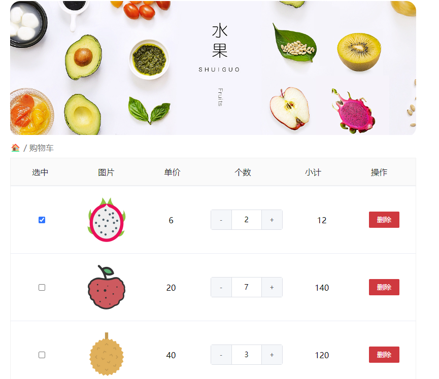
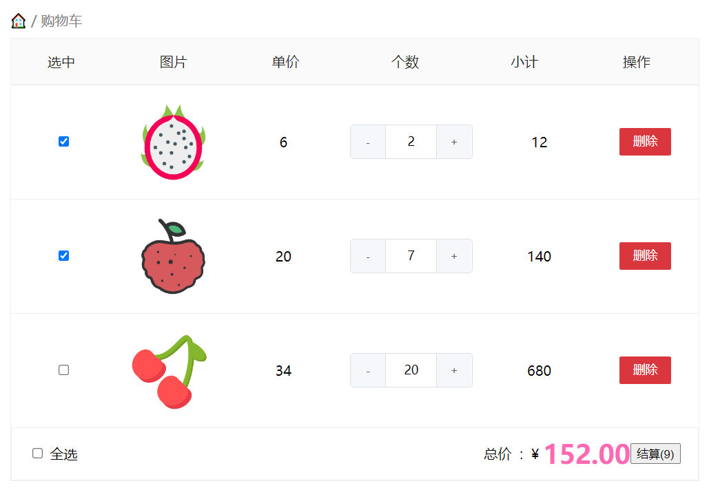

# 作业 - 2

## 客观题

 https://ks.wjx.top/vj/QG54lSj.aspx

## 排错题

### 1. forEach排错题

以下代码是否有问题，如果有，如何修改

```js
const arr = [1,2,3,4,5]

const res = arr.forEach(item,index, arr) {
  console.log(item);
}
```

答：`forEach` 里面应该是函数，应该修改为 `const res = arr.forEach(item => console.log(item))`

### 2. 实例成员 - 静态成员

size与getSize 是实例成员说法对吗

name与getName 是静态成员说法对吗

```js
function fn(){}
fn.size = '24cm'
fn.getSize = function() {}

const obj = {
  name: '123',
  getName: function() {}
}

obj.name
obj.getName()
```

- `size` 和 `getSize` 是实例成员，因为它们是定义在函数 `fn` 上的。
- `name` 和 `getName` 是实例成员，因为它们是定义在对象 `obj` 上的。

### 3. map 的排错题

下面res的返回值是[2] 说法对吗

```js
const arr = [1,2,3]

const res = arr.map(function(item, index) {
  return item % 2 === 0
})

console.log(res);
```

答：不对。map的返回值只有 `true` 和 `false` 

### 4. find 排错题

下面res的返回值是 undefined 说法对吗

```js
const arr = [11, 22, 33, 44]

const res = arr.find(item => item > 50)
console.log(res); 
```

答：是的

### 5. 字符串的 subString 排错题

下面打印的结果是 ll 说法对吗

```js
const str = 'hello'
console.log(str.substring(2,3)); 
```

答：不正确。输出的是 `l` 

## 主观题



### 需求

1. 全选反选功能
2. 个数新增和减少功能
3. 删除功能
4. 计算总额和总数量功能

### 代码

1. 先将页面渲染出来

```html
<script>
  const tbody = document.querySelector('.tbody')

  function render() {
    const strArr = dataArr.map(function (ele, index) {
      const { icon, num, price, isChecked } = ele
      return `
      <div class="tr" data-id="${index}">
        <div class="td"><input type="checkbox" ${isChecked ? 'checked' : ''} /></div>
        <div class="td"></div>
        <div class="td">${price}</div>
        <div class="td">
        <div class="my-input-number">
        <button class="decrease"> - </button>
        <span class="my-input">${num}</span>
        <button class="increase"> + </button>
          </div>
          </div>
        <div class="td">${price * num}</div>
        <div class="td"><button class="button del">删除</button></div>
      </div> 
    `
    })
    tbody.innerHTML = strArr.join('')
    
    tbody.addEventListener('click', function (e) {
      const id = e.target.parentNode.parentNode.dataset.id
      // 小复选框控制全选
      if(e.target.tagName === 'INPUT') {
        dataArr[id].isChecked = e.target.checked
        render()
      }
    })

    // 空空购物车是否显示
    const empty = document.querySelector('.empty')
    const bottom = document.querySelector('.bottom')
    if (dataArr.length === 0) {
      empty.style.display = 'block'
      bottom.style.display = 'none'
    } else {
      empty.style.display = 'none'
    }
  }
  render()
</script>
```

2. 全选反选功能

```html
<script>
	const checkAll = document.querySelector('.check-all input')
  
  function render() {
    ...
    // 全选按钮设置
    checkAll.checked = dataArr.every(ele => ele.isChecked === true)
  }
  
  checkAll.addEventListener('click', function () {
    dataArr.forEach(ele => ele.isChecked = this.checked)
    render()
  })
</script>
```

3. 个数新增和减少功能

```html
<script>
  // 事件委托
  tbody.addEventListener('click', function (e) {
    // 增加数量
    if (e.target.className === "increase") {
      const idNum = e.target.parentNode.parentNode.parentNode.dataset.id
      dataArr[idNum].num++
      render()
    }
    if (e.target.className === "decrease") {
      const idNum = e.target.parentNode.parentNode.parentNode.dataset.id
      if (dataArr[idNum].num <= 1) {
        dataArr[idNum].num = 1
      } else {
        dataArr[idNum].num--
        render()
      }
    }
  })
</script>
```

4. 删除功能

```html
<script>
	tbody.addEventListener('click', function (e) {
    // 删除
    if (e.target.className === 'button del') {
      dataArr.splice(id, 1)
      render()
    }
  })
</script>
```

5. 计算总额和总数量

```html
<script>
	const price = document.querySelector('.price')
  
  function render() {
    const newArr = dataArr.filter(ele => ele.isChecked === true)
    const totalPrice = newArr.reduce((prev, item) => prev += item.num * item.price, 0)
    document.querySelector('.price-box .price').innerHTML = totalPrice.toFixed(2)
    const totalNum = newArr.reduce((prev, item) => prev += item.num, 0)
    document.querySelector('.pay').innerHTML = `结算(${totalNum})`
  }
</script>
```

