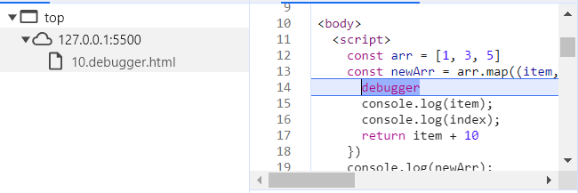
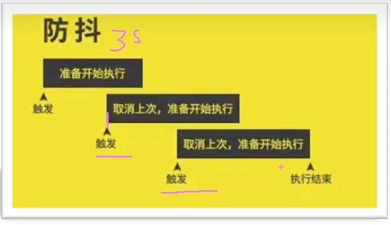
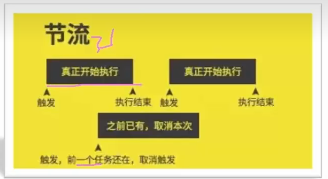

# 四、高阶技巧

## 深浅拷贝

开发中，经常需要一个对象，如果直接用赋值的方式复制对象会有以下问题：

```js
const obj = {
  uname: 'black',
  age: 18
}
const o = obj
console.log(o); // { uname: 'black', age: 18 }

o.age = 20
console.log(o); // { uname: 'black', age: 20 }
console.log(obj); // { uname: 'black', age: 20 }
```

这样搞会直接把 `obj` 里面的值直接改了，那干嘛还需要这样拐弯抹角的赋值哦。出现这个问题的原因赋值只是复制了地址，没有复制值，所以只要做了修改都会对里面的值进行了修改。

### 浅拷贝

浅拷贝：**拷贝的是地址**

#### 常见方法

1. 拷贝对象：`Object.assgin()` 或者 展开运算符 `{...obj}` 
2. 拷贝数组：`Array.prototype.concat()` 或者 `[...arr]`

```js
const obj = {
  uname: 'black',
  age: 18
}

// 展开运算符
const o = { ...obj }
console.log(o); // { uname: 'black', age: 18 }
o.age = 20
console.log(o); // { uname: 'black', age: 20 }
console.log(obj); // { uname: 'black', age: 18 }

// assgin方法
const o = {}
Object.assign(o, obj)
console.log(o); // { uname: 'black', age: 18 }
o.age = 21
console.log(o); // { uname: 'black', age: 21 }
console.log(obj); // { uname: 'black', age: 18 }
```

但是浅拷贝只是拷贝外面的一层，再里面的是不会管的，拷贝的还是地址。

```js
const obj = {
  uname: 'black',
  age: 18,
  family: {
    baby: 'zs'
  }
}

const o = {}
Object.assign(o, obj)
console.log(o); // { uname: 'black', age: 18, family: { baby: 'zs' } }
o.age = 21
o.family.baby = 'ls'
console.log(o); // { uname: 'black', age: 21, family: { baby: 'ls' } }
console.log(obj); // { uname: 'black', age: 18, family: { baby: 'ls' } }
```

解决这个问题也不难，深拷贝就可以了

### 深拷贝

深拷贝：拷贝的是**对象**，不是地址。

#### 常见方法

1. 通过递归函数实现深拷贝（简易版）

函数递归：在一个函数内部调用其本身。

示例：

```js
const obj = {
  uname: 'zs',
  age: 18,
  hobby: ['basketball', 'football'],
  family: {
    baby: 'xzs'
  }
}

const o = {}

function deepCopy(newObj, oldObj) {
  for (let k in oldObj) {
    // 解决数组问题
    if (oldObj[k] instanceof Array) {
      newObj[k] = []
      deepCopy(newObj[k], oldObj[k])
      // 解决对象问题
    } else if (oldObj[k] instanceof Object) {
      newObj[k] = {}
      deepCopy(newObj[k], oldObj[k])
    } else {
      // k 是属性名  oldObj[k] 属性值
      newObj[k] = oldObj[k]

    }
  }
}

deepCopy(o, obj)// 函数调用，两个参数 o是新的，obj是旧的
console.log(o);
o.age = 20
o.hobby[0] = '篮球'
o.family = '老'
// console.log(o);
console.log(obj);
console.log([1, 23] instanceof Object);
```

2. `lodash` 里面的 `cloneDeep` 

用递归写这个，那肯定麻烦死了

现在，只需要引用一个JS库，就可以很方便的实现深拷贝了。

```html
<script src="./lodash.min.js"></script>
<script>
  const obj = {
    uname: 'zs',
    age: 18,
    hobby: ['basketball', 'football'],
    family: {
      baby: '小'
    }
  }
  const o = _.cloneDeep(obj)
  console.log(o);
  o.family.baby = '老'
  console.log(obj);
</script>
```

3. 通过 `JSON.stringify()` 实现

其实就是把原来的对象转换为字符串再转换为一个新的对象，这样也是可以的。

```js
const obj = {
  uname: 'zs',
  age: 18,
  hobby: ['basketball', 'football'],
  family: {
    baby: '小'
  }
}

const o = JSON.parse(JSON.stringify(obj))
console.log(o);
o.family.baby = '123'
console.log(obj);
```

## 异常处理

### throw 抛异常

异常处理是指预估代码执行过程中可能发生的错误，然后最大程度的避免错误的发生导致整个程序无法继续运行。

```html
<script>
  function fn(x, y) {
    if (!x || !y) {
      throw new Error('没有参数传递进来')
    }
    return x + y
  }
  console.log(fn());
</script>
```

1. `throw` 抛出异常信息的时候，程序也会终止执行
2. `throw` 后面跟的是错误提示信息
3. `Error` 对象配合 `throw` 使用，能够设置更详细的错误信息

### try / catch 捕获异常

当然，也可以通过 `try / catch`  捕获错误信息，其中，`try` 试试  `catch` 拦住  `finally` 最后

```html
<body>
  <p>
    123
  </p>
  <script>
    function fn() {
      try {
        const p = document.querySelector('.p')
        p.style.color = 'red'
      } catch (err) {
        console.log(err.message);
        throw new Error('选择器错误')
        // return
      }
      finally {
        alert('弹出对话框')
      }
      console.log(11);
    }
    fn()
  </script>
</body>
```

1. 将预估可能发生错误的代码写在 `try` 代码段中
2. 如果 `try` 代码段中出现错误后，会执行 `catch` 代码段，并截获到错误信息
3. `finally` 不管是否有错误，都会执行

### debugger

一个关键字，跟打断点差不多，在你需要断点的地方加上 `debugger` 它就会直接断点了。

```html
<script>
  const arr = [1, 3, 5]
  const newArr = arr.map((item, index) => {
    debugger
    console.log(item);
    console.log(index);
    return item + 10
  })
  console.log(newArr);
</script>
```




这样的好处就是如果代码量多了，直接去找的话有点麻烦，直接写 `debugger` 就会很方便了。

## 处理 this

### this 指向

#### 普通函数的 this 指向

配普通函数的调用方式决定了 `this` 的值，【谁调用了 `this` 的值指向谁】

```html
<body>
  <button>点击</button>
  <script>
      console.log(this); // window
      function fn() {
        console.log(this); // window
      }
      window.fn()
      setTimeout(function () {
        console.log(this); // window
      }, 1000);
      document.querySelector('button').addEventListener('click', function () {
        console.log(this); // 指向button
      })

      const obj = {
        sayHi: function () {
          console.log(this); // 指向 obj
        }
      }
      obj.sayHi() 
  </script>
</body>
```

#### 箭头函数的 this 指向

箭头函数中的 `this` 引用的就是最近作用域中的 `this` ；并且是持续向外层作用域中，一层一层查找 `this` ，直到有 `this` 的定义。

```html
<script>
  const user = {
    uname: 'zs',
    walk: () => {
      console.log(this); // 指向 window
    }
  }
  user.walk()
</script>
```

不过，需要注意的是，事件回调函数使用箭头函数时，`this` 为全局的 `window` 。因此，DOM事件的回调函数里面不推荐使用箭头函数。

```html
<body>
  <button class="btn">点击</button>
  <script>
  	
  </script>
</body>
```

还有一件事，基于原型的面向对象也不推荐采用箭头函数

```html
<script>
  function Person() {

  }
  Person.prototype.walk = () => {
    console.log('走路');
    console.log(this); // window
  }
  const p1 = new Person()
  p1.walk()
</script>
```

因此，箭头函数方便是方便，但是对于**构造函数** 、 **原型函数** 、 **字面量对象中函数** 、 **DOM事件函数** 都不适用。

什么时候适用？需要使用上层 `this` 的时候，箭头函数就可以用了。

### 改变 this

但其实 `this` 不是一成不变的，是可以改的。

有三个方法可以改变 `this` 的指向：`call()`  `apply()`   `bind()`  

#### call() - 了解（后期用的不多）

**语法：**

```js
// thisArg: 在函数运行时指定 this 的值
// arg1, agr2: 传递的其他参数
fun.call(thisArg, arg1, arg2)
```

示例：

```html
<script>
  const obj = {
    uname: 'zs'
  }
  function fn(x, y) {
    console.log(this);
    console.log(x + y);
  }

  fn.call(obj, 1, 2) // Object  3
</script>
```

#### apply()

**语法：**

```js
// thisArg: 指定 this 的值
// argsArray: 传递的值，必须包含在数组里面
// 返回值  本身就是在调用函数，所以返回值就是函数的返回值
fun.apply(thisArg, [argsArray])
```

示例：

```html
<script>
  const obj = {
    age: 18
  }
  function fn(x, y) {
    console.log(this); // {age: 18}
    console.log(x + y); // 3
  }
  fn.apply(obj, [1, 2])
</script>
```

#### bind()

`bind()` 方法跟前面两个不同的是，它不会调用函数，但是它会返回一个改造过的一个新函数。

**语法：**

```js
// thisArg: 在函数运行时指定 this 的值
// arg1, agr2: 传递的其他参数
fun.bind(thisArg, arg1, arg2, ...)
```

示例：

```html
<script>
  const obj = {
    age: 18
  }
  function fn() {
    console.log(this);
  }
  const fun = fn.bind(obj)
  console.log(fun);
</script>
```

所以，如果只是想改变 `this` 指向，但又不想调用这个函数的时候，就可以使用 `bind`，比如改变定时器内部的 `this` 指向。

```html
<body>
  <button>点击</button>
  <script>
  	const btn = document.querySelector('button')
    btn.addEventListener('click', function () {
      this.disabled = true
      window.setTimeout(function () {
        this.disabled = false
      }.bind(this), 2000)
    })
  </script>
</body>
```

## 防抖

### 防抖

其实就是单位时间内，频繁触发事件的话，就只执行最后一次。



有一个很合适的例子，就像王者的回城的时候，如果被打断，那就需要重新点回城了。

还有一个，如果是先学习 vue 的话，就能记得有一个小案例，是做翻译的，那个时候是如果输入一个字母就翻译一次，请求次数过于频繁，如果使用防抖的话，就能够等待用户最后一次输入完毕后再发送请求。

防抖的处理一般有两种方式：`lodash` 库中的 `_.debounce()` 方法，或者手搓。

#### `_.debounce()` 方法

示例：

```html
<head>
  <style>
    .box {
      width: 500px;
      height: 500px;
      background-color: #ccc;
      color: #fff;
      text-align: center;
      font-size: 100px;
    }
  </style>
</head>

<body>
  <div class="box"></div>
  <script src="./lodash.min.js"></script>
  <script>
    const box = document.querySelector('.box')
    let i = 1
    function mouseMove() {
      box.innerHTML = i++
    }

    // lodash实现防抖
    // 语法：_.debounce(fun, 时间)
    box.addEventListener('mousemove', _.debounce(mouseMove, 200))
  </script>
</body>
```

#### 手搓防抖函数

**核心思路：**

主要是利用定时器实现，当鼠标滑过，判断有没有定时器，有就清除，以最后一次滑动为准开启定时器。

1. 声明定时器变量
2. 每次鼠标移动（事件触发）的时候都要先判断是否有定时器，如果存在先清除以前的定时器
3. 如果没有定时器，则开启定时器，存入到定时器变量里面
4. 定时器里面写函数调用

```html
<script>
  ...
  function debounce(fn, time) {
    let timer
    // 这里其实就相当于 debounce(mouseMove, 200) = functoin () {}
    return function () {
      if (timer) clearTimeout(timer)
      timer = setTimeout(() => {
        fn()
      }, time);
    }
  }
  box.addEventListener('mousemove', debounce(mouseMove, 200))
</script>
```

### 节流 - throttle

单位时间内，频繁触发事件，只执行一次



还是举一个王者的例子，技能CD，CD期间无法继续放技能，一定要冷却以后才能再执行。

好像鼠标移动 `mousemove` ，页面尺寸缩放 `resize` ，滚动条滚动 `scroll` 等等。

节流的方式一样也是有两种方式：`lodash` 提供的节流函数 `_.throttle()` 方法，或者手搓。

#### `_.throttle()` 方法

示例：

```html
<script>
	...
  // 节流 lodash
  // 语法: _.throttle(fun, 事件)
  box.addEventListener('mousemove', _.throttle(mouseMove, 3000))
</script>
```

#### 手搓节流函数

核心思路：

利用时间相减：移动后的时间 - 刚开始移动的时间 >=500ms，才会去执行 `mouseMove` 函数

1. 声明一个定时器变量
2. 当鼠标每次滑动都先判断是否有定时器了，如果有定时器则不开启新定时器
3. 如果没有定时器则开启定时，记得存到变量里面
   1. 定时器里面调用执行的函数
   2. 定时器里面要把定时器清空

```html
<script>
	...
  function throttle(fn, time) {
    let timer = null
    return function () {
      if (!timer) {
        timer = setTimeout(() => {
          fn()
          // 清空定时器，不用clearTimout是因为本身就不能在定时器里面清除定时器
          timer = null
        }, time);
      }
    }
  }
  box.addEventListener('mousemove', throttle(mouseMove, 500))
</script>
```

## 节流综合小案例

### 页面打开，记录上一次视频播放位置

#### 分析

1. `ontimeupdate` 事件在视频/音频（audio/video）当前的播放位置发送改变时触发
2. `onloadeddata` 事件在当前帧的数据加载完成且还没有足够的数据播放视频/音频（audio/video）的 下一帧时触发

#### 思路

1. 在ontimeupdate事件触发的时候，每隔1秒钟，就记录当前时间到本地存储 
2. 下次打开页面， onloadeddata 事件触发，就可以从本地存储取出时间，让视频从取出的时间播放，如 果没有就默认为0s 
3. 获得当前时间 video.currentTime

#### 代码

```html
<head>
  <style>
    * {
      padding: 0;
      margin: 0;
      box-sizing: border-box;
    }

    .container {
      width: 1200px;
      margin: 0 auto;
    }

    .video video {
      width: 100%;
      padding: 20px 0;
    }

    .elevator {
      position: fixed;
      top: 280px;
      right: 20px;
      z-index: 999;
      background: #fff;
      border: 1px solid #e4e4e4;
      width: 60px;
    }

    .elevator a {
      display: block;
      padding: 10px;
      text-decoration: none;
      text-align: center;
      color: #999;
    }

    .elevator a.active {
      color: #1286ff;
    }

    .outline {
      padding-bottom: 300px;
    }
  </style>
</head>

<body>
  <div class="container">
    <div class="header">
      <a href="http://pip.itcast.cn">
        
      </a>
    </div>
    <div class="video">
      <video src="https://v.itheima.net/LapADhV6.mp4" controls></video>
    </div>
    <div class="elevator">
      <a href="javascript:;" data-ref="video">视频介绍</a>
      <a href="javascript:;" data-ref="intro">课程简介</a>
      <a href="javascript:;" data-ref="outline">评论列表</a>
    </div>
  </div>
  <script src="https://cdn.jsdelivr.net/npm/lodash@4.17.21/lodash.min.js"></script>
  <script>
    const video = document.querySelector('video')
    video.ontimeupdate = _.throttle(() => {
      console.log(video.currentTime);
      localStorage.setItem('currentTime', video.currentTime)
    }, 1000)

    video.onloadeddata = () => {
      video.currentTime = localStorage.getItem('currentTime') || 0
    }
  </script>
</body>
```

