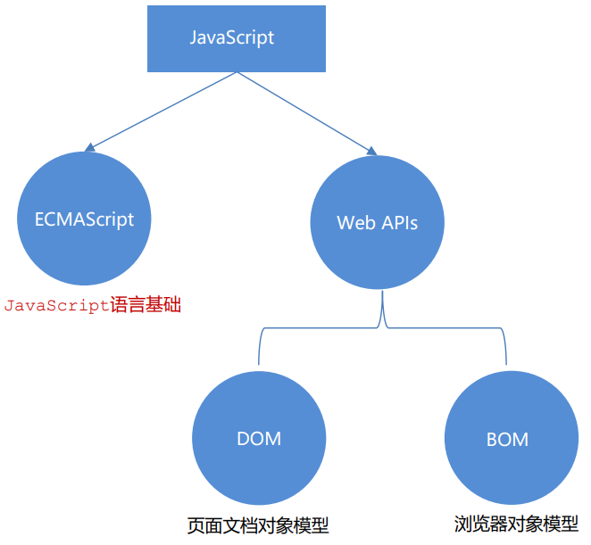
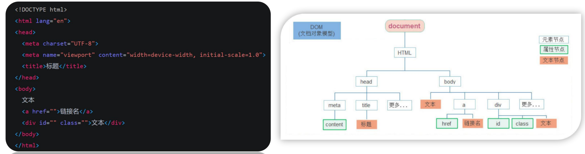
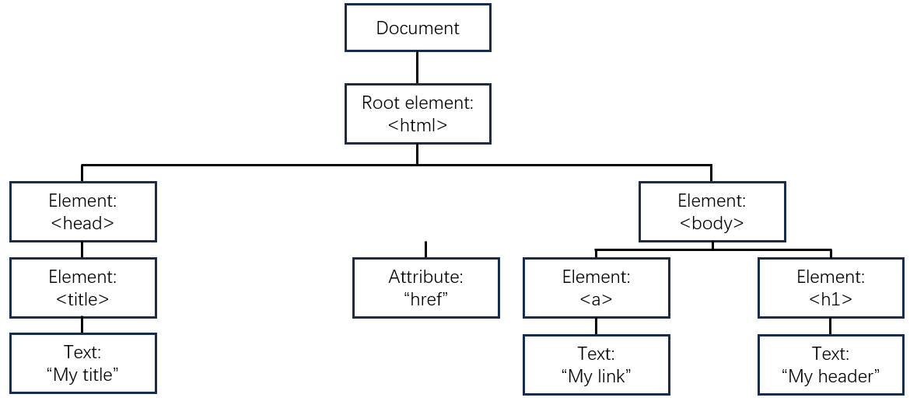

# 一、DOM获取&属性操作

## Web API 基本认识

### 作用和分类

作用：就是使用 JavaScript 去操作 html 和浏览器

分类：DOM（文档对象模型）、BOM（浏览器对象模型）



### 什么是DOM？

其实就是浏览器提供的一套专门用来 **操作网页内容** 的功能，可以开发网页内容特效和实现用户交互

### DOM树

将 HTML 文档以树状结构直观表现出来，能够更加直观体现标签与标签之间的关系



### DOM对象

浏览器根据html标签生成的JS对象，所有的标签属性都可以在这个对象上面找到。如果修改这个对象的属性就会自动映射到标签上。



#### 核心思想：

把网页内容当作对象来处理

#### document对象

其实整个网页就是document，它是DOM里面提供的一个对象，所以一般都是用来访问和操作网页的内容，之前所使用的 `document.write()` 就是其中一种

## 获取DOM元素

要想操作某个标签，那首先就得先选中这个标签

### 根据CSS选择器来获取DOM元素

#### 选择匹配的第一个元素

**语法：**

```js
document.querySelector('css选择器')
```

**返回值：**

CSS选择器匹配的第一个元素，一个 HTMLElement对象

如果没有匹配到，则返回null

示例：

```js
document.querySelector('h2')
document.querySelector('#one')
document.querySelector('.box')
```

#### 选择匹配多个元素

**语法：**

```js
document.querySelectorAll('css选择器')
```

**返回值：**

CSS选择匹配的NodeList  对象集合

:::warning

这个返回值，可以理解为一个只有**长度**只有**索引号**的伪数组，其他诸如 `pop()` 之类的方法都不能用

如果想要得到里面的每一个对象，也是需要用 `for` 来遍历

即使只有一个元素，获取过来的也只是一个伪数组。

:::

示例：

```js
document.querySelectorAll('ul li')
```

### 其他获取DOM元素的方法

除了上面那些方法，还可以用类名、id、标签等等来获取元素

```js
// 根据id获取一个元素
document.getElementById('nav')

// 根据 标签获取一类元素  获取页面所有div
document.getElementsByTagName('div')

// 根据 类名获取元素  获取页面所有类名为w的
document.getElementsByClassName('w')
```

## 操作元素内容

如果想修改标签元素里面的内容，可以使用以下方法

### 对象.innerText 属性

+ 将文本内容添加/更新到任意标签位置

+ 只识别文本，不能够解析标签

示例：

```js
const info = document.querySelector('.info')
// 获取标签内部的文字
console.log(info.innerText)
// 添加/修改标签内部文字内容
info.innerText = `Hello`
```

### 对象.innerHTML 属性

+ 将文本内容添加/更新到任意标签位置
+ 不仅能识别文本，还能够解析标签

```js
const info = document.querySelector('.info')
// 获取标签内部的文字
console.log(info.innetHTML)
// 添加/修改标签内部文字内容
info.innerHTML = `Hello,<strong>innerHTML</strong>`
```

如果实在不知道用谁，可以选择 `innerHTML `

### 年会抽奖案例

#### 需求

从数组随机抽取一等奖、二等奖和三等奖，显示到对应的标签里面。

#### 代码编写

1. 静态模板

```html
<head>
  <style>
    .wrapper {
      width: 840px;
      height: 420px;
      background: url(./images/bg01.jpg) no-repeat center / cover;
      padding: 100px 250px;
      box-sizing: border-box;
    }
  </style>
  
  <body>
    <div class="wrapper">
    <strong>传智教育年会抽奖</strong>
    <h1>一等奖：<span id="one">???</span></h1>
    <h3>二等奖：<span id="two">???</span></h3>
    <h5>三等奖：<span id="three">???</span></h5>
  </div>
  </body>
</head>
```

2. 编写逻辑

```html
<script>
	const personArr = ['张三', '李四', '王五', '赵六', '王琦']
  const random = Math.floor(Math.random() * personArr.length)
  const one = document.querySelector('#one')
  one.innerHTML = personArr[random]
  personArr.splice(random, 1)

  const random2 = Math.floor(Math.random() * personArr.length)
  const two = document.querySelector('#two')
  two.innerHTML = personArr[random2]
  personArr.splice(random2, 1)

  const random3 = Math.floor(Math.random() * personArr.length)
  const three = document.querySelector('#three')
  three.innerHTML = personArr[random3]
  personArr.splice(random3, 1)
</script>
```

但是这段代码，重复的逻辑未免太多了，因此我们可以尝试封装一个更加通用的函数去调用，这样看起来就会更加简洁了

```html
<script>
	function setRandomPerson(selectors, personArr) {
    for(let i = 0; i < selectors.length; i++) {
      const random = Math.floor(Math.random() * personArr.length)
      const element = document.querySelector(selectors[i])
      element.innerHTML = personArr[random]
      personArr.splice(random, 1)
    }
  }
  
  // 使用封装函数
  const selectors = ['#one', '#two', '#three']
  const personArr = ['张三', '李四', '王五', '赵六', '王琦']
  serRandomPerson(selectors, personArr)
</script>
```

不同之处在于，把原先固定的数组改成了参数的形式，同时因为是知道了本身这段HTML代码里面的 `span` 里的 `id` 的值，所以可以用数组的形式存储 `id` ，按照顺序进行调用就行了

## 操作元素属性

除了操作元素的内容，属性也是可以操作，比如通过 `src` 更换图片等

### 操作元素常用属性

在常见的属性比如 `href` 、`title` 、`src` 等

**语法：**

```js
对象.属性 = 值
```

**示例：**

```js
// 1. 获取元素
const pic = document.querySelector('img')
// 2. 操作元素
pic.src = './images/b02.jpg'
pic.title = 'Hello'
```

### 操作元素样式属性

除了常用的属性可以操作以外，样式属性也是可以操作的

#### 通过 style 属性操作 CSS

**语法：**

```js
对象.style.样式属性 = 值
```

示例：

```js
const box = document.querySelector('.box')

// 修改元素样式
box.style.width = '200px'
box.style.marginTop = '15px'
box.style.backgroundColor = 'black'
```

#### 操作类名（className）操作CSS

**语法：**

```js
// active 是一个css类名
// className是使用新值换旧值，如果需要添加一个类，需要保留之前的类名
元素.className = 'active'
```

#### 通过 classList 操作类控制CSS

用className容易覆盖以前的类名，可以通过classList方式追加和删除类名

**语法：**

```js
// 追加一个类
元素.classList.add('类名')
// 删除一个类
元素.classList.remove('类名')
// 切换一个类
元素.classList.toggle('类名')
```

#### 使用 className 和 classList 的区别

classList 修改大量样式更加方便

className 修改不多样式的时候方便

classList 追加和删除不影响以前的类名

### 操作表单元素属性

表单里很多情况也是需要修改属性的

**语法：**

```js
// 获取
DOM对象.属性名
// 设置
DOM对象.属性名 = 新值
```

示例：

```html
<body>
  <input type="text" value="电脑">
  <script>
  	const uname = document.querySelector('input')
    console.log(uname.value) // 电脑
    uname.value = '手机' // 此时文本框里就变成了手机
    uname.type = 'password' // 原本是文本框 text，现在变成了密码框
  </script>
</body>
```

表单里面也有一些属性，添加了就有效果，移除了就没有效果。这些都是用布尔值表示，true表示添加了该属性，false表示移除该属性。

### 自定义属性

在html5中推出了专门的 `data-自定义属性` ，就是如果要使用自定义属性，需要在标签上一律以 `data-`开头，然后在DOM对象上一律以dataset对象方式获取

示例：

```html
<body>
  <div data-id="1" data-spm="商品名">1</div>
  <div data-id="2">2</div>
  <div data-id="3">3</div>
  <div data-id="4">4</div>
  <div data-id="5">5</div>
  <script>
    const one = document.querySelector('div')
    console.log(one.dataset); // DOMStringMap {id: '1', spm: '商品名'}
  </script>
</body>
```

## 定时器 - 间歇函数

有些时候需要每隔一段时间就自动执行一段代码，这种时候就需要用到定时器函数。

定时器函数有两种，间歇函数和延迟函数。

### 开启定时器

**语法：**

```js
// 每隔一段时间调用这个函数，间隔时间单位是毫秒
setInterval(函数, 间隔时间)
```

示例：

```js
function repeat() {
  console.log('开启定时器')
}
// 每隔一秒调用repeat函数
// 定时器返回的是一个id数字，每一个id数字是独一无二的
setInterval(repeat, 1000)
```

### 关闭定时器

**语法：**

```js
let 变量名 = setInterval(函数, 间隔时间)
clearInterval(变量名)
```

示例：

```js
let timer = setInterval(function() {
  console.log('hi~~')
}, 1000)
clearInterval(timer)
```

### 小案例

#### 需求：

按钮60秒之后才可以使用

#### 分析：

1. 开始先把按钮禁用（disabled 属性）

2. 一定要获取元素

3. 函数内处理逻辑 

   秒数开始减减 

   按钮里面的文字跟着一起变化 

   如果秒数等于0 停止定时器 里面文字变为 同意 最后 按钮可以点击

#### 代码编写

1. 静态模板

```html
<body>
  <textarea name="" id="" cols="30" rows="10">
        用户注册协议
        欢迎注册成为京东用户！在您注册过程中，您需要完成我们的注册流程并通过点击同意的形式在线签署以下协议，请您务必仔细阅读、充分理解协议中的条款内容后再点击同意（尤其是以粗体或下划线标识的条款，因为这些条款可能会明确您应履行的义务或对您的权利有所限制）。
        【请您注意】如果您不同意以下协议全部或任何条款约定，请您停止注册。您停止注册后将仅可以浏览我们的商品信息但无法享受我们的产品或服务。如您按照注册流程提示填写信息，阅读并点击同意上述协议且完成全部注册流程后，即表示您已充分阅读、理解并接受协议的全部内容，并表明您同意我们可以依据协议内容来处理您的个人信息，并同意我们将您的订单信息共享给为完成此订单所必须的第三方合作方（详情查看
  </textarea>
  <br>
  <button class="btn" disabled>我已经阅读用户协议(60)</button>
</body>
```

2. 逻辑编写

```html
<body>
  <button class="btn" disabled>...</button>
</body>

<script>
	const btn = document.querySelector('.btn')
  let i = 60
  let n = setInterval(function() {
    i--
    btn.innerHTML = `我已经阅读用户协议(${i})`
    if (i === 0) {
      clearInterval(n)
      btn.disabled = false
      btn.innerHTML = '同意'
    }
  }, s1000)
</script>
```

## 综合案例

### 需求

每隔一秒钟切换一个图片

### 分析

1. 准备一个数组对象，里面包含详细信息（素材包含）

2. 获取元素 

3. 设置定时器函数 

   设置一个变量++ 

   找到变量对应的对象 

   更改图片、文字信息 

   激活小圆点：移除上一个高亮的类名，当前变量对应的小圆点添加类

4. 处理图片自动复原从头播放（放到变量++后面，紧挨） 

   如果图片播放到最后一张， 就是大于等于数组的长度 

   则把变量重置为0

### 代码编写

1. 准备静态模板

```html
<head>
    <style>
    * {
      box-sizing: border-box;
    }

    .slider {
      width: 560px;
      height: 400px;
      overflow: hidden;
    }

    .slider-wrapper {
      width: 100%;
      height: 320px;
    }

    .slider-wrapper img {
      width: 100%;
      height: 100%;
      display: block;
    }

    .slider-footer {
      height: 80px;
      background-color: rgb(100, 67, 68);
      padding: 12px 12px 0 12px;
      position: relative;
    }

    .slider-footer .toggle {
      position: absolute;
      right: 0;
      top: 12px;
      display: flex;
    }

    .slider-footer .toggle button {
      margin-right: 12px;
      width: 28px;
      height: 28px;
      appearance: none;
      border: none;
      background: rgba(255, 255, 255, 0.1);
      color: #fff;
      border-radius: 4px;
      cursor: pointer;
    }

    .slider-footer .toggle button:hover {
      background: rgba(255, 255, 255, 0.2);
    }

    .slider-footer p {
      margin: 0;
      color: #fff;
      font-size: 18px;
      margin-bottom: 10px;
    }

    .slider-indicator {
      margin: 0;
      padding: 0;
      list-style: none;
      display: flex;
      align-items: center;
    }

    .slider-indicator li {
      width: 8px;
      height: 8px;
      margin: 4px;
      border-radius: 50%;
      background: #fff;
      opacity: 0.4;
      cursor: pointer;
    }

    .slider-indicator li.active {
      width: 12px;
      height: 12px;
      opacity: 1;
    }
  </style>
</head>

<body>
    <div class="slider">
    <div class="slider-wrapper">
      
    </div>
    <div class="slider-footer">
      <p>对人类来说会不会太超前了？</p>
      <ul class="slider-indicator">
        <li class="active"></li>
        <li></li>
        <li></li>
        <li></li>
        <li></li>
        <li></li>
        <li></li>
        <li></li>
      </ul>
      <div class="toggle">
        <button class="prev">&lt;</button>
        <button class="next">&gt;</button>
      </div>
    </div>
  </div>
</body>
```

2. 代码编写

```html
<script>
	const sliderData = [
    { url: './images/slider01.jpg', title: '对人类来说会不会太超前了？', color: 'rgb(100, 67, 68)' },
    { url: './images/slider02.jpg', title: '开启剑与雪的黑暗传说！', color: 'rgb(43, 35, 26)' },
    { url: './images/slider03.jpg', title: '真正的jo厨出现了！', color: 'rgb(36, 31, 33)' },
    { url: './images/slider04.jpg', title: '李玉刚：让世界通过B站看到东方大国文化', color: 'rgb(139, 98, 66)' },
    { url: './images/slider05.jpg', title: '快来分享你的寒假日常吧~', color: 'rgb(67, 90, 92)' },
    { url: './images/slider06.jpg', title: '哔哩哔哩小年YEAH', color: 'rgb(166, 131, 143)' },
    { url: './images/slider07.jpg', title: '一站式解决你的电脑配置问题！！！', color: 'rgb(53, 29, 25)' },
    { url: './images/slider08.jpg', title: '谁不想和小猫咪贴贴呢！', color: 'rgb(99, 72, 114)' },
  ]
  
  const img = document.querySelector('.slider-wrapper img')
  const p = document.querySelector('.slider-footer p')
  
  let i = 0
  setInterval(function () {
    i++
    if (i >= sliderData.length) {
      i = 0
    }
    img.src = sliderData[i].url
    p.innerHTML = sliderData[i].title
    
    document.querySelector('.slider-indicator .active').classList.remove('active')
    document.querySelector('.slider-indicator li:nth-child(${i + 1})').classList.add('active')
  }, 1000)
</script>
```

