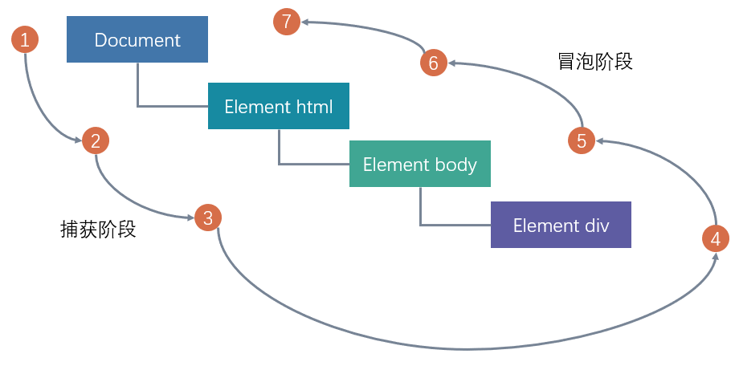
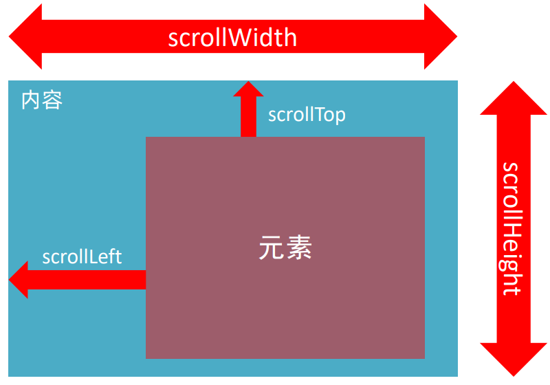
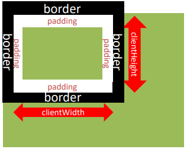

# 三、DOM事件进阶

## 事件流

事件流就是事件完整执行过程的流动路径

其实就是假设有个div，当触发事件时，会经历两个阶段，分别是捕获阶段、冒泡阶段。简答来说，捕获阶段就是父到子，冒泡阶段就是子到父。而在实际工作工程中都是使用事件冒泡为主。



### 事件捕获

从DOM的根元素开始去执行队形的事件

代码：

```js
DOM.addEventListener(事件类型, 事件处理函数, 是否使用捕获机制)
```

+ addEventListener第三个参数传入true代表是捕获阶段触发
+ 若传入false代表冒泡阶段触发，默认是false
+ 若是用L0事件监听，则只有冒泡阶段，没有捕获

示例：

```html
<head>
  <style>
    .father {
      width: 500px;
      height: 500px;
      background-color: blue;
    }

    .son {
      width: 200px;
      height: 200px;
      background-color: purple;
    }

    .grandson {
      width: 100px;
      height: 100px;
      background-color: red;
    }
  </style>
</head>

<body>
  <div class="father">
    <div class="son">
      <div class="grandson"></div>
    </div>
  </div>
  <script>
    const fa = document.querySelector('.father')
    const son = document.querySelector('.son')
    const gs = document.querySelector('.grandson')

    document.addEventListener('click', function () {
      alert('我是爷爷')
    }, true)
    fa.addEventListener('click', function () {
      alert('我是爸爸')
    }, true)
    son.addEventListener('click', function () {
      alert('我是儿子')
    }, true)
    gs.addEventListener('click', function () {
      alert('我是孙子')
    }, true)
  </script>
</body>
```

只有每一个点击事件后面加上true才会启动事件捕获，如果是只有一个点击事件加上true，则会先优先显示带true那个，剩下的则按照冒泡方式依次显示。

### 事件冒泡

当一个元素的事件被触发时，会依次向上调用所有父级元素的同名事件

```js
const father = document.querySelector('.father')
const son = document.querySelector('.son')
document.addEventListener('click', function () {
  alert('我是爷爷')
})
father.addEventListener('click', function () {
  alert('我是爸爸')
})
son.addEventListener('click', function () {
  alert('我是儿子')
})
```

+ 事件冒泡是默认存在的
+ L2事件监听第三个参数是false，或者默认都是冒泡

### 阻止冒泡

**语法：**

```js
事件对象.stopPropagation()
```

示例：

```js
const father = document.querySelector('.father')
const son = document.querySelector('.son')
document.addEventListener('click', function () {
  alert('我是爷爷')
})
father.addEventListener('click', function () {
  alert('我是爸爸')
})
son.addEventListener('click', function (e) {
  alert('我是儿子')
  // 阻止冒泡
  e.stopPropagation()
})
```

这个方法不仅可以在冒泡阶段有效，捕获阶段也有效

### 解绑事件

有些时候，比如说一个点击按钮，我就只想点击一次，往后再点击按钮就不再触发其他事件了，这个时候就需要解绑事件了。

#### on事件

**语法：**

```js
// 绑定事件
btn.onclick = function () {
  alert('点击了')
}
// 解绑事件
btn.onclick = null
```

#### addEventListener方式

**语法：**

```js
function fn() {
  alert('点击了')
}
// 绑定事件
btn.addEventListener('click', fn)
// 解绑事件
btn.removeEventListener('click', fn)
```

:::caution 注意

匿名函数无法被解绑

:::

### 鼠标经过事件

+ mouseover 和 mouseout 会有冒泡的效果
+ mouseenter 和 mouseleave 没有冒泡效果（推荐）

## 事件委托

在原来，如果同时给多个元素注册事件，需要使用for循环注册事件，似乎有点麻烦

```html
<body>
  <ul>
    <li>我是第1个li</li>
    <li>我是第2个li</li>
    <li>我是第3个li</li>
    <li>我是第4个li</li>
    <li>我是第5个li</li>
  </ul>
</body>

<script>
	const lis = document.querySelectorAll('ul li')
  for (let i = 0; i < lis.length; i++) {
    lis[i].addEventlistener('click', function () {
      alert('我被点击了')
    })
  }
</script>
```

那如果使用事件委托的话，只需要注册依次就可以了。

其实事件委托是利用事件冒泡的特点，即给父元素注册事件，当我们触发子元素的时候，会冒泡到父元素身上，从而触发事件。

示例：

```html
<body>
  <ul>
    <li>第1个孩子</li>
    <li>第2个孩子</li>
    <li>第3个孩子</li>
    <li>第4个孩子</li>
    <li>第5个孩子</li>
    <p>文字文字</p>
  </ul>
  <script>
    const ul = document.querySelector('ul')
    ul.addEventListener('click', function (e) {
      // alert(11)
      // this.style.color = 'red'
      // 这样操作<p>就不会执行
      if (e.target.tagName === 'LI') {
        e.target.style.color = 'red'
      }
    })
  </script>
</body>
```

tagName会找到真正需要触发的元素

### 小案例 - tab栏切换

#### 需求

优化程序，将tab切换案例改为事件委托写法 

#### 思路

1. 给a的父级 注册点击事件，采取事件委托方式 

2. 如果点击的是A , 则进行排他思想，删除添加类 
3. 注意判断的方式 利用 e.target.tagName 
4. 因为没有索引号了，所以这里我们可以自定义属性，给5个链接添加序号 
5. 下面大盒子获取索引号的方式 e.target.dataset.id 号， 然后进行排他思

```html
<head>
  <style>
    * {
      margin: 0;
      padding: 0;
    }

    .tab {
      width: 590px;
      height: 340px;
      margin: 20px;
      border: 1px solid #e4e4e4;
    }

    .tab-nav {
      width: 100%;
      height: 60px;
      line-height: 60px;
      display: flex;
      justify-content: space-between;
    }

    .tab-nav h3 {
      font-size: 24px;
      font-weight: normal;
      margin-left: 20px;
    }

    .tab-nav ul {
      list-style: none;
      display: flex;
      justify-content: flex-end;
    }

    .tab-nav ul li {
      margin: 0 20px;
      font-size: 14px;
    }

    .tab-nav ul li a {
      text-decoration: none;
      border-bottom: 2px solid transparent;
      color: #333;
    }

    .tab-nav ul li a.active {
      border-color: #e1251b;
      color: #e1251b;
    }

    .tab-content {
      padding: 0 16px;
    }

    .tab-content .item {
      display: none;
    }

    .tab-content .item.active {
      display: block;
    }
  </style>
</head>

<body>
  <div class="tab">
    <div class="tab-nav">
      <h3>每日特价</h3>
      <ul>
        <li><a class="active" href="javascript:;" data-id="0">精选</a></li>
        <li><a href="javascript:;" data-id="1">美食</a></li>
        <li><a href="javascript:;" data-id="2">百货</a></li>
        <li><a href="javascript:;" data-id="3">个护</a></li>
        <li><a href="javascript:;" data-id="4">预告</a></li>
      </ul>
    </div>
    <div class="tab-content">
      <div class="item active"></div>
      <div class="item"></div>
      <div class="item"></div>
      <div class="item"></div>
      <div class="item"></div>
    </div>
  </div>
  
  <script>
  	const ul = document.querySelector('.tab-nav ul')
    ul.addEventListener('click', function (e) {
      if (e.target.tagName === 'A') {
        document.querySelector('.tab-nav .active').classList.remove('active')
        e.target.classList.add('active')
        const id = +e.target.dataset.id
        document.querySelector('.tab-content .active').classList.remove('active')
        document.querySelector('.tab-content .item:nth-child(${id + 1})').classList.add('active')
      }
    })
  </script>
</body>
```

## 其他事件

### 页面加载事件（不常用）

等加载外部资源加载完毕的时候才触发事件

事件名：**load**

作用：监听页面所有资源加载完毕

示例：

```js
// 页面加载事件
window.addEventListener('load', function () {
  // 执行的操作
})
```

事件名：**DOMContentLoaded**

作用：监听页面DOM加载完毕，无需等待样式表、图像等完全加载

示例：

```js
document.addEventListener('DOMContentLoaded', function () {
  // 执行的操作
})
```

### 元素滚动事件

滚动条再滚动的时候触发的事件

就好像有一些网页，当滚动条滚动到某一个位置的时候，就弹出页面里的一些元素。

事件名：**scroll**

作用：监听整个页面滚动

示例：

```js
// 页面滚动事件
window.addEventListener('scroll', function () {
  // 执行的操作            
})
```

#### 获取位置

scrollLeft 和 scrollTop

+ 获取被卷去的大小（可以看成卷轴，这样的话被卷去就会好理解一点）
+ 获取元素内容往左、往上滚出去看不到的距离
+ 这两个值是可读写的



现在一般都是读取整个页面的滚动距离，也就是整个html，所以这种特殊的一般是这样写的：

```html
<script>
window.addEventListener('scroll', function () {
  const n = document.documentElement.scrollTop
  console.log(n)
})
</script>
```

#### 滚动到指定坐标

语法：`元素.scrollTo(x, y)`

示例：

```js
window.scrollTo(0, 1000)
```

### 页面尺寸事件

#### 窗口尺寸改变

当窗口尺寸改变的时候触发事件：`resize`

```js
window.addEventListener('resize', function () {
  // 执行的代码
})
```

检测屏幕宽度：

```html
<script>
window.addEventListener('resize', function () {
  let w = document.documentElement.clientWidth
  console.log(w)
})
</script>
```

#### 获取元素宽高

获取元素的可见部分宽高（不包含边框，margin，滚动条等）

clientWidth 和 clientHeight



## 元素尺寸与位置

一般也不会去算页面滚动多少距离就做某些事情，而是通过JS的方式，得到元素在页面中的位置，这样的话，当页面滚动到这个位置，就可以做某些操作，就省去了计算了。

1. 获取宽高
   + 获取元素的自身宽高、包含元素自身设置的宽高、padding、border
   + offsetWidth 和 offsetHeight
   + 获取出来的是数值，方便计算
   + 注意：获取的是可是宽高，如果盒子是隐藏的，获取的结果是0
2. 获取位置
   + 获取元素距离自己定位父级元素的左、上距离
   + offsetLeft 和 offsetTop 注意是只读属性

### 尺寸

获取位置： `element.getBoundingClientRect()`

方法返回元素的大小及其相对于视口的位置

### 固定导航栏案例

#### 需求

当页面滚动到秒杀模块，导航栏自动滑入，否则滑出

#### 分析

1. 用到页面滚动事件
2. 检测页面滚动大于等于 秒杀模块的位置 则滑入，否则滑出
3. 主要移动的是秒杀模块的顶部位置

#### 代码编写

```html
<head>
  <style>
    * {
      margin: 0;
      padding: 0;
      box-sizing: border-box;
    }

    .content {
      overflow: hidden;
      width: 1000px;
      height: 3000px;
      background-color: pink;
      margin: 0 auto;
    }

    .backtop {
      display: none;
      width: 50px;
      left: 50%;
      margin: 0 0 0 505px;
      position: fixed;
      bottom: 60px;
      z-index: 100;
    }

    .backtop a {
      height: 50px;
      width: 50px;
      background: url(./images/bg2.png) 0 -600px no-repeat;
      opacity: 0.35;
      overflow: hidden;
      display: block;
      text-indent: -999em;
      cursor: pointer;
    }

    .header {
      position: fixed;
      top: -80px;
      left: 0;
      width: 100%;
      height: 80px;
      background-color: purple;
      text-align: center;
      color: #fff;
      line-height: 80px;
      font-size: 30px;
      transition: all .3s;
    }

    .sk {
      width: 300px;
      height: 300px;
      background-color: skyblue;
      margin-top: 500px;
    }
  </style>
</head>

<body>
  <div class="header">我是顶部导航栏</div>
  <div class="content">
    <div class="sk">秒杀模块</div>
  </div>
  <div class="backtop">
    
    <a href="javascript:;"></a>
  </div>
  
  <script>
  	const head = document.querySelector('.header')
    const sk = document.querySelector('.sk')
    
    window.addEventListener('scroll', function () {
      const n = document.documentElement.scrollTop
      head.style.top = n >= sk.offsetTop ? 0 : '-80px'
    })
  </script>
</body>
```

### 点击小滑块移动效果

#### 需求

当点击链接，下面红色滑块跟着移动

#### 分析

1. 用到事件委托
2. 点击链接得到当前元素的 offsetLeft 值
3. 修改 line 颜色快的 left 值 = 点击链接的 offsetLeft
4. 添加过度效果

#### 代码编写

```html
...
<script>
	const list = document.querySelector('.tabs-list')
  const line = document.querySelector('.line')
  
  list.addEventListener('click', function(e) {
    if (e.target.tagName = 'A')
      line.style.left = (e.target.offsetLeft + 16) / 3.75 + 'w'
  })
</script>
```

## 综合案例

### 电梯导航 - 完整版

#### 需求

点击不同模块，页面可以自动跳转不同位置

#### 分析

1. 页面滚动到对应位置，导航显示，否则隐藏模块
2. 点击导航对应小模块，页面会跳到对应大模块位置
3. 页面滚动到对应位置，电梯导航对应模块自动发生变化
4. 将电梯盒子和返回顶部放到自执行函数里面，防止变量污染
5. 电梯模块单独放到自执行函数里面
6. 点击每个模块，页面自动滚动到对应模块，使用事件委托方法更加简单
7. 页面滚动到对应位置，电梯导航对应模块自动发生变化

#### 代码编写

1. 电梯盒子和返回顶部

```html
<script>
	(function () {
    const entry = document.querySelector('.xtx_entry')
    const elevator = document.querySelector('.xtx_elevator')
    window.addEventListener('scroll', function () {
      const n = document.documentElement.scrollTop
      elevator.style.opacity = n >= entry.offsetTop ? 1 : 0
    })
    const backTop = document.querySelector('#backTop')
    backTop.addEventListener('click', function () {
      window.scrollTo(0, 0)
    })
  })();
</script>
```

2. 电梯模块

```html
<script>
	(function () {
    const list = document.querySelector('.xtx-elevator-list')
    list.addEventListener('click', function (e) {
      if (e.target.tagName === 'A' && e.target.dataset.name) {
        const old = document.querySelector('.xtx-elevator-list .active')
        if (old) old.classList.remove('active')
        e.target.classList.add('active')
        const top = document.querySelector(`.xtx_goods_${e.target.dataset.name}`).offsetTop
        document.documentElement.scrollTop = top
      }
    })
    
    window.addEventListener('scroll', function () {
      const old = document.querySelector('.xtx-elevator-list .active')
      if (old) old.classList.remove('active')
      const news = document.querySelector('.xtx_goods_new')
      const popular = document.querySelector('.xtx_goods_popular')
      const brand = document.querySelector('.xtx_goods_brand')
      const topic = document.querySelector('.xtx_goods_topic')
      const n = document.documentElement.scrollTop
      if (n >= news.offsetTop && n < popular.offsetTop) {
        document.querySelector('[data-name=new]').classList.add('active')
      } else if (n >= popular.offsetTop && n < brand.offsetTop) {
        document.querySelector('[data-name=popular]').classList.add('active')
      } else if (n >= brand.offsetTop && n < brand.offsetTop) {
        document.querySelector('[data-name=brand]').classList.add('active')
      } else if (n >= topic.offsetTop) {
        document.querySelector('[data-name=topic]').classList.add('active')
      }
    })
  })();
</script>
```

