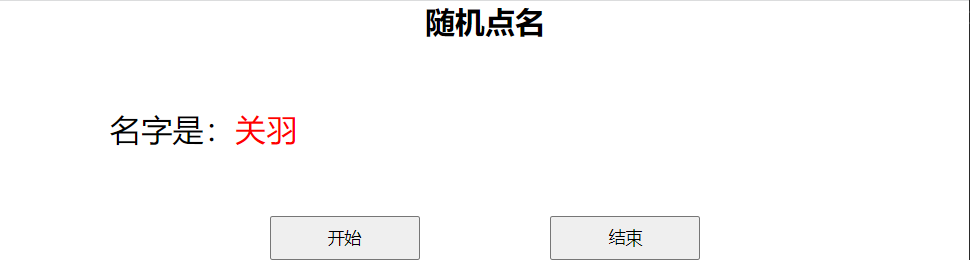
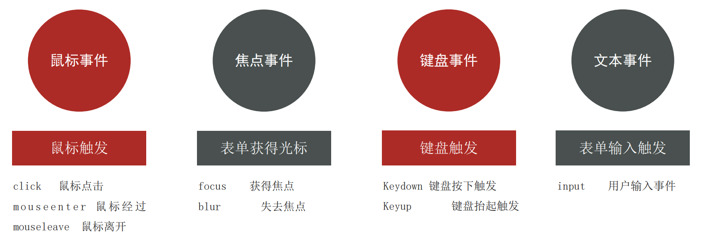
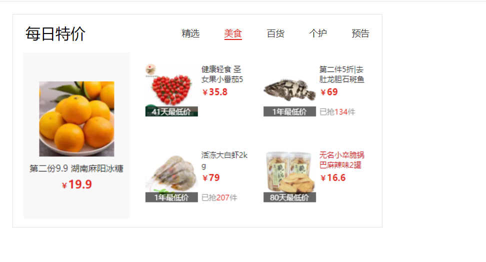

# 二、DOM事件基础

事件是在变成时系统内发生的**动作**或者发生的事情，比如用户在网页上**单击**一个按钮。

## 事件监听

让程序检测是否有事件产生，一旦有事件触发，就立即调用一个函数做出响应，也称为 绑定事件或者注册事件

**语法：**

```js
元素对象.addEventListener('事件类型', 要执行的函数)
```

**监听三要素：**

+ 事件源：哪个dom元素被事件出发了，要获取dom元素
+ 事件类型：用什么方式触发，比如鼠标单击 click、鼠标经过 mouseover 等
+ 事件调用的函数：要做什么事

示例：

```html
<button class="btn">
  按钮
</button>

<script>
	const btn = document.querySelector('.btn')
  // 修改元素样式
  btn.addEventListener('click', function () {
    alert('点击了~')
  })
</script>
```

### 小案例 - 随机点名

```html
<head>
  <style>
    * {
      margin: 0;
      padding: 0;
    }

    h2 {
      text-align: center;
    }

    .box {
      width: 600px;
      margin: 50px auto;
      display: flex;
      font-size: 25px;
      line-height: 40px;
    }

    .qs {

      width: 450px;
      height: 40px;
      color: red;

    }

    .btns {
      text-align: center;
    }

    .btns button {
      width: 120px;
      height: 35px;
      margin: 0 50px;
    }
  </style>
</head>

<body>
  <h2>随机点名</h2>
  <div class="box">
    <span>名字是：</span>
    <div class="qs">这里显示姓名</div>
  </div>
  <div class="btns">
    <button class="start">开始</button>
    <button class="end">结束</button>
  </div>
  
  <script>
  	// 数据数组
    const arr = ['马超', '黄忠', '赵云', '关羽', '张飞']
    let timerId = 0
    let random = 0
    
    const start = document.querySelector('.start')
    const qs = document.querySelector('.qs')
    
    start.addEventListener('click', () => {
      // 判断是否有没有定时器，控制定时器的数量
      if (timerId) {
        clearInterval(timerId)
      }
      timerId = setInterval(() => {
        random = parseInt(Math.random() * arr.length)
        qs.innerHTML = arr[random]
      }, 35)
      if (arr.length === 1) {
        start.disabled = end.disasbled = true
      }
    })
    
    const end = document.querySelector('.end')
    end.addEventListener('click', () => {
      clearInterval(timerId)
      // 解决多次点击结束按钮再点击开始会出现undefined
      if (random !== null) {
        arr.splice(random, 1)
      }
      random = null
    })
  </script>
</body>
```



### 事件监听版本

在以前，捕获事件，使用的是 `事件源.on事件 = function() {}` 来捕获的，但是这就会带来了一个问题，就是如果多次调用，最后一个会覆盖前面一个的 `on方式` ，因此就出现了 `addEventListener方式`

## 事件类型

事件类型常用的有四种：鼠标事件、焦点事件、键盘事件、文本事件。



### 鼠标事件 - 案例演示 - 轮播图案例

1. 静态模板

```html
<head>
  <style>
    * {
      box-sizing: border-box;
    }

    .slider {
      width: 560px;
      height: 400px;
      overflow: hidden;
    }

    .slider-wrapper {
      width: 100%;
      height: 320px;
    }

    .slider-wrapper img {
      width: 100%;
      height: 100%;
      display: block;
    }

    .slider-footer {
      height: 80px;
      background-color: rgb(100, 67, 68);
      padding: 12px 12px 0 12px;
      position: relative;
    }

    .slider-footer .toggle {
      position: absolute;
      right: 0;
      top: 12px;
      display: flex;
    }

    .slider-footer .toggle button {
      margin-right: 12px;
      width: 28px;
      height: 28px;
      appearance: none;
      border: none;
      background: rgba(255, 255, 255, 0.1);
      color: #fff;
      border-radius: 4px;
      cursor: pointer;
    }

    .slider-footer .toggle button:hover {
      background: rgba(255, 255, 255, 0.2);
    }

    .slider-footer p {
      margin: 0;
      color: #fff;
      font-size: 18px;
      margin-bottom: 10px;
    }

    .slider-indicator {
      margin: 0;
      padding: 0;
      list-style: none;
      display: flex;
      align-items: center;
    }

    .slider-indicator li {
      width: 8px;
      height: 8px;
      margin: 4px;
      border-radius: 50%;
      background: #fff;
      opacity: 0.4;
      cursor: pointer;
    }

    .slider-indicator li.active {
      width: 12px;
      height: 12px;
      opacity: 1;
    }
  </style>
</head>

<body>
  <div class="slider">
    <div class="slider-wrapper">
      
    </div>
    <div class="slider-footer">
      <p>对人类来说会不会太超前了？</p>
      <ul class="slider-indicator">
        <li class="active"></li>
        <li></li>
        <li></li>
        <li></li>
        <li></li>
        <li></li>
        <li></li>
        <li></li>
      </ul>
      <div class="toggle">
        <button class="prev">&lt;</button>
        <button class="next">&gt;</button>
      </div>
    </div>
  </div>
</body>
```

2. 填写逻辑

```html
<script>
  // 1. 初始数据
  const sliderData = [
    { url: './images/slider01.jpg', title: '对人类来说会不会太超前了？', color: 'rgb(100, 67, 68)' },
    { url: './images/slider02.jpg', title: '开启剑与雪的黑暗传说！', color: 'rgb(43, 35, 26)' },
    { url: './images/slider03.jpg', title: '真正的jo厨出现了！', color: 'rgb(36, 31, 33)' },
    { url: './images/slider04.jpg', title: '李玉刚：让世界通过B站看到东方大国文化', color: 'rgb(139, 98, 66)' },
    { url: './images/slider05.jpg', title: '快来分享你的寒假日常吧~', color: 'rgb(67, 90, 92)' },
    { url: './images/slider06.jpg', title: '哔哩哔哩小年YEAH', color: 'rgb(166, 131, 143)' },
    { url: './images/slider07.jpg', title: '一站式解决你的电脑配置问题！！！', color: 'rgb(53, 29, 25)' },
    { url: './images/slider08.jpg', title: '谁不想和小猫咪贴贴呢！', color: 'rgb(99, 72, 114)' },
  ]
  // 2. 右侧按钮业务
  // 3. 左侧按钮业务
  // 4. 自动播放业务
  // 5. 鼠标经过离开业务
  
  const next = document.querySelector('.next')
  const img = document.querySelector('.slider-wrapper img')
  const p = document.querySelector('.slider-footer p')
  const footer = document.querySelector('.slider-footer')
  const prev = document.querySelector('.prev')
  
  let i = 0
  function toggle() {
    img.src = sliderData[i].url
    p.innerHTML = sliderData[i].title
    footer.style.backgroundColor = sliderData[i].color
    document.querySelector('.slider-indicator .active').classList.remove('active')
    document.querySelector(`.slider-indicator li:nth-child(${i + 1})`).classList.add('active')
    
  }
  
  next.addEventListener('click', () => {
    i++
    i = i >= sliderData.length ? 0 : i
    toggle()
  })
  
  prev.addEventListener('click', () => {
    i--
    i = i < 0 ? sliderData.length - 1 : i
    toggle()
  })
  
  let timerId = setInterval(function () {
    next.click()
  }, 1000)
  
  const slider = document.querySelector('.slider')
  slider.addEventListener('mouseenter', () => {
    clearInterval(timerId)
  })
  slider.addEventListener('mouseleave', () => {
    timerId = setInterval(function () {
      next.click()
    }, 1000)
  })
  
</script>
```

### 焦点事件 - 案例演示 - 搜索框案例

1. 静态模板

```html
<!DOCTYPE html>
<html lang="en">

<head>
  <meta charset="UTF-8">
  <meta http-equiv="X-UA-Compatible" content="IE=edge">
  <meta name="viewport" content="width=device-width, initial-scale=1.0">
  <title>Document</title>
  <style>
    * {
      margin: 0;
      padding: 0;
      box-sizing: border-box;
    }

    ul {

      list-style: none;
    }

    .mi {
      position: relative;
      width: 223px;
      margin: 100px auto;
    }

    .mi input {
      width: 223px;
      height: 48px;
      padding: 0 10px;
      font-size: 14px;
      line-height: 48px;
      border: 1px solid #e0e0e0;
      outline: none;
    }

    .mi .search {
      border: 1px solid #ff6700;
    }

    .result-list {
      position: absolute;
      left: 0;
      top: 48px;
      width: 223px;
      border: 1px solid #ff6700;
      border-top: 0;
      background: #fff;
    }

    .result-list a {
      display: block;
      padding: 6px 15px;
      font-size: 12px;
      color: #424242;
      text-decoration: none;
    }

    .result-list a:hover {
      background-color: #eee;
    }
  </style>

</head>

<body>
  <div class="mi">
    <input type="search" placeholder="小米笔记本">
    <ul class="result-list">
      <li><a href="#">全部商品</a></li>
      <li><a href="#">小米11</a></li>
      <li><a href="#">小米10S</a></li>
      <li><a href="#">小米笔记本</a></li>
      <li><a href="#">小米手机</a></li>
      <li><a href="#">黑鲨4</a></li>
      <li><a href="#">空调</a></li>
    </ul>
  </div>
</body>
</html>
```

2. 填写逻辑

```html
<script>
	const input = document.querySelector('[type=search]')
  const ul = document.querySelector('.result-list')
  input.addEventListener('focus', () => {
    ul.style.display = 'block'
    input.classList.add('search')
  })
  input.addEventListener('blur', () => {
    ul.style.display = 'none'
    input.classList.remove('search')
  })
</script>
```

### 键盘事件

示例：

```html
<body>
  <input type="text">
  <script>
  	const input = document.querySelector('input')
    input.addEventListener('keydown', function () {
      console.log('键盘按下了')
    })
    input.addEventListener('keyup', function () {
      console.log('键盘弹起了')
    })
  </script>
</body>
```

### 文本事件

示例：

```html
<body>
  <input type="text">
  <script>
  	const input = document.querySelector('input')
    input.addEventListener('input', function () {
      console.log(input.value)
    })
  </script>
</body>
```

## 事件对象

 ### 获取事件对象

这个对象里有事件触发时的相关信息，比如当鼠标点击事件中，事件对象就存了鼠标点在那个位置等信息；实际应用中，可以判断用户按下哪个键，或者判断用户点击了哪个元素从而做相应的操作。

**语法：**

```js
// 一般命名event、ev、e
元素.addEventListener('click', function (e) {
  ...
})
```

### 事件对象常用属性

+ type：获取当前的事件类型
+ clientX/clientY：获取光标相对于浏览器可见窗口左上角的位置
+ offsetX/offsetY：获取光标相对于当前DOM元素左上角的位置
+ key：用户按下的键盘的值；且不提倡用keyCode

#### 评论字数统计 + 回车发布 - 小案例

**需求：**

1. 用户输入文字，可以计算用户输入的字数
2. 按下回车键盘，可以发布信息

**分析：**

1. 计算用户输入的字数
   1. 判断输入事件 input
   2. 不断取得文本框里面的字符长度，  文本域.value.length
   3. 把获得数组给下面文本框
2. 按下回车发布信息
   1. 按下键盘事件 keydown 或者 keyup 都可以
   2. 如果用户按下的是回车键盘，则发布信息
   3. 让留言信息模块显示，把拿到的数据渲染到对应标签内部

**代码编写：**

1. 模板代码

```html
<head>
    <style>
    .wrapper {
      min-width: 400px;
      max-width: 800px;
      display: flex;
      justify-content: flex-end;
    }

    .avatar {
      width: 48px;
      height: 48px;
      border-radius: 50%;
      overflow: hidden;
      background: url(./images/avatar.jpg) no-repeat center / cover;
      margin-right: 20px;
    }

    .wrapper textarea {
      outline: none;
      border-color: transparent;
      resize: none;
      background: #f5f5f5;
      border-radius: 4px;
      flex: 1;
      padding: 10px;
      transition: all 0.5s;
      height: 30px;
    }

    .wrapper textarea:focus {
      border-color: #e4e4e4;
      background: #fff;
      height: 50px;
    }

    .wrapper button {
      background: #00aeec;
      color: #fff;
      border: none;
      border-radius: 4px;
      margin-left: 10px;
      width: 70px;
      cursor: pointer;
    }

    .wrapper .total {
      margin-right: 80px;
      color: #999;
      margin-top: 5px;
      opacity: 0;
      transition: all 0.5s;
    }

    .list {
      min-width: 400px;
      max-width: 800px;
      display: flex;
    }

    .list .item {
      width: 100%;
      display: flex;
    }

    .list .item .info {
      flex: 1;
      border-bottom: 1px dashed #e4e4e4;
      padding-bottom: 10px;
    }

    .list .item p {
      margin: 0;
    }

    .list .item .name {
      color: #FB7299;
      font-size: 14px;
      font-weight: bold;
    }

    .list .item .text {
      color: #333;
      padding: 10px 0;
    }

    .list .item .time {
      color: #999;
      font-size: 12px;
    }
  </style>
</head>

<body>
    <div class="wrapper">
    <i class="avatar"></i>
    <textarea id="tx" placeholder="发一条友善的评论" rows="2" maxlength="200"></textarea>
    <button>发布</button>
  </div>
  <div class="wrapper">
    <span class="total">0/200字</span>
  </div>
  <div class="list">
    <div class="item" style="display: none;">
      <i class="avatar"></i>
      <div class="info">
        <p class="name">清风徐来</p>
        <p class="text">大家都辛苦啦，感谢各位大大的努力，能圆满完成真是太好了[笑哭][支持]</p>
        <p class="time">2022-10-10 20:29:21</p>
      </div>
    </div>
  </div>
</body>
```

2. 填写逻辑

```html
<script>
	const tx = document.querySelector('#tx')
  const total = document.querySelector('.total')
  const item = document.querySelector('.item')
  const text = docuemnt.querySelector('.text')
  
  // 显示用户输入的数字
  tx.addEventListener('focus', function () {
    total.style.opacity = 1
  })
  tx.addEventListener('blur', function () {
    total.style.opacity = 0
  })
  tx.addEventListener('input', function () {
    total.innerHTML = `${tx.value.length}/200字`
  })
  
  // 回车事件
  tx.addEventListener('keyup', function (e) {
    if (e.key === 'Enter') {
      if (tx.value.trim() !== '') {
        item.style.display = 'block'
        text.innerHTML = tx.value
      }
      tx.value = ''
      total.innerHTML = '0/200字'
    }
  })
</script>
```

## 环境对象（变量 this）

函数内部特殊对象的变量 this，代表着当前函数运行时所处的环境

**作用：**

函数调用方式不同，this所指代的对象也不同

**谁调用这个函数，this就是谁** （粗略规则）

直接调用函数，其实就相当于是window函数，所以this指代window

示例：

```html
<body>
  <button>
    点击
  </button>
  
  <script>
  	const btn = document.querySelector('button')
    btn.addEventListener('click', function () {
      console.log(this) // <button>点击</button>
      
      // btn.style.color = 'red'
      this.style.color = 'red'
    })
  </script>
</body>
```

## 回调函数

一个函数当做参数传递给另一个函数的时候，这个函数就是回调函数

示例：

```js
function fn() {
  console.log('我是回调函数...')
}
// fn 传递给了setInterval，fn是回调函数
// 过了一秒钟就回调这个函数
setInterval(fn, 1000)
```

其实就是把回调函数当成参数使用了，一般用匿名函数做为回调函数是比较常见的作法

## 综合案例 - Tab栏切换

### 需求

鼠标经过不同的选项卡，底部可以显示不同的内容

### 分析

主要核心是类的切换，设定一个当前类，可以让当前元素高亮

鼠标经过当前选项卡，先移除其余元素身上的当前类，而只给当前元素添加类

当前类只能有一个

### 代码编写

1. 代码模板

```html
<head>
    <style>
    * {
      margin: 0;
      padding: 0;
    }

    .tab {
      width: 590px;
      height: 340px;
      margin: 20px;
      border: 1px solid #e4e4e4;
    }

    .tab-nav {
      width: 100%;
      height: 60px;
      line-height: 60px;
      display: flex;
      justify-content: space-between;
    }

    .tab-nav h3 {
      font-size: 24px;
      font-weight: normal;
      margin-left: 20px;
    }

    .tab-nav ul {
      list-style: none;
      display: flex;
      justify-content: flex-end;
    }

    .tab-nav ul li {
      margin: 0 20px;
      font-size: 14px;
    }

    .tab-nav ul li a {
      text-decoration: none;
      border-bottom: 2px solid transparent;
      color: #333;
    }

    .tab-nav ul li a.active {
      border-color: #e1251b;
      color: #e1251b;
    }

    .tab-content {
      padding: 0 16px;
    }

    .tab-content .item {
      display: none;
    }

    .tab-content .item.active {
      display: block;
    }
  </style>
</head>

<body>
  <div class="tab">
    <div class="tab-nav">
      <h3>每日特价</h3>
      <ul>
        <li><a class="active" href="javascript:;">精选</a></li>
        <li><a href="javascript:;">美食</a></li>
        <li><a href="javascript:;">百货</a></li>
        <li><a href="javascript:;">个护</a></li>
        <li><a href="javascript:;">预告</a></li>
      </ul>
    </div>
    <div class="tab-content">
      <div class="item active"></div>
      <div class="item"></div>
      <div class="item"></div>
      <div class="item"></div>
      <div class="item"></div>
    </div>
  </div>
</body>
```

2. 填写逻辑

```html
<script>
	const as = document.querySelectorAll('.tab-nav a')
  for (let i = 0; i < as.length; i++) {
    as[i].addEventListener('mouseenter', function () {
      document.querySelector('.tab-nav .active').classList.remove('active')
      this.classList.add('active')
      
      document.querySelector('.tab-content .active').classList.remove('active')
      document.querySelector(`.tab-content .item:nth-child(${i + 1})`).classList.add('active')
    })
  }
</script>
```



## 综合案例 - 全选文本框案例

### 需求

用户点击全选，则下面复选框全部选择，取消全选则全部取消，文字对应变化

### 分析：

1. 全选复选框点击，可以得到当前按钮的 checked
2. 把下面所有的小复选框状态checked，改为和全选复选框一致
3. 遍历下面的所有的checkbox，添加点击事件
4. 检查小复选框选中的个数，是不是等于小复选框的总个数
5. 把结果给全选按钮
6. 利用css复选框选择器  input:checked

### 代码编写

```html
<head>
  <style>
    * {
      margin: 0;
      padding: 0;
    }

    table {
      border-collapse: collapse;
      border-spacing: 0;
      border: 1px solid #c0c0c0;
      width: 500px;
      margin: 100px auto;
      text-align: center;
    }

    th {
      background-color: #09c;
      font: bold 16px "微软雅黑";
      color: #fff;
      height: 24px;
    }

    td {
      border: 1px solid #d0d0d0;
      color: #404060;
      padding: 10px;
    }

    .allCheck {
      width: 80px;
    }
  </style>
</head>

<body>
  <table>
    <tr>
      <th class="allCheck">
        <input type="checkbox" name="" id="checkAll"> <span class="all">全选</span>
      </th>
      <th>商品</th>
      <th>商家</th>
      <th>价格</th>
    </tr>
    <tr>
      <td>
        <input type="checkbox" name="check" class="ck">
      </td>
      <td>小米手机</td>
      <td>小米</td>
      <td>￥1999</td>
    </tr>
    <tr>
      <td>
        <input type="checkbox" name="check" class="ck">
      </td>
      <td>小米净水器</td>
      <td>小米</td>
      <td>￥4999</td>
    </tr>
    <tr>
      <td>
        <input type="checkbox" name="check" class="ck">
      </td>
      <td>小米电视</td>
      <td>小米</td>
      <td>￥5999</td>
    </tr>
  </table>
  
  <script>
  	const checkAll = document.querySelector('#checkAll')
    const checks = document.querySelector('.ck')
    
    // 1. 全选带小复选框
    checkAll.addEventListener('click', function () {
      for (let i = 0; i < checks.length; i++) {
        checks[i].checked = this.checked
      }
    })
    
    // 2. 小复选框带全选
    for
  </script>
</body>
```

