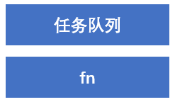

# 五、BOM操作

## Window对象

### BOM（浏览器对象模型）

+ window对象是一个全局对象，也是JavaScript中的顶级对象
+ 像 `document` 、`alert()` 、`console.log()` 都是window的属性，基本BOM的属性和方法都是window的
+ 所有通过 `var` 定义再全局作用域中的变量、函数都会变成window对象的属性和方法
+ window对象下的属性和方法调用的时候可以省略window


### 定时器 - 延时函数 (setTimeout)

可以让代码延迟执行的函数

**语法：** `setTimeout(回调函数, 等待的毫秒数)`

示例：

```js
let timer = setTimeout(回调函数, 等待的毫秒数)
// 清除延时函数
clearTimeout(timer)
```

:::warning

+ 延时器需要等待，所以后面的代码先执行
+ 每一次调用延时器都会产生一个新的延时器

:::

#### 延时函数和间歇函数

+ 延时函数：执行一次
+ 间歇函数：每隔一段时间就执行依次，除非手动清除

### JS执行机制 - 同步与异步

JavaScript 语言的一大特点就是单线程，即，同一个时间只能做一件事。单线程就意味着，前面一个任务没有结束，后面一个任务就不能执行，如果JS执行时间过长，就会造成页面的渲染不连贯，导致页面渲染加载阻塞感更强。

由此，可以引出一个概念 - 异步。

#### 异步

简单理解为，做一件事，比如做饭，在烧水的同时，可以利用这10分钟，去切菜，炒菜等。

就好像以前小学时候的计算题，烧水三十分钟，切菜4分钟，炒菜8分钟......问全部做完要多长时间

#### 同步任务

同步任务都在主线程上执行，形成一个执行栈


#### 异步任务

异步任务都是耗时的，0时也是会耗时的，因为是放在任务队列里面去的。

一般而言，异步任务有以下三种类型：

1. 普通时间，如click、resize等
2. 资源加载，如load、error等
3. 定时器，包括 `setInterval` 、`setTimeout` 等

异步任务相关添加到任务队列中



#### 执行机制

1. 先执行执行栈中的同步任务
2. 异步任务放入任务队列中
3. 一旦执行栈中的所有同步任务执行完毕，系统就会按次序读取任务队列中的异步任务，于是被读取的异步任务结束等待状态，进入执行栈，开始执行。


由于主线程不断的重复获得任务、执行任务、再获取任务、再执行，所以这种机制被称为**事件循环(event loop)**

### location对象

它的数据类型是对象，它拆分并保存了 URL 地址的各个组成部分

#### 常用属性和方法

+ `href` 属性获取完整的URL地址，利用JS的方法去跳转页面
+ `search` 属性获取地址中携带的参数，符号 `?` 后面部分
+ `hash` 属性获取地址中的哈希值，符号 `#` 后面部分
+ `reload` 方法用来刷新当前页面，传入参数 `true` 时表示强制刷新

#### href属性

可以直接跳转到指定页面，比如登录成功后跳转到相对应的页面。

示例：

```js
// 可以得到当前文件URL地址
console.log(location.href)
// 可以通过js方式跳转到目标地址
location.href = 'http://www.baidu.com'
```

#### search属性

主要是当别人在表单输入信息并提交了之后，这些信息都会放到地址栏地址的后面，如果需要提取出来，用 `location.search` 就能查询到了。

示例：

```js
console.log(location.search)
```

#### hash属性

如果页面用到了SPA，即点击标题栏，整个页面不是全部刷新的，只是部分刷新，这个时候地址栏上面显示的是 `.../#/...` 这个时候用hash就能查到 `#` 后面的内容

示例：

```js
consoloe.log(location.hash)
```

#### reload属性

示例：

```html
<button>点击刷新</button>

<script>
	let btn = document.querySelector('button')
  btn.addEventListener('click', function () {
    // 强制刷新
    location.reload(true)
  })
</script>
```

### navigator对象

这个对象记录了浏览器自身的相关信息

#### 常用的属性和方法

通过 `userAgent` 检测浏览器的版本及平台，实现PC端和移动端自动跳转相对应页面

```html
<head>
  <script>
  	// 检测 userAgent (浏览器信息)
    !(function () {
      const userAgent = navigator.userAgent
      // 验证是否为Android或iPhone
      const android = userAgent.match(/(Android);?[\s\/]+([\d.]+)?/)
      const iphone = userAgent.match(/(iPhone\sOS)\s([\d_]+)/)

      // 如果是Android或iPhone，则跳转至移动站点
      if (android || iphone) {
        location.href = 'http://m.baidu.com'
      }
    })
  </script>
</head>
```

### histroy对象

最终实现的是页面的前进、后退、历史记录等

| history对象方法 |                           作用                            |
| :-------------: | :-------------------------------------------------------: |
|     back()      |                       可以后退功能                        |
|    forward()    |                         前进功能                          |
|    go(参数)     | 前进后退功能，参数如果是1前进1个页面，如果是-1后退1个页面 |

## 本地存储

有些时候在页面上写的数据一刷新页面就没有了，因此需要在本地存储大量的数据

一般是存储在用户的浏览器中，这样刷新页面的时候也不丢失数据。本地存储分为两种，一种是sessionStorage和localStorage

### 本地存储分类

#### localStorage

可以将数据永久存储在本地，除非手动删除，否则关闭页面也会存在

可以多个窗口共享（同一浏览器可以共享），并以键值对的形式存储

**语法：**

+ 存储数据：`localStorage.setItem(key, value)`
+ 获取数据：`localStorage.getItem(key)`
+ 删除数据：`localStorage.removeItem(key)`


####  sessionStorage

与localStorage不同，如果关闭了浏览器窗口，数据就会消失

### 存储复杂数据类型

用以上的方法，只能一条一条存储数据的话，如果遇到复杂的数据类型，就太麻烦了。而且，如果你需要存储一个对象，直接存储，它是识别不了你是一个对象的，返回的只有 `[object object]` 所以就需要转化。

因此，就需要将复杂数据类型转换成JSON字符串，存储到本地。

**语法：** `JSON.stringify(复杂数据类型)` 

示例：

```html
<script>
	const goods = {
    uname: 'zs',
    age: 18
  }
  localStorage.setItem('goods': JSON.stringify(goods))
</script>
```

单纯存了还不行，还要把取出来的字符串转换为对象

**语法：** `JSON.parse(JSON字符串)`

示例：

```html
<script>
	const obj = JSON.parse(localStorage.getItem('goods'))
  console.log(obj)
</script>
```

## 综合案例 - 学生信息案例

与上一篇不同的是，这次的数据的操作都是在本次存储数据里面操作

### 代码编写

1. 静态框架搭建

```html
<body>
   <h1>新增学员</h1>
  <form class="info" autocomplete="off">
    姓名：<input type="text" class="uname" name="uname" />
    年龄：<input type="text" class="age" name="age" />
    性别:
    <select name="gender" class="gender">
      <option value="男">男</option>
      <option value="女">女</option>
    </select>
    薪资：<input type="text" class="salary" name="salary" />
    就业城市：<select name="city" class="city">
      <option value="北京">北京</option>
      <option value="上海">上海</option>
      <option value="广州">广州</option>
      <option value="深圳">深圳</option>
      <option value="曹县">曹县</option>
    </select>
    <button class="add">录入</button>
  </form>

  <h1>就业榜</h1>
  <div class="title">共有数据<span>0</span>条</div>
  <table>
    <thead>
      <tr>
        <th>学号</th>
        <th>姓名</th>
        <th>年龄</th>
        <th>性别</th>
        <th>薪资</th>
        <th>就业城市</th>
        <th>操作</th>
      </tr>
    </thead>
    <tbody>
      <!-- 
        <tr>
          <td>1001</td>
          <td>欧阳霸天</td>
          <td>19</td>
          <td>男</td>
          <td>15000</td>
          <td>上海</td>
          <td>
            <a href="javascript:">删除</a>
          </td>
        </tr> 
        -->
    </tbody>
  </table>
  
  <script>
    const initData = [
      {
        stuId: 1001,
        uname: '欧阳霸天',
        age: 19,
        gender: '男',
        salary: '20000',
        city: '上海',
        time: '2000-08-08 18:00:00'
      }
    ]
  </script>
</body>
```

2. 填写逻辑

```html
<script>
	const arr = JSON.parse(localStorage.getItem('data')) || []
  const tbody = document.querySelector('tbody')
  
  function render() {
    const trArr = arr.map(function (ele, index) {
      return `
				<tr>
					<td>${ele.stuId}</td>
          <td>${ele.uname}</td>
          <td>${ele.age}</td>
          <td>${ele.gender}</td>
          <td>${ele.salary}</td>
          <td>${ele.city}</td>
          <td>${ele.time}</td>
          <td>
  					<a href="javascript:;" data-id="${index}">删除</a>
  				</td>
				</tr>
			`
    })
    tbody.innerHTML = trArr.join('')
    document.querySelector('.title span').innerHTML = arr.length
  }
  render()
  
  const info = document.querySelector('.info')
  const uname = document.querySelector('.uname')
  const age = document.querySelector('.age')
  const salary = document.querySelector('.salary')
  const gender = document.querySelector('.gender')
  const city = document.querySelector('.city')
  
  info.addEventListener('submit', function (e) {
    e.preventDefault()
    if (!uname.value || !age.value || !salary.value) {
      return alert('输入内容不能为空')
    }
    arr.push({
      stuId: arr.length ? arr[arr.length - 1].stuId + 1 : 1,
      uname: uname.value,
      age: age.value,
      gender: gender.value,
      salary: salary.value,
      city: city.value,
      time: new Date().toLocaleString()
    })
    render()
    this.reset()
    localStorage.setItem('data', JSON.stringfy(arr))
  })
  
  tbody.addEventListener('click', function (e) {
    if (e.target.tagName === 'A') {
      if (confirm('您确定要删除这条数据吗')) {
        arr.splice(e.target.dataset.id, 1)
        render()
        localStorage.setItem('data', JSON.stringify(arr))
      }
    }
  })
</script>
```


## 补充知识

### map方法

可以遍历数组处理数组，并且返回新的数组

**语法：**

```js
const arr = ['black', 'red', 'blue']
// 数组元素，索引号
const newArr = arr.map(function (item, index) {
  console.log(item) // black、red、blue
  console.log(index) // 0、1、2  
  return item + '颜色'
})
console.log(newArr) // [ 'black颜色', 'red颜色', 'blue颜色' ]
```

 ### join方法

可以把所有元素转换一个字符串

**语法：**

```js
const arr = ['black颜色', 'red颜色', 'blue颜色']
// 通过指定分隔符进行分隔
console.log(arr.join()) // black颜色,red颜色,blue颜色
console.log(arr.join('')) // black颜色red颜色blue颜色
console.log(arr.join(' ')) // black颜色 red颜色 blue颜色
```

