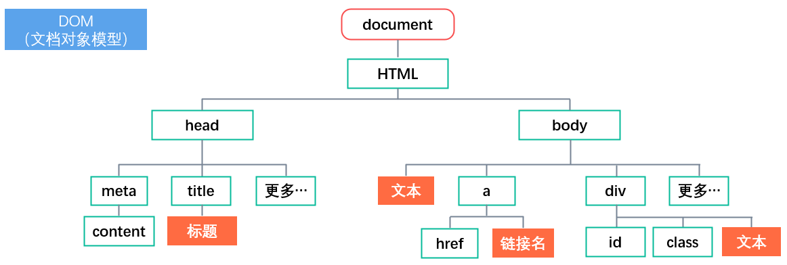
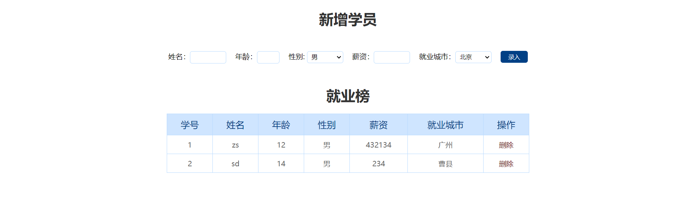

# 四、DOM节点&移动端滑动

## 日期对象

可以得到当前系统的时间

**语法：**

```js
// 获取当前时间
const date = new Date()

// 获取指定时间
const date = new Date('2008-8-8')
console.log(date) // 2008-08-07T16:00:00.000Z
```

### 日期对象方法

|     方法      |        作用        |        说明        |
| :-----------: | :----------------: | :----------------: |
| getFullYear() |      获得年份      |    获取四位年份    |
|  getMonth()   |      获取月份      |    取值为 0~11     |
|   getDate()   | 获取月份中的每一天 | 不同月份取值也不同 |
|   getDay()    |      获取星期      |     取值为0~6      |
|  getHours()   |      获取小时      |     取值为0~23     |
| getMinutes()  |      获取分钟      |     取值为0~59     |
| getSeconds()  |       获取秒       |     取值为0~59     |

:::warning 注意

月份、小时、分钟、秒都要+1

:::

### 时间戳

指1970年01月01日00时00分00秒起至现在的毫秒数，它是一种特殊的计量时间的方式。

主要是可以实现倒计时的效果

#### 算法

1. 将来的时间戳 - 现在的时间戳 = 剩余时间毫秒数
2. 剩余时间毫秒数 转换为 剩余时间的 年月日时分秒 就是 倒计时时间
3. 比如：将来时间戳  2000ms -  现在时间戳  1000ms = 1000ms
4. 1000ms 转换为就是 0小时0分1秒

#### 怎么获取？

1. 使用 getTime() 方法

```js
const date = new Date()
console.log(date.getTime())
```

2. 简写 +new Date()

```js
console.log(+new Date())
```

3. 使用 Date.now()

只能得到当前的时间戳，前面两个都可以返回指定时间的时间戳

```js
console.log(Date.now())
```

### 倒计时案例

1. 静态框架

```html
<head>
  <style>
    .countdown {
      width: 240px;
      height: 305px;
      text-align: center;
      line-height: 1;
      color: #fff;
      background-color: brown;
      /* background-size: 240px; */
      /* float: left; */
      overflow: hidden;
    }

    .countdown .next {
      font-size: 16px;
      margin: 25px 0 14px;
    }

    .countdown .title {
      font-size: 33px;
    }

    .countdown .tips {
      margin-top: 80px;
      font-size: 23px;
    }

    .countdown small {
      font-size: 17px;
    }

    .countdown .clock {
      width: 142px;
      margin: 18px auto 0;
      overflow: hidden;
    }

    .countdown .clock span,
    .countdown .clock i {
      display: block;
      text-align: center;
      line-height: 34px;
      font-size: 23px;
      float: left;
    }

    .countdown .clock span {
      width: 34px;
      height: 34px;
      border-radius: 2px;
      background-color: #303430;
    }

    .countdown .clock i {
      width: 20px;
      font-style: normal;
    }
  </style>
</head>

<body>
  <div class="countdown">
    <p class="next">今天是2222年2月22日</p>
    <p class="title">下班倒计时</p>
    <p class="clock">
      <span id="hour">00</span>
      <i>:</i>
      <span id="minutes">25</span>
      <i>:</i>
      <span id="second">20</span>
    </p>
    <p class="tips">18:30:00下课</p>
  </div>
</body>
```

2. 填写逻辑

```html
<script>
	function getCountTime () {
    const now = new Date()
    const last = +new Date('2023-11-20 18:30:00')
    const count = (last - now) / 1000

    h = parseInt(count / 60 / 60 % 24)
    m = parseInt(count / 60 % 60)
    s = parseInt(count % 60)

    const hour = document.querySelector('#hour')
    const minutes = document.querySelector('#minutes')
    const second = document.querySelector('#second')

    hour.innerHTML = h.toString().padStart(2, 0)
    minutes.innerHTML = m.toString().padStart(2, 0)
    second.innerHTML = s.toString().padStart(2, 0)
  }
  
  setInterval(getCountTime, 1000)
</script>
```

## 节点操作

### DOM 节点

DOM树里每一个内容都可以称之为节点



#### 节点类型

+ 元素节点：所有的标签，比如 body、div，html是根节点
+ 属性节点：所有的熟悉你个，比如 href
+ 文本节点：所有的文本
+ 其他

### 查找节点

#### 父节点查找

**语法：** `子元素.parentNode`

+ parentNode 属性
+ 返回最近一级的父节点，找不到返回null

这样操作就不需要每个节点都要用 `document.querySelector` 获取节点，只需要获取一个子节点，然后再通过子节点获取父节点就行了。

示例：

关闭盒子

```html
<body>
  <div class="box">
    我是广告
    <div class="box1">X</div>
  </div>
  
  <script>
  	const box1 = document.querySelector('.box1')
    box1.addEventListener('click', function () {
      this.parentNode.style.display = 'none'
    })
  </script>
</body>
```

#### 子节点查找

1. childNodes
   + 获得所有子节点，包括文本节点、注释节点等

2. children 属性（重点）

**语法：** `父元素.children`

+ 仅获得所有元素节点
+ 返回的是一个为数组

#### 兄弟关系查找

1. 下一个兄弟节点
   + nextElementSibling 属性
2. 上一个兄弟节点
   + previousElementSibling 属性

### 增加节点

创造要给新的网页元素添加到网页内。

一般是先创建节点，然后插入节点。

**语法：**

```js
// 创造一个新的元素节点
document.createElement('标签名')

// 插入到这个父元素的最后
父元素.appendChild(要插入的元素)

// 插入到某个子元素的前面
父元素.insertBefore(要插入的元素, 在哪个元素前面)
```

#### 克隆节点

特殊情况下，可以复制一个原有的节点，然后把复制的节点放入到指定的元素内部。

```js
// 克隆要给已有的元素节点
// 默认为 false
// 若为 true，则代表克隆时会包含后代节点一起克隆
// 若为 false,则代表克隆时不包含后代节点
元素.cloneNode(布尔值)
```

### 删除节点

**语法：** `父元素.removeChild(要删除的元素)`

要删除元素必须通过父元素删除，而且删除节点和隐藏节点（`display: none`）是由区别的，隐藏节点节点还是存在的；删除节点则是在html中删除。

## M端事件

### 常见的触屏事件

| 触屏touch事件 |              说明               |
| :-----------: | :-----------------------------: |
|  touchstart   |  手指触摸到一个 DOM 元素时触发  |
|   touchmove   | 手指在一个 DOM 元素上滑动时触发 |
|   touchend    | 手指从一个 DOM 元素上移开时触发 |

## JS 插件

把别人写好的代码，只需要CV就能实现对应的效果，成为真正的CV工程师。😝

## 综合案例

### 学生信息表案例

#### 业务

1. 点击录入按钮可以录入数据
2. 点击删除可以删除当前的数据

#### 代码编写

1. 静态结构

```html
<body>
  <h1>新增学员</h1>
  <form class="info" autocomplete="off">
    姓名：<input type="text" class="uname" name="uname" />
    年龄：<input type="text" class="age" name="age" />
    性别:
    <select name="gender" class="gender">
      <option value="男">男</option>
      <option value="女">女</option>
    </select>
    薪资：<input type="text" class="salary" name="salary" />
    就业城市：<select name="city" class="city">
    <option value="北京">北京</option>
    <option value="上海">上海</option>
    <option value="广州">广州</option>
    <option value="深圳">深圳</option>
    <option value="曹县">曹县</option>
    </select>
    <button class="add">录入</button>
  </form>

  <h1>就业榜</h1>
  <table>
    <thead>
      <tr>
        <th>学号</th>
        <th>姓名</th>
        <th>年龄</th>
        <th>性别</th>
        <th>薪资</th>
        <th>就业城市</th>
        <th>操作</th>
      </tr>
    </thead>
    <tbody>
      <!-- 
        <tr>
        <td>1001</td>
        <td>欧阳霸天</td>
        <td>19</td>
        <td>男</td>
        <td>15000</td>
        <td>上海</td>
        <td>
        <a href="javascript:">删除</a>
        </td>
        </tr> 
			-->
    </tbody>
  </table>
</body>
```

2. 填写逻辑

```html
<script>
  const uname = document.querySelector('.uname')
  const age = document.querySelector('.age')
  const gender = document.querySelector('.gender')
  const salary = document.querySelector('.salary')
  const city = document.querySelector('.city')
  const tbody = document.querySelector('tbody')
  
	const arr = []
  
  const info = document.querySelector('.info')
  info.addEventListener('submit', function (e) {
    e.preventDefault()
    
    for (let i = 0; i < items.length; i++) {
      if (items[i].value === '') {
        return alert('输入内容不能为空')
      }
    }
    
    const obj = {
      stuId: arr.length + 1
      uname: uname.value,
      age: age.value,
      gender: gender.value
      salary: salary.value
      city: city.value
    }
    arr.push(obj)
    this.reset()
    render()
  })
  
  function render() {
    tbody.innerHTML = ''
    for (let i = 0; i < arr.length; i++) {
      const tr = document.createElement('tr')
      tr.innerHTML = `
        <td>${arr[i].stuId}</td>
        <td>${arr[i].uname}</td>
        <td>${arr[i].age}</td>
        <td>${arr[i].gender}</td>
        <td>${arr[i].salary}</td>
        <td>${arr[i].city}</td>
        <td>
        	<a href="javascript:" data-id=${i}>删除</a>
        </td>
			`
      tbody.appendChild(tr)
    }
  }
  
  tbody.addEventListener('click', function (e) {
    if (e.target.tagName === 'A') {
      arr.splice(e.target.dataset.id, 1)
      render()
    }
  })
</script>
```

