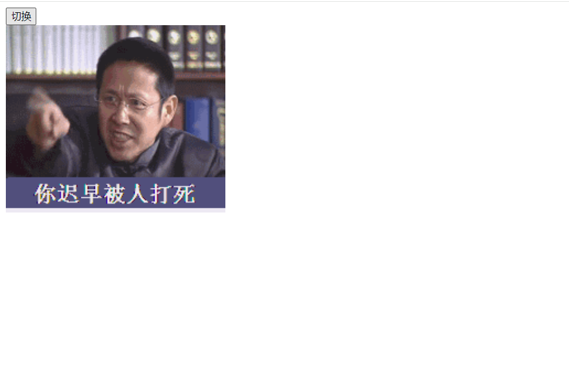
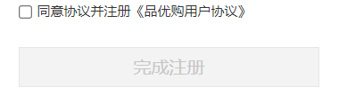
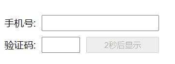
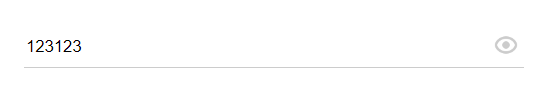

# 每日作业 - 2

## 01 -  点击随机显示图片

### 思路：

1. 先拿到按钮和图片
2. 给按钮注册点击事件
3. 获取数组长度的随机数
4. 把数组里面的随机数，就是数组里面的图片地址复制给img的src里面。

### 代码编写

```html
<body>
  <input type="button" value="切换" id="btn"><br>
  
  
  <script>
  	let arr = ['images/1.jpg', 'images/01.gif', 'images/02.gif']
    function getRandom(min, max) {
      return Math.floor(Math.random() * (max - min + 1)) + min
    }
    
    const btn = document.querySelector('[type=search]')
    const img = document.querySelector('img')
    btn.addEventListener('click', function () {
      let random = getRandom(0, arr.length - 1)
      img.src = arr[random]
    })
  </script>
</body>
```



## 02 - 同意协议

### 思路

1. 获取同意协议和完成注册两个按钮
2. 给同意协议加上注册事件
3. log(agree) 可知，选中的时候为true，没选中的时候为false；而log(btn.disabled)的时候，高亮的时候为false，true的时候为false，因此只需要取反再赋值给btn.disabled就行了

### 代码编写

```html
<body>
  <div class="control-group">
    <span class="control-label">&nbsp;</span>
    <label class="controls">
      <input id="agree" name="m1" type="checkbox" checked />
      <span>同意协议并注册《品优购用户协议》</span>
    </label>
  </div>
  <div class="control-group">
    <span class="control-label"></span>
    <div class="controls btn-reg">
      <button id="registerBtn" class="sui-btn btn-block btn-xlarge btn-danger" href="#">
        完成注册
      </button>
    </div>
  </div>
</body>

<script>
	const agree = document.querySelector('#agree')
  const btn = document.querySelector('#registerBtn')
  
  agree.addEventListener('click', function () {
    registerBtn.disabled = !this.checked
  })
</script>
```



## 03 - 验证码倒计时

### 思路

1. 获取元素按钮
2. 给按钮注册点击事件
3. 点击之后，禁用按钮，同时开启倒计时
4. 如果时间为0，则清除定时器，并且更改文字

### 代码编写

```html
<body>
  <ul>
    <li>
    	手机号：
      <input type="text">
    </li>
    <li>
    	验证码：
      <input type="text" class="verify">
      <button id="btn">
        获取验证码
      </button>
    </li>
  </ul>
  
  <script>
  	const btn = document.querySelector('#btn')
    btn.addEventListener('click', function () {
      btn.disabled = true
      let i = 5
      btn.innerHTML = `${i}秒后显示`
      let timer = setInterval(function () {
        i--
        btn.innerHTML = `${i}秒后显示`
        if(i <= 0) {
          clearInerval(timer)
          btn.disabled = false
          btn.innerHTML = '获取验证码'
        }
      }, 1000)
    })
  </script>
</body>
```



## 04 - 显示隐藏密码

### 思路

1. 获取元素 label 和 input
2. 给label注册事件
3. 因为要修改input的type属性text ipassword, 可以使用一个变量来控制flag ，如果 为true就切换为password，如果为false就修改为text

### 代码编写

```html
<body>
  <div class="box">
    <label for=""></label>
    <input type="password" name="" id="pwd">
  </div>
  
  <script>
  	const label = document.querySelector('label')
    const input = document.querySelector('input')
    
    let flag = true
    
    label.addEventListener('click', function () {
      this.classList.toggle('active')
      if (flag) {
        input.type = 'text'
      } else {
        input.type = 'password'
      }
      flag = !flag
    })
  </script>
</body>
```

