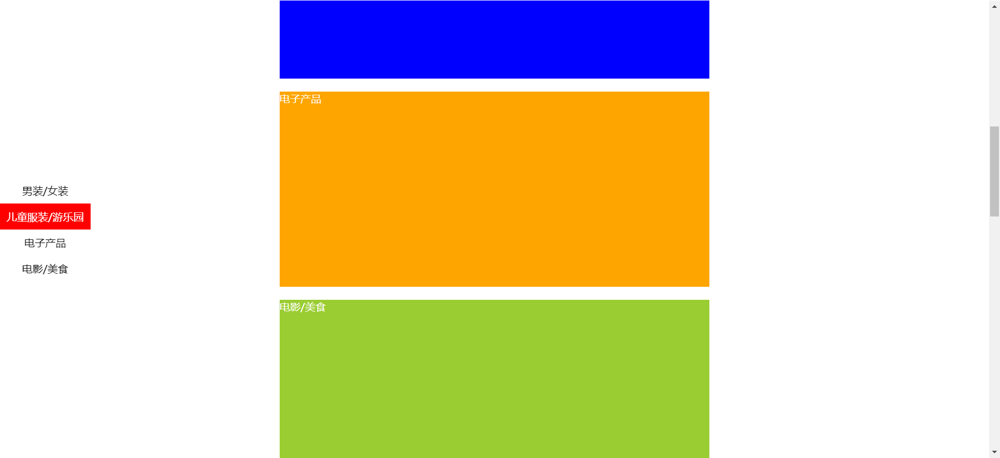
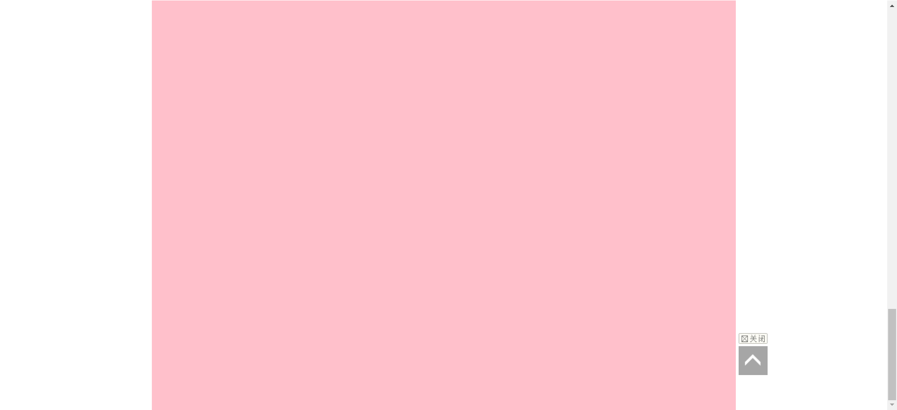
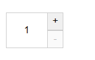
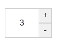

# 每日作业 - 3

## 01 - 电梯导航

### 思路

观察静态框架可知，.aside盒子是没有自定义属性的，这就很不利于后面neirong盒子去找到页面顶端的距离。所以可以先给.aside盒子加上自定义属性，属性名字和neirong盒子相同，这样后面就可以用字符拼接的方式去找到到页面顶端的距离了。

### 代码编写

1. 搭建框架

```html
<head>
  <style>
    * {
      margin: 0;
      padding: 0;
    }

    body {
      height: 3000px;
    }

    .aside {
      position: fixed;
      left: 0;
      top: 50%;
      transform: translateY(-50%);
    }

    .item {
      height: 40px;
      line-height: 40px;
      text-align: center;
      padding: 0 10px;
      cursor: pointer;
    }

    .active {
      background-color: red;
      color: #fff;
    }

    .content {
      width: 660px;
      margin: 400px auto;
    }

    .neirong {
      height: 300px;
      margin-bottom: 20px;
      color: #fff;
    }

    .content1 {
      background-color: red;
    }

    .content2 {
      background-color: blue;
    }

    .content3 {
      background-color: orange;
    }

    .content4 {
      background-color: yellowgreen;
    }
  </style>
</head>

<body>
  <div class="aside">
    <div class="item active">男装/女装</div>
    <div class="item">儿童服装/游乐园</div>
    <div class="item">电子产品</div>
    <div class="item">电影/美食</div>
  </div>

  <div class="content">
    <div class="neirong content1">男装/女装</div>
    <div class="neirong content2">儿童服装/游乐园</div>
    <div class="neirong content3">电子产品</div>
    <div class="neirong content4">电影/美食</div>
  </div>
  
  <script>
  
  </script>
</body>
```

2. 点击导航栏，页面进行滚动

```html
<head>
  <style>
    html {
      scroll-behavior: smooth;
    }
  </style>
</head>

<body>
  <div class="aside">
    <div class="item active" data-name="content1">男装/女装</div>
    <div class="item" data-name="content2">儿童服装/游乐园</div>
    <div class="item" data-name="content3">电子产品</div>
    <div class="item" data-name="content4">电影/美食</div>
  </div>

  <div class="content">
    <div class="neirong content1">男装/女装</div>
    <div class="neirong content2">儿童服装/游乐园</div>
    <div class="neirong content3">电子产品</div>
    <div class="neirong content4">电影/美食</div>
  </div>
  
  <script>
  // 点击导航栏，页面滚动
  // 获取导航栏元素
  const aside = document.querySelector('.aside')
  // 给导航栏注册点击事件
  aside.addEventListener('click', function (e) {
    // 判断，找到盒子元素
    if (e.target.tagName === 'DIV') {
      // 排他思想，当用户点击的时候，先给给导航栏里的元素去除高亮
      document.querySelector('.aside .active').classList.remove('active')
      // 去除高亮后给其他盒子加上高亮
      e.target.classList.add('active')
      // 给neirong元素找到到页面顶端距离
      const top = document.querySelector(`.neirong.${e.target.dataset.name}`).offsetTop
      // 返回文档根元素（即<html>标签）已经向上滚动的像素值。
      document.documentElement.scrollTop = top
    }
  })
</script>
</body>
```

3. 根据内容选择导航栏内容

```html
<script>
  // 根据内容选导航栏
  window.addEventListener('scroll', function () {
    const old = document.querySelector('.aside .active')
    if (old) old.classList.remove('active')
    const content1 = document.querySelector('.neirong.content1')
    const content2 = document.querySelector('.neirong.content2')
    const content3 = document.querySelector('.neirong.content3')
    const content4 = document.querySelector('.neirong.content4')
    const n = document.documentElement.scrollTop
    if (n >= content1.offsetTop && n < content2.offsetTop) {
      document.querySelector('[data-name=content1]').classList.add('active')
    } else if (n >= content2.offsetTop && n < content3.offsetTop) {
      document.querySelector('[data-name=content2]').classList.add('active')
    } else if (n >= content3.offsetTop && n < content4.offsetTop) {
      document.querySelector('[data-name=content3]').classList.add('active')
    } else if (n >= content4.offsetTop) {
      document.querySelector('[data-name=content4]').classList.add('active')
    }
  })
</script>
```



## 2. 返回顶部

### 代码编写

```html
<head>
  <style>
    * {
      margin: 0;
      padding: 0;
      box-sizing: border-box;
    }

    .content {
      width: 1000px;
      height: 3000px;
      background-color: pink;
      margin: 0 auto;
    }

    .backtop {
      display: none;
      width: 50px;
      left: 50%;
      margin: 0 0 0 505px;
      position: fixed;
      bottom: 60px;
      z-index: 100;
    }

    .backtop a {
      height: 50px;
      width: 50px;
      background: url(./images/bg2.png) 0 -600px no-repeat;
      opacity: 0.35;
      overflow: hidden;
      display: block;
      text-indent: -999em;
      cursor: pointer;
    }
  </style>
</head>

<body>
  <div class="content"></div>
  <div class="backtop">
    
    <a href="javascript:;"></a>
  </div>
  
  <script>
    const backTop = document.querySelector('.backtop')
    function scrollEventListener() {
      const n = document.documentElement.scrollTop
      if (n >= 500) {
        backTop.style.display = 'block'
      } else {
        backTop.style.display = 'none'
      }
    }
    window.addEventListener('scroll', scrollEventListener)
    backTop.children[1].addEventListener('click', function () {
      window.scrollTo(0, 0)
    })
    backTop.children[0].addEventListener('click', function () {
      backTop.style.opacity = 0
      window.removeEventListener('scroll', scrollEventListene)
    })
  </script>
</body>
```



## 3. 数字加减操作

### 代码编写

```html
<head>
  <style>
    div {
      width: 80px;
    }

    input[type=text] {
      width: 50px;
      height: 44px;
      outline: none;
      border: 1px solid #ccc;
      text-align: center;
      border-right: 0;
    }

    input[type=button] {
      height: 24px;
      width: 22px;
      cursor: pointer;
    }

    input {
      float: left;
      border: 1px solid #ccc;

    }
  </style>
</head>

<body>
  <div>
    <input type="text" id="total" value="1" readonly>
    <input type="button" value="+" id="add">
    <input type="button" value="-" id="reduce" disabled>
  </div>
  <script>
    const total = document.querySelector('#total')
    const add = document.querySelector('#add')
    const reduce = document.querySelector('#reduce')

    add.addEventListener('click', function () {
      total.value++
      reduce.disabled = false
    })

    reduce.addEventListener('click', function () {
      total.value--
      total.value <= 1 ? reduce.disabled = true : reduce.disabled = false
    })
  </script>
</body>
```




