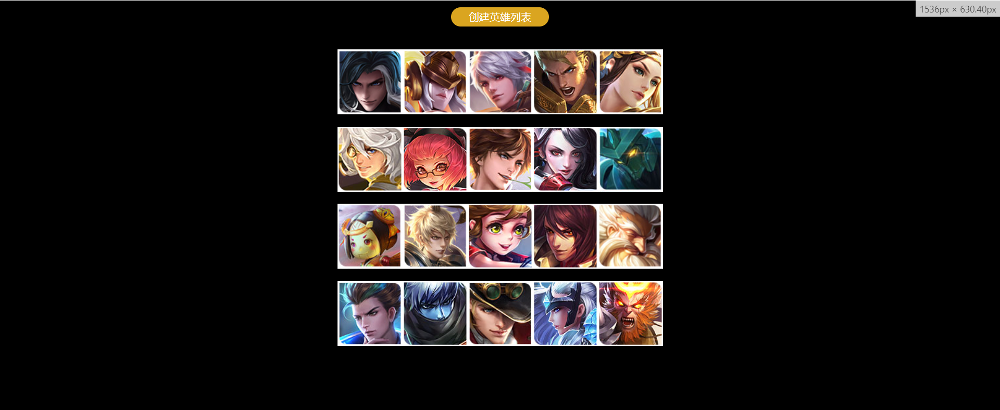

# 每日作业 - 4

## 01. 创建英雄列表

### 思路

1. 获取元素
   1. 获取按钮
   2. 获取ul
2. 给按钮注册点击事件
   1. 循环遍历 `datas` 数组，取出一个对象，就创建一个 `li` 追加到 `ul` 中
   2. 创建一个 `img` 图片元素，追加到 `li` 中
   3. 把对象中的 `imgSrc` 的值取出来赋值给图片的 `src` 
   4. 把对象中的 `name` 的值取出来赋值给图片的 `title` 

### 代码

1. 静态框架

```html
<body>
  <a href="javascript:" id="create">创建英雄列表</a>
  <ul class="list"></ul>
  
  <script>
  	let datas = [
      { name: '司马懿', imgSrc: '01.jpg' },
      { name: '女娲', imgSrc: '02.jpg' },
      { name: '百里守约', imgSrc: '03.jpg' },
      { name: '亚瑟', imgSrc: '04.jpg' },
      { name: '虞姬', imgSrc: '05.jpg' },
      { name: '张良', imgSrc: '06.jpg' },
      { name: '安其拉', imgSrc: '07.jpg' },
      { name: '李白', imgSrc: '08.jpg' },
      { name: '阿珂', imgSrc: '09.jpg' },
      { name: '墨子', imgSrc: '10.jpg' },
      { name: '鲁班', imgSrc: '11.jpg' },
      { name: '嬴政', imgSrc: '12.jpg' },
      { name: '孙膑', imgSrc: '13.jpg' },
      { name: '周瑜', imgSrc: '14.jpg' },
      { name: 'XXX', imgSrc: '15.jpg' },
      { name: 'XXX', imgSrc: '16.jpg' },
      { name: 'XXX', imgSrc: '17.jpg' },
      { name: 'XXX', imgSrc: '18.jpg' },
      { name: 'XXX', imgSrc: '19.jpg' },
      { name: 'XXX', imgSrc: '20.jpg' }
    ];
  </script>
</body>
```

2. 填写逻辑

```html
<script>
	const btn = document.querySelector('#create')
  const ul = document.querySelector('.list')
  
  btn.addEventListener('click', function () {
    let newLi = document.createElement('li')
    ul.appendChild(newLi)
    
    let img = document.createElement('img')
    newLi = appendChild(img)
    // <ul><li></li></ul>
    
    img.src = 'uploads/heros/' + datas[i].imgSrc
    img.title = datas[i].name
  })
</script>
```



## 02. 网页时钟

### 思路

1. 获取元素
2. 获取时分秒
3. 给元素加上动画
4. 调用定时器函数，每秒转一次

### 代码

1. 静态框架

```html
<head>
  <style>
    * {
      box-sizing: border-box;
    }

    .clock {
      width: 600px;
      height: 600px;
      background: url(./images/clock.jpg) no-repeat;
      margin: 50px auto 0;
      position: relative;
    }

    .hh,
    .mm,
    .ss {
      position: absolute;
      width: 100%;
      height: 100%;
      left: 0;
      top: 0;
      background: url(./images/hour.png) no-repeat center;
    }

    .mm {
      background-image: url(./images/minute.png);
      transform: rotate(270deg);
    }

    .ss {
      background-image: url(./images/second.png);
      transform: rotate(30deg);
    }
  </style>
</head>

<body>
  <div class="clock">
    <div class="hh" id="h"></div>
    <div class="mm" id="m"></div>
    <div class="ss" id="s"></div>
  </div>
</body>
```

2. 填写逻辑

```html
<script>
	let hours = document.querySelector('#h')
  let minutes = document.querySelector('#m')
  let seconds = document.querySelector('#s')
  
  function clock() {
    let date = new Date()
    let hh = date.getHours()
    let mm = date.getMinutes()
    let ss = date.getSeconds()
    
    hours.style.transform = `rotate(${hh * 30 + mm / 60 * 30}deg)`
    minutes.style.transform = `rotate(${mm * 6 + ss / 60 * 6}deg)`
    seconds.style.transform = `rotate(${ss * 6}deg)`
  }
  
  clock()
  setInterval(clock, 1000)
</script>
```

