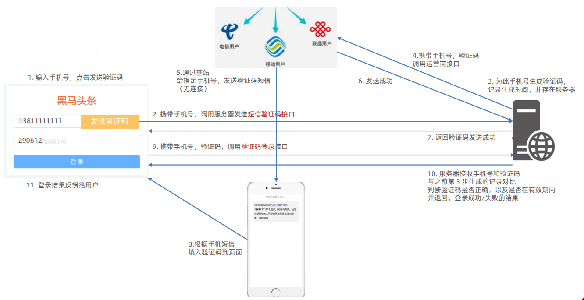
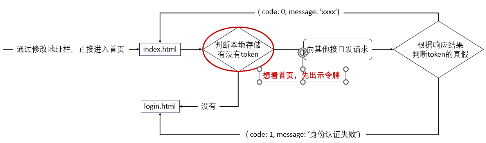

# 黑马头条数据管理平台

## 项目简介

### 项目介绍

对移动网站的数据进行数据管理

### 功能

1. 登录和权限判断
2. 查看文章内容列表（筛选、分页）
3. 编辑文章（数据回显）
4. 删除文章
5. 发布文章（图片上传，富文本编辑器）

### 技术

+ 基于 Bootstrap 搭建网站标签和样式
+ 集成 wangEditor 插件实现富文本编辑器
+ 使用原生 JavaScript 完成增删改查等业务
+ 基于 axios 与黑马头条线上接口交互
+ 使用 axios 拦截器进行权限判断

### 文件结构

开始前，先认识一下文件结构

```txt
├── assets
├── lib
├── page
│   ├── content
│   │   ├── index.css
│   │   ├── index.html
│   │   └── index.js
│   ├── login
│   └── publish
└── utils
```

+ assets：资源文件夹（图片、字体等）
+ lib：资料文件夹（第三方插件，如：form-serialize）
+ page：页面文件夹
+ utils：实用程序文件夹（工具插件）

## 登录页

### 验证码登录

#### 目标

完成验证码登录，后端设置验证码默认为246810

#### 步骤

1. 在 `utils/request.js` 配置 axios 请求 **基地址** （这样做之后，配置 axios 请求时直接写后半段地址就可以了）
2. 收集手机号和验证码数据
3. 基于 axios 调用验证码登录接口
4. 使用 Bootstrap 的 Alert 警告框反馈结果给用户

#### 代码实现

1. 配置 axios 公共请求

```js title="utils/request.js"
axios.defaults.baseURL = 'http://geek.itheima.net'
```

2. 完成验证码登录逻辑

```js title="page/login/index.js"
const loginBtn = document.querySelector('.btn')
loginBtn.addEventListener('click', () => {
  const form = document.querySelector('.login-form')
  const data = serialize(form, { hash: true, empty: true })

  axios({
    url: '/v1_0/authorizations',
    method: 'post',
    data
  }).then(result => {
    myAlert(true, '登陆成功')
  }).catch(error => {
    myAlert(false, error.response.data.message)
  })
})
```

### 知识补充 - 验证码登录流程

一图读懂验证码登录流程



### 知识补充 - token

概念：访问权限的令牌，本质上是一串字符串

作用：主要进行判断是否有登录状态，控制访问权限



::: tip

前端只能判断 token 有无

后端才能判断 token 的有效性

:::

### token 的使用

#### 目标

只有登录状态，才可以访问内容页面

#### 步骤

1. 在 utils / auth.js 中判断无 token 令牌字符串，则强制跳转到登录页（手动修改地址栏测试）
2. 在登录成功后，保存 token 令牌字符串到本地，再跳转到首页（手动修改地址栏测试）

#### 代码实现

```js title="utils/auth.js"
const token = localStorage.getItem('token')
if(!token) {
  location.href = '../login/index.html'
}
```

```js title="page/login/index.js"
loginBtn.addEventListener('click', () => {
  ...
  axios({
    ...
  }).then(result => {
    ...
    // 登陆成功
    localStorage.setItem('token', result.data.data.token)
  	setTimeout(() => {
      location.href = '../content/index.html'
    }, 1500)
  })
})
```

## 显示用户名

### 设置个人信息

#### 需求

设置用户昵称

#### 步骤

1. 在 utils/request.js 设置请求拦截器，统一携带 token
2. 请求个人信息并设置到页面

#### 代码实现

```js title="utils/request.js"
// 请求拦截器
axios.interceptors.request.use(function (config) {
  const token = localStorage.getItem('token')
  token && (config.headers.Authorization = `Bearer ${token}`)
  return config
}, function (error) {
  return Promise.reject(error)
})
```

```js title="utils/auth.js"
axios({
  url: '/v1_0/user/profile'
}).then(result => {
  const username = result.data.data.name
  document.querySelector('.nick-name').innerHTML = username
})
```

### 优化 axios 拦截器

#### 需求

响应回到 then/catch 之前，触发的拦截函数，对响应结果进行统一处理

#### 代码实现

```js title="utils/request.js"
// 添加响应拦截器
axios.interceptors.response.use(function (response) {
  return response
}， function (error) {
  if (error?.response?.status === 401) {
    alert('身份验证失败，请重新登录')
    localStorage.clear()
  	location.href = '../login/index.html'
	}
	return Promise.reject(error)
})
```

### 优化 axios 响应结果

#### 需求

axios 直接接收服务器返回的响应结果

#### 代码实现

```js title="utils/request.js"
axios.interceptors.response.use(function (response) {
  const result = response.data
  return result
}, function (error) {...})
```

这样写了以后，后面就不再需要 `result.data.data.name` 这样取值了，而是更改为

```js title="utils/auth.js"
axios({
  ...
}).then(result => {
  const username = result.data.name
})
```

```js title="page/login/index.js"
loginBtn.addEventListener('click', () => {
  ...
  localStorage.setItem('token', result.data.token)
})
```

## 发布文章

### 富文本编辑器

富文本：带样式，多格式的文本，在前端一般使用标签配合内联样式实现

富文本编辑器：用于编写富文本内容的容器

#### 使用

使用 wangEditor 插件

#### 步骤

1. 引入CSS定义样式
2. 定义HTML结构
3. 引入JS创建编辑器
4. 监听内容改变，保存在隐藏文本域（便于后期收集）

#### 代码实现

1. 引入CSS样式

```css
/* 富文本编辑器 */
#editor—wrapper {
  border: 1px solid #ccc;
  z-index: 100; /* 按需定义 */
}
#toolbar-container { border-bottom: 1px solid #ccc; }
#editor-container { height: 500px; }
```

2. 定义HTML结构

```html
<div>
  <label for="">内容：</label>
  <!-- 富文本编辑器位置 -->
  <div id="editor—wrapper">
    <div id="toolbar-container"><!-- 工具栏 --></div>
    <div id="editor-container"><!-- 编辑器 --></div>
  </div>
  <!-- 记录富文本内容-用于表单收集 -->
  <textarea name="content" class="publish-content" hidden></textarea>
</div>
```

3. 引入JS编辑器
4. 监听内容改变，保存在隐藏文本域（便于后期收集）

```js
// 解构赋值
const { createEditor, createToolbar } = window.wangEditor

// 编辑器配置对象
const editorConfig = {
  // 占位提示文字
  placeholder: '发布文章内容...',
  // 编辑器变化时回调函数
  onChange(editor) {
    // 获取富文本的内容
    const html = editor.getHtml()
    console.log('editor content', html)
    // 也可以同步到 <textarea>
    // 为了后续快速收集整个表单内容做铺垫
    document.querySelector('.publish-content').value = html
  }
}

// 创建编辑器
const editor = createEditor({
  // 创建位置
  selector: '#editor-container',
  // 默认内容
  html: '<p><br></p>',
  // 配置项
  config: editorConfig,
  // 配置集成模式(default 全部) (simple 简介)
  mode: 'default', // or 'simple'
})

// 工具栏配置对象
const toolbarConfig = {}

// 创建工具栏
const toolbar = createToolbar({
  // 为指定编辑器创建工具栏
  editor,
  // 工具栏创建的位置
  selector: '#toolbar-container',
  // 工具栏配置对象
  config: toolbarConfig,
  // 配置集成模式
  mode: 'default', // or 'simple'
})
```

### 频道列表

#### 目标

展示频道列表，供用户选择

#### 步骤

1. 获取频道列表数据
2. 展示到下拉菜单中

#### 代码实现

```js
async function setChannelList() {
  const res = await axios({
    url: '/v1_0/channels'
  })
  const htmlStr = `<option value="" selected="">请选择文章频道</option>` + res.data.channels.map(item => `
    <option value="${item.id}">${item.name}</option>
  `).join('')
  document.querySelector('.form-select').innerHTML = htmlStr
}
setChannelList()
```

### 封面设置

#### 目标

文章封面的设置

#### 步骤

1. 准备标签结构和样式
2. 选择文件并保存在 FormData
3. 单独上传图片并得到图片 URL 地址
4. 回显并切换 img 标签展示（隐藏+号上传标签）

::: warning 注意

图片地址临时存储在 img 标签上，并未和文章关联保存

:::

#### 代码实现

1. 准备标签结构和样式

```css
/* 封面 */
.cover .place{
  width: 200px;
  height: 200px;
  text-align: center;
  font-size: 40px;
  line-height: 200px;
  border: 1px solid #ddd;
  color: #aaa;
  cursor: pointer;
  display: inline-block;
  vertical-align: top;
}
.cover img{
  width: 200px;
  height: 200px;
}
.cover .rounded{
  display: none;
}
.cover .show{
  display: inline-block;
}
.cover .hide{
  display: none;
}
```

2. 选择文件并保存 FormData
3. 单独上传图片并得到图片 URL 地址
4. 回显并切换 img 标签展示（隐藏+号上传标签）

```js
const rounded = document.querySelector('.rounded')
const imgFile = document.querySelector('.img-file')
const place = document.querySelector('.place')

imgFile.addEventListener('change', async e => {
  const file = e.target.files[0]
  const fd = new FormData()
  fd.append('image', file)
  const res = await axios({
    url: '/v1_0/upload',
    method: 'post',
    data: fd
  })
  const imgUrl = res.data.url
  rounded.src = imgUrl
  rounded.classList.add('show')
  place.classList.add('hide')
})
rounded.addEventListener('click', () => {
  imgFile.click()
})
```

### 收集并保存

#### 目标

收集文章内容，并提交保存

#### 步骤

1. 基于 form-serialize 插件收集表单数据对象
2. 基于 axios 提交到服务器保存
3. 调用 Alert 警告框反馈结果给用户
4. 重置表单并跳转到列表页

#### 代码实现

```js
document.querySelector('.send').addEventListener('click', async e => {
  const form = document.querySelector('.art-form')
  const data = serialize(form, { hash: true, empty: true })
  delete data.id
  data.cover = {
    type: 1, // 封面类型
    images: [rounded.src] // 封面图片 URL 网址
  }
  try {
    const res = await axios({
      url: '/v1_0/mp/articles',
      method: 'post',
      data
    })
    myAlert(true, '发布成功')
    // 发布完成后清空
    form.reset()
    rounded.src = ''
    rounded.classList.remove('show')
    place.classList.remove('hide')
    editor.setHtml('')

    setTimeout(() => {
      location.href = '../content/index.html'
    }, 1500);
  } catch (error) {
    myAlert(false, error.response.data.message)
  }
})
```

## 内容管理

### 文章列表展示

#### 目标

获取文章列表并展示

#### 步骤

1. 准备查询参数对象
2. 获取文章列表数据
3. 展示到指定的标签结构中

#### 代码实现

```js title="page/content/index.js"
const queryObj = {
  status: '', // 文章状态(1-待审核, 2-审核通过) 空字符串 - 全部
  channel_id: '', // 文章频道 id, 空字符串 - 全部
  page: 1, // 当前页码
  per_page: 2 // 当前页面条数
}

async function setArtileList() {
  const res = await axios({
    url: '/v1_0/mp/articles',
    params: queryObj
  })
  const htmlStr = res.data.results.map(item => `
    <tr>
      <td>
        
      </td>
      <td>${item.title}</td>
      <td>
        ${item.status === 1 ? `<span class="badge text-bg-primary">待审核</span>` : `<span class="badge text-bg-success">审核通过</span>`}
      </td>
      <td>
        <span>${item.pubdate}</span>
      </td>
      <td>
        <span>${item.read_count}</span>
      </td>
      <td>
        <span>${item.comment_count}</span>
      </td>
      <td>
        <span>${item.like_count}</span>
      </td>
      <td>
        <i class="bi bi-pencil-square edit"></i>
        <i class="bi bi-trash3 del"></i>
      </td>
    </tr>
  `).join('')
  console.log(htmlStr);
  document.querySelector('.art-list').innerHTML = htmlStr
}
setArtileList()
```

### 筛选功能

#### 目标

根据筛选条件，获取匹配数据展示

#### 步骤

1. 设置频道列表数据
2. 监听筛选条件改变，保存查询信息到查询参数对象
3. 点击筛选时，传递查询参数对象到服务器
4. 获取匹配数据，覆盖到页面展示

#### 代码实现

```js title="page/content/index.js"
const formSelect = document.querySelector('.form-select')
async function setChannelList() {
  const res = await axios({
    url: '/v1_0/channels'
  })
  const htmlStr = `<option value="" selected="">请选择文章频道</option>` + res.data.channels.map(item => `
    <option value="${item.id}">${item.name}</option>
  `).join('')
  formSelect.innerHTML = htmlStr
}
setChannelList()
// 筛选状态
document.querySelectorAll('.form-check-input').forEach(radio => {
  radio.addEventListener('change', e => {
    queryObj.status = e.target.value
  })
})

formSelect.addEventListener('change', e => {
  queryObj.channel_id = e.target.value
})

const selBtn = document.querySelector('.sel-btn')
selBtn.addEventListener('click', () => {
  setArtileList()
})
```

### 分页功能

#### 目标

完成文章列表，分页管理功能

#### 步骤

1. 保存并设置文章总条数
2. 点击下一页，做临界值判断，并切换页码参数请求最新数据
3. 点击上一页，做临界值判断，并切换页码参数请求最新数据

#### 代码实现

```JS title="page/content/index.js"
let totalCount = 0

async function setArtileList() {
  ...
  totalCount = res.data.total_count
  document.querySelector('.total-count').innerHTML = `共 ${totalCount} 页`
}

const pageNow = document.querySelector('.page-now')
document.querySelector('.next').addEventListener('click', e => {
  if (queryObj.page < Math.ceil(totalCount / queryObj.per_page)) {
    queryObj.page++
    pageNow.innerHTML = `第${queryObj.page}页`
    setArtileList()
  }
})
document.querySelector('.last').addEventListener('click', e => {
  if (queryObj.page > 1) {
    queryObj.page--
    pageNow.innerHTML = `第${queryObj.page}页`
    setArtileList()
  }
})
```

### 删除功能

#### 目标

完成删除文章功能

#### 步骤

1. 关联文章 id 到删除图表
2. 点击删除时，获取文章 id
3. 调用删除接口，传递文章 id 到服务器
4. 重新获取文章列表，并覆盖展示

#### 代码实现

```js title="page/content/index.js"
async function setArtileList() {
  ...
  const htmlStr = res.data.results.map(item => {`
		<tr>
			...
			<td data-id="${item.id}">
        <i class="bi bi-pencil-square edit"></i>
        <i class="bi bi-trash3 del"></i>
      </td>
		</tr>
	`})
}

document.querySelector('.art-list').addEventListener('click', async e => {
  if (e.target.classList.contains('del')) {
    const delId = e.target.parentNode.dataset.id
    const res = await axios({
      url: `/v1_0/mp/articles/${delId}`,
      method: 'delete'
    })
    setArtileList()
  }
})
```

### 删除最后一条

#### 目标

在删除最后一页，最后一条时有 Bug

#### 解决

1. 删除成功时，判断 DOM 元素只剩一条，让当前页码 page--
2. 注意，当前页码为 1 时不能继续向前翻页
3. 重新设置页码数，获取最新列表展示

#### 代码实现

```js title="page/content/index.js"
const artList = document.querySelector('.art-list')
artList.addEventListener('click', async e => {
  ...
  const children = artList.children
  if (children.length === 1 && queryObj.page !== 1) {
    queryObj.page--
    pageNow.innerHTML = `第 ${queryObj.page} 页`
  }
})
```

### 编辑文章 - 回显

#### 目标

编辑文章时，回显数据到表单

#### 步骤

1. 页面跳转传参(URL 查询参数方式)
2. 发布文章页面接收参数判断(共用同一套表单)
3. 修改标题和按钮文字
4. 获取文章详情数据并回显表单

#### 代码实现

1. 页面跳转传参

```js title="page/content/index.js"
artList.addEventListener('click', e => {
  if (e.target.classList.contains('edit')) {
    const artId = e.target.parentNode.dataset.id
    location.href = `../publish/index.html?id=${artId}`
  }
})
```

2. 发布文章页面接收参数判断(共用同一套表单)
3. 修改标题和按钮文字
4. 获取文章详情数据并回显表单

```js title="page/publish/index.js"
; (function () {
    const paramsStr = location.search
    const params = new URLSearchParams(paramsStr)
    params.forEach(async (value, key) => {
      // 当前有要编辑的文章 id 被传入对象
      if (key === 'id') {
        document.querySelector('.title span').innerHTML = '修改文章'
        document.querySelector('.send').innerHTML = '修改'

        const res = await axios({
          url: `/v1_0/mp/articles/${value}`
        })
        const dataObj = {
          channel_id: res.data.channel_id,
          title: res.data.title,
          rounded: res.data.cover.images[0],
          content: res.data.content,
          id: res.data.id
        }
        Object.keys(dataObj).forEach(key => {
          if (key === 'rounded') {
            // 封面设置 有封面的情况下
            if (dataObj[key]) {
              rounded.src = dataObj[key]
              rounded.classList.add('show')
              place.classList.add('hide')
            }
          } else if (key === 'content') {
            // 富文本内容
            editor.setHtml(dataObj[key])
          } else {
            // 用数据对象属性名，作为标签 name 属性选择器值来找到匹配的标签
            document.querySelector(`[name=${key}]`).value = dataObj[key]
          }
        })
      }
    });
  })()
```

### 编辑文章 - 保存

#### 目标

确认修改，保存文章到服务器

#### 步骤

1. 判断按钮文字，区分业务（因为共用一套表单）
2. 调用编辑文章接口，保存信息到服务器
3. 基于 Alert 反馈结果消息给用户

#### 代码实现

```js title="page/publish/index.js"
const send = document.querySelector('.send')
send.addEventListener('click', async e => {
  if (e.target.innerHTML !== '发布') return
  ...
})

send.addEventListener('click', async e => {
  if (e.target.innerHTML !== '修改') return
  const form = document.querySelector('.art-form')
  const data = serialize(form, { hash: true, empty: true })

  try {
    const res = await axios({
      url: `/v1_0/mp/articles/${data.id}`,
      method: 'put',
      data: {
        ...data,
        cover: {
          type: rounded.src ? 1 : 0,
          images: [rounded.src]
        }
      }
    })
    myAlert(true, '修改成功')
  } catch (error) {
    myAlert(false, error.response.data.message)
  }
})
```

## 退出登录

#### 目标

完成退出登录效果

#### 步骤

1. 绑定点击事件
2. 清空本地缓存，跳转到登录页面

#### 代码实现

```js title="utils/auth.js"
document.querySelector('.quit').addEventListener('click', e => {
  localStorage.clear()
  location.href = '../login/index.html'
})
```

