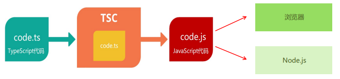

# TypeScript

## 什么是TypeScript

TypeScript是JavaScript的超集，也就是JS有的TS都有，TS有的JS未必有。

TypeScript有明确的类型，JavaScript没有明确的类型。

## 安装编译TS的工具包



```bash
# 安装命令
npm i -g typescript

# 验证安装是否成功
tsc -v

# 编译并运行TS代码
tsc hello.ts
node hello.js
```

但其实可以简化

```bash
# 简化运行TS
npm i -g ts-node

# 使用方法
ts-node hello.ts
```

## 常用类型

### 类型注解

```typescript
let age: number = 18

age = 20

// 不能将类型“string”分配给类型“number”
// age = '30'
```

其中，`: number` 就是类型注解。

### 常用基础类型概述

1. JS已有类型

+ 原始类型：number/string/boolean/null/undefined/symbol
+ 对象类型：object

2. TS新增类型

+ 联合类型、自定义类型(类型别名)、接口、元组、字面量类型、枚举、void、any等。

### 原始类型

```typescript
let age: number = 18

let myName: string = '张三'

let isloading: boolean = false

let a: null = null

let b: undefined = undefined

let s: symbol = Symbol()
```

### 数组类型

数组有两种写法

```typescript
// 推荐
// 数值类型
let  numbers: number[] = [1, 3, 5]
// 字符串类型
let string: string[] = ['a', 'b', 'c']
// boolean类型
let b: boolean[] = [true, false]

// 不推荐
let numbers1: Array<string> = ['a', 'b', 'c']
```

### 联合类型

```typescript
// 首先是数组，然后，这个数组中能够出现 number 或 string 类型
let arr: (number | string)[] = [1, 'a', 2, 'b']
let arr1: (number | string | boolean)[] = [1, 2, 'a', 'b', true]

// arr2 和 arr3 既可以是 number 类型，又可以是 string[]
let arr2: number | string[] = ['a', 'b']
let arr3: number | string[] = 1
```

### 类型别名

给类型起名字。

同一类型会被多次使用的时候就需要用到类型别名。

```typescript
type CustomArray = (number | string)[]
let arr1: CustomArray = [1, 'a', 3, 'b']
let arr2: CustomArray = ['x', 'y', 'z', 6, 7]
```

### 函数类型

1. 单独指定参数、返回值的类型：

```typescript
function add(num1: number, num2: number): number {
  return num1 + num2
}

const sub = (num1: number, num2: number): number => {
  return num1 - num2
}

console.log(add(1, 2))
console.log(sub(3, 2))
```

2. 同时指定参数和返回值的类型

```typescript
type AddFn = (num1: number, num2: number) => number

const add: AddFn = (num1, num2) => {
  return num1 + num2
}
```

#### void类型

+ JS中函数没有返回值，返回值默认是undefined
+ TS中函数没有返回值，返回值默认是void类型而不是undefined

```typescript
// 不写void也没关系，毕竟默认是void
function greet(name: string): void{
  console.log('Heelo', name)
}

const greet1 = (name: sting): void => {
  console.log('heelo', name)
}

greet('jack')
greet1('jack')
```

所以，如果指定函数的返回值的undefined，则必须要指定return

```typescript
function testRes(): undefined {
  console.log('undefined')
  return
}
```

#### 函数可选参数

参数可传可不传的情况就可以用到**可选参数**了。

```typescript
function muSlice(start?: number, end?: number): void {
  console.log('起始索引:', start, '结束索引', end)
}

mySlice() // 起始索引: undefined 结束索引: undefined
muSlice(1) // 起始索引: 1 结束索引: undefined
muSlice(1,2) // 起始索引: 1 结束索引: 2
```

+ 可传可不传的参数名称后面添加 `?` (问号)

#### 对象类型

```typescript
// 在一行代码中指定对象的多个属性类型时，使用“;”(分号)来分隔
let person: { name: string; sayHi(): void } = {
  name: 'jack',
  sayHi() {}
}

// 可以通过换行来分隔多个属性类型，就不需要“;”了
let person: {
  name: string
  age: number
  // sayHi(): void
  sayHi: () => void
  greet(name: string): void
} = {
  name: 'jack',
  age: 19,
  sayHi() { },
  greet(name) { }
}
```

如果太复杂，可以使用类型别名

```typescript
// 创建类型别名
type Person = {
  name: string
  age: number
  sayHi: () => void
  greet(name: string): void
}
  
// 使用类型别名作为对象的类型:
let person: Person = {
  name: 'jack',
  age: 19,
  sayHi() { },
  greet(name) { }
}
```

####  对象可选

对象的属性或方法也是可选的，就可以用到可选属性了。

```typescript
type Config = {
  url: string
  method?: string
}

function myAxios(config: Config) {
  console.log(config)
}

myAxios({
  url: ''
})
```

#### 接口

如果一个对象类型被多次使用，可以使用**接口(interface)**来描述对象的类型，达到**复用**的目的。

```typescript
interface IPerson {
  name: string
  age: number
  sayHi(): void
}

let person: IPerson = {
  name: 'jack',
  age: 19,
  sayHi() {}
}

let person1: IPerson = {
  name: 'zs'
  age: 20
  sayHi() {}
}
```

##### interface(接口) vs type(类型别名)

+ 相同点：都可以给对象指定类型
+ 不同点：
  + 接口：只能为对象指定类型
  + 类型别名：不仅可以为对象指定类型，实际上还可以为任意类型指定别名
+ 推荐：**能使用type就用type**

```typescript
interface IPerson {
  name: string
  age: number
  sayHi(): void
}

//为对象类型创建类型别名
type IPerson = {
  name: string
  age: number
  sayHi():void
}
  
// 为联合类型创建类型别名
type NumStr = number | string
```

##### 接口继承

接口可以通过**继承**来进行复用**公共属性或方法**

```typescript
interface Point2D {
  x: number
  y: number
}

// 继承后，point3D 同时有x、y、z三个属性
interface point3D extends Point2D {
  z: number
}

let p3: point3D = {
  x: 1,
  y: 0,
  z: 3
}
```

#### 元组

```typescript
let position: number[] = [39, 114, 1, 3, 4]

// 元组
let position1: [number, number] = [39, 113]
```

如果使用number[]，那么这个数组可以出现任意多个数字

使用元组就可以确切的知道包含了多少个元素。

#### 类型推论

在以下两种场景可以省略不写类型注解：

1. 声明变量并初始化
2. 决定函数返回值时

```typescript
// 变量 age 的类型被自动推断为: number
let age = 18

// 函数返回值的类型被自动推断为: number
function add(num1: number, num2: number) {
  return num1 + num2
}
```

#### 类型断言

```html
<body>
  <a href="http://www.baidu.com" id="link">百度</a>
</body>
```

```typescript
const aLink = document.getElementById('link') as HTMLAnchorElement

// 还有一种语法，使用<>语法，不过少用
const aLink = <HTMLAnchorElement>document.getElementById('link')

aLink.href
```

1. 使用 `as` 关键字实现类型断言

#### 字面量类型

+ 使用模式：**字面量类型配合联合类型一起使用**
+ 使用场景：**用来表示一组明确的可选值列表**

```typescript
type Direction = 'up' | 'down' | 'left' | 'right'

function changeDirection(direction: Direction) {
  console.log(direction)
}

// 调用函数的时候会有类型提示：
changeDirection('up')
```

使用字面量类型可以更加精确、严谨

#### 枚举

与**字面量类型+联合类型组合**类似，也可以表示一组明确的可选值

```typescript
enum Direction {
  Up,
  Down,
  Left,
  Right
}

function changeDirection(direction: Direction) {}

changeDirection(Direction.Left)
```

##### 数字枚举

```typescript
// 枚举成员是有值的，默认从0开始自增
// down -> 11、left -> 12、right -> 13
enum Direction {
  up = 10,
  down,
  left,
  right
}

// 当然自定义值也是可以的
enum Direction {
  Up = 2,
  Down = 4,
  Left = 8,
  Right = 16
}

function changeDirection(direction: Direction) {}
changeDirection(Direction.Up)
```

##### 字符串枚举

```typescript
enum Direction {
  Up = 'UP',
  Down = 'DOWN',
  Left = 'LEFT',
  Right = 'RIGHT'
}
```

##### 枚举实现原理

```typescript
enum Direction {
  Up = 'UP',
  Down = 'DOWN',
  Left = 'LEFT',
  Right = 'RIGHT'
}

// 会被编译为以下 JS 代码
var Direction;

(function (Direction) {
  Direction['UP'] = 'UP'
  Direction['Down'] = 'DOWN'
  Direction['Left'] = 'LEFT'
  Direction['Right'] = 'RIGHT'
})(Direction || Direction = {})
```

+ 还是推荐使用**字面量类型+联合类型**组合的方式，因为枚举会先编译为JS代码，而其他的类型在编译为JS代码时会自动移除类型

#### any类型

+ 不推荐使用any，这会让TypeScript变的毫无意义

```typescript
let obj: any = { x: 0 }

obj.bar = 100
obj()
const n: number = obj
```

#### typeof

可以在类型上下文中引用变量或属性的类型(类型查询)

+ 使用场景：根据已有变量的值，获取该值的类型，来简化类型书写

```typescript
let p = { x: 1, y: 2 }
function formatPoint(point: typeof p) {
  console.log(point)
}
formatPoint({ x: 1, y: 100 }) // { x: 1, y: 100 }
```

## 高级类型

### class类

```typescript
class Person {
  age: number
  gender = '男' // gender: string = '男'
}

const p = new Person()

p.age
p.gender
```

#### 构造函数

```typescript
class Person {
  age: number
  gender: string
  
  constructor(age: number, gender: string) {
    this.age = age
    this.gender = gender
    // this.age 对应 class Person 的 age: number
    // age 对应的是 constructor() 里面的 age: number
  }
}

const p = new Person(12, 'zs')
console.log(p.age, p.gender) // 12 zs
```

1. 成员初始化(age: number)后，才可以通过 this.age 来访问实例成员
2. 需要为构造函数指定类型注解，否则会被隐式推断为 any；构造函数不需要返回值类型

`constructor` -> 构造函数

#### 实例方法

```typescript
class Point {
  x = 1
  y = 2
  // scale => 方法
  scale(n: number): void {
    this.x *= n
    this.y *= n
    // this.x 与 class Point 中 x = 1对应
    // n 与 n: number 对应
  }
}

const p = new Point()

p.scale(10)

console.log(p.x, p.y) // 10 20
```

#### 继承

类继承的两种方式： 

1. extends(继承父类)
2. implements(实现接口)

##### extends(继承父类)

```typescript
class Animal {
  move() {
    console.log('Moving along!')
  }
}

class Dog extends Animal {
  name = 'zs'
  bark() {
    console.log('wang')
  }
}

const dog = new Dog()

dog.move()
dog.bark()
console.log(dog.name)
// Moving along!
// wang
// zs
```

1. 通过 `extends` 关键字实现继承
2. 子类Dog继承父类Animal，则Dog的实例对象dog就同时具有了父类Animal和子类Dog的所有属性和方法

##### implements(实现接口)

```typescript
interface Singable {
  sing(): void
  name: string
}

class Person implements Singable {
  name = 'jack'
  sing() {
    console.log('zs')
  }
}

const p = new Person()
p.sing()
console.log(p.name)
// zs
// jack
```

1. 通过implements关键字让class实现接口
2. Person类实现接口Singable意味着，Person类中必须提供Singable接口中指定的所有方法和属性

#### 可见性修饰符

1. public(公有的)

```typescript
// 父类
class Animal {
  public move() {
    console.log('moving along')
  }
}

const a = new Animal()
a.move()

// 子类
class Dog extends Animal {
  bark() {
    console.log('wang')
  }
}

const d = new Dog()
d.move()
```

+ 公有成员可以被任何地方访问，且默认是可见，可以直接省略
+ 在类属性或方法前面添加public关键字

2. protected(受保护的)

```typescript
class Animal {
  protected move() {
    console.log('Moving along')
  }
  run() {
    console.log('run')
    this.move
  }
}
const a = new Animal()

class dog extends Animal {
  bark() {
    console.log('wang')
    this.move
  }
}

const d = new dog()
```

+ 在子类的方法内部可以通过this来访问父类中受保护的成员，但是对实例不可见
+ 在类属性或方法前添加 protected 关键字，来修饰该属性或方法是受保护的

3. private(私有的)

```typescript
class Animal {
  private __run__() {
    console.log('Animal 内部辅助函数')
  }
  protected move() {
    console.log('walk')
  }
  run() {
    this.move()
    this.__run__()
    console.log('run')
  }
}

const a = new Animal()

class dog extends Animal {
  bark() {
    console.log('wang')
  }
}

const d = new dog()
```

+ 在类属性或方法前面添加private关键字，来修饰该属性或方法是私有的
+ 私有的属性或方法只在当前类中可见，对子类和实例对象也都是不可见的

#### readonly(只读修饰符)

readonly：表示只读，用来防止在构造函数之外对属性进行赋值

把值写死，不让外部改它的值

常量也不能重新赋值

```typescript
class Person {
  readonlu age: number = 18
	constructor(age: number) {
    this.age = age
  }
}

interface IPerson {
  //   name: string
  readonly name: string
}
let obj: IPerson = {
  name: 'jack'
}
// obj.name = 'rose'

let obj1: { readonly name: string } = {
  name: 'jack'
}
// obj.name = 'rose'
```

### 类型兼容性

如果两个对象结构相同，则认为它们属于同一类型

```typescript
class Point {
  x: number
  y: number
}
class Point2D {
  x: number
  y: number
}
class Point3D {
  x: number
  y: number
  z: number
}

// 尽管两个是名称不同的类，但是里面的结构是相同的，所以没有类型错误
const p: Point = new Point2D()
// 成员多的可以赋值给成员少的
const p1: Point = new Point3D()
```

#### 接口兼容性

接口之间的兼容性，类似于class。并且class和interface之间也兼容。

```typescript
interface Point {
  x: number
  y: number
}
interface Point2D {
  x: number
  y: number
}
interface Point3D {
  x: number
  y: number
  z: number
}
class Point4D {
  x: number
  y: number
  z: number
}

// 需要赋值才能使用变量
let p1: Point = { x: 1, y: 2 }
let p2: Point2D = { x: 3, y: 4 }
let p3: Point3D = { x: 5, y: 6, z: 7 }

p2 = p3
p1 = p2
// 类不需要赋值就可以使用
p2 = new Point4D()
```

#### 函数兼容性

1. 参数个数

```typescript
// 参数少的可以赋值给参数多的
type F1 = (a: number) => void
type F2 = (a: number, b: number) => void
let f1: F1
let f2: F2 = f1
```

2. 参数类型

```typescript
// 相同位置的参数类型要相同或兼容
type F1 = (a: number) => void
type F2 = (a: number) => void

let f1: F1
let f2: F2

f1 = f2
f2 = f1

// 对象类型
interface Point2D {
  x: number
  y: number
}
interface Point3D {
  x: number
  y: number
  z: number
}

type F2 = (p: Point2D) => void
type F3 = (p: Point3D) => void

let f2: F2
let f3: F3

f3 = f2
```

3. 返回值类型

```typescript
// 只需要关注返回值类型本身即可

// 原始类型,两个类型要相同
type F5 = () => string
type F6 = () => string

let f5: F5
let f6: F6

f6 = f5
f5 = f6

// 对象类型，成员多的可以赋值给成员少的
type F7 = () => { name: string }
type F8 = () => { name: string; age: number}

let f7: F7
let f8: F8
```

### 交叉类型

组合多个类型为一个类型(常用于对象类型)

```typescript
interface Person {
  name: string
  say(): number
}
interface Contact {
  phone: string
}
type PersonDetail = Person & Contact

// PersonDetail 同时具备了Person和Contact的所有属性类型
let obj: PersonDetail = {
  name: 'jack',
  phone: '123...',
  say() {
    return 11
  }
}
```

交叉类型(&)和接口继承(extends)的对比

+ 相同点：都可以实现对象类型的组合
+ 不同点：交叉类型类型不一致也没关系；接口继承属性类型要一致

```typescript
// 接口继承
interface A {
  fn: (value: number) => string
}
interface B extends A {
  fn: (value: string) => string
}

// 交叉类型
interface A {
  fn: (value: number) => string
}
interface B {
  fn: (value: string) => string
}
type C = A & B
// 交叉类型可以简单理解为：
fn: (value: string | number) => string
```

### 泛型和keyof

泛型可以保证类型安全的同时，可以让函数等与多种不同的类型一起工作，灵活可复用

即，先在函数后面占个坑，等用户调用函数的时候再手动给类型

```typescript
// Type相当于一个占位符
function id<Type>(value: Type): Type {
  return value
}

const num = id<number>(10)
const str = id<string>('a')
```

但是，上面那个太麻烦了，因此可以简化调用泛型函数

```typescript
let num = id(10)
let str = id('a')
```

#### 泛型约束

因为Type可以代表多个类型，会导致无法访问任何属性

1. 指定更加具体的类型

```typescript
// 将类型修改为Type[]，这样只要是数组就一定存在length属性，这样就可以访问了
function id1<Type>(value: Type[]): Type[] {
  console.log(value.length)
  return value
}

let num2 = id(123456)
```

2. 添加约束

```typescript
// 创建约束接口
interface ILength {
  length: number
}

// 通过extends关键字使用接口，为泛型添加约束
function id2<Type extends ILength>(value: Type): Type {
  console.log(value.length)
  return value
}

id2(['a', 'c']) // 2
id2('abc') // 3
id2({ length: 10, name: 'jack' }) // 10
```

3. 多个类型变量之间的约束

```typescript
function getProp<Type, Key extends keyof Type>(obj: Type, key: Key) {
  return obj[key]
}

getProp({ name: 'jack', age: 18 }, 'age')
getProp({ name: 'jack', age: 18 }, 'name')
```

#### 泛型接口

```typescript
interface IdFunc<Type> {
  id: (value: Type) => Type
  ids: () => Type[]
}

let obj: IdFunc<number> = {
  id(value) {
    return value
  },
  ids() {
    return [1, 3, 5]
  }
}
```

实际上，JS中的数组在TS中就是一个泛型接口

```typescript
const strs = ['a', 'b', 'c']
strs.forEach(item => {})

const nums = [1, 3, 5]
nums.forEach(item => {})
```

#### 泛型类

```typescript
class GenericNumber<NumType> {
  defaultValue: NumType
  add: (x: NumType, y: NumType) => NumType
}

// 这种情况下，推荐明确指定 <类型>。因为 TS 无法推导出类型
const myNum = new GenericNumber()
myNum.defaultValue = 10
```

#### 泛型工具类型

> 1. `Partial<Type>`
> 2. `Readonly<Type>`
> 3. `Pick<Type, Keys>`
> 4. `Record<Keys, Type>`

##### `Partial<Type>`

属性转可选

将Type的所有属性设置为可选

```typescript
interface Props {
  id: string
  children: number[]
}

// 构造出来的新类型 PartialProps 结构和 Props 相同，但是所有属性都变为可选
type PartialProps = Partial<Props>
```

##### `Readonly<Type>`

属性转只读

将Type的所有属性都设置为只读

```typescript
interface Props {
  id: string
  children: number[]
}
type ReadonlyProps = Readonly<Props>

let p1: ReadonlyProps = {
  id: '1',
  children: [1, 3]
}

p1.id = '2' // 报错，无法为"id"赋值，因为它是只读属性。
```

##### Pick<Type, Keys>

选取属性

从Type中**选择一组**属性来构造新类型

```typescript
interface Props {
  id: string
  title: string
  children: number[]
}

// Pick<表示选择谁的属性, 表示选择哪几个属性>
typePickProps = Pick<Props, 'id' | 'title'>
```

##### Record<Keys, Type>

构造一个对象类型，属性键为Keys，属性类型为Type

```typescript
type RecordObj = Record<'a' | 'b' | 'c', string[]>

// Record<表示对象有哪些属性, 表示对象属性的类型>
let obj: RecordObj = {
	a: ['1'],
  b: ['2'],
  c: ['3']
}
```

构建的新对象类型RecordObj表示：这个对象有三个属性分别为a/b/c，属性值的类型都是string[]

### 索引签名类型

当无法确定对象中有哪些属性，就可以用索引签名类型了

```typescript
interface AnyObject {
  [key: string]: number
}

let obj: AnyObject = {
  a: 1,
  abc: 124,
  abcde: 12345
}
```

+ 使用[key: string] 来约束该接口中允许出现的属性名称。
+ Key只是一个占位符，可以换成任意合法的变量名称

**数组的键（索引）是数值类型**

```typescript
const arr = [1, 3, 5]
arr.forEach

interface MyArray<Type> {
  [index: number]: Type
}
let arr1: MyArray<number> = [1, 3, 5]
arr1[0]
```

### 映射类型

##### 基于旧类型创建新类型（对象类型

减少重复、提升开发效率

```typescript
type PropKeys = 'x' | 'y' | 'z' | 'a' | 'b'
type Type1 = { x: number; y: number; z: number; a: number; b: number }

// 根据联合类型
// Key in PropKeys 表示 Key 可以是 PropKeys 联合类型中的任意一个，类似于forin(let k in obj)
type Typ2 = { [key in PropKeys]: number}
```

映射类型只能在类型别名中使用，不能在接口中使用

##### 根据对象类型创建

相当于现场改类型

```typescript
type Props = { a: number; b: string; c: boolean}

// Keyof Props 获取到对象类型Props中所有键的联合类型
// Key in 表示Key可以是Props中所有的键名称中的任意一个
type Type3 = { [key in keyof Props]: number }
```

##### 泛型工具类

```typescript
type Partial<Type> = {
  [P in keyof Type]?: T[P]
}

type Props = { a: number; b: string; c: boolean }
type PartialProps = Partial<Props>
```

### 索引查询(访问)类

用来查询属性的类型

```typescript
type Props = { a: number; b: string; c: boolean }

type a = Props['a']

type MyPartial<T> = {
  [P in keyof T]?: T[P]
}

type PartialProps = Partial<Props>

// 同时查询多个索引的类型
type A = Props['a' | 'b']
type B = Props[keyof Props]
```

