# 第一章 | Vue入门

## Vue快速上手

### 一、Vue是什么？

概念：Vue是一个用于 **构建用户界面** 的 **渐进式** **框架**

+ 构建用户界面：基于数据渲染出用户看到的页面
+ 渐进式：循序渐进（边学边开发）

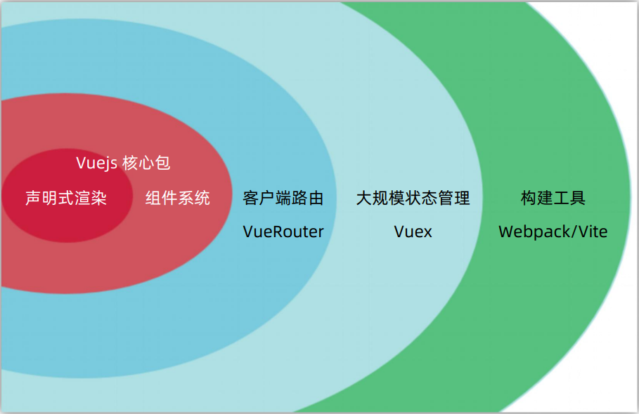

+ 框架：一套完整的项目解决方案

### 二、创建实例

#### 核心步骤：

1. 准备容器
2. 引包（官网）- 开发版本/生产版本
3. 创建Vue实例 new Vue()
4. 指定配置项 -> 渲染数据
   1. el 指定挂载点
   2. data 提供数据

```html
<div id="app">
  {{ msg }}
</div>

<script src="https://cdn.jsdelivr.net/npm/vue@2/dist/vue.js"></script>

<script>
	const app = new Vue({
    el: '#app',
    data: {
      msg: 'Hello Vue'
    }
  })
</script>
```

#### 显示结果：

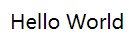

### 三、插值表达式{{ }}

插值表达式是一种Vue的模板语法

利用表达式进行插值，渲染到页面中。

```html
<div id="app">
  <p>{{ nickname }}</p>
  <p>{{ nickname.toUpperCase() }}</p>
  <p>{{ nickname + '你好' }}</p>
  <p>{{ age >= 18 ? '成年' : '未成年' }}</p>
  <p>{{ friend.name }}</p>
  <p>{{ friend.desc }}</p>
</div>

<script>
	const app = new Vue({
    el: '#app',
    data: {
      nickname: 'tony',
      age: 18,
      friend: {
        name: 'jackson',
        desc: '热爱学习'
      }
    }
  })
</script>
```

#### 显示结果

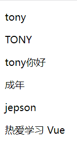

### 四、响应式特征

数据一改变，视图就会自动更新

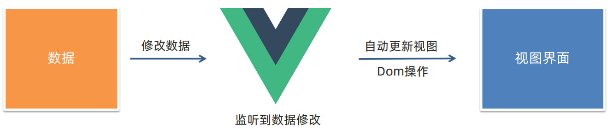

### 五、Vue开发者工具安装

1. 极简插件下载（推荐） <https://chrome.zzzmh.cn/index>

安装步骤：


安装之后可以F12后看到多一个Vue的调试面板

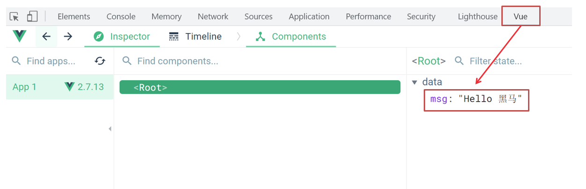

## Vue指令

### v-html

**作用：** 设置元素的innerHTML，用来解析网址等等

**语法：** `v-html="表达式"`

```html
<div id="app">
  <div v-html="msg"></div>
</div>

<script>
	const app = new Vue({
    el: '#app',
    data: {
      msg: `
				<h3>解析HTML地址</h3>
			`
    }
  })
</script>
```

#### 显示结果

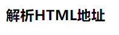

### v-show

**作用：** 控制元素显示隐藏

**语法：** `v-show="表达式"` 表达式值 true 显示，false隐藏

**原理：** 切换 `display:none` 控制显示隐藏，本质上控制的是CSS

**场景：** 频繁切换显示隐藏的场景

```html
<div id="app">
  <div v-show="flag"></div>
</div>

<script>
	const app = new Vue({
    el: '#app',
    data: {
      flag: true
    }
  })
</script>
```

### v-if

**作用：** 控制元素显示隐藏（条件渲染），条件性渲染元素或模板片段
 
**语法：** `v-if="表达式"` 表达式值 true 显示，false 隐藏
 
**原理：** 基于条件判断，是否创建或移除元素节点
 
**场景：** 要么显示，要么隐藏，不频繁切换的场景

```html
<div id="app">
  <div v-if="flag"></div>
</div>

<script>
	const app = new Vue({
    el: '#app',
    data: {
      flag: true
    }
  })
</script>
```

### v-else  v-else-if

**作用：** 辅助 v-if 进行判断渲染

**语法：** `v-else`     `v-else-if="表达式"`

```html
<div id="app">
  <p v-if="gender === 1">性别：♂ 男</p>
  <p v-else>性别：♀ 女</p>
  <hr>
  <p v-if="score >= 90">成绩评定A：奖励电脑一台</p>
  <p v-else-if="score >= 70">成绩评定B：奖励周末郊游</p>
  <p v-else-if="score >= 60">成绩评定C：奖励零食礼包</p>
  <p v-else>成绩评定D：惩罚一周不能玩手机</p>
</div>

<script>
  const app = new Vue({
    el: '#app',
    data: {
      gender: 2,
      score: 95
    }
  })
</script>
```

#### 条件

| 性别 | 性别标识 |
| ---- | -------- |
| 男   | 1        |
| 女   | 2        |

| 序号 | 成绩等级 | 考试分数 |
| ---- | -------- | -------- |
| 1    | A        | 90分+    |
| 2    | B        | 70-90分  |
| 3    | C        | 60-70分  |
| 4    | D        | 60分以下 |

#### 显示结果

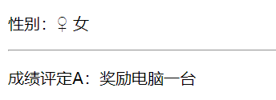

### v-on

**作用：** 注册事件=添加监听+提供处理逻辑

**语法：** `v-on:事件名="内联函数"` 或 `v-on:事件名="methods中的函数名"`

**简写：** `@事件名`

#### v-on配置内联函数

```html
<div id="app">
  <button @click="count--">-</button>
  <span>{{ count }}</span>
  <button v-on:click="count++">+</button>
</div>
<script src="./vue.js"></script>
<script>
  const app = new Vue({
    el: '#app',
    data: {
      count: 100
    }
  })
</script>
```

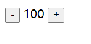

#### v-on配置methods函数

```html
<div id="app">
  <button @click="fn">切换显示隐藏</button>
  <h1 v-show="isShow">黑马程序员</h1>
</div>
<script src="./vue.js"></script>
<script>
  const app4 = new Vue({
    el: '#app',
    data: {
      isShow: true
    },
    methods: {
      fn () {
        this.isShow = !this.isShow
      }
    }
  })
</script>
```

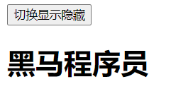

#### v-on参数传递

```html
<div id="app">
  <div class="box">
    <h3>小黑自动售货机</h3>
    <button @click="buy(5)">可乐5元</button>
    <button @click="buy(10)">咖啡10元</button>
    <button @click="buy(8)">牛奶8元</button>
  </div>
  <p>银行卡余额：{{ money }}元</p>
</div>

<script>
  const app = new Vue({
    el: '#app',
    data: {
      money: 100
    },
    methods: {
      buy (price) {
        this.money -= price
      }
    }
  })
</script>
```

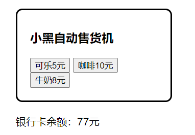

### v-bind

**作用：** 动态设置html的标签属性

**语法：** `v-bind:属性名="表达式"`

**简写形式：** `:属性名="表达式"`

```html
<div id="app">
  
  
</div>

<script>
  const app = new Vue({
    el: '#app',
    data: {
      imgUrl: './imgs/10-02.png',
      msg: 'hello 波仔'
    }
  })
</script>
```

#### 显示结果


### 图片切换案例

#### 核心思路：

1. 数组存储图片路径 ['url1','url2','url3'，...]

2. 可以准备个下标 index 去数组中取图片地址。

3. 通过v-bind给src绑定当前的图片地址

4. 点击上一页下一页只需要修改下标的值即可

5. 当展示第一张的时候，上一页按钮应该隐藏。展示最后一张的时候，下一页按钮应该隐藏

```html
<div id="app">
  <button @click="index--" v-show="index > 0">上一页</button>
  <div>
    
  </div>
  <button @click="index++" v-show="index < 5">下一页</button>
</div>

<script>
	const app = new Vue({
    el: '#app',
    data: {
      index: 0,
      list: [
        './imgs/11-00.gif',
        './imgs/11-01.gif',
        './imgs/11-02.gif',
        './imgs/11-03.gif',
        './imgs/11-04.png',
        './imgs/11-05.png'
      ]
    }
  })
</script>
```

#### 显示结果

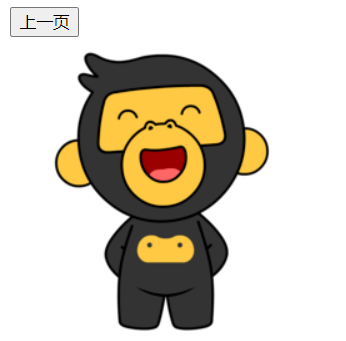

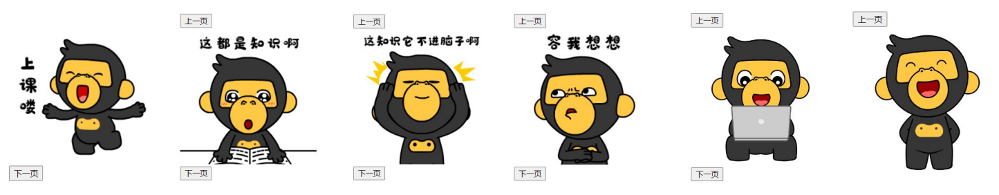

### v-for

**作用：** 基于数据循环，多次渲染整个元素

**语法：** `v-for="(item, index) in 数组"`

> item 每一项，index 下标
>
> 省略index: v-for = "item in 数组"

```html
<div id="app">
  <h3>小黑水果店</h3>
  <ul>
    <li v-for="(item, index) in list">
      {{ item }} - {{ index }}
    </li>
  </ul>
  <ul>
    <li v-for="item in list">
      {{ item }}
    </li>
  </ul>
</div>

<script>
  const app = new Vue({
    el: '#app',
    data: {
      list: ['西瓜', '苹果', '鸭梨', '榴莲']
    }
  })
</script>
```

#### 显示结果

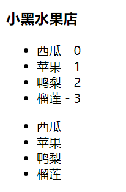

### v-for中的key/案例 - 小黑的书架

**语法：** `key属性="唯一标识"`

**作用：** 给列表项添加的唯一表示。便于Vue进行列表项的正确排序复用

**需求：**

1.根据左侧数据渲染出右侧列表（v-for）

2.点击删除按钮时，应该把当前行从列表中删除（获取当前行的id，利用filter进行过滤）

```html
<body>
  <div id="app">
    <h3>小黑的书架</h3>
    <ul>
      <li v-for="(item, index) in booksList" :key="item.id">
        <span>{{item.name}}</span>
        <span>{{item.author}}</span>
        <button @click="del(item.id)">删除</button>
      </li>
    </ul>
  </div>
</body>

<script>
  const app = new Vue({
    el: '#app',
    data: {
      booksList: [
        { id: 1, name: '《红楼梦》', author: '曹雪芹' },
        { id: 2, name: '《西游记》', author: '吴承恩' },
        { id: 3, name: '《水浒传》', author: '施耐庵' },
        { id: 4, name: '《三国演义》', author: '罗贯中' }
      ]
    },
    methods: {
      del(id) {
        this.booksList = this.booksList.filter((item) => item.id !== id)
      }
    }
  })
</script>
```

#### 显示结果

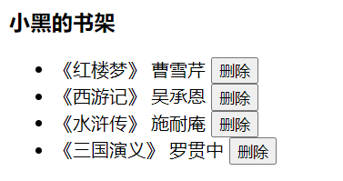

### v-model

**作用：** 给表单元素使用，双向数据绑定 -> 可以快速获取或设置表单元素内容

1. 数据变化 -> 视图自动更新
2. 视图变化 -> 数据自动更新

**语法：** `v-model='变量'`

```html
<div id="app">
  账户：<input type="text" v-model="username"> <br><br>
  密码：<input type="password" v-model="password"> <br><br>
  <button @click="login">登录</button>
  <button @click="reset">重置</button>
</div>

<script>
  const app = new Vue({
    el: '#app',
    data: {
      username: '',
      password: ''
    },
    methods: {
      login () {
        console.log(this.username, this.password)
      },
      reset () {
        this.username = ''
        this.password = ''
      }
    }
  })
</script>
```

#### 显示结果

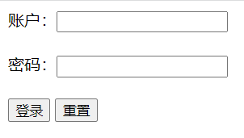


