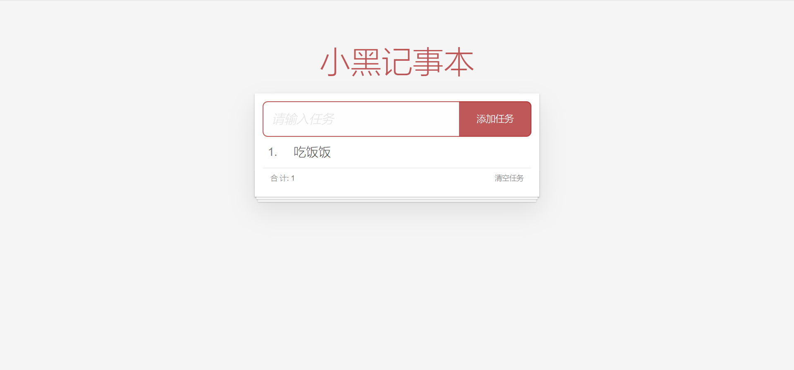

# 第一章案例 - 小黑记事本

## 功能需求：

1. 列表渲染
2. 删除功能
3. 添加功能
4. 底部统计和清空

## 基本框架

```html
<link rel="stylesheet" href="./css/index.css">
<title>记事本</title>

<!-- 主体区域 -->
<section id="app">
  <!-- 输入框 -->
  <header class="header">
    <h1>小黑记事本</h1>
    <input placeholder="请输入任务" class="new-todo" />
    <button class="add">添加任务</button>
  </header>
  <!-- 列表区域 -->
  <section class="main">
    <ul class="todo-list">
      <li class="todo">
        <div class="view">
          <span class="index">1.</span> <label>吃饭饭</label>
          <button class="destroy"></button>
        </div>
      </li>
    </ul>
  </section>
  <!-- 统计和清空 -->
  <footer class="footer">
    <!-- 统计 -->
    <span class="todo-count">合 计:<strong> 1 </strong></span>
    <!-- 清空 -->
    <button class="clear-completed">
      清空任务
    </button>
  </footer>
</section>

<!-- 底部 -->
<script src="https://cdn.jsdelivr.net/npm/vue/dist/vue.js"></script>
<script>

  const app = new Vue({
    el: '#app',
    data: {
      
    }
  })
</script>
```

### 显示结果



## 列表渲染和删除

```html
<section id="app">
	<!-- 列表区域 -->
  <section class="main">
  	<ul class="todo-list">
      <li class="todo" v-for="(item, index) in list" :key="item.id">
      	<div class="view">
          <span class="index">{{ index + 1 }}.</span> 
          <label>{{ item.name }}</label>
          <button @click="del(item.id)" class="destroy"></button>
        </div>
      </li>
    </ul>
  </section>
</section>

<!-- 底部 -->
<script>
	const app = new Vue({
    el: '#app',
    data: {
      list: [
        { id:1, name: '跑步一公里' },
        { id:3, name: '游泳100米' }
      ]
    },
    methods: {
      del (id) {
        // 对于列表中的每个元素（item），如果该元素的id不等于给定的id，那么就保留这个元素。
        this.list = this.list.filter(item => item.id !== id)
      }
    }
  })
</script>
```

### 显示结果


## 添加功能

```html
<section id="app">
	<!-- 输入框 -->
  <header>
  	<h1>小黑记事本</h1>
    <input 
      v-model="todoName" 
      placeholder="请输入任务" 
      class="new-todo" 
      @keyup.enter="add"
     />
    <button @click="add" class="add">添加任务</button>
  </header>
</section>

<script>
	const app = new Vue({
    el: '#app',
    data: {
      todoName: '',
    },
    methods: {
      add () {
        if (this.todoName.trim() === '') {
          alert('请输入任务名称')
          return
        }
        this.list.unshift({
          id: +new Date(),
          name: this.todoName
        })
        this.todoName = ''
      }
    }
  })
</script>
```

### 显示结果


## 底部功能

```html
<section id="app">
	<footer class="footer" v-show="list.length > 0">
  	<span class="todo-count">合计<strong>{{ list.length }}</strong></span>
    <button @click="clear" class="clear-completed">
      清空任务
    </button>
  </footer>
</section>

<script>
	const app = new Vue({
    methods: {
      clear() {
        this.list = []
      }
    }
  })
</script>
```


