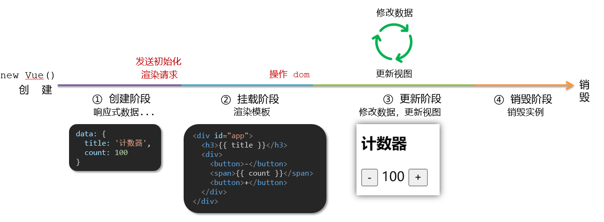
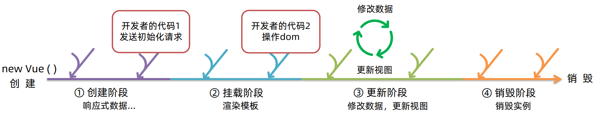
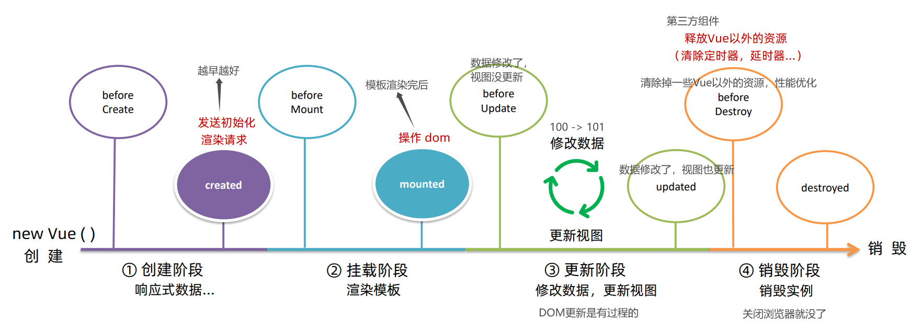
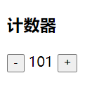
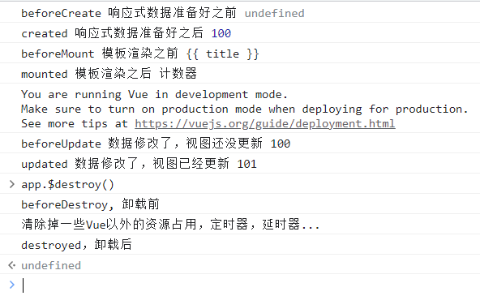
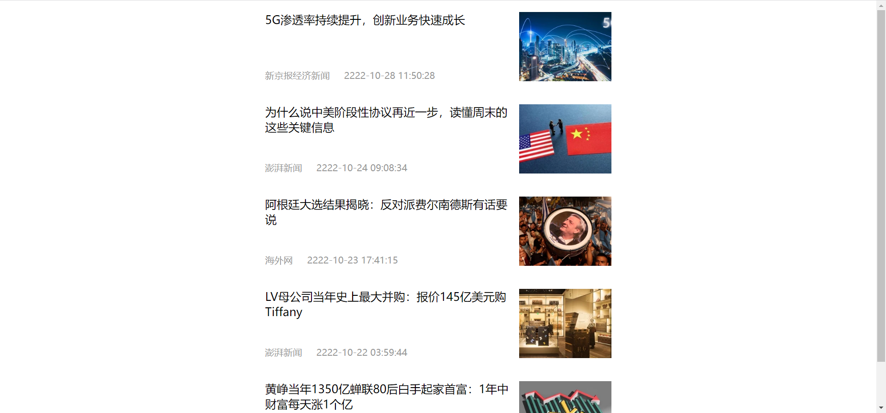
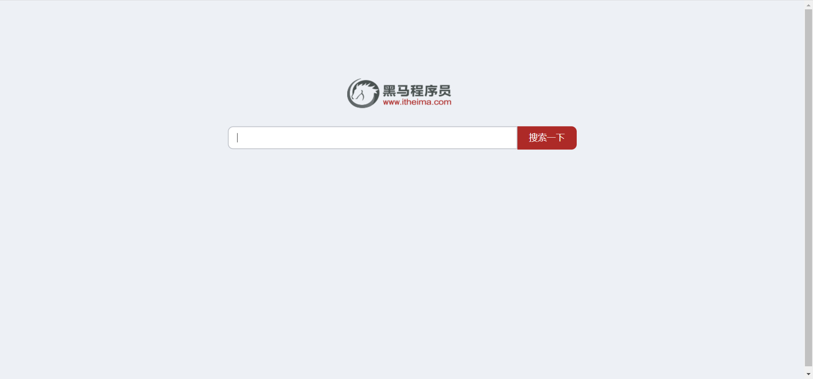

# 第三章 | 生命周期

## 生命周期

一个Vue实例从**创建**到**销毁**的整个过程。

## 生命周期四个阶段

四个阶段：① 创建 ② 挂载 ③ 更新 ④ 销毁

1. 创建阶段：创建响应式数据
2. 挂在阶段：渲染模板
3. 更新阶段：修改数据，更新视图
4. 销毁阶段：销毁Vue实例



## 生命周期函数(钩子函数)

让开发者可以在**特定阶段**运行自己的代码






### 示例代码

```html
<div id="app">
  <h3>{{ title }}</h3>
  <div>
    <button @click="count--">-</button>
    <span>{{ count }}</span>
    <button @click="count++">+</button>
  </div>
</div>

<script>
	const app = new Vue({
    el: '#app',
    data: {
      count: 100,
      title: '计数器'
    },
    // 1. 创建阶段(准备数据)
    beforeCreate () {
      console.log('beforeCreate 响应式数据准备好之前', this.count)
    },
    created () {
      console.log('created 响应式数据准备好之后', this.count)
      // this.数据名 = 请求回来的数据
      // 可以开始发送初始化渲染的请求
    },
    // 2. 挂载阶段(渲染模板)
    beforeMount () {
      console.log('beforeMount 模板渲染之前', document.querySelector('h3')。innerHTML)
    },
    mounted () {
      console.log('mounted 模板渲染之后', document.querySelector('h3').innerHTML)
      // 可以开始操作dom了
    }, 
    // 3. 更新阶段(修改数据 -> 更新视图)
    beforeUpdate () {
      console.log('beforeUpdate 数据修改了，视图还没更新', document.querySelector('span').innerHTML)
    },
    updated () {
      console.log('updated 数据修改了，视图已经更新', document.querySelector('span').innerHTML)
    },
    // 4. 卸载阶段
    beforeDestroy () {
      console.log('beforeDestroy, 卸载前')
      console.log('清除掉一些Vue以外的资源占用，定时器、演示器等')
    },
    destroyed () {
      console.log('destroyed, 卸载后')
    }
  })
</script>
```





## 案例-新闻列表(created应用)

created 数据准备好后，就可以发送初始化渲染请求

```html
<head>
  <style>
  	* {
      margin: 0;
      padding: 0;
      list-style: none;
    }
    .news {
      display: flex;
      height: 120px;
      width: 600px;
      margin: 0 auto;
      padding: 20px 0;
      cursor: pointer;
    }
    .news .left {
      flex: 1;
      display: flex;
      flex-direction: column;
      justify-content: space-between;
      padding-right: 10px;
    }
    .news .left .title {
      font-size: 20px;
    }
    .news .left .info {
      color: #999999;
    }
    .news .left .info span {
      margin-right: 20px;
    }
    .news .right {
      width: 160px;
      height: 120px;
    }
    .news .right img {
      width: 100%;
      height: 100%;
      object-fit: cover;
    }
  </style>
</head>

<body>
  <div id="app">
    <ul>
      <li class="news" v-for="(item, index) in list" :key="item.id">
      	<div class="left">
          <div class="title">{{ item.title }}</div>
          <div class="info">
            <span>{{ item.source }}</span>
            <span>{{ item.time }}</span>
          </div>
        </div>
        <div class="right">
          
        </div>
      </li>
    </ul>
  </div>
  
  <script>
  	// 接口地址：http://hmajax.itheima.net/api/news
		// 请求方式：get
    const app = new Vue({
      el: '#app',
      data: {
        list: []
      },
      async created () {
        // 1. 发送请求获取数据
        const res = await axios.get('http://hmajax.itheima.net/api/news')
        this.list = res.data.data
      }
    })
  </script>
</body>
```



## 案例-输入框获取焦点(mounted应用)

```html
<head>
  <!-- 初始化演示 -->
  <link
    rel="stylesheet"
    href="https://cdn.jsdelivr.net/npm/reset.css@2.0.2/reset.min.css"
  />
  <!-- 核心样式 -->
  <style>
  	html,
    body {
      height: 100%;
    }
    .search-container {
      position: absolute;
      top: 30%;
      left: 50%;
      transform: translate(-50%, -50%);
      text-align: center;
    }
    .search-container .search-box {
      display: flex;
    }
    .search-container img {
      margin-bottom: 30px;
    }
    .search-container .search-box input {
      width: 512px;
      height: 16px;
      padding: 12px 16px;
      font-size: 16px;
      margin: 0;
      vertical-align: top;
      outline: 0;
      box-shadow: none;
      border-radius: 10px 0 0 10px;
      border: 2px solid #c4c7ce;
      background: #fff;
      color: #222;
      overflow: hidden;
      box-sizing: content-box;
      -webkit-tap-highlight-color: transparent;
    }
    .search-container .search-box button {
      cursor: pointer;
      width: 112px;
      height: 44px;
      line-height: 41px;
      line-height: 42px;
      background-color: #ad2a27;
      border-radius: 0 10px 10px 0;
      font-size: 17px;
      box-shadow: none;
      font-weight: 400;
      border: 0;
      outline: 0;
      letter-spacing: normal;
      color: white;
    }
    body {
      background: no-repeat center / cover;
      background-color: #edf0f5;
    }
  </style>
</head>

<body>
  <div class="container" id="app">
    <div class='search-container'>
      
      <div class="search-box">
        <input type="text" v-model="words" id="inp" />
        <button>搜索一下</button>
      </div>
    </div>
  </div>
  
  <script>
  	const app = new Vue({
      el: '#app',
      data: {
        words: ''
      },
      mounted() {
        document.querySelector('#inp').focus()
      }
    })
  </script>
</body>
```

