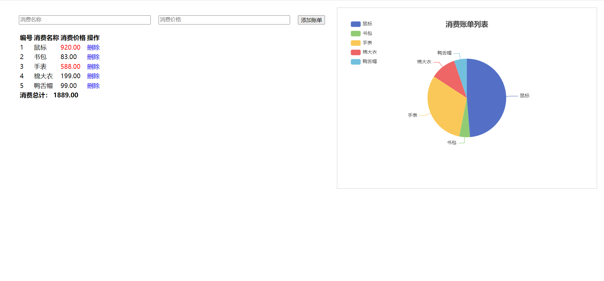

# 第三章案例 - 小黑记账清单

## 需求

1. 基本渲染
2. 添加功能
3. 删除功能
4. 饼图渲染

## 思路

1. 基本渲染
   + 立刻发送请求获取数据 created
   + 拿到数据，存到data 的响应式数据中
   + 结合数据，进行渲染 v-for
   + 消费统计 -> 计算属性
2. 添加功能
   + 收集表单数据 v-model，使用指令修饰符处理数据
   + 给添加按钮注册点击事件，对输入的内容做非空判断，发送请求
   + 请求成功后，对文本框内容进行清空
   + 重新渲染列表
3. 删除功能
   + 注册点击事件，获取当前行的 id
   + 根据 id 发送删除请求
   + 需要重新渲染
4. 饼图渲染
   + 初始化一个饼图 `echarts.init(dom)`  并在mounted钩子函数中渲染
   + 根据数据试试更新饼图 `echarts.setOptions({...})`

## 实现

### 0. 准备模板

先下载`vue.js`、`echarts.min.js`、`axios.min.js`

当然，也可以在线调用，调用地址如下：

+ vue.js：https://cdn.jsdelivr.net/npm/vue@2/dist/vue.js
+ echarts：https://cdn.jsdelivr.net/npm/echarts@5.4.0/dist/echarts.min.js
+ axios：https://cdn.jsdelivr.net/npm/axios/dist/axios.min.js

```html
<head>
  <link rel="stylesheet" href="https://cdn.jsdelivr.net/npm/bootstrap@5.1.3/dist/css/bootstrap.min.css">
  <style>
  	.red {
      color: red!import;
    }
    .search {
      width: 300px;
      margin: 20px 0;
    }
    .my-form {
      display: flex;
      margin: 20px 0;
    }
    .my-form input {
      flex: 1;
      margin-right: 20px;
    }
    .table > :not(:first-child) {
      border-top: none;
    }
    .contain {
      display: flex;
      padding: 10px;
    }
    .list-box {
      flex: 1;
      padding: 0 30px;
    }
    .list-box  a {
      text-decoration: none;
    }
    .echarts-box {
      width: 600px;
      height: 400px;
      padding: 30px;
      margin: 0 auto;
      border: 1px solid #ccc;
    }
    tfoot {
      font-weight: bold;
    }
    @media screen and (max-width: 1000px) {
      .contain {
        flex-wrap: wrap;
      }
      .list-box {
        width: 100%;
      }
      .echarts-box {
        margin-top: 30px;
      }
    }
  </style>
</head>

<body>
  <div id="app">
    <div class="contain">
      <!-- 左侧列表 -->
      <div class="list-box">
        <!-- 添加资产 -->
        <form class="my-form">
          <input type="text" class="form-control" placeholder="消费名称" />
          <input type="text" class="form-control" placeholder="消费价格" />
          <button type="button" class="btn btn-primary">添加账单</button>
        </form>
        <table class="table table-hover">
          <thead>
          	<tr>
            	<th>编号</th>
              <th>消费名称</th>
              <th>消费价格</th>
              <th>操作</th>
            </tr>
          </thead>
          <tbody>
          	<tr>
            	<td>1</td>
              <td>帽子</td>
              <td>99.00</td>
              <td><a href="javascript:;">删除</a></td>
            </tr>
            <tr>
            	<td>2</td>
              <td>大衣</td>
              <td class="red">199.00</td>
              <td><a href="javascript:;">删除</a></td>
            </tr>
          </tbody>
          <tfoot>
          	<tr>
            	<td colspan="4">消费总计：298.00</td>
            </tr>
          </tfoot>
        </table>
      </div>
      <!-- 右侧图表 -->
      <div class="echarts-box" id="main"></div>
    </div>
  </div>
  
  <script src="./echarts.min.js"></script>
  <script src="./vue.js"></script>
  <script src="./axios.min.js"></script>
  <script>
  	const app = new Vue({
      el: '#app',
      data: {
        ...
      }
    })
  </script>
</body>
```

### 1. 基本渲染

先将模板里的 `<tbody>` 静态数据删除掉

```html
<table class="table table-hover">
  ...
  <tbody>
  	<tr v-for="(item, index) in list" :key="item.id">
    	<td>{{ index + 1 }}</td>
      <td>{{ item.name }}</td>
      <td :class="{ red: item.price > 500 }">{{ item.price.toFixed(2) }}</td>
      <td><a href="javascript:;">删除</a></td>
    </tr>
  </tbody>
  <tfoot>
  	<tr>
    	<td colspan="4">消费总计：{{ totalPrice.toFixed(2) }}</td>
    </tr>
  </tfoot>
</table>

<script>
	const app = new Vue({
    el: '#app',
    data: {
      list: []
    },
    computed: {
      totalPrice () {
        return this.list.reduce((sum, item) => sum + item.price, 0)
      }
    },
    async created () {
      const res = await axios.get('https://applet-base-api-t.itheima.net/bill', {
      	params: {
        	creator: '小黑'
        }
      })
      this.list = res.data.data
    }
  })
</script>
```

### 2. 添加功能

```html
<!-- 左侧列表 -->
<div class="list-box">
  <!-- 添加资产 -->
  <form class="my-form">
    <input v-model.trim="name" type="text" class="form-control" placeholder="消费名称" />
    <input v-model.number="price" type="text" class="form-control" placeholder="消费价格">
    <button @click="add" type="button" class="btn btn-primary">添加账单</button>
  </form>
</div>

<script>
	const app = new Vue({
    el: '#app',
    data: {
      list: [],
      name: '',
      price: ''
    },
    computed: {
      totalPrice () {
        return this.list.reduce((sum, item) => sum + item.price, 0)
      }
    },
    // 把原来created的内容抽出来，更改成以下代码
    created () {
      this.getList()
    },
    methods: {
      async getList () {
        const res = await axios.get('https://applet-base-api-t.itheima.net/bill', {
      	params: {
        	creator: '小黑'
        }
      })
      this.list = res.data.data
      },
      async add () {
        if (!this.name) {
          alert('请输入消费名称')
          return
        }
        if (typeof this.price !== 'number') {
          alert('请输入正确的消费价格')
          return
        }
        // 发送添加请求
        const res = await axios.post('https://applet-base-api-t.itheima.net/bill', {
          // creator要和上面的getList()的creator一致，不然就显示不出数据
          creator: '小黑',
          name: this.name,
          price: this.price
        })
        // 重新渲染一次
        this.getList()
        this.name = ''
        this.price = ''
      }
    }
  })
</script>
```

### 3. 删除功能

```html
<tbody>
	<tr>
  	<td><a @click="del(item.id)" href="javascript:;">删除</a></td>
  </tr>
</tbody>

<script>
	async del (id) {
    // 根据 id 发送删除请求
    const res = await axios.delete(`https://applet-base-api-t.itheima.net/bill/${id}`)
    // 重新渲染
    this.getList()
  }
</script>
```

### 4. 饼图

```html
<!-- 右侧图表 -->
<div class="echarts-box" id="main"></div>

<script>
	mounted() {
    this.myChart = echarts.init(document.querySelector('#main'))
    this.myChart.setOption({
      // 大标题
      title: {
        text: '消费账单列表',
        left: 'center'
      },
      // 提示框
      tooltip: {
        trigger: 'item'
      },
      // 图例
      legend: {
        orient: 'vertical',
        left: 'left'
      },
      // 数据
      series: [
        {
          name: '消费账单',
          type: 'pie',
          radius: '50%', // 圆的半径
          data: [
            // 数组，拿到数据以后根据最新的数据实时更新饼图
          ],
          emphasis: {
            itemStyle: {
              itemStyle: {
                shadowBlur: 10,
                shadowOffsetX: 0,
                shadowColor: 'rgba(0, 0, 0, 0.5)'
              }
            }
          }
        }
      ]
    })
  },
  methods: {
    async getList() {
      ...
      // 更新图表
      this.myChart.setOption({
        series: [
          {
            data: this.list.map((item) => ({
              value: item.price,
              name: item.name
            }))
          }
        ]
      })
    }
  }
</script>
```

