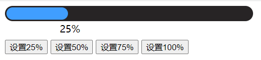

# 第二章 | 指令补充

## 指令补充

### 指令修饰符

通过 "." 指明一些指令后缀，不同后缀封装不同的处理操作 -> 简化代码

1. 案件修饰符

   @keyup.enter -> 键盘回车监听 -> 当点击键盘回车的时候才触发

```html
<div>
  <h3>@keyup.enter -> 监听键盘回车事件</h3>
  <input @keyup.enter="fn" v-model="username" type="text">
</div>

<script>
	const app = new Vue({
    el: '#app',
    data: {
      username: ''
    },
    methods: {
      fn (e) {
        console.log('键盘回车的时候触发', this.username)
      }
    }
  })
</script>
```


2. v-model修饰符

   v-model.trim -> 去除首尾空格(输入框中假如用户在里面输入空格就可以自动清除空格)

   v-model.number -> 转数字(输入框中假如用户在原本应该输入数字的地方输入其他字符，则自动转换为number类型)

3. 事件修饰符

   @事件名.stop -> 阻止冒泡

   @事件名.prevent -> 阻止默认行为(本来点击链接是可以跳转的，加了这个属性以后就不能跳转了)

```html
<div id="app">
  <h3>v-model修饰符 .trim .number</h3>
  姓名：<input v-model.trim="username" type="text"><br>
  年纪：<input v-model.number="age" type="text"><br>
  
  <h3>@事件名.stop    ->    阻止冒泡</h3>
  <div @click="fatherFn" class="father">
    <div @click.stop="sonFn" class="son">儿子</div>
  </div>
  
  <h3>@事件名.prevent    ->    阻止默认行为</h3>
  <a @click.prevent href="http://www.baidu.com">阻止默认行为</a>
</div>

<script>
	const app = new Vue({
    el: '#app',
    data: {
      username: '',
      age: ''
    },
    methods: {
      fatherFn () {
        alert('老父亲被点击了')
      }，
      sonFn (e) {
    		alert('儿子被点击了')
  		}
    }
  })
</script>
```


### v-bind对于样式操作的增强

针对class类名和style行内样式控制

**语法：** `:class="对象/数组"`

1. 对象

   当class动态绑定的是对象时，键就是类名，值就是布尔值，如果值是true，就有这个类，否则没有这个类

```html
<div class="box" :class="{ 类名1: 布尔值, 类名2: 布尔值 }"></div>
```

​		使用场景：一个类名，来回切换

2. 数组

   当class动态绑定的是数组时，数组中所有的类，都会添加到盒子上，本质就是一个class列表

```html
<div class="box" :class="[ 类名1, 类名2, 类名3 ]"></div>
```

​		使用场景：批量添加或删除类

**语法：** `:style="样式对象"`

3. 操作style

```html
<div class="box" :style=" { CSS属性名1: CSS属性值, CSS属性名2: CSS属性值 }">
</div>
```

​		使用场景：某个具体属性的动态设置

代码

```html
<head>
  <style>
    .box {
      width: 200px;
      height: 200px;
      border: 3px solid #000;
      font-size: 30px;
      margin-top: 10px;
    }
    .pink {
      background-color: pink;
    }
    .big {
      width: 300px;
      height: 300px;
    }
	</style>
</head>

<body>
  <div id="app">
    <div class="box" :class="{ pink: true, big: true }">黑马程序员</div>
    <div class="box" :class="['pink', 'big']">黑马程序员</div>
  </div>

  <script>
    const app = new Vue({
      el: '#app',
      data: {

      }
    })
  </script>
</body>
```


### 案例：京东秒杀tab导航高亮

#### 核心思路：

1. 基于数据动态渲染tab
2. 准备下标记录高亮的是哪一个tab
3. 基于下标，动态控制class类名

其实就是改下标的方式切换高亮

```html
<head>
	<style>
    * {
      margin: 0;
      padding: 0;
    }
    ul {
      display: flex;
      border-bottom: 2px solid #e01222;
      padding: 0 10px;
    }
    li {
      width: 100px;
      height: 50px;
      line-height: 50px;
      list-style: none;
      text-align: center;
    }
    li a {
      display: block;
      text-decoration: none;
      font-weight: bold;
      color: #333333;
    }
    li a.active {
      background-color: #e01222;
      color: #fff;
    }

  </style>
</head>

<body>
  <div id="app">
    <ul>
      <li 
        v-for="(item, index) in list" 
        :key="item.id" 
        @click="activeIndex = index">
      	<a :class="{ active: index === activeIndex }" href='#'>{{ item.name }}</a>
      </li>
    </ul>
  </div>
  
  <script>
  	const app = new Vue({
      el: '#app',
      data: {
        activeIndex: 2, // 记录高亮
        list: [
          { id: 1, name: '京东秒杀' },
          { id: 2, name: '每日特价' },
          { id: 3, name: '品类秒杀' }
        ]
      }
    })
  </script>
</body>
```


### 案例 - 进度条效果

```html
<head>
  <style>
    .progress {
      height: 25px;
      width: 400px;
      border-radius: 15px;
      background-color: #272425;
      border: 3px solid #272425;
      box-sizing: border-box;
      margin-bottom: 30px;
    }
    .inner {
      width: 50%;
      height: 20px;
      border-radius: 10px;
      text-align: right;
      position: relative;
      background-color: #409eff;
      background-size: 20px 20px;
      box-sizing: border-box;
      transition: all 1s;
    }
    .inner span {
      position: absolute;
      right: -20px;
      bottom: -25px;
    }
  </style>
</head>

<body>
  <div id="app">
    <!-- 外层盒子底色 -->
    <div class="progress">
      <!-- 内层盒子 -->
      <div class="inner" :style="{ width: percent + '%' }">
        <span>{{ percent }}%</span>
      </div>
    </div>
    <button @click="percent = 25">设置25%</button>
    <button @click="percent = 50">设置50%</button>
    <button @click="percent = 75">设置75%</button>
    <button @click="percent = 100">设置100%</button>
  </div>
  
  <script>
  	const app = new Vue({
      el: '#app',
      data: {
        percent: 30
      }
    })
  </script>
</body>
```



### v-model

表单元素都可以用 v-model 绑定关联 -> 快速获取或设置表单元素的值

根据控件类型自动选组正确的方法来更新元素

::: info

输入框 input:text -> value

文本框 textarea -> value

复选框 input:checkbox -> checked

单选框 input:radio -> checked

下拉菜单 select -> value

:::

```html
<head>
  <style>
    textarea {
      display: block;
      width: 240px;
      height: 100px;
      margin: 10px 0;
    }
  </style>
</head>

<body>
  <div id="app">
    <h3>小黑学习网</h3>
    姓名：
    	<input type="text" v-model="username">
    	<br><br>
    是否单身：
    	<input type="checkbox" v-model="isSingle">
    	<br><br>
    <!--  
			1. name: 加上name属性后可以分组，这样同一组会互斥就能选择出男女了
			2. value: 用于提交后台数据
		-->
    性别：
    	<input v-model="gender" type="radio" name="gender" value="1">男
    	<input v-model="gender" type="radio" name="gender" value="2">女
    	<br><br>
    <!--
			1. option 需要设置 value 值，提交给后台
			2. select 的 value 值，关联选中的 option 的 value 值
		-->
    所在城市：
    	<select v-model="cityId">
      	<option value="101">北京</option>
        <option value="102">上海</option>  
        <option value="103">成都</option>  
        <option value="104">南京</option>  
    	</select>
    	<br><br>
    自我描述：
    	<textarea v-model="desc"></textarea>
    <button>立即注册</button>
  </div>
  
  <script>
  	const app = new Vue({
      el: '#app',
      data: {
        username: '',
        isSingle: false,
        gender: '2',
        cityId: '102',
        desc: ""
      }
    })
  </script>
</body>
```


## computed计算属性

用来写表达式的，如果在模板中写太多逻辑，会使得模板变得臃肿

### 基础语法

1. 声明在 computed 配置项中，一个计算属性对应一个函数
2. 使用起来和普通属性一样使用 {{ 计算属性名 }}

#### 案例

```html
<head>
  <style>
    table {
      border: 1px solid #000;
      text-align: center;
      width: 240px;
    }
    th,td {
      border: 1px solid #000;
    }
    h3 {
      position: relative;
    }
  </style>
</head>

<body>
  <div id="app">
    <h3>小黑的礼物清单</h3>
    <table>
      <tr>
      	<th>名字</th>
        <th>数量</th>
      </tr>
      <tr v-for="(item, index) in list" :key="item.id">
      	<td>{{ item.name }}</td>
        <td>{{ item.num }}个</td>
      </tr>
    </table>
    <p>礼物总数：{{ totalCount }}个</p>
  </div>
  
  <script>
  	const app = new Vue({
      el: '#app',
      data: {
        list: [
          { id: 1, name: '篮球', num: 1 },
          { id: 2, name: '玩具', num: 2 }, 
          { id: 3, name: '铅笔', num: 5 }, 
        ]
      },
      computed: {
        totalCount () {
          // 对 this.list 数组里面的 num 进行求和 -> reduce
          let total = this.list.reduce((sum, item) => sum + item.num, 0)
          return total
        }
      }
    })
  </script>
</body>
```


### 计算属性 vs 方法

::: tip computed 计算属性：

**作用：** 封装了一段对于数据的处理，求得一个结果

**语法：** 

1. 写在 computed 配置项中
2. 作为属性，直接使用 -> this.计算属性 {{  计算属性 }}

:::

:::tip methods 方法

**作用：** 给实例提供一个方法，调用以处理业务逻辑

**语法：**

1. 写在 methods 配置项中
2. 作为方法，需要调用 -> `this.方法名() {{ 方法名() }}`   ` @事件名="方法名"`

:::

:::warning

方法不会对结果缓存

:::

### 完整写法

```html
<script>
	const app = new Vue({
    computed: {
      计算属性名: {
        get() {
          一段代码逻辑(计算逻辑)
          return 结果
        }，
        set(修改的值) {
      		一段代码逻辑(修改逻辑)
    		}
      }
    }
  })
</script>
```

### 案例-成绩案例

#### 需求：

1. 渲染功能
2. 删除功能
3. 添加功能
4. 统计总分，求平均分

#### 思路分析：

1. 渲染功能  `v-for` `:key` `v-bind:动态绑定class的样式`
2. 删除功能  `v-on` 绑定事件，阻止a标签的默认行为
3. v-model的修饰符 `.trim`、`.number` 、判断数据是否为空后再添加、添加后清空文本框的数据
4. 使用计算属性 computed 计算总分和平均分的值

#### 代码

1. 准备模板

```html
<body>
  <div id="app" class="score-case">
    <div class="table">
      <table>
        <thead>
          <tr>
            <th>编号</th>
            <th>科目</th>
            <th>成绩</th>
            <th>操作</th>
          </tr>
        </thead>
        <tbody>
          <tr>
            <td>1</td>
            <td>语文</td>
            <td class="red">46</td>
            <td><a href="#">删除</a></td>
          </tr>
          <tr>
            <td>2</td>
            <td>英语</td>
            <td>80</td>
            <td><a href="#">删除</a></td>
          </tr>
          <tr>
            <td>3</td>
            <td>数学</td>
            <td>100</td>
            <td><a href="#">删除</a></td>
          </tr>
        </tbody>
        <tbody>
          <tr>
            <td colspan="5">
              <span class="none">暂无数据</span>
            </td>
          </tr>
        </tbody>

        <tfoot>
          <tr>
            <td colspan="5">
              <span>总分：246</span>
              <span style="margin-left: 50px">平均分：79</span>
            </td>
          </tr>
        </tfoot>
      </table>
    </div>
    <div class="form">
      <div class="form-item">
        <div class="label">科目：</div>
        <div class="input">
          <input
                 type="text"
                 placeholder="请输入科目"
                 />
        </div>
      </div>
      <div class="form-item">
        <div class="label">分数：</div>
        <div class="input">
          <input
                 type="text"
                 placeholder="请输入分数"
                 />
        </div>
      </div>
      <div class="form-item">
        <div class="label"></div>
        <div class="input">
          <button class="submit" >添加</button>
        </div>
      </div>
    </div>
  </div>
  <script src="https://cdn.jsdelivr.net/npm/vue@2/dist/vue.js"></script>

  <script>
    const app = new Vue({
      el: '#app',
      data: {
        list: [
          { id: 1, subject: '语文', score: 20 },
          { id: 7, subject: '数学', score: 99 },
          { id: 12, subject: '英语', score: 70 },
        ],
        subject: '',
        score: ''
      }
    })
  </script>
</body>
```

2. 渲染实现

   1. 删除模板中的 `tbody`

      ```html
      <tbody>
        <tr>
          <td>1</td>
          <td>语文</td>
          <td class="red">46</td>
          <td><a href="#">删除</a></td>
        </tr>
        <tr>
          <td>2</td>
          <td>英语</td>
          <td>80</td>
          <td><a href="#">删除</a></td>
        </tr>
        <tr>
          <td>3</td>
          <td>数学</td>
          <td>100</td>
          <td><a href="#">删除</a></td>
        </tr>
      </tbody>
      ```

   2. 添加内容

```html
<div id="app">
  <tobdy v-if="list.length > 0">
  	<tr v-for="(item, index) in list" :key="item.id">
    	<td>{{ index + 1}}</td>
      <td>{{ index.subject }}</td>
      <!-- 不及格的标红，, 60分，加上 red 类 -->
      <td :class="{ red: item.score < 60}">{{ item.score }}</td>
      <td><a href="#">删除</a></td>
    </tr>
  </tobdy>
  <tbody v-else>
  	<tr>...</tr>
  </tbody>
</div>
```

3. 删除&添加功能

```html
<div id="app">
  <tbody v-if="list.length > 0">
  	...
    <td><a @click.prevent="del(item.id)" href="http://www.baidu.com"></a></td>
  </tbody>
  <div class="form">
    <div class="form-item">
      <div class="label">科目：</div>
      <div class="input">
        <input 
           type="text" 
           placceholder="请输入科目" 
           v-model.trim="subject"
        >
      </div>
    </div>
    <div class="form-item">
      <div class="label">分数：</div>
      <div class="input">
				<input 
        	type="text"
          placeholder="请输入分数"
          v-model.number="score"
          @keyup.enter="add"
        >
      </div>
    </div>
  </div>
  ...
  <div class="input">
    <button @click="add" class="submit">添加</button>
  </div>
</div>

<script>
	const app = new Vue({
    methods: {
      del (id) {
        this.list = this.list.filter(item => item.id !== id)
      },
      add () {
        if (!this.subject) {
          alert('请输入科目')
          return
        }
        if (typeof this.score !== 'number') {
          alert('请输入正确的成绩')
          return
        }
        this.list.unshift({
          id: +new Date(),
          subject: this.subject,
          score: this.score
        })
        this.subject = ''
        this.score = ''
      }
    }
  })
</script>
```

:::warning 注意

@keyup.enter 要分配给输入框而不是添加按钮，不然生效不了

:::

4. 统计总分并实现

```html
<div>
  <tfoot>
  	<tr>
    	<td colspan="5">
      	<span>总分：{{ totalScore }}</span>
        <span style="margin-left: 50px">平均分：{{ averageScore }}</span>
      </td>
    </tr>
  </tfoot>
</div>

<script>
	const app = new Vue({
    computed: {
      totalScore() {
        return this.list.reduce((sum, item) => sum + item.score, 0)
      },
      averageScore() {
        if (this.list.length === 0) {
          return 0
        }
        return (this.totalScore / this.list.length).toFixed(2)
      }
    }
  })
</script>
```


## watch侦听器

监听数据变化，执行一些业务逻辑或异步操作

### 基础语法

```html
<script>
	const app = new Vue({
    watch: {
      数据属性名 (newValue, oldValue) {
        一些业务逻辑 或 异步操作
      },
      '对象.属性名' (newValue, oldValue) {
        一些业务逻辑 或 异步操作
      }
    }
  })
</script>
```

### 完整写法

添加额外配置项

1. `deep:true` 对复杂类型深度监视
2. `immediate:true` 初始化立刻执行一次handler方法

```html
<script>
	const app = new Vue({
    watch: {
      数据属性名: {
        deep: true, // 深度监视(针对复杂类型)
        immediate: true, // 是否立刻执行一次handler
        handler (newValue) {
          console.log(newValue)
        }
      }
    }
  })
</script>
```


