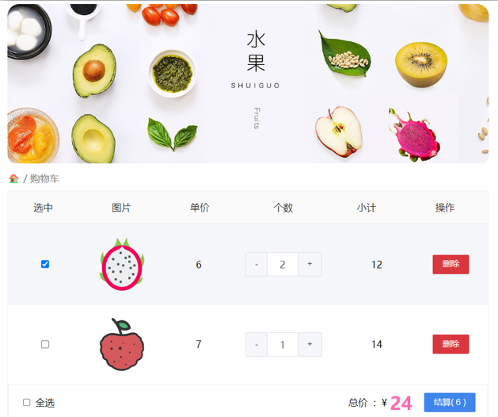

# 第二章案例 - 购物车

## 需求

1. 渲染功能
2. 删除功能
3. 修改个数
4. 全选反选
5. 统计选中的总价和总数量
6. 持久化到本地

## 实现思路

1. 基本渲染：v-for遍历、:class动态绑定样式

2. 删除功能 ： v-on 绑定事件，获取当前行的id

3. 修改个数 ： v-on绑定事件，获取当前行的id，进行筛选出对应的项然后增加或减少

4. 全选反选 

   1. 必须所有的小选框都选中，全选按钮才选中 → every
   2. 如果全选按钮选中，则所有小选框都选中
   3. 如果全选取消，则所有小选框都取消选中

   声明计算属性，判断数组中的每一个checked属性的值，看是否需要全部选

5. 统计 选中的 总价 和 总数量 ：通过计算属性来计算**选中的**总价和总数量

6. 持久化到本地： 在数据变化时都要更新下本地存储 watch

## 代码

### 1. 准备模板

```html
<head>
  <link rel="stylesheet" href="./css/inputnumber.css" />
	<link rel="stylesheet" href="./css/index.css" />
</head>
<body>
  <div class="app-container" id="app">
    <!-- 顶部banner -->
    <div class="banner-box">
      
    </div>
    <!-- 面包屑 -->
    <div class="breadcrumb">
      <span>🏠</span>
      /
      <span>购物车</span>
    </div>
    <!-- 购物车主体 -->
    <div class="main">
      <div class="table">
        <!-- 头部 -->
        <div class="thead">
          <div class="tr">
            <div class="th">选中</div>
            <div class="th th-pic">图片</div>
            <div class="th">单价</div>
            <div class="th num-th">个数</div>
            <div class="th">小计</div>
            <div class="th">操作</div>
          </div>
        </div>
        <!-- 身体 -->
        <div class="tbody">
          <div class="tr active">
            <div class="td"><input type="checkbox" checked /></div>
            <div class="td">
            	
            </div>
            <div class="td">6</div>
            <div class="td">
              <div class="my-input-number">
                <button class="decrease"> - </button>
                <span class="my-input__inner">2</span>
                <button class="increase"> + </button>
              </div>
            </div>
            <div class="td">12</div>
            <div class="td"><button>删除</button></div>
          </div>
          
          <div class="tr">
            <div class="td"><input type="checkbox"/></div>
            <div class="td">
              
            </div>
            <div class="td">7</div>
            <div class="td">
              <div class="my-input-number">
                <button disabled class="decrease"> - </button>
                <span class="my-input__inner">1</span>
                <button class="increase"> + </button>
              </div>
            </div>
            <div class="td">14</div>
            <div class="td"><button>删除</button></div>
          </div>
        </div>
      </div>
      <!-- 底部 -->
      <div class="bottom">
        <!-- 全选 -->
        <label class="bottom">
        	<input type="checkbox" />
          全选
        </label>
        <div class="right-box">
          <!-- 所有商品总价 -->
          <span class="price-box">
            总价&nbsp;&nbsp;:&nbsp;&nbsp;¥&nbsp;
            <span class="price">24</span>
          </span>
          <!-- 结算按钮 -->
          <button class="pay">结算( 6 )</button>
        </div>
      </div>
    </div>
    <!-- 空车 -->
    <div class="empty">🛒空空如也</div>
  </div>
  
  <script>
  	const app = new Vue({
      el: '#app',
      data: {
        // 水果列表
        fruitList: [
          {
            id: 1,
            icon: 'http://autumnfish.cn/static/火龙果.png',
            isChecked: true,
            num: 2,
            price: 6,
          },
          {
            id: 2,
            icon: 'http://autumnfish.cn/static/荔枝.png',
            isChecked: false,
            num: 7,
            price: 20,
          },
          {
            id: 3,
            icon: 'http://autumnfish.cn/static/榴莲.png',
            isChecked: false,
            num: 3,
            price: 40,
          },
          {
            id: 4,
            icon: 'http://autumnfish.cn/static/鸭梨.png',
            isChecked: true,
            num: 10,
            price: 3,
          },
          {
            id: 5,
            icon: 'http://autumnfish.cn/static/樱桃.png',
            isChecked: false,
            num: 20,
            price: 34,
          },
        ]
      }
    })
  </script>
</body>
```

### 2. 渲染

```html
<!-- 购物车主体 -->
<div class="main" v-if="fruitList.length > 0">
  <!-- 身体 -->
  <div class="tbody">
    <div 
      v-for="(item, index) in fruitList"
      :key="item.id"
      class="tr"
      :class="{ active: item.isChecked }"
    >
      <div class="td">
        <input type="checkbox" v-model="item.isChecked" />
      </div>
      <div class="td">
        
      </div>
      <div class="td">{{ item.price }}</div>
      <div class="td">
        <div class="my-input-number">
          <button class="decrease"> - </button>
          <span class="my-input__inner">{{ item.num }}</span>
          <button class="increase"> + </button>
        </div>
      </div>
      <div class="td">{{ item.num * item.price }}</div>
      <div class="td"><button>删除</button></div>
    </div>
  </div>
  
  <!-- 空车 -->
  <div class="empty" v-else>🛒空空如也</div>
</div>
```

### 3. 删除和修改数量

```html
<!-- 身体 -->
<div class="tbody">
  <div class="td">
    <div class="my-input-number">
      <button :disabled="item.num <= 1" @click="sub(item.id)"> - </button>
      <button class="increase" @click="add(item.id)"> + </button>
    </div>
  </div>
  <div class="td"> 
    <button @click="del(item.id)">
      删除
    </button>
  </div>
</div>

<script>
	const app = new Vue({
    methods: {
      del (id) {
        this.fruitList = this.fruitList.filter(item => item.id !== id)
      },
      add (id) {
        // 1. 根据 id 找到数组中的对应项 -> find
        const fruit = this.fruitList.find(item => item.id === id)
        // 2. 操作 num 数量
        fruit.num++
      },
      sub (id) {
        // 1. 根据 id 找到数组中的对应项 -> find
        const fruit = this.fruitList.find(item => item.id === id)
        // 2. 操作 num 数量
        fruit.num--
      }
    }
  })
</script>
```

3. 全选反选

```html
<!-- 底部 -->
<div class="bottom">
  <!-- 全选 -->
  <label class="check-all">
  	<input type="checkbox" v-model="isAll" />
    全选
  </label>
</div>

<script>
	const app = new Vue({
    computed: {
      isAll: {
        get () {
          return this.fruitList.every(item => item.isChecked)
        },
        set (value) {
          this.fruitList.forEach(item => item.isChecked = value)
        }
      }
    }
  })
</script>
```

### 4. 统计总价和总数量

```html
<div class="right-box">
  <!-- 所有商品总价 -->
  <span class="price-box">
    总价&nbsp;&nbsp;:&nbsp;&nbsp;¥&nbsp;
    <span class="price">{{ totalPrice }}</span>
  </span>
  <!-- 结算按钮 -->
  <button class="pay">结算( {{ totalCount }} )</button>
</div>

<script>
	const app = new Vue({
    isAll: {
      // 统计选中的总数 reduce
      totalCount () {
        return this.fruitList.reduce((sum, item) => {
          if (item.isChecked) {
            // 选中 -> 需要累加
            return sum + item.num
          } else {
            // 没选中 -> 不需要累加
            return sum
          }
        }, 0)
      },
      // 总价选中的总价 num * price
      totalPrice () {
        return this.fruitList.reduce((sum, item) => {
          if (item.isChecked) {
            return sum + item.num * item.price
          } else {
            return sum
          }
        }, 0)
      }
    }
  })
</script>
```

### 5. 持久化到本地

这样的话数据不会一刷新就消失了

```html
<script>
	const defaultArr = [
    {
      id: 1,
      icon: 'http://autumnfish.cn/static/火龙果.png',
      isChecked: true,
      num: 2,
      price: 6,
    },
    {...}
  ]
  const app = new Vue({
     el: '#app',
     data: {
     // 水果列表
     fruitList: JSON.parse(localStorage.getItem('list')) || defaultArr
    },
    watch: {
      fruitList: {
        deep: true,
        handler (newValue) {
          // 需要将变化后的 newValue 存入本地 (转JSON)
          localStorage.setItem('list', JSON.stringify(newValue))
        }
      }
    }
  })
</script>
```



