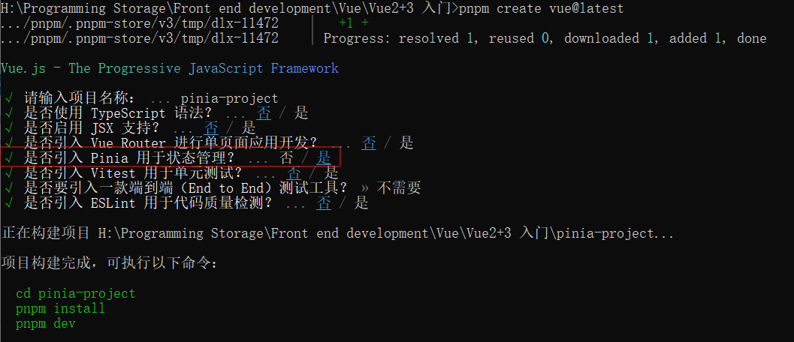
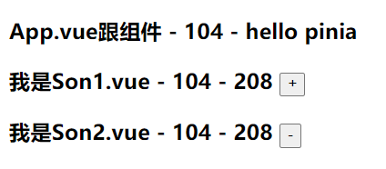
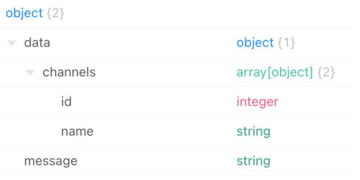
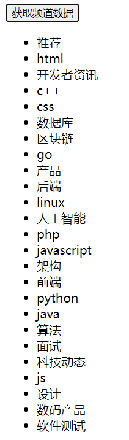
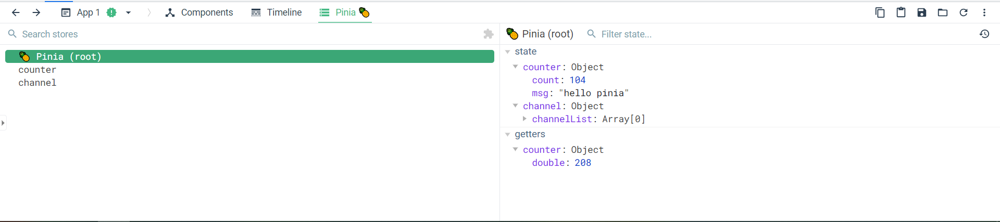

# 第五章 | pinia快速入门

## 什么是Pinia？

Pinia 是 Vue 的最新状态管理工具，是 Vuex 的替代品

所谓状态管理工具，就是要怎样**优雅地实现跨层级组件间的数据通信和状态共享**

### 相比于Vuex

1. 提供更加简单的API（去掉了mutation）
2. 提供符合，组合式风格的API
3. 去掉了 modules 的概念，每一个 store 都是一个独立的模块
4. 配合 TypeScript 更加友好，提供可靠的类型推断

## 添加Pinia到Vue项目

1. 安装pinia

```bash
npm install pinia
```

2. 配置 pinia 实例

```javascript
// main.js

import { createApp } from 'vue'
import { createPinia } from 'pinia'
import App from './App.vue'

const pinia = createPinia() // 创建Pinia实例
const app = createApp(app) // 创建根实例

app.use(pinia) // pinia插件的安装配置
app.mount('#app') // 视图的挂载
```

往后的话可以直接使用Vite创建项目自动创建就可以了

```bash
npm create vue@latest
```



## 核心概念

### 定义 Store

1. 定义 store
2. 组件使用 store

示例：

```vue
// components/Son1Com.vue
<script setup>
import { useConuterStore } from '../store/counter'

const counterStore = useConuterStore()
</script>

<template>
  <h3>
    我是Son1.vue - {{ counterStore.count }} - {{ counterStore.double }}
    <button @click="counterStore.addCount">+</button>
  </h3>
</template>
```

```vue
// components/Son2Com.vue
<script setup>
import { useConuterStore } from '../store/counter'

const counterStore = useConuterStore()
</script>

<template>
  <h3>
    我是Son2.vue - {{ counterStore.count }} - {{ counterStore.double }}
    <button @click="counterStore.subCount">-</button>
  </h3>
</template>
```

```javascript
// store/counter.js

import { defineStore } from 'pinia'
import { ref } from 'vue'

// 定义 store
export const useCounterStore = defineStore('counter', () => {
  // 声明数据 state - count
  const count = ref(100)
  // 声明数据 state - msg
  const msg = ref('hello pinia')
  // 声明操作数据方法 action
  const addCount = () => count.value++
  const subCount = () => count.value--

  // 声明基于数据派生的计算属性 getters
  const double = computed(() => count.value * 2)
  return {
    count,
    msg,
    addCount,
    subCount,
  }
})
```

```vue
// App.vue

<script setup>
import Son1Com from '@/components/Son1Com.vue'
import Son2Com from '@/components/Son2Com.vue'
import { useCounterStore } from '@/store/counter.js'
  
const counterStore = useCounterStore()
</script>

<template>
	<div>
    <h3>App.vue跟组件 - {{ counterStore }} - {{ counterStore.msg}}</h3>
    <Son1Com></Son1Com>
 	  <Son2Com></Son2Com>
  </div>
</template>
```



### action异步实现

异步action函数的写法和组件中获取异步数据的写法完全一致

示例：

+ 接口：http://geek.itheima.net/v1_0/channels

+ 请求方法：get

+ 请求参数：无

+ 数据结构：

  

1. 先安装axios

```bash
pnpm add axios
```

2. 新建channel.js

```javascript
// src/store/channel.js

import axios from 'axios'
import { defineStore } from 'pinia'
import { ref } from 'vue'

export const useChannelStore = defineStore('channel', () => {
  const channelList = ref([])
  
  const getList = async() => {
    const {
      data: { data }
    } = await axios.get(`http://geek.itheima.net/v1_0/channels`)
    channelList.value = data.channels
  }
  return {
    channelList,
    getList
  }
})
```

```vue
// App.vue
<script setup>
import { useChannelStore } from './store/channel'
  
const { channelList } = storeToRefs(channelStore)
const { getList } = channelStore
</script>

<template>
	<button @click="channelStore.getList">
    获取频道数据
  </button>
	<ul>
  	<li v-for="item in channelStore.channelList" :key="item.id">
      {{ item.name }}
  	</li>
  </ul>
</template>
```



### storeToRefs工具函数

使用storeToRefs函数可以辅助保持数据( state + getter )的响应式解构

示例：

改造上面的代码

```vue
// App.vue

<script setup>
import { storeToRefs } from 'pinia'
  
const { count, msg } = storeToRefs(counterStore)
const { getList } = channelStore
</script>

<template>
	<button @click="getList">
  	获取频道数据
  </button>
	<ul>
    <li v-for="item in channelList" :key="item.id">
  		{{ item.name }}
  	</li>
  </ul>
</template>
```

## Pinia的调试

Vue官方的 dev-tools 对 Pinia直接支持进行调试



:::tip

如果你在 dev-tools 里没有看到 Pinia 的话，可以试试这样改

```javascript
// main.js

// const app = createApp(App)
// app.mount('#app')

createApp(App).use(pinia.use(presisit).mount('#app'))
```

:::

## Pinia 持久化插件

官方文档：[https://prazdevs.github.io/pinia-plugin-persistedstate/zh/](https://prazdevs.github.io/pinia-plugin-persistedstate/zh/)

1. 安装插件 `pinia-plugin-persistedstate`

::: code-tabs#shell

@tab pnpm

```bash
pnpm i pinia-plugin-persistedstate
```

@tab:active npm

```bash
npm i pinia-plugin-persistedstate
```

:::

2. 导入

```javascript
// main.js

import persist from 'pinia-plugin-persistedstate'
...
const pinia = createPinia()
app.use(pinia.use(persist))
```

3. 开启本地持久化

```javascript
// src/store/counter.js

export const useCounterStore = defineStore('counter', () => {
  ...
}, {
  // persist: true // 开启当前模块的持久化
  persist: {
    key: 'XX-counter', // 修改本地存储的唯一标识，存储的键名
    paths: ['count'] // 存储的是哪些数据
  }
})
```

