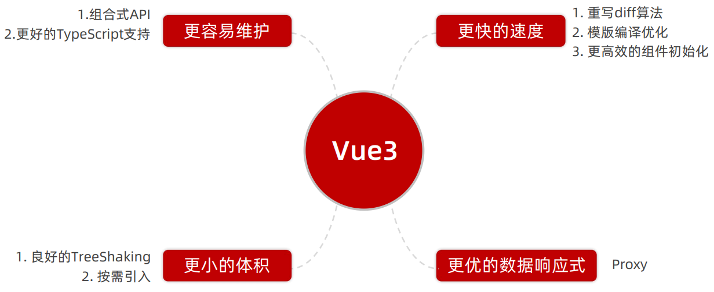
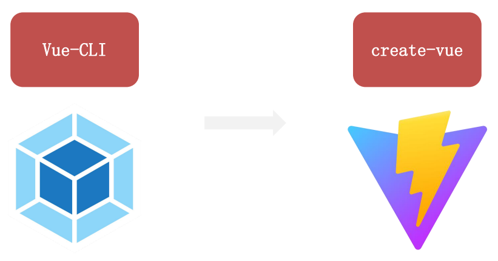
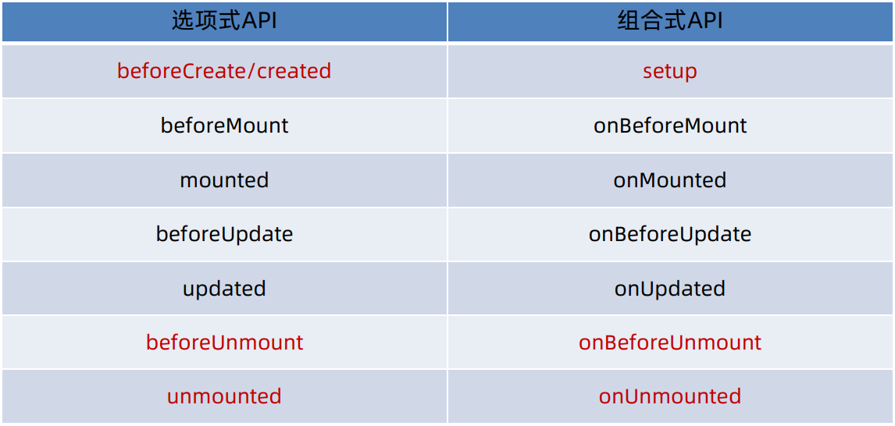
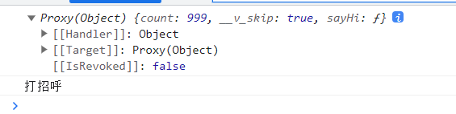
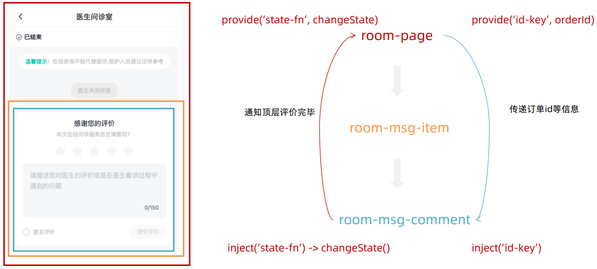
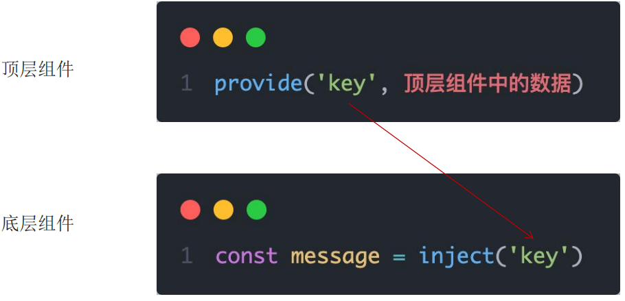
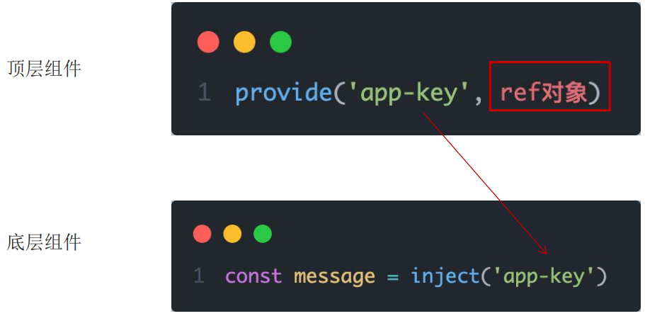
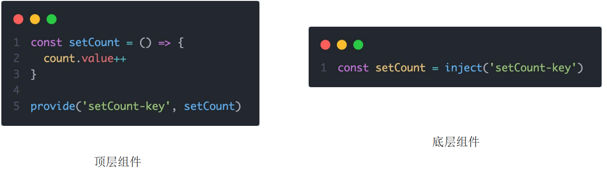
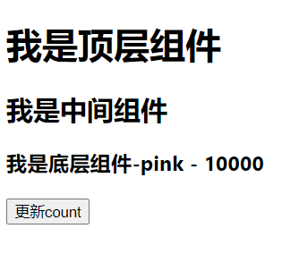

# 第四章 | Vue3 入门

## Vue3 的优势



## Vue2 选项式 API :vs: Vue3 组合式 API

```vue
<!-- vue2 -->
<script>
export default {
  data() {
    return {
      count: 0
    }
  },
  methods: {
    addCount() {
      this.count++
    }
  }
}
</script>
```

```vue
<!-- vue3 -->
<script setup>
import { ref } from 'vue'
const count = ref(0)
const addCount = () => count.value++
</script>
```

1. 代码量更少了
2. 分散式维护转为集中式维护，更易封装复用

## 使用create-vue创建项目

### 什么是create-vue？

create-vue是Vue官方新的脚手架工具，底层切换到了 vite，为开发提供极速响应。



### 创建项目

:::info 前置条件

请确保你的Node.js ≥ 16.0

:::

```
npm init vue@latest
```


启动项目

```bash
npm run dev
```

### 目录结构

```txt
├── .vscodde
│   ├── extensions.json
├── node_modules
├── public
├── src
│   ├── ...
│   ├── App.vue
│   └── main.js
├── index.html
├── package-lock.json
├── package.json
├── README.md
└── vite.config.js
```

+ `.vscode/extensions.json`  用于记录vscode已安装的扩展程序的信息
+ `node_modules`  用于存放下载安装的包
+ `public`  存放与业务逻辑无关的静态资源
+ `src/App.vue`  应用程序的跟组件
+ `src/main.js` 入口文件
+ `index.html`  单页入口
+ `package.json`  项目包文件
+ `vite.config.js`  项目的配置文件

## setup选项

### 什么时候写setup？

在 beforeCreate钩子之前写

```vue
<script>
export default {
  setup() {
    
  },
  beforeCreate() {
    
  }
}
</script>
```

### setup中写代码的特点

在setup函数中写的数据和方法需要在末尾以对象的方式return，才能给模板用

```vue
<script>
export default {
  setup() {
    const message = 'this is message'
    const logMessage = () => {
      console.log(message)
    }
    // 必须return才可以
    return {
      message,
      logMessage
    }
  }
}
</script>
```

### script setup 语法糖

每次都要写 `export default { setup() {}}` 有点太麻烦了

因此有了 `<script setup>` 语法糖，它会默认添加导出语句

```vue
<script setup>
const message = 'this is message'
const logMessage = () => {
  console.log(message)
}
</script>
```

:::warning 注意

setup中的this指向undefined

:::

## reactive 和 ref 函数

### reactive()

接收对象类型数据的参数传入并返回一个响应式对象

```vue
<script setup>
import { reactive } from 'vue'
  
const state = reactive({
  msg: 'this is msg'
})
const setSate = () => {
  state.msg = 'this is new msg'
}
</script>

<template>
	{{ state.msg }}
	<button @click="setState">change msg</button>
</template>
```

### ref()

接收简单类型或者对象类型的数据传入并放回一个响应式的对象

```vue
<script setup>
import { ref } from 'vue'
  
const count = ref(0)
const setCount = () => {
  count.value++
}
</script>

<template>
	<button @click="setCount">{{ count }}</button>
</template>
```

### reactive :vs: ref

1. 都是用来生成响应式数据
2. 不同点
   1. reactive不能处理简单类型的数据
   2. ref参数类型支持更好，但是必须通过.value做访问修改
   3. ref函数内部的实现依赖于reactive函数

:::tip 提示

一般使用ref函数

:::

## computed

计算属性基本思想和Vue2保持一致，只不过修改了API写法

```vue
<script setup>
import { computed, ref } from 'vue'
  
const list = ref([1, 2, 3, 4, 5, 6, 7, 8])
const computedList = computed(() => {
  return list.value.filter(item => item > 2)
})

const addFn = () => {
  list.value.push(666)
}
</script>

<template>
	<div>
    <div>原始数据：{{ list }}</div>
    <div>计算后的数据：{{ computedList }}</div>
    <button @click="addFn" type="button">修改</button>
  </div>
</template>
```

## watch

侦听一个或者多个数据的变化，数据变化时执行回调函数，immediate控制立刻执行，deep开启深度侦听

### 1. 侦听单个数据

写法：

```vue
watch(ref对象, (newValue, oldValue) => { ... })
```

示例：

```vue
<script setup>
import { ref, watch } from 'vue'
  
const count = ref(0)
// 调用watch侦听变化
watch(count, (newValue, oldValue) => {
  console.log(`count发生了变化，老值为${oldValue}, 新值为${newValue}`)
})
</script>
```

### 2. 侦听多个数据

侦听多个数据，第一个参数可以改写成数组的写法

写法：

```vue
watch([ref对象1, ref对象2], (newArr, oldArr) => { ... })
```

示例：

```vue
<script setup>
import { ref, watch } from 'vue'
  
const count = ref(0)
const name = ref('cp')

watch([count, name], ([newCount, newName], [oldCount, oldName]) => {
  console.log(`count或者name变化了，[newCount, newName], [oldCount, oldName]`)
})
</script>
```

### 3. immediate

在侦听器创建时立即发出回调，响应式数据变化之后继续执行回调

```vue
<script setup>
import { ref, watch } from 'vue'
  
const count = ref(0)

watch(count, (newValue, oldValue) => {
  console.log(`count发生了变化，老值为${oldValue}，新值为${newValue}`)
}, {
  immediate: true
})
</script>
```

### 4. deep

通过watch监听的ref对象默认是**浅层侦听**，直接修改嵌套的对象属性不会触发回调执行，开启了deep之后，就会监听到个别数据的更换。

浅层侦听：只有修改了对象的地址才能监视到

写法：

```vue
const ref1 = ref(简单类型) 可以直接监视
const ref2 = ref(复杂类型) 监视不到复杂类型内部数据的变化
```

示例：

```vue
<script setup>
import { ref, watch } from 'vue'

const userInfo = ref({
  name: 'zs',
  age: 18
})
const setUserinfo = () => {
  userInfo.value.age++
}

watch(userInfo, (newValue) => {
  console.log(newValue)
}, {
  deep: true
})
</script>
```

### 5. 对于对象中的单个属性，进行监视

```vue
<script setup>
import { ref, watch } from 'vue'

const userInfo = ref({
  name: 'zs',
  age: 18
})
const setUserinfo = () => {
  userInfo.value.age++
}

watch(
  // 固定写法
	() => ueserInfo.value.age,
  (newValue, oldValue) => {
    console.log(newValue, oldValue)
  }
)
</script>
```

## 生命周期函数

### 选项式与组合式



### 用法

```vue
<script setup>
import { onMounted } from 'vue'

onMounted(() => {
  // 自定义逻辑
})
</script>
```

#### 多次执行

当生命周期函数执行多次时，会按照顺序依次执行

```vue
<script setup>
import { onMounted } from 'vue'

onMounted(() => {
  // 自定义逻辑
})

onMounted(() => {
  // 自定义逻辑
})
</script>
```

示例：

```vue
<script setup>
import { onMounted } from 'vue'
  
const getList = () => {
  setTimeout(() => {
    console.log('发送请求，获取数据')
  }, 2000)
}

// 进入页面的请求
getList()
  
// 如果有些代码需要在mounted生命周期中年执行
onMounted(() => {
  console.log('mounted生命周期函数 - 逻辑1')
})

// 写成函数的调用方式，可以调用多次，并不冲突，按照顺序执行
onMounted(() => {
  console.log('mounted生命周期函数 - 逻辑2')
})
</script>
```

## 父子通信

### 父传子

基本思想：

1. 给子组件，添加属性的方式传值
2. 子组件内部通过props选项接收数据

示例：

```vue
// App.vue

<script setup>
import sonComVue from './son-com.vue'
</script>

<template>
	<!-- 1. 绑定属性 message -->
	<sonComVue message="this is app message"></sonComVue>
</template>
```

```vue
// son-com.vue

<script setup>
// 2. 通过 defineProps "编译器宏" 接收子组件传递的数据
  const props = defineProps({
    message: String
  })
</script>

<template>
 {{ message }}
</template>
```

### 子传父

1. 在子组件内部，emit触发事件
2. 在父组件，通过@监听

示例：

```vue
// App.vue
<script setup>
import sonComVue from './son-com.vue'
  
const getMessage = (msg) => {
  console.log(msg)
}
</script>

<template>
	<!-- 1. 绑定自定义事件 -->
	<sonComVue @get-message="getMessage"></sonComVue>
</template>
```

```vue
// ./son-com.vue

<script setup>
// 2. 通过 defineEmits 编译器宏生成emit方法
const emit = defineEmits(['get-message'])

const sendMsg = () => {
  // 3. 触发自定义事件并传递参数
  emit('get-message', 'this is son msg')
}
</script>

<template>
	<button @click="sendMsg">
    sendMsg
  </button>
</template>
```

### 总结

父传子：defindProps 

子传父：defindEmits

## 模板引用

通过ref表示获取真实的DOM对象或者组件实例对象

实例：

通过一进入页面让输入框聚焦

```vue
// test-com.vue

<template>
	<div>
    我是用于测试的组件
  </div>
</template>
```

```vue
// App.vue

<script setup>
import { onMounted, ref } from 'vue'
import TestCom from './test-com.vue'
  
const inp = ref(null)
onMounted(() => {
  console.log(inp.value)
  inp.value.focus()
})
</script>

<template>
	<div>
    <input ref="inp" type="text">
    <button>点击让输入框聚焦</button>
  </div>
	<TestCom ref="testRef"></TestCom>
</template>
```

除了一进入页面聚焦以外，还可以通过点击按钮让输入框聚焦

改造上面`App.vue`的代码

```vue
// App.vue

<script setup>
onMounted(() => {
  // ...
})
const clickFn = () => {
  inp.value.focus()
}
</script>

<template>
	<button @click="clickFn">
    点击输入框将聚焦
  </button>
</template>
```

### defineExpose

默认情况下在 `<script setup>` 语法糖下组件内部的属性和方法时不开放给父组件访问的，可以通过defineExpose编译宏指定哪些属性和方法可以访问

```vue
// test-com.vue

<script setup>
const count = 999
const sayHi = () => {
  console.log('打招呼')
}
defineExpose({
  count,
  sayHi
})
</script>
```

```vue
// App.vue

<script setup>
import TestCom from './test-com.vue'
import { ref } from 'vue'
  
const testRef = ref(null)
const getCom = () => {
  console.log(testRef.value)
  testRef.value.sayHi()
}
</script>

<template>
	<button @click="getCom">
    获取组件
  </button>
</template>
```



## provide 和 inject

### 作用

实现跨层组件通信



这样做就不用一层一层的传递消息了

### 跨层传递普通数据

实现步骤：

1. 顶层组件通过provide函数提供数据
2. 底层组件通过inject函数获取数据



### 跨层传递响应式数据

在调用provide函数时，第二个参数设置为ref对象



### 跨层传递方法

跨层组件可以向底层组件传递方法，底层组件调用方法修改顶层组件中的数据



示例：

```vue
// App.vue

<script setup>
import CenterCom from './center-com.vue'
import { provide, ref } from 'vue'
  
// 1. 跨层传递普通数据
provide('theme-color', 'pink')
  
// 2. 跨层传递响应式数据
const count = ref(100)
provide('count', count)

setTimeout(() => {
  count.value = 500
}, 2000)
  
// 3. 跨层传递函数 => 给子孙后代传递可以修改数据的方法
provide('changeCount', (newCount) => {
  count.value = newCount
})
</script>

<template>
	<div>
    <h1>我是顶层组件</h1>
  </div>
	<CenterCom></CenterCom>
</template>
```

``` vue
// center-com.vue

<script setup>
import BottomCom from './bottom-com.vue'
</script>

<template>
	<div>
    <h2>我是中间组件</h2>
    <BottomCom></BottomCom>
  </div>
</template>
```

```vue
// bottom-com.vue

<script setup>
import { inject } from 'vue'

// 1. 接收顶层普通数据
const themeColor = inject('theme-color')
// 2. 接收顶层响应式数据
const count = inject('count')
// 3. 接收顶层函数
const changeCount = inject('changeCount')

const clickFn = () => {
  changeCount(1000)
}
</script>

<template>
	<div>
    <h3>我是底层组件-{{ themeColor }} - {{ count }}</h3>
    <button @click="clickFn">更新count</button>
  </div>
</template>
```



## defineOptions

在以前Vue2的时代，是可以这样写代码的

```vue
<script>
const app = new Vue({
  setup() {
    ...
  },
  props: ...,
  emits: ...
})
</script>
```

这样的话就是说`setup`与`props`、`emits`等这些属性是平级的一个关系

但是Vue3之后，`setup`变成了语法糖的形式，尽管引入了 `defineProps` 和 `defineEmits` 这两个宏，但也只是解决了 props 和 emits 这两个属性，如果要定义其他组件，那就变成了这样：

```vue
<script>
export default {
  name: 'LoginIndex'
}
</script>

<script setup>

</script>

<template>
	<div>
    登录页
  </div>
</template>
```

这就变成了两个 `<script>` 标签，这不是脱裤子放屁嘛~

因此就有了 defineOptions

```vue
<script setup>
defineOptions({
  name: 'Foo',
  inheritAttrs: false,
  // ... 更多自定义属性
})
</script>
```

这样的好处就是终于可以定义任意的选项了

## defineModel

可以快速实现双向绑定

在 Vue2 里面，v-model = :value + @input

而在 Vue3 里面，v-model = :modelValue + @update:modelValue

相当于传递了一个 modelValue 属性，同时触发 update:modelValue 事件

我们需要先定义 props，再定义 emits 。其中有许多重复的代码。如果需要修改此值，还需要手动调用 emit 函数。

不懂？没关系，我也没懂，看看例子吧😂

示例：

现在需要封装一个输入框组件，用 v-model 做一个数据绑定

```vue
// App.vue

<script setup>
import MyInput from './my-input.vue'
import { ref } from 'vue'
  
const txt = ref('123456')
</script>

<template>
	<div>
    <MyInput v-model="txt"></MyInput>
    {{ txt }}
  </div>
</template>
```

```vue
// my-input.vue

<script setup>
defineProps({
  modelValue: String
})
const emit = defineEmits(['update:modelValue'])
</script>

<template>
	<div>
    <!-- @input 监听值是否更新 -->
    <input
    	type="text"
      :value="modelValue"
      @input="e => emit('update:modelValue', e.target.value)"
    >
  </div>
</template>
```

那如果用新版本的语法切换要怎么做呢？

```vue
// my-input.vue

<script setup>
import { defineModel } from 'vue'
const modelValue = defineModel()
</script>

<template>
	<div>
    <input 
     type="text"
     :value="modelValue"
     @input="e => modelValue = e.target.value"
    >
  </div>
</template>
```

然后你切换页面一看，欸，还是不行的？

问题不大，莫慌

```javascript
// vite.config.js

export default defineConfig({
  plugins: {
    vue({
      script: {
        defineModel: true
      }
    })
  }
})
```

然后重启一下框架就可了

:::warning

这个只是一个实验性质的属性，保不准以后还会改，所以看不懂就不要死磕在这里了，赶紧去看下一章吧~~~

:::

