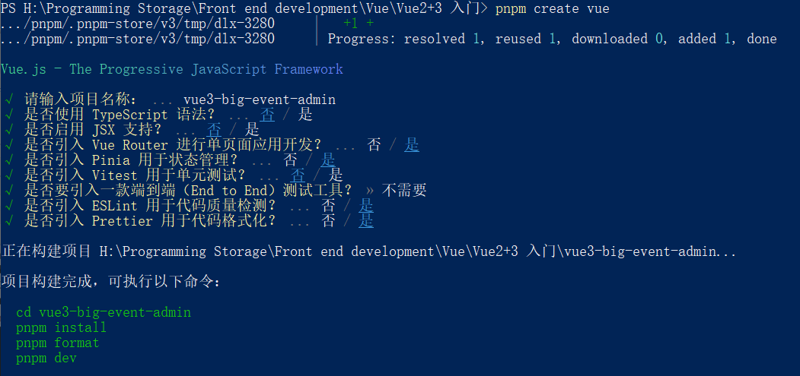
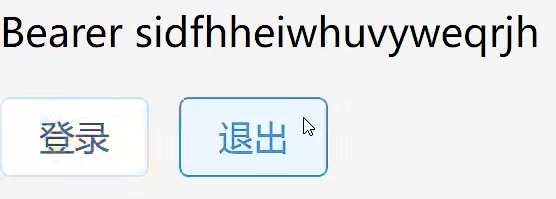
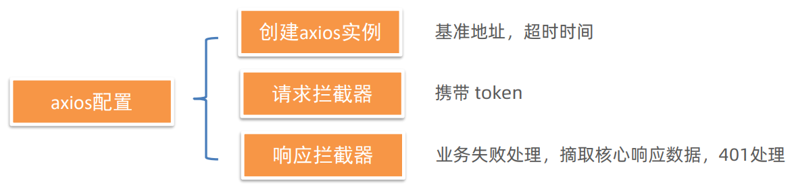

# 一、项目介绍与创建

[在线演示](https://fe-bigevent-web.itheima.net/login)

[接口文档](https://apifox.com/apidoc/shared-26c67aee-0233-4d23-aab7-08448fdf95ff/api-93850835)


## 本项目技术栈

ES6、Vue3、Pinia、Vue-Router、Vite、Axios、ElementPlus

## 创建项目

使用 pnpm 包管理器


1. 安装方式：

```bash
npm install -g pnpm
```

2. 创建项目：

```bash
pnpm create vue
```



3. 安装依赖：

```bash
pnpm install
```

4. 运行

```bash
pnpm dev
```

## 配置代码风格

主要使用 ESLint 和 Prettier

+ ESLint 主要是规范代码

+ Prettier 主要是美化代码风格

### 环境同步

1. 安装了插件 ESLint，开启保存自动修复
   
2. 禁用插件 Prettier，关闭保存自动格式化

```json
// vscode下面的setting.json

// ESlint插件 + Vscode配置 实现自动格式化修复
"editor.codeActionsOnSave": {
    "source.fixAll": true
},
"editor.formatOnSave": false,
```

### 配置文件 .eslintrc.cjs

1. prettier 风格配置

   1. 单引号

   2. 不使用分号

   3. 每行宽度至多80字符

   4. 不加对象|数组最后逗号

   5. 换行符号不限制（win mac 不一致）

2. vue 组件名称多单词组成（忽略index.vue）

3. props 解构（关闭）

```jsx
// .eslintrc.cjs

rules: {
  'prettier/prettier': [
    'warn',
    {
      singleQuote: true, // 单引号
      semi: false, // 无分号
      printWidth: 80, // 每行宽度至多80字符
      trailingComma: 'none', // 不加对象|数组最后逗号
      endOfLine: 'auto' // 换行符号不限制（win mac 不一致）
    }
  ],
  'vue/multi-word-component-names': [
    'warn',
    {
      ignores: ['index'] // vue组件名称多单词组成（忽略index.vue）
    }
  ],
  'vue/no-setup-props-destructure': ['off'], // 关闭 props 解构的校验
  // 💡 添加未定义变量错误提示，create-vue@3.6.3 关闭，这里加上是为了支持下一个章节演示。
  'no-undef': 'error'
}
```

### 配置 husky 代码检查工作流

husky 是一个 git hooks 工具，能在提交代码前做检查

1. 初始化 git 仓库

```bash
git init
```

2. 初始化 husky 工具配置

```bash
pnpm dlx husky-init && pnpm install
```

3. 更改配置

```jsx
// .husky/pre-commit

// npm test
pnpm lint
```

这样就可以对整个工程文件进行 **全量检查**

是的，它会把所有文件都扫一遍，这样就会造成整个项目会非常耗时，且别人看到这代码的时候会很混乱。

解决这个问题其实也不难，使用暂存区就可以了

#### 暂存区 eslint 校验

当代码写到一部分的时候，可以先提交到暂存区，暂存区之后再提交到仓库。

1. 安装 lint-staged 包

```bash
pnpm i lint-staged -D
```

2. `package.json` 配置 `lint-staged` 命令

```json
// package.json

{
  "scripts": {
    ...,
    "lint-staged": "lint-staged"
  },
  "devDependencies":{
  	...
	},
  "lint-staged": {
    "*.{js,ts,vue}": [
      "eslint --fix"
    ]
  }
}
```

3. `.husky/pre-commit` 文件修改

```jsx
// .husky/pre-commit

// pnpm lint
pnpm lint-staged
```

这样的话，每当我们修改某一段代码，它只会对某一个文件进行校验

## 调整目录

```txt
src
├── api(新增)
├── assets
│   └── .(删除)
│   ├── avatar.jpg(新增)
│   ├── cover.jpg(新增)
│   ├── default.png(新增)
│   ├── login_bg.jpg(新增)
│   ├── login_title.jpg(新增)
│   ├── logo.png(新增)
│   ├── logo2.png(新增)
│   └── main.scss(新增)
├── components
│   └── .(删除)
├── router
│   └── index.js(修改)
├── stores
│   └── .(删除)
├── utils(新增)
├── views
│   └── .(删除)
├── App.vue(修改)
└── main.js
```

+ `src/api/` 存放请求函数
+ `src/assets/` 存放静态资源
+ `src/components/` 存放公共组件
+ `src/router/` 存放路由
+ `src/stores/` 存放仓库模块，需要在页面引用才会初始化
+ `src/utils/` 存放自己封装的工具函数

```javascript
// src/router/index.js

import { createRouter, createWebHistory } from 'vue-router'

const router = createRouter({
  history: createWebHistory(import.meta.env.BASE_URL),
  routes: []
})

export default router
```

```vue
// src/App.vue

<template>
  <div>
    <router-view></router-view>
  </div>
</template>

<style scoped></style>
```

```javascript
// src/main.js

import { createApp } from 'vue'
import { createPinia } from 'pinia'
import App from './App.vue'
import router from './router'
import '@/assets/main.scss'

const app = createApp(App)

app.use(createPinia())
app.use(router)
app.mount('#app')
```

安装 sass 依赖

```bash
pnpm add sass -D
```

## VueRouter4 路由代码解析

```javascript
// src/router/index.js

// 按需导入
import { createRouter, createWebHistory } from 'vue-router'

// createRouter 创建路由实例，===> new VueRouter()
const router = createRouter({
  // 配置模式
  // 1. history模式: createWebHistory()   http://xxx/user
	// 2. hash模式: createWebHashHistory()  http://xxx/#/user
  
  // import.meta.env.BASE_URL 是路由的基准地址，加了什么前面就默认有什么，默认是 '/'，可以在 vite.config.ts 统一配置 base: my-path，路由这就会加上 my-path 前缀了
  history: createWebHistory(import.meta.env.BASE_URL),
  // 配路由规则
  routes: []
})

export default router
```

其中，`import.meta.env.BASE_URL` 是Vite 环境变量，具体看[这里](https://cn.vitejs.dev/guide/env-and-mode.html)

其实 `hash` 模式的地址中间有 #，而 `history` 模式中间没有 #

一般使用 `history` 模式

## 引入 ElementUI 组件库

[官方文档](https://element-plus.org/zh-CN/)

1. 安装组件库

```bash
pnpm add element-plus
```

2. 按需导入，安装插件

```bash
pnpm add -D unplugin-vue-components unplugin-auto-import
```

3. 配置文件实现自动导入

```javascript
// vite.config.js

...
import AutoImport from 'unplugin-auto-import/vite'
import Components from 'unplugin-vue-components/vite'
import { ElementPlusResolver } from 'unplugin-vue-components/resolvers'

export default defineConfig({
  plugins: [
    ...
    AutoImport({
      resolvers: [ElementPlusResolver()]
    }),
    Components({
      resolvers: [ElementPlusResolver()]
    })
  ]
})
```

## Pinia - 构建用户仓库 和 持久化

[官方文档](https://prazdevs.github.io/pinia-plugin-persistedstate/zh/)

### 构建用户仓库

```javascript
// src/stores/user.js

import { defineStore } from 'pinia'
import { ref } from 'vue'

export const useUserStore = defineStore('big-user', () => {
  const token = ref('')
  const setToken = (newToken) => {
    token.value = newToken
  }
  const removeToken = () => {
    token.value = ''
  }
  
  return {
    token,
    setToken,
    removeToken
  }
})
```

```vue
// src/App.vue

<srcipt setup>
import { useUserStore } from '@/stores/user'

const userStore = useUserStore()
</srcipt> 

<template>
	<div>
    <p>{{ useUserStore.token }}</p>
    <el-button @click="userStore.setToken('Bearer ...')">登录</el-button>
    <el-button @click="userStore.removeToken()">退出</el-button>
  </div>
</template>
```



现在，仓库构建完成

但是，如果一刷新页面，你会发现登录的信息又没有了，那是因为没有做持久化的原因，我们只需要加上一些东西就可以持久化啦~

1. 安装插件

```bash
pnpm add pinia-plugin-persistedstate -D
```

2. 使用 main.js

```javascript
// main.js

import persist from 'pinia-plugin-persistedstate'
...
app.use(createPinia().use(persist))
```

3. 配置文件

```javascript
// src/stores/user.js

export const useUserStore = defineStore({
  ...
}, {
  persist: true // 持久化
})
```

这样操作以后，就完成了持久化的操作啦~ :smile:

### 统一管理

当然，为了未来能够更好的维护，我们还需要改进一下代码来避免 main.js 过于臃肿

```javascript
// src/stores/index.js

import { createPinia } from 'pinia'
import persist from 'pinia-plugin-persistedstate'

const pinia = createPinia()
pinia.use(persist)

export default pinia
```

```javascript
// src/main.js

// import { createPinia } from 'pinia'
// import persist from 'pinia-plugin-persistedstate'
import pinia from '@/stores/index'
```

## Axios 数据交互 - 请求工具设计



一般需要使用 axios 来请求后端接口，一般会对 axios 进行一些配置

1. 安装 axios

```bash
pnpm add axios
```

2. 封装 axios 模块

```javascript
// src/utils/request.js

import axios from 'axios'
import { useUserStore } from '@/stores'
import { ElMessage } from 'element-plus'

const baseURL = 'http://big-event-vue-api-t.itheima.net'

const instance = axios.create({
  // TODO 1. 基础地址，超时时间
  baseURL,
  timeout: 10000 // 10秒
})

// 请求拦截器
instance.interceptors.request.use(
  (config) => {
    // TODO 2. 携带token
    const useStore = useUserStore()
    if (useStore.token) {
      config.headers.Authorization = useStore.token
    }
    return config
  },
  (err) => Promise.reject(err)
)

// 响应拦截器
instance.interceptors.response.use(
  (res) => {
    // TODO 3. 处理业务失败
    // TODO 4. 摘取核心响应数据
    if (res.data.code === 0) {
      return res
    }
    // 处理业务失败，给错误提示，抛出错误
    ElMessage.error(res.data.message || '服务异常 ')
    return Promise.reject(res.data)
  },
  (err) => {
    // TODO 5. 处理401错误
    if (err.response?.status === 401) {
      router.push('/login')
    }
    // 错误的默认情况
    ElMessage.error(err.response.data.message || '服务异常')
    return Promise.reject(err)
  }
)

export default instance
export { baseURL }
```

## 整体路由设计

路由的设计其实可以理解为一个项目的框架，搭建好路由能够让你更加清楚什么页面加在什么位置，需要做什么页面

**约定路由规则**

```txt
src
├── views
│   └── article
│   │   ├── ArticleManage.vue
│   │   └── ArticleChannel.vue
│   ├── layout
│   │   └── LayoutContainer.vue
│   ├── login
│   │   └── LoginPage.vue
│   ├── user
│   │   ├── UserProfile.vue
│   │   ├── UserAvatar.vue
└── └── └── UserPassword.vue
```

文件                        | 功能      | 组件名          | 路由级别 |
---------------------------| --------- | --------------- | -------- |
login/LoginPage.vue        | 登录&注册 | LoginPage       | 一级路由 |
layout/LayoutContainer.vue | 布局架子  | LayoutContainer | 一级路由 |
article/ArticleManage.vue  | 文章管理  | ArticleManage   | 二级路由 |
article/ArticleChannel.vue | 频道管理  | ArticleChannel  | 二级路由 |
user/UserProfile.vue       | 个人详情  | UserProfile     | 二级路由 |
user/UserAvatar.vue        | 更换头像  | UserAvatar      | 二级路由 |
user/UserPassword.vue      | 重置密码  | UserPassword    | 二级路由 |

明确以后，就可以去 `router` 下面配规则了

```javascript
// src/router/index.js

const router = createRouter({
  routes: [
    { path: '/login', component: () => import('@/views/login/LoginPage.vue') },
    {
      path: '/',
      component: () => import('@/views/layout/LayoutContainer.vue'),
      redirect: '/article/manage',
      children: [
        {
          path: '/article/manage',
          component: () => import('@/views/article/ArticleManage.vue')
        },
        {
          path: '/article/channel',
          component: () => import('@/views/article/ArticleChannel.vue')
        },
        {
          path: '/user/profile',
          component: () => import('@/views/user/UserProfile.vue')
        },
        {
          path: '/user/avatar',
          component: () => import('@/views/user/UserAvatar.vue')
        },
        {
          path: '/user/password',
          component: () => import('@/views/user/UserPassword.vue')
        }
      ]
    }
  ]
})
```

然后去到 `App.vue` 加载这些路由界面

```vue
// src/App.vue

<template>
	<div>
    <router-view></router-view>
  </div>
</template>
```

