# Vue3小兔鲜项目

## 项目初始化

### 创建项目

```bash
pnpm create vue
```

Project name: vue3-rabbit

选择yes的项目：

Vue Router

pinia

ESlint

Prettier

### jsconfig.json配置别名路径

配置别名路径可以在写代码时提示路径（仅提示，不做路径转换）

```json
// 根目录下创建jsconfig.json

{
  "compilerOptions": {
    "baseUrl": "./",
    "paths": {
      "@/*": ["src/*"]
    }
  }
}
```

### git管理项目

初始化git仓库

```bash
git init
git add .
git commit -m "init"
```

### ESLint & Prettier 配置代码风格

**环境同步**

1. **安装插件ESlint，开启保存自动修复**

```jsx
// ESlint插件 + VSCode配置，实现自动格式化修复
"editor.codeActionsOnSave": {
  "source.fixAll": true
},
"editor.formatOnSave": false
```

2. **禁用插件Prettier**，并关闭保存自动格式化

```jsx
// .eslintrc.cjs

module.exports = {
  parserOptions: {
    ...
  },
  rules: {
    // prettier 风格配置
    'prettier/prettier': [
      'warn',
      {
        singleQuote: true, // 单引号
        semi: false, // 无分号
        printWidth: 80, // 每行宽度至多80字符
        trailingComma: 'none', // 不加对象|数组最后逗号
        endOfLine: 'auto' // 换行符号不限制（win mac 不一致）
      }
    ],
    // vue组件名称多单词组成(忽略index.vue)
    'vue/multi-word-component-names': [
      'warn',
      {
        ignores: ['index'] // vue组件名称多单词组成（忽略index.vue）
      }
    ],
    'vue/no-setup-props-destructure': ['off'], // 关闭 props 解构的校验
    // 💡 添加未定义变量错误提示，create-vue@3.6.3 关闭，这里加上是为了支持下一个章节演示。
    'no-undef': 'error'
  }
}
```

### elementPlus引入

#### 1. 安装elementPlus和自动导入插件

```bash
pnpm i elementPlus
pnpm add -D unplugin-vue-components unplugin-auto-import
```

#### 2. 配置自动按需导入

```js
// vite.config.js

// 引入插件
import AutoImport from 'unplugin-auto-import/vite'
import Components from 'unplugin-vue-components/vite'
import { ElementsPlusResolver } from 'unplugin-vue-components/resolvers'

export default defineConfig({
  plugins: [
    // 配置插件
    AutoImport({
      resolvers: [ElementPlusResolver()]
    }),
    Components({
      resolvers: [ElementPlusResolver()]
    })
  ]
})
```

#### 3. 验证组件有没有成功

1. 先把 App.vue 的内容删除掉
2. 添加 elementPlus 组件中的 el-button

```vue
<template>
	<el-button type="primary"></el-button>
</template>
```

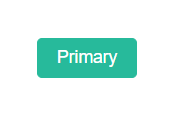

### 定制elementPlus主题

#### 1. 安装sass

```bash
pnpm add -D sass
```

#### 2. 准备定制化的样式文件

```scss
// src/styles/element/index.scss

/* 只需要重写你需要的即可 */
@forward 'element-plus/theme-chalk/src/common/var.scss' with (
  $colors: (
    'primary': (
      // 主色
      'base': #27ba9b,
    ),
    'success': (
      // 成功色
      'base': #1dc779,
    ),
    'warning': (
      // 警告色
      'base': #ffb302,
    ),
    'danger': (
      // 危险色
      'base': #e26237,
    ),
    'error': (
      // 错误色
      'base': #cf4444,
    ),
  )
)
```

#### 3. 导入配置

1. 配置elementPlus采用sass样式配色系统
2. 自动导入定制化样式文件进行样式覆盖

```js
export default defineConfig({
  plugins: [
    ...,
    Components({
    	resolvers: [
    		// 1. 配置elementPlus采用sass样式配色系统
    		ElementPlusResolver({ importStyle: "sass" })
 		  ]
    })
  ],
  resolve:{...},
  css: {
    preprocessorOptions: {
      // 2. 自动导入定制化样式文件进行样式覆盖
      additionalData: `@use "@/styles/element/index.scss" as *`
    }
  }
})
```

### axios安装并封装

#### 1. 安装axios

```bash
pnpm add axios
```

#### 2. 基础配置

> 1. 实例化 - baseURL + timeout
> 2. 拦截器 - 携带token 401拦截等

``` javascript
// src/utils/http.js

import axios from 'axios'

// 创建axios实例
const httpInstance = axios.create({
  baseURL: 'http://pcapi-xiaotuxian-front-devtest.itheima.net'
  timeout: 5000 // 5秒
})

// axios请求拦截器
httpInstance.interceptors.request.use(
	(config) => {
    return config
  },
  (e) => Promise.reject(e)
)

// axios响应拦截器
httpInstance.interceptors.response.use(
	(res) => res.data,
  (e) => {
    return Promise.reject(e)
  }
)

export default httpInstance
```

#### 3. 封装请求函数

```javascript
// src/apis/testApi.js

import httpInstance from '@/utils/http'

export function getCategory(){
  return httpInstance({
    url: 'home/catefory/head'
  })
}
```

#### 4. 测试函数

```javascript
// src/main.js

import { getCategory } from '@/apis/testApi'
getCategory().then((res) => {
  console.log(res)
})
```

返回结果：

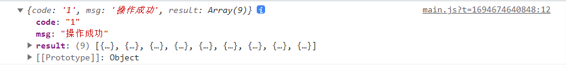

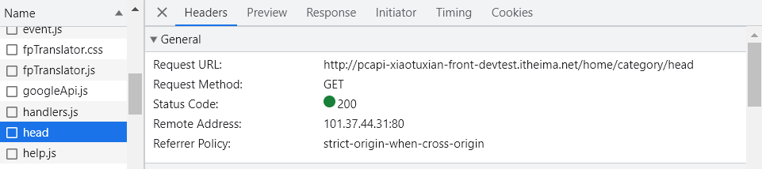

### 路由整体设计

1. 如果是整个页面进行切换的，则为一级路由
2. 如果是在一级路由内部切换的，则为二级路由

#### 一级路由

```vue
// src/views/Layout/index.vue

<template>首页</template>
```


```vue
// src/views/Login/index.vue

<template>登录页</template>
```

```javascript
// src/router/index.js

import Login from '@/views/Login/index.vue'
import Layout from '@/views/Layout/index.vue'

const router = createRouter({
  ...,
  routes: [
  	{ path: '/', component: Layout },
    { path: '/login', component: Login }
  ]
})
```

```vue
// src/App.vue

<template>
	<!-- 一级路由出口组件 -->
	<RouterView></RouterView>
</template>
```

#### 二级路由

``` vue
// src/views/Home/index.vue

<template>Home</template>
```

```vue
// src/views/Category/index.vue

<template>分类</template>
```

```javascript
// src/router/index.js

import Home from '@/views/Home/index.vue'
import Category from '@/views/Category/index.vue'

const router = createRouter({
  ...,
  routes: [
  	{
  		path: '/',
  		component: Layout,
  		children: [
  			{ path: '', component: Home },
        { path: 'category', component: Category }
  		]
		},
  	...
  ]
})
```

```vue
// src/views/Layout/index.vue

<template>
	<div>
    首页
    <router-view></router-view>
  </div>
</template>
```

### 引入静态资源

> 1. 图片样式 - 把 images 文件夹放到 assets 目录下
> 2. 样式资源 - 把 common.scss 文件放到 styles 目录下

### scss自动导入

1. 新建文件var.scss
2. 在vite.config.js导入样式文件
3. 用就行了

```scss
// src/styles/var.scss

$xtxColor: #27ba9b;
$helpColor: #e26237;
$sucColor: #1dc779;
$warnColor: #ffb302;
$priceColor: #cf4444;
```

```javascript
// vite.config.js

css: {
  preprocessorOptions: {
    scss: {
      additionalData: `
				@use "@/styles/element/index.scss" as *;
				@use "@/styles/var.scss" as *;
			`
    }
  }
}
```

## Layout页

### 组件结构快速搭建

1. 在Layout文件夹下新建components文件夹
2. 在components下新建三个文件：LayoutNav.vue，LayoutHeader.vue，LayoutFooter.vue
3. CV静态结构
4. 在Layout/index.vue下引入三个文件

```vue
// src/views/Layout/index.vue

<script setup>
import LayoutNav from './components/LayoutNav.vue'
import LayoutHeader from './components/LayoutHeader.vue'
import LayoutFooter from './components/LayoutFooter.vue'
</script>

<template>
  <LayoutNav></LayoutNav>
  <LayoutHeader></LayoutHeader>
  <router-view></router-view>
  <LayoutFooter></LayoutFooter>
</template>
```

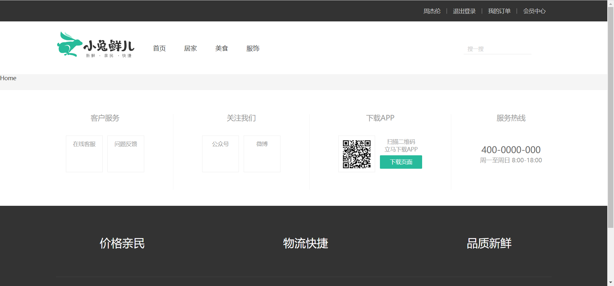

### 字体图标渲染

字体图标采用阿里矢量图标的字体图标库，直接在index.html引入就行

```html
<!-- index.html --> 

<link rel="stylesheet" href="//at.alicdn.com/t/font_2143783_iq6z4ey5vu.css">
```

### 一级导航渲染

1. 封装接口函数
2. 调用接口函数
3. v-for渲染模板

```javascript
// src/apis/layout.js

import httpInstance from '@/utils/http'

export function getCategoryApi(){
  return httpInstance({
    url: '/home/category/head'
  })
}
```

```vue
// src/views/Layout/components/LayoutHeader.vue

<script setup>
import { getCategoryApi } from '@/apis/layout'
import { onMounted, ref } from 'vue'
  
const categoryList = ref([])
const getCategory = async () => {
  const res = await getCategoryApi()
  categoryList.value = res.result
}

onMounted(() => {
  getCategory()
})
</script>

<template>
	<header>
  	<div>
      <h1>...</h1>
      <ul>
        <li v-for="item in categoryList" :key="item.id">
					<RouterLink to="/">{{ item.name }}</RouterLink>
  			</li>
  		</ul>
 	  </div>
  </header>
</template>
```

### 吸顶导航交互实现

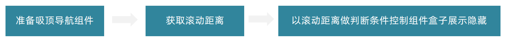

1. 在Layout/components下新建LayoutFixed.vue，准备静态结构
2. 获取滚动距离
3. 判断当前show类名是否显示，大于78显示，小于78不显示

```vue
// src/views/Layout/components/LayoutFixed.vue

<script setup>
import { useScroll } from '@vueuse/core'
const { y } = useScroll(window)
</script>

<template>
	<div class="app-header-sticky" :class="{ show: y > 78 }">
    ...
  </div>
</template>
<script scoped lang="scss">...</script>
```

```vue
// src/views/Layout/index.vue

<script setup>
import LayoutFixed from './components/LayoutFixed.vue'
</script>

<template>
	<LayoutFixed></LayoutFixed>
</template>
```

### Pinia优化重复请求

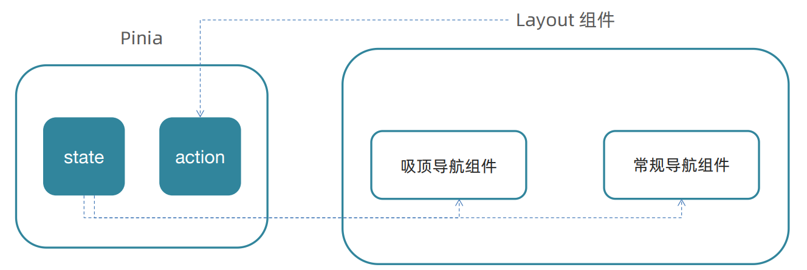

**为什么要优化？**

因为LayoutHeader和LayoutFixed所使用的数据都一样，这样会造成多次请求，浪费资源

**步骤**

1. 在stores下新建category.js，用来存放数据
2. 重构Layout下的index.vue
3. 在LayoutFixed.vue和LayoutHeader.vue使用pinia中的数据

``` javascript
// src/stores/category.js

import { ref } from 'vue'
import { defineStore } from 'pinia'
import { getCategoryApi } from '@/apis/layout'

export const useCategoryStore = defineStore('category', () => {
  const categoryList = ref([])
  const getCategory = async () => {
    const res = await getCategoryApi()
    categoryList.value = res.result
  }
  
  return {
    categoryList,
    getCategory
  }
})
```

```vue
// src/views/Layout/index.vue

<script setup>
import { useCategotyStore } from '@/stores/category'
import { onMounted } from 'vue'
  
const categoryStore = useCategoryStore()

onMounted(() => categoryStore.getCategory())
</script>
```

```vue
// src/views/Layout/components/LayoutFixed.vue

<script setup>
import { useCategoryStore } from '@/stores/category'
const categoryStore = useCategoryStore()
</script>

<template>
	<div>
    <div>
    	<ul>
      	<li class="home" 
            v-for="item in categoryStore.categoryList" 
            :key="item.id">
  				<RouterLink to="/">{{ item.name }}</RouterLink>
  			</li>  
  		</ul>  
  	</div>
  </div>
</template>
```

```vue
// src/views/Layoute/components/LayoutHeader.vue

<script setup>
import { useCategoryStore } from '@/stores/category'
const categoryStore = useCategoryStore()
</script>

<template>
	<header>
  	<div>
      <h1>...</h1>
    	<ul>
      	  <li class="home"
              v-for="item in categoryStore.categoryList"
              :key="item.id">
  					<RouterLink to="/">{{ item.name }}</RouterLink>
  				</li>
  		</ul>  
  	</div>
  </header>
</template>
```

## Home页

### 整体结构创建

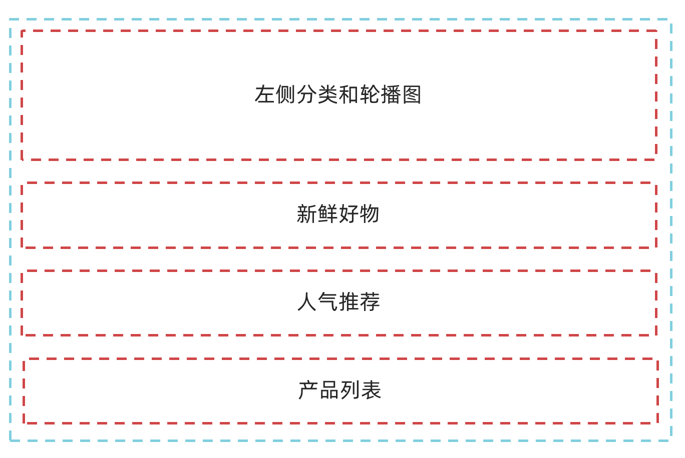

1. 在Home下新建文件夹components，新增五个组件
   - HomeCategory
   - HomeBanner
   - HomeNew
   - HomeHot
   - HomeProduce
2. 在Home的index.vue引入这五个组件

```vue
// src/views/Home/index.vue

<script setup>
import HomeCategory from './components/HomeCategory.vue'
import HomeBanner from './components/HomeBanner.vue'
import HomeNew from './components/HomeNew.vue'
import HomeHot from './components/HomeHot.vue'
import HomeProduct from './components/HomeProduct.vue'
</script>

<template>
	<div>
    <HomeCategory></HomeCategory>
    <HomeBanner></HomeBanner>
  </div>
	<HomeNew></HomeNew>
	<HomeHot></HomeHot>
	<HomeProduct></HomeProduct>
</template>
```

### 实现分类

1. 将模板CV到HomeCategory.vue
2. 完善代码

```vue
// src/views/Home/components/HomeCategory.vue

<script setup>
import { useCategoryStore } from '@/stores/category'
const categoryStore = useCategoryStore()
</script>

<template>
	<div>
    <ul>
    	<li v-for="item in categoryStore.categoryList" :key="item.id">
  			<RouterLink to="/">{{ item.name }}</RouterLink>
        <RouterLink v-for="i in item.children,slice(0, 2)" 
                    :key=i.id
                    to="/">
  				{{ i.name }}
  			</RouterLink>
        <!-- 弹层layer位置 -->
        <div>
        	<h4>...</h4>
          <ul>
  					<li v-for="i in item.goods" :key="i.id">
  						<RouterLink to="/">
  							
                <div>
                	<p class="name ellipsis-2">{{ i.name }}</p>
                  <p class="desc ellipsis">{{ i.desc }}</p>
                  <p class="price"><i>￥</i>{{ i.price }}</p>
  							</div>
  						</RouterLink>
  					</li>
  				</ul>
  			</div>
  		</li>  
  	</ul>
  </div>
</template>
```

### Banner轮播图实现

1. 在apis下新建home.js

```javascript
// src/apis/home.js

import httpInstance from '@/utils/http'

// 获取banner

export function getBannerApi() {
  return httpInstance({
    url: '/home/banner'
  })
}
```

2. 获取数据渲染模板，完善代码

```vue
// src/views/Home/components/HomeBanner.vue

<script setup>
import { getBannerApi } from '@/apis/home'
import { ref, onMounted } from 'vue'
  
const bannerList = ref([])
const getBanner = async () => {
  const res = await getBannerApi()
  bannerList.value = res.result
}

onMounted(() => getBanner())
</script>

<template>
	<div>
    <el-carousel>
  		<el-carousel-item v-for="item in bannerList" :key="item.id">
  			
  		</el-carousel-item>
  	</el-carousel>
  </div>
</template>
```

### 封装面板

1. 不做任何抽象，准备静态模板
2. 抽象可变的部分
   - 主标题和副标题是**纯文本**，可以抽象成**prop**传入
   - 主题内容是**复杂**的模板，抽象成**插槽**传入

```vue
// src/views/Home/components/HomePannel.vue

<script setup>
defineProps({
  // 主标题
  title: {
    type: String
  },
  // 副标题
  subTitle: {
    type: String
  }
})
</script>

<template>
	<div>
    <div>
      <div class="head">
        <!-- 主标题和副标题 -->
      	<h3>
        	{{ title }}
          <small>{{ subTitle }}</small>
  			</h3>  
  		</div>
      <slot />
  	</div>
  </div>
</template>
```

### 新鲜好物实现

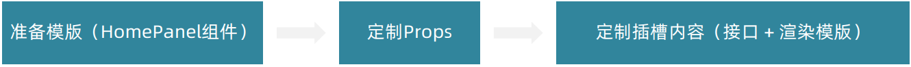

1. 准备模板
2. 封装接口

```javascript
// src/apis/home.js

/** 
* @description: 获取新鲜好物
* @param {*}
* @return {*}
*/
export const findNewApi = () => {
  return httpInstance({
    url: '/home/new'
  })
}
```

3. 渲染数据

```vue
// src/views/Home/components/HomeNew.vue

<script setup>
import HomePannel from './HomePannel.vue'
import { findNewApi } from '@/apis/home'
import { ref, onMounted } from 'vue'
  
// 获取数据
const newList = ref([])
const getNewList = async () => {
  const res = await findNewApi()
  newList.value = res.result
}

onMounted(() => getNewList())
</script>

<template>
	<HomePannel title="新鲜好物" subTitl="新鲜出炉 品质靠谱">
  	<ul class="goods-list">
    	<li v-for="item in newList" :key="item.id">
  			<RouterLink to="/">
  				
          <p class="name">{{ item.name }}</p>
          <p class="price">&yen;{{ item.price }}</p>
  			</RouterLink>
  		</li>  
  	</ul>
  </HomePannel>
</template>
```


### 人气推荐

1. 封装接口

```javascript
// src/apis/home.js

/**
 * @description: 获取人气推荐
 * @param {*}
 * @return {*}
 * */
export const findHotApi = () => {
  return httpInstance({
    url: '/home/hot'
  })
}
```

2. 渲染数据

```vue
// src/views/Home/components/HomeHot.vue

<script setup>
...
import { findHotApi } from '@/apis/home'
const HotList =ref([])
const getHotList = async () => {
  const res = await findHotApi()
  HotList.value = res.result
}
onMounted(() => getHotList())
</script>

<template>
  <HomePannel title="人气推荐" subTitle="人气爆款 不容错过">
    <ul class="goods-list">
      <li v-for="item in HotList" :key="item.id">
        <RouterLink to="/">
          
          <p class="name">{{ item.name }}</p>
          <p class="desc">{{ item.alt }}</p>
        </RouterLink>
      </li>
    </ul>
  </HomePannel>
</template>
```

### 图片懒加载实现

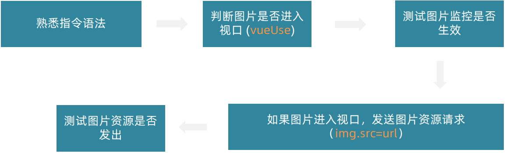

1. 封装全局指令

```javascript
// src/main.js

import { useIntersectionObserver } from '@vueuse/core'
app.directive('img-lazy', {
  mounted(el, binding) {
    useIntersectionObserver(el, ([{ isIntersecting }]) => {
      if (isIntersecting) {
        el.src = binding.value
      }
    })
  }
})
```

2. 实现图片懒加载

```vue
// src/views/Home/components/HomeHot.vue

<template>
	<HomePannel>
  	<ul>
    	<li>
  			<RouterLink>
  				
  			</RouterLink>
  		</li>  
  	</ul>
  </HomePannel>
</template>
```

但是，这样会把main.js写的太多太复杂，所以需要把它封装出去作为插件

而且，`useIntersectionObserver`是一直在监听的，浪费内存，图片都加载出来了就不需要再监听了

因此，改写如下：

```javascript
// src/directives/index.js

import { useIntersectionObserver } from '@vueuse/core'

export const lazyPlugin = {
  install(app) {
    app.directive('img-lazy', {
      mounted(el, binding) {
        const { stop } = useIntersectionObserver(el, ([{isIntersecting}]) => {
          if (isIntersecting) {
            el.src = binding.value
            stop()
          }
        })
      }
    })
  }
}

```

### Product产品列表实现

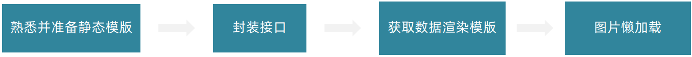

1. 准备静态模板
2. 封装接口

```javascript
// src/apis/home.js

/**
 * @description: 获取所有商品模块
 * @param {*}
 * @return {*}
 */
export const getGoodsApi = () => {
  return httpInstance({
    url: '/home/goods'
  })
}
```

3. 获取并渲染数据

``` vue
// src/views/Home/components/HomeProduct.vue

<script setup>
import HomePannel from './HomePannel.vue'
import { getGoodsApi } from '@/apis/home'
import { ref, onMounted } from 'vue'
  
const goodsProduct = ref([])
const getGoods = async () => {
  const res = await getGoodsApi()
  goodsProduct.value = res.result
}

onMounted(() => {
  getGoods()
})
</script>

<template>
	<div>
    <HomePannel>
  		...
  	</HomePannel>
  </div>
</template>
```

4. 图片懒加载

```vue
// src/views/Home/components/HomeProduct.vue

<template>
	<div>
    <HomePannel>
  		<div>
      	<RouterLink>
  				
  			</RouterLink>
        <ul>
        	<li>
  					<RouterLink>
  						
  					</RouterLink>
  				</li>  
  			</ul>
  		</div>
  	</HomePannel>
  </div>
</template>
```

### GoodsItem组件封装


1. 封装组件

```vue
// src/views/Home/components/GoodsItem.vue

<script setup>
defineProps({
  goods: {
    type: Object,
    default: () => {}
  }
})
</script>

<template>...</template>
```

2. 使用组件

```vue
// src/views/Home/components/HomeProduct.vue

<script setup>
import GoodsItem from './GoodsItem.vue'
</script>

<template>
	<div>
    <HomePannel v-for="cate in goodsProduct">
      ...
      <ul>
      	<li>
  				<GoodsItem :goods="goods"></GoodsItem>
  			</li>  
  		</ul>
  	</HomePannel>
  </div>
</template>
```

## 一级分类页

### 准备路由

1. 准备静态结构的搭建
2. 配置路由

```javascript
// src/router/index.js

routers: [
  {
    path: '/',
    component: Layout,
    children: [
      {...},
      { path: 'category/:id'}
    ]
  },
  ...
]
```

```vue
// src/views/Layout/components/LayoutHeader.vue

<template>
	<header>
  	<div>
    	<h1>...</h1>
      <ul>
  			<li>...</li>
        <li>
  				<RouterLink :to="`/category/${item.id}`">{{ item.name }}</RouterLink>
  			</li>
  		</ul>
  	</div>
  </header>
</template>
```

```vue
// src/views/Layout/components/LayoutFixed.vue

<template>
	<div>
    <div>
    	<ul>
      	<li></li>  
  		</ul>  
  	</div>
  </div>
</template>
```

### 面包屑导航

1. 准备静态组件模板
2. 封装接口

```javascript
// src/apis/category.js

import request from '@/utils/http'

export function getCategoryApi(id) {
  return request({
    url: '/category',
    params: {
      id
    }
  })
}
```

3. 渲染面包屑导航

```vue
// src/views/Category/index.vue

<script setup>
import { getCategoryApi } from '@/apis/category'
import { ref, onMounted } from 'vue'
import { useRoute } from 'vue-router'
  
const categoryData = ref({})
const route = useRoute()

const getCategory = async () => {
  const res = await getCategoryApi(route.params.id)
  categoryData.value = res.result
}

onMounted(() => {
  getCategory()
})
</script>

<template>
	<div>
    <div>
      <!-- 面包屑 -->
    	<div>
      	<el-breadcrumb-item :to="{ path: '/' }"></el-breadcrumb-item>
        <el-breadcrumb-item>{{ categoryData.name }}</el-breadcrumb-item>
  		</div>  
  	</div>
  </div>
</template>
```

### 一级分类-轮播图的实现

1. 适配接口

```javascript
// src/apis/home.js

export function getBannerApi(params = {}){
  // 默认为1，商品为2
  const { distributionSite = '1' } = params
  return httpInstance({
    url: '/home/banner',
    params: {
      distributionSite
    }
  })
}
```

2. 渲染banner

```vue
// src/views/Category/index.vue

<script setup>
import { getBannerApi } from '@/apis/home'

const bannerList = ref([])
const getBanner = async () => {
  const res = await getBannerApi({
    distributionSite: '2'
  })
  bannerList.value = res.result
}
onMounted(() => getBanner())
</script>

<template>
	<div>
    <div>
      <div class="bread-container">...</div>
      <div class="home-banner">
        <el-carousel height="500px">
  				<el-carousel-item v-for="item in bannerList" :key="item.id">
  					
  				</el-carousel-item>
  			</el-carousel>
  		</div>
 		</div>
  </div>
</template>
```

### 导航激活与分类列表渲染

#### 导航激活

```vue
// src/views/Layout/components/LayoutHeader.vue
// src/views/Layout/components/LayoutFixed.vue

<template>
	<RouterLink :to="`/category/${item.id}`" active-class="active">
  	{{ item.name }}
  </RouterLink>
</template>
```

#### 分类列表渲染

```vue
// src/views/Category/index.vue

<template>
	<div class="sub-list">
    <h3>全部分类</h3>
    <ul>
    	<li v-for="i in categoryData.children" :key="i.id">
  			<RouterLink to="/">
  				
          <p>{{ i.name }}</p>
  			</RouterLink>
  		</li>  
  	</ul>
  </div>
</template>
```

### 路由缓存问题

> 现在，如果你好奇心重一点的话，你会发现，从“居家”直接跳到“美食”上，页面是不会进行切换的，唯有重新点进去首页，再点到“美食”，页面才会重新加载到相对应的数据上。
>
> 这是因为vue3中，当用户从`/user/johny`，导航到`/users/jolyne`时，**相同的组件实例将会被重复使用，同时这也意味着组件的生命周期钩子不会被调用**。

解决思路：

1. 让组件实例不复用，强制销毁重建（但是会导致Banner图也跟着一起重新刷新）

```vue
// src/views/Layout/index.vue

<template>
	<router-view :key="$route.fullPath"></router-view>
</template>
```

2. 监听路有变化， 变化之后执行数据更新操作（使用`beforeRouteUpdate`钩子函数）

```vue
// src/view/Category/index.vue

<script setup>
import { onBeforeRouteUpdate } from 'vue-router'
  
const getCategory = async (id = route.params.id) => {
  const res = await getCategoryApi(id)
  categoryData.value = res.result
}
  
onBeforeRouteUpdate((to) => {
  getCategory(to.params.id)
})
</script>
```

### 基于业务逻辑的函数拆分

1. 按照业务声明以'use'打头的逻辑函数
2. 把独立的业务逻辑封装到各个函数内部
3. 函数内部把组件中需要用到的数据或者方法return出去
4. 在组件中调用函数把数据或者方法组合回来使用

```javascript
// src/views/Category/composables/useCategory.js

// 封装分类数据业务相关代码
import { onMounted, ref } from 'vue'
import { getCategoryApi } from '@/apis/category'
import { useRoute } from 'vue-router'
import { onBeforeRouteUpdate } from 'vue-router'

export function useCategory() {
  const categoryData = ref({})
  const route = useRoute()
  cconst getCategory = async (id = route.params.id) => {
    const res = await getCategoryApi(id)
    categoryData.value = res.result
  }
  onMounted(() => getCategory())
  
  onBeforeRouteUpdate((to) => {
    getCategory(to.params.id)
  })
  return {
    categoryData
  }
}
```

```javascript
// src/views/Category/composables/useBanner.js

// 封装Banner轮播图相关业务相关代码
import { ref, onMounted } from 'vue'
import { getBannerApi } from '@/apis/home'

export function useBanner() {
  const bannerList = ref([])
  const getBanner = async () => {
    const res = await getBannerApi({
      distributionSite: '2'
    })
    bannerList.value = res.result
  }
  onMounted(() => getBanner())
  
  return {
    bannerList
  }
}
```

```vue
// src/views/Category/index.vue

<script setup>
import GoodsItem from './Home/components/GoodsItem.vue'
import { useBanner } from './composables/useBanner'
import { useCategory } from './composables/useCategory'
  
const { bannerList } = useBanner()
const { categoryData } = useCategory()
</script>
```

## 二级路由

### 整体业务与路由配置

1. 准备组件模板(src/views/SubCategory/index.vue)
2. 配置路由关系

```javascript
// src/router/index.js

routes:[
  {
    ...
    children: [
      { path: 'category/sub/:id', component: SubCategory }
    ]
  }
]
```

3. 配置跳转

```vue
// src/views/Category/index.vue

<template>
	<div class="sub-list"> 
    <h3>全部分类</h3>
    <ul>
    	<li v-for="i in categoryData.children" :key="i.id">
  			<Routerlink :to="`/category/sub/${i.id}`">
  				
          <p>{{ i.name }}</p>
  			</Routerlink>
  		</li>  
  	</ul>
  </div>
</template>
```

### 二级分类面包屑导航

1. 准备接口

```javascript
// src/apis/category.js

/** 
* @description: 获取二级分类列表数据
* @param {*} id 分类id
* @return {*}
*/

export const getCategoryFilterAPI = (id) => {
  return request({
    url: '/category/sub/filter',
    params: {
      id
    }
  })
}
```

2. 获取数据渲染模板

```vue
// src/views/SubCategory/index.vue

<script setup>
import { getCategoryFIlterAPI } from '@/apis/category'
import {ref, onMounted } from 'vue'
import { useRoute } from 'vue-router'
  
// 获取面包屑导航数据
const categoryData = ref({})
const route = useRoute()
const getCategoryData = async () => {
  const res = await getCategoryFilterAPI(route.params.id)
  categoryData.value = res.result
}
onMounted(() => {
  getCategoryData()
})
</script>

<template>
	<div class="container">
    <div class="bread-container">
      <el-breadcrumb separator=">">
  			<el-breadcrumb-item :to="{ path: '/'}">首页</el-breadcrumb-item>
        <el-breadcrumb-item :to="{ path: `/category/${{ categoryData.parentId`}"
                            >
  				{{ categoryData.parentName }}
  			</el-breadcrumb-item>
  		</el-breadcrumb>
  	</div>
  </div>
</template>
```

### 分类基础列表实现

1. 准备接口

```javascript
// src/apis/category.js

/** 
* @description: 获取导航数据
* @data {
		categoryId: 1005000,
		page: 1,
		pageSize: 20,
		sortField: 'publishTime' | 'orderNum' | 'evaluateNum'
	}
* @return {*}
*/
export const getSubCategoryAPI = (date) => {
  return request({
    url: '/category/goods/temporay',
    method: 'POST',
    data
  })
}
```

2. 渲染获取到的数据列表

```vue
// src/views/SubCategory/index.vue

<script setup>
const goodList = ref([])
const reqData = ref({
  categoryId: route.params.id,
  page: 1,
  pageSize: 20,
  sortField: 'publishTime'
})
const getGoodList = async () => {
  const res = await getSubCategoryAPI(reqData.value)
  goodList.value = res.result.items
}
onMounted(() => {
  getGoodList()
})
</script>

<template>
	<div class="body">
  	<!-- 商品列表 -->
    <GoodsItem v-for="goods in goodList" :goods="goods" :key="goods.id">
  	</GoodsItem>
  </div>
</template>
```

### 列表筛选实现

```vue
// src/views/SubCategory/index.vue

<script setup>
const tabChange = () => {
  // 重置第一页
  reqData.value.page = 1
  getGoodList()
}
</script>

<template>
	<div class='sub-container'>
    <el-tabs v-model="reqData.sortField" @tab-change="tabChange">
  		<el-tab-pane label="最新商品" name="publishTime"></el-tab-pane>
      <el-tab-pane label="最高人气" name="orderNum"></el-tab-pane>
      <el-tab-pane label="评论最多" name="evaluateNum"></el-tab-pane>
  	</el-tabs>
  </div>
</template>
```

### 列表无限加载

```vue
// src/views/SubCategory/index.vue

<script setup>
const disabled = ref(false)
const load = async () => {
  // 获取下一页的数据
  reqData.value.page++
  const res = await getSubCategoryAPI(reqData.value)
  goodList.value - [...goodList.value, ...res.result.items]
  // 加载完毕，停止监听
  if (res.result.items.length === 0) {
    disabled.value = true
  }
}
</script>

<template>
	<div class="body" v-infinite-scroll="load" 
       :infinite-scroll-disabled="disabled">
    <GoodsItem></GoodsItem>
  </div>
</template>
```

### 路由滚动行为定制

目的是为了跳转页面的时候能自动切换到顶部

```javascript
// src/router/index.js

const router = createRouter({
  // 路由滚动行为定制
  scrollBehavior(){
    return {
      top: 0
    }
  }
})
```

## 商品详情页

### 前期工作

1. 配置静态模板
2. 配置路由

```javascript
// src/router/index.js

import Detail from '@/views/Detail/index.vue'

const router = createRouter({
  routes: [
    {
      ...,
      children: [
      	path: 'detail/:id', component: Detail
      ]
    }
  ]
})
```

3. 绑定首页测试跳转

```vue
// src/views/Home/components/HomeNew.vue

<template>
	<HomePannel>
  	<ul>
    	<li>
  			<RouterLink :to='`/detail/${item.id}`'></RouterLink>
  		</li>  
  	</ul>
  </HomePannel>
</template>
```

### 渲染基础数据

1. 封装接口

```javascript
// src/apis/detail.js

import request from '@/utils/http'

export const getDetail = (id) => {
  return request({
    url: '/goods',
    params: {
      id
    }
  })
}
```

2. 获取数据渲染模型

```vue
// src/views/Detail/index.vue

<script setup>
import { getDetail } from '@/aps/detail'
import { ref, onMounted } from 'vue'
import { useRoute } from 'vue-router'

const goods = ref({})
const route = useRoute()
const getGoods = async () => {
  const res = await getDetail(route.params.id)
  goods.value = res.result
}

onMounted(() => {
  getGoods()
})
</script>

<template>
	<div class="container" v-if="goods.details">
    <div class="bread-container">
      <el-breadcrumb-item :to="{ path: '/' }">首页</el-breadcrumb-item>
      <el-breadcrumb-item 
      	:to="{ path: `/category/${goods.categories[1].id}`}">
  			{{ goods.categories[1].name }}
  		</el-breadcrumb-item>
      <el-breadcrumb-item
      	:to="{ path: `/category/sub/${goods.categories[0].id}`}">
  			{{ goods.categories[0].name s}}
  		</el-breadcrumb-item>
    </div>  
    <!-- 商品信息 -->
    <div>
    	<div>
      	<div class="goods-info">
          <div class="media"></div>
          <!-- 统计数量 -->
          <div class="spec">
            <!-- 商品信息 -->
            <p class="g-name">{{ goods.name }}</p>
            <p class="g-desc">{{ goods.desc }}</p>
            <p class="g-price">
  						<span>{{ goods.price }}</span>
              <span>{{ goods.oldPrice }}</span>
  					</p>
  				</div>
  			</div>
        <div class="goods-footer">
          ...
          <ul>
            <li v-for="item in goods.details.properties" 
                :key="item.value">
  						<span class="dt">{{ item.name }}</span>
              <span class="dd">{{ item.value }}</span>
  					</li>
  				</ul>
          <!-- 图片 -->
          
  			</div>
  		</div>
  	</div>
  </div>
</template>
```

**注意**

渲染模板时遇到对象的多层属性访问，会存在报错

```javascript
good.details.pictures
```

> TypeError: Cannot read properties of undefined (reading 'properties')

首次渲染的时候good可能是一个空对象，所以后面是选不到值的

解决办法：

1. 可选链
2. v-if控制渲染

```javascript
good.details?.[1].prctures

v-if="goods.details"
```

### 热榜区域

1. 准备静态模板
2. 添加路由

```javascript
// src/apis/detail.js

/**
* 获取热榜商品
* @param {Number} id - 商品id
* @param {Number} type - 1代表24小时热销榜 2代表周热销榜
* @param {Number} limit - 获取个数
*/
export const getHotGoodsAPI = ({id, type, limit = 3}) => {
  return request({
    url: '/goods/hot',
    params: {
      id,
      type,
      limit
    }
  })
}
```

3. 加载到页面

```vue
// src/views/Detail/index.vue

<script setup>
import DetailHot from './components/DetailHot.vue'
</script>

<template>
	...
	<div class=goods-aside>
    <!-- 24小时 -->
  	<DetailHot></DetailHot>
    <!-- 周 -->
    <DetailHot></DetailHot>
  </div>
</template>
```

4. 获取基础数据渲染模板

```vue
// src/views/Detail/components/DetailHot.vue

<script setup>
import { getHotGoodsAPI } from '@/aipis/detail'
import { ref, onMounted } from 'vue'
import { useRoute } from 'vue-router'
  
const hotList = ref([])
const route = useRoute()
const getHotList = async () => {
  const res = await getHotGoodsAPI({
    id: route.params.id,
    type: 1
  })
  hotList.value = res.result
}
onMounted(() => {
  getHotList()
})
</script>

<template>
	...
	<RouterLink class="goods-item" v-for="item in hotList" :key="item.id">
  	
    <p class="name ellipsis">{{ item.name }}</p>
    <p class="desc ellipsis">{{ item.desc }}</p>
    <p class="price">{{ item.price }}</p>
  </RouterLink>
</template>
```

5. 适配热榜标题

```vue
// src/views/Detail/components/DetailHot.vue

<script>
const props = defineProps({
  hotType: {
    type: Number
  }
})
</script>
```

```vue
// src/views/Detail/index.vue

<template>
	<div class="goods-aside">
    <DetailHot :hot-type="1"></DetailHot>
    <DetailHot :hot-type="2"></DetailHot>
  </div>
</template>
```

6. 适配热榜title

```vue
// src/views/Detail/components/DetailHot.vue

<script setup>
// 适配 title 1-24小时热榜  2-周热榜
const TYPEMAP = {
  1: '24小时热榜',
  2: '周热榜'
}
const title = computed(() => TYPEMAP[props.hotType])

const getHotList = async () => {
  const res = await getHotGoodsAPI({
    id: route.params.id,
    type: props.hotType
  })
  hotList.value = res.result
}
</script>

<template>
	<h3>{{ title }}</h3>
</template>
```

### 图片预览组件封装

#### 小图切换大图显示

1. 准备静态模板
2. 实现逻辑

```vue
// src/components/ImageView/index.vue

<script setup>
import { ref } from 'vue'
  
const activeIndex = ref(0)
const enterhandler = (i) => {
  activeIndex.value = i
}
</script>

<template>
	...
	<!-- 左侧大图 -->
	<div class="middle" ref="target">
    
  </div>
	<!-- -->
	<ul>
    <li v-for="(img, i) in imageList" 
        :key="i" 
        @mouseenter="enterhandler(i)"
        :class="{ active: i === activeIndex }"></li>
  </ul>
</template>
```

#### 放大镜效果显示

1. 获取鼠标相对位置

```vue
// src/components/ImageView/index.vue

<script setup>
import { useMouseInElement } from '@vueuse/core'

const target = ref(null)
const { elementX, elementY, isOutside } = useMouseInElement(target)
</script>
```

2. 滑块跟随鼠标移动

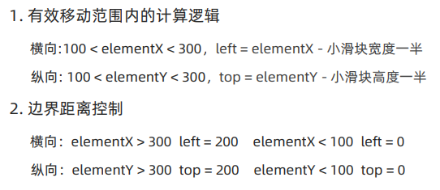

```vue
// src/components/ImageView/index.vue

<script setup>
const left = ref(0)
const top = ref(0)
watch([elementX, elementY, isOutside], () => {
  // 判断鼠标在图片里面
  if (isOutside.value) return
	// 有效范围内控制滑块距离
  // 横向
  if (elementX.value > 100 && elementX.value < 300) {
    left.value = elementX.value - 100
  }
  // 纵向
  if (elementY.value > 100 && elementY.value < 300) {
    top.value = elementY.value - 100
  }
  // 处理边界
  if (elementX.value > 300) {
    left.value = 200
  }
  if (elementX.value < 100) {
    left.value = 0
  }
  if (elementY.value > 300) {
    top.value = 200
  }
  if (elementY.value < 100) {
    top.value = 0
  }
})
</script>

<template>
	...
	<div>
    <!-- 蒙层小滑块 -->
    <div class="layer" :style="{ left: `${left}px`, top: `${top}px`}">
  	</div>
  </div>
</template>
```

#### 大图效果实现

```vue
// src/components/ImageView/index.vue

<script setup>
const positionX = ref(0)
const positionY = ref(0)
watch([elementX, elementY, isOutside], () => {
  ...
  // 控制大图的显示
  positionX.value = -left.value * 2
  positionY.value = -top.value * 2
})
</script>

<template>
	<!-- 蒙层小滑块 -->
	<div class="layer" :style="{ left: `${left}px`, top: `${top}px`}" 
       v-show="!isOutside">
  </div>
	<!-- 放大镜大图 -->
	<div class="large"
       :style="[
               {
               	backgroundImage: `url(${imageList[activeIndex]})`,
               	backgroundPositionX: `${positionX}px`,
               	backgroundPositionY: `${positionY}px`
               }
               ]"
       v-show="!isOutside">
  </div>
</template>
```

#### props适配图片列表

```vue
// src/components/ImageView/index.vue

<script setup>
defineProps({
  imageList: {
    type: Array,
    default: () => []
  }
})
</script>
```

```vue
// src/views/Detail/index.vue

<template>
	<!-- 商品信息 -->
	<div>
    <!-- 图片预览区 -->
    <ImageView :image-list="goods.mainPictures"></ImageView>
  </div>
</template>
```

#### sku熟悉

1. 复制XtxSku到 /src/components 下

2. 引入组件

```vue
// src/views/Detail/index.vue

<script setup>
import XtxSku from '@/components/XtxSku/index.vue'

// sku规格被操作时
const skuChange = (sku) => {
  console.log(sku)
}
</script>

<template>
	<!-- sku组件 -->
	<XtxSku :goods="goods" @change="skuChange"></XtxSku>
</template>
```

#### 全局组件插件化

1. 把components中的所有组件通过插件的方式进行全局化注册

```javascript
// src/components/index.js

import ImageView from './ImageView/index.vue'
import Sku from './XtxSku/index.vue'

export const componentPlugin = {
  install(app) {
    // app.component('组件名字', 组件配置对象)
    app.component('XtxImageView', ImageView)
    app.component('XtxSku', Sku)
  }
}
```

2. 插件注册

```javascript
// src/main.js

import { componentPlugin } from '@/components'

app.use(componentPlugin)
```

3. 验证

```vue
// src/views/Detail/index.vue

<script setup>
// 删掉引入
import ImageView from '@/components/ImageView/index.vue'
import XtxSku from '@/components/XtxSku/index.vue'
</script>

<template>
	<!-- 更改名字 -->
	<!-- 图片预览区 -->
	<XtxImageView ...></XtxImageView>
</template>
```

## 登录页面

### 前期工作

1. 准备静态模板
2. 配置路由跳转

```vue
// src/views/Layout/components/LayoutNav.vue

<template>
	...
	<li>
  	<a href="javascript:;" @click="$router.push('/login')"></a>
  </li>
</template>
```

### 校验功能

#### 基础校验

```vue
// src/views/Login/index.vue

<script setup>
import { ref } from 'vue'
// 表单校验(账户名+密码)
// 1. 准备表单对象
const form = ref({
  account: '',
  password: ''
})

// 2. 准备规则对象
const rules = {
  account: [{ reuqired: true, message: '用户名不能为空', trigger: 'blur' }],
  password: [
    { required: true, message: '密码不能为空', trigger: 'blur' },
    { min: 6, max: 14, message: '密码长度为6-14个字符', trigger: 'blur'}
  ]
}
</script>

<template>
	...
	<el-form-item prop="account" label="账户">
  	<el-input v-model="form.account"></el-input>
  </el-form-item>
	<el-form-item prop="password" label="密码">
  	<el-input v-model="form.password"></el-input>
  </el-form-item>
</template>
```

#### 自定义校验

```vue
// src/views/Login/index.vue

<script setup>
const rules = {
  ...,
  agree: [
  	{
  		validator: (rule, value, callback) => {
        if (value){
          callback()
        } else {
          callback(new Error('请勾选协议'))
        }
      }
		}
  ]
}
</script>

<template>
	...
	<el-form-item label-width="22px" prop="agree">
  	<el-checkbox size="large" v-model="form.agree">
  		我已同意隐私条款和服务条款
  	</el-checkbox>
  </el-form-item>
</template>
```

#### 表单统一校验

```vue
// src/views/Login/index.vue

<script setup>
const formRef = ref(null)
const doLogin = () => {
  formRef.value/validate((valid) => {
    if(valid){
      // TODO LOGIN
    }
  })
}
</script>

<template>
	...
	<el-button size="large" class="subBtn" @click="doLogin">
  	点击登录
  </el-button>
</template>
```

### 登录业务流程

> 用户名：xiaotuxian001
>
> 密码：123456

基础思想

1. 调用登录接口获取用户信息
2. 提示用户当前是否成功
3. 跳转到首页

```vue
// src/views/Login/index.vue

<script setup>
import { ElMessage } from 'element-plus'
import 'element-plus/theme-chalk/el-message.css'
import { useRouter } from 'vue-router'

const doLogin = () => {
  const { account, password } = form.value
  formRef.value.validate(async (valid) => {
    const res = await loginAPI({ account, password })
    // 1. 提示用户
    ElMessage({ type: 'success', message: '登录成功' })
    // 2. 跳转首页
    router.replace({ path: '/' })
  })
}
</script>
```

```javascript
// src/utils/http.js

httpInstance.interceptors.response.use(
	(res) => res.data,
  (e) => {
    // 统一错误提示
    ElMessage({
      type: 'warning',
      message: e.response.data.message
    })
    return Promise.reject(e)
  }
)
```

### Pinia管理数据

基本思想：Pinia负责用户数据相关的state和action，组件中只负责触发action函数并传递参数

```javascript
// src/stores/user.js

// 管理用户数据相关
import { defineStore } from 'pinia'
import { loginAPI } from '@/apis/user'
import { ref } from 'vue'

export const useUserStore = defineStore('user', () => {
  // 1. 定义管理用户数据的state
  const userInfo = ref({})
  // 2. 定义获取接口数据的action函数
  const getUserInfo = async ({ account, password }) => {
    const res = await loginAPI({ account, password })
    userInfo.value = res.result
  }
  // 3. 以对象的格式把state和action return
  return {
    userInfo,
    getUserInfo
  }
})
```

```vue
// src/views/Login/index.vue

<script setup>
// import { loginAPI } from '@/apis/user'
  
if (valid) {
  // const res = await loginAPI({ account, password })
  await userStore.getUserInfo({ account, password })
}
</script>
```

### Pinia持久化数据

1. 安装插件

`pnpm add pinia-plugin-persistedstate`

2. Pinia注册插件

```javascript
// src/main.js

import piniaPluginPersistedstate from 'pinia-plugin-persistedstate'

const pinia = createPinia()
pinia.use(piniaPluginPersistedstate)
app.use(pinia)
```

3. 需要持久化的store进行配置

```javascript
// src/stores/user.js

export const useUserStore = defineStore(
	...,
  {
  	persist: true
  }
)
```

### 根据登录是否显示的模板适配

思路：有几个需要适配的模板就准备几个template片段，通过条件渲染控制显示即可

```vue
// src/views/Layout/components/LayoutNav.vue

<script setup>
import { useUserStore } from '@/stores/user'
const userStore = useUserStore()
</script>

<template>
	...
	<template v-if="userStore.userInfo.token">...</template>
	<template>...</template>
</template>
```

### 请求拦截器携带Token

基础思想：很多接口如果想要获取数据必须要带着有效的Token信息才可以，拦截器中做一次，用到axios实例的其他都可以拿到

```javascript
// src/utils/http.js

import { useUserStore } from '@/stores/user'

httpInstance.interceptors.request.use(
	(config) => {
    // 1. 从pinia获取token数据
    const userStore = useUserStore()
    // 2. 按照后端的要求拼接token数据
    const token = userStore.userInfo.token
    if (token) {
      config.headers.Authorization = `Bearer ${token}`
    }
    return config
  },
  (e) => Promise.reject(e)
)
```

### 退出登录功能

1. 新增清除用户action

```javascript
// src/stores/user.js

const clearUserInfo = () => {
  userInfo.value = {}
}
return {
  clearUserInfo
}
```

2. 组件中执行退出登录业务

```vue
// src/views/Layout/components/LayoutNav.vue

<script setup>
import { useRouter } from 'vue-router'

const router = useRouter()
const confirm = () => {
  userStore.clearUserInfo()
  router.push('/login')
}
</script>

<template>
	...
	<el-popconfirm title="确认退出吗？" 
                 confirm-button-text="确认"
                 cancel-button-text="取消"
                 @confirm="confirm"></el-popconfirm>
</template>
```

### Token失效401拦截

```javascript
// src/utils/http.js

httpInstance.interceptors.response.use(
	...
  // 401 token失败处理
  if (e.response.status === 401) {
  	userStore.clearUserInfo()
  	router.push('/login')
	}
)
```

## 购物车

### 加入购物车实现

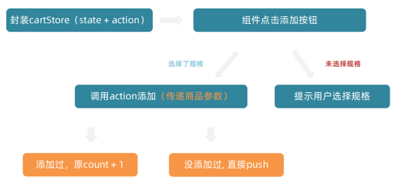

1. 封装cartStore

```javascript
// src/stores/cartStore.js

import { defineStore } from 'pinia'
import { ref } from 'vue'

export const useCartStore = defineStore('cart', () => {
  // 1. 定义state - cartList
  const cartList = ref([])
  // 2. 定义action - addCart
  const addCart = () => {
    // 添加购物车操作
  }
  return {
    cartList,
    addCart
  }
})
```

2. 组件点击添加按钮

```vue
// src/views/Detail/index.vue

<script setup>
// count
const count = ref(1)
const countChange = (count) => {
  console.log(count)
}
</script>

<template>
	<!-- 数据组件 -->
	<el-input-number v-model="count" @change="countChange"></el-input-number>
</template>
```

3. 判断逻辑，是否选择规格

> 获取sku里面的数据，获取到了就代表了是选择了

``` vue
// src/views/Detail/index.vue

<script setup>
import { useCartStore } from '@/stores/cartStore'
const cartStore = useCartStore()
  
let skuObj = {}
const skuChange = (sku) => {
  sukObj = sku
}

// 添加购物车
const addCart = () => {
  if (skuObj.skuId) {
    // 规则已经选择  触发action
    cartStore.addCart({
      id: goods.value.id,
      name: goods.value.name,
      picture: goods.value.mainPictures[0],
      price: goods.value.price,
      count: count.value,
      skuId; skuObj.skuId,
      attrsText: skuObj.specsText,
      selected: true
    })
    // 规则没有选择  提示用户
  } else {
    ElMessage.warning('请选择规格')
  }
}
</script>

<template>
	<!-- 按钮组件 -->
	<el-button size="large" class="btn" @click="addCart">加入购物车</el-button>
</template>
```

4. 查看是否有添加过商品规格

```javascript
// src/stores/cartStore.js

const addCart = (goods) => {
  // 通过匹配传递过来的商品对象中的skuId能不能在cartlist中找到，找到了就是添加过
  const item = cartList.value.find((item) => goods.skuId === item.skuId)
  if (item) {
    item.count++
  } else {
    cartList.value.push(goods)
  }
}
```

5. 开启本地存储

```javascript
// src/sotres/cartStore.js

export const useCartStore = defineStore(
	'cart',
  () => {...},
  {
    persist: true
  }
)
```

### 头部购物车

#### 列表渲染

1. 准备静态模板
2. 调用模板组件

```vue
// src/views/Layout/components/LayoutHeader.vue

<script setup>
import HeaderCart from './HeaderCart.vue'
</script>

<template>
	<!-- 头部购物车 -->
	<HeaderCart></HeaderCart>
</template>
```

3. 从pinia中获取数据渲染列表

```vue
// src/views/Layout/components/HeaderCart.vue

<script setup>
import { useCartStore } from '@/stores/cartStore'
const cartStore = useCartStore()
</script>

<template>
	...
	<i class="iconfont icon-cart"><em>{{ cartStore.cartList.length }}</em></i>
	...
	<div class="item" v-for="i in cartStore.cartList" :key="i">...</div>
</template>
```

#### 删除功能

```javascript
// src/stores/cartStore.js

const delCart = (skuId) => {
  const idx = cartList.value.findIndex((item) => skuId === item.skuId)
  cartList.value.splice(idx, 1)
}

return {
  delCart
}
```

```vue
// src/views/Layout/components/HeaderCart.vue

<template>
	<i class="iconfont icon-close-new" @click="cartStore.delCart(i.skuId)"></i>
</template>
```

#### 统计计算

```javascript
// src/stores/cartStore.js

const allCount = computed(() => 
	cartList.value.reduce((a, c) => a + c.count, 0)
)

const allPrice = computed(() => 
	cartList.value.reduce((a, c) => a + c.count * c.price, 0)
)
```

```vue
// src/views/Layout/components/HeaderCart.vue

<template>
	<div class="total">
    <p>共 {{ cartStore.allCount }} 件商品</p>
    <p>&yen; {{ cartStore.allPrice.toFixed(2) }}</p>
  </div>
</template>
```

### 列表购物车

#### 基本功能

1. 准备静态模板
2. 绑定路由

```javascript
// src/router/index.js

import CartList from '@/views/CartList/index.vue'

...
children: [
  ...,
  { path: 'cartlist', component: CartList }
]
```

3. 给按钮绑定跳转操作

```vue
// src/views/Layout/components/HeaderCart.vue

<template>
	<el-button size="large" type="primary" @click="$router.push('/cartlist')">
    去购物车结算
  </el-button>
</template>
```

4. 渲染列表数据

```vue
// src/views/CartList/index.vue

<script setup>
import { useCartStore } from '@/stores/cartStore'
const cartStore = useCartStore()
</script>

<template>
	<!-- 商品列表 -->
	<tr v-for="i in cartStore.cartList" :key="i.id">...</tr>
	
	<tr v-if="cartStore.cartList.length === 0">...</tr>
</template>
```

#### 单选功能实现

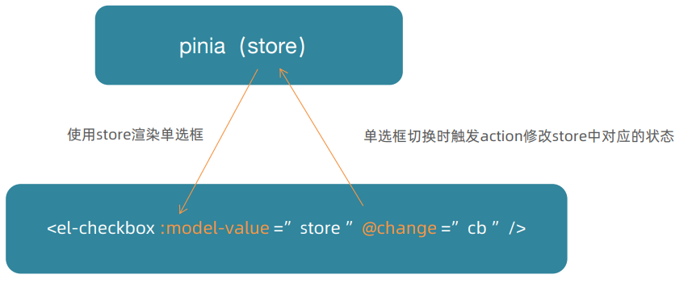

1. 渲染单选框

```vue
// src/views/CartList/index.vue

<script setup>
const singleCheck = (selected) => {
  // TODO 
}
</script>
<template>
	<!-- 单选框 -->
	<el-checkbox :model-value="i.selected" @change="singleCheck"></el-checkbox>
</template>
```

2. 单选框切换触发action修改store中对应的状态

```javascript
// src/stores/cartStore.js

const singleCheck = (skuId, selected) => {
  const item = cartList.value.find((item) => item.skuId === skuId)
  item.selected = selected
}
return {
  singleCheck
}
```

```vue
// src/views/CartList

<script setup>
const singleCheck = (i, selected) => {
  cartStore.singleCheck(i.skuId, selected)
}
</script>

<template>
	<!-- 单选框 -->
	<el-checkbox :model-value="i.selected" 
               @change="(selected) => singleCheck(i, selected)">
  </el-checkbox>
</template>
```

#### 全选功能

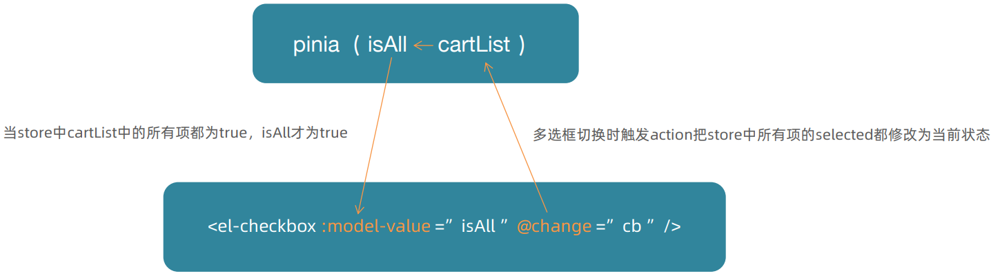

基础思想：

+ 全选状态决定单选框状态 - 遍历cartList把每一项的selected都设置为何全选框状态一致

+ 单选框状态决定全选状态 - 只有所有单选框的selected都为true, 全选框才为true

1. store中定义action和计算属性

```javascript
// src/stores/cartStore.js

// 全选功能
const allCheck = (selected) => {
  cartList.value.forEach((item) => (item.selected = selected))
}

// 是否全选
const isAll = computed(() => cartList.value.every((item) => item.selected))

return {
  isAll,
  allCheck
}
```

2. 组件中触发aciton和使用计算属性

```vue
// src/views/CartList/index.vue

<script setup>
const allCheck = (selected) => {
  cartStore.allCheck(selected)
}
</script>

<template>
	<!-- 全选框 -->
	<el-checkbox :model-value="cartStore.isAll" @change="allCheck">
  </el-checkbox>
</template>
```

#### 统计数据实现

```javascript
// src/stores/cartStore.js

// 3. 已选择数量
const selecctedCount = computed(() => 
	cartList.value
		.filter((item) => item.selected)
    .reduce((a, c) => a + c.count, 0)
)
// 4. 已选择商品价钱合计
const selecctedPrice = computed(() => 
	cartList.value
		.filter((item) => item.selected)
    .reduce((a, c) => a + c.count * c.price, 0)
)
```

```vue
// src/views/CartList/index.vue

<template>
	<!-- 操作栏 -->
	<div class="batch">
    共 {{ cartStore.allCount }} 件商品，已选择
    {{ cartStore.selectedCount }} 件，商品合计：
    <span class="red">￥ {{ cartStore.selectedPrice.toFixed(2) }}</span>
  </div>
</template>
```

### 接口购物车

#### 加入购物车

1. 接口封装

```javascript
// src/apis/cart.js

// 封装购物车相关接口
import request from '@/utils/http'

// 加入购物车
export const insertCartAPI = ({ skuId, count }) => {
  return requset({
    url: '/member/cart',
    method: 'POST',
    data: {
      skuId,
      count
    }
  })
}

// 获取最新的购物车列表
export const findNewCartListAPI = () => {
  return request({
    url: '/member/cart'
  })
}
```

2. 适配登录和非登录

```javascript
// src/stores/cartStore.js

import { insertCartAPI, findNewCartListAPI } from '@/apis/cart'

export const useCartStore = defineStore(
	'cart',
  () => {
    const userStore = useUserStore()
    const isLogin = computed(() => userStore.userInfo.token)
    ...
    const addCart = async (goods) => {
      const { skuId, count } = goods
      if (isLogin.value) {
        // 登录之后的加入购物车逻辑
        await insertCartAPI({ skuId, count })
        const res = await findNewCartListAPI()
        cartList.value = res.result
      } else {
        // 通过匹配传递过来的商品对象中的skuId能不能......
        ...
      }
    }
  }
)
```

#### 删除购物车

1. 更改原先本地购物车-删除购物车的代码结构

```javascript
// src/stores/cartStore.js

const delCart = async (skuId) => {
  if (isLogin.value) {
    // 调用接口实现接口购物车中的删除功能
  } else {
    // 原先本地购物车-删除购物车功能
  }
}
```

2. 封装接口

```javascript
// src/apis/cart.js

// 删除购物车
export const delCartAPI = (ids) => {
  return request({
    url: '/member/cart',
    method: 'DELETE',
    data: {
      ids
    }
  })
}
```

3. 由于有多个地方使用更新购物车列表action，因此封装action
4. 登录之后加入购物车逻辑

```javascript
// src/stores/cartStore.js

const updateNewList = async () => {
  const res = await findNewCartListAPI()
  cartList.value = res.result
}

const delCart = async (skuId) => {
  if (isLogin.value) {
    await delCartAPI([skuId])
    updateNewList()
  } else {
    ...
  }
}
  
const addCart = async (goods) => {
  const { skuId, count } = goods
  if (isLogin.value) {
    await insertCartAPI({ skuId, count })
    // const res = await findNewCartListAPI()
    // cartList.value = res.result
    updateNewList()
  } else {
    ...
  }
}
```

#### 退出登录时-清空购物车列表

1. 封装接口

```javascript
// src/stores/cartStore.js

// 清除购物车
const clearCart = () => {
  cartList.value = []
}
```

2. 调用接口

```javascript
// src/stores/user.js

import { useCartStore } from './cartStore'

export const useUserStore = defineStore(
	'user',
  () => {
    const cartStore = useCartStore()
    ...
    const clearUserInfo = () => {
      userInfo.value = {}
      // 执行清除购物车的action
      cartStore.clearCart()
    }
    return {
      ...
      clearUserInfo
    }
  }
)
```

#### 合并本地购物车到服务器

1. 封装接口

```javascript
// src/apis/cart.js

export const mergeCartAPI = (data) => {
  return request({
    url: '/member/cart/merge',
    method: 'POST',
    data
  })
}
```

2. 将cartStore.js中的updataNewList导出来

```javascript
// src/stores/cartStore.js

export const useCartStore = defineStore(
	'cart',
  () => {
    ...
    return {
      updateNewList
    }
  }
)
```

3. 合并购物车

```javascript
// src/stores/user.js

export const useUserStore = defineStore(
	'user',
  () => {
    ...
    const getUserInfo = async ({ account, password }) => {
      // 合并购物车操作
      await mergeCartAPI(
      	cartStore.cartList.map((item) => {
          return {
            skuId: item.skuId,
            selected: item.selected,
            count: item.count
          } 
        })
      )
      cartStore.updateNewList()
    }
  }
)
```

## 订单页（结算）

### 路由配置和基础数据渲染

1. 准备静态模板
2. 封装接口

```javascript
// src/apis/checkout.js

import request from '@/utils/http'

// 获取详情接口
export const getCheckInfoAPI = () => {
  return request({
    url: '/member/order/pre'
  })
}
```

3. 配置路由

```javascript
// src/router/index.js

import Checkout from '@/views/Checkout/index.vue'

const router =createRouter({
  ...
  routes: [
    {
      children: [
        { ... },
        { path: 'checkout', component： Checkout }
      ]
    }
  ]
})
```

4. 渲染数据

```vue
// src/views/Checkout/index.vue

<script setup>
import { getCheckInfoAPI } from '@/apis/checkout'
import { ref, onMounted } from 'vue'
  
const checkInfo = ref({})
const curAddress = ref({})
const getCheckInfo = async () => {
  const res = await getCheckInfoAPI()
  checkInfo.value = res.result
  // 适配默认地址
  // 从地址列表中筛选出来 isDefault === 0 那一项
  const item = checkInfo.value.userAddresses.find(
  	(item) => item.isDefault === 0
  )
  curAddress.value = item
}

onMounted(() => {
  getCheckInfo()
})
</script>
```

### 切换地址

#### 打开弹框交互

1. 准备静态模板

2. 控制弹框打开

```vue
// src/views/Checkout/index.vue

<script setup>
// 控制弹框打开
const showDialog = ref(false)
</script>

<template>
	<div class="action">
    <el-button size="large" @click="showDialog = true">
  		切换地址
  	</el-button>
  </div>
	<!-- 切换地址 -->
	<el-dialog v-model="showDialog">...</el-dialog>
</template>
```

#### 地址激活交互

```vue
// src/views/Checkout/index.vue

<script setup>
const acctiveAddress = ref({})
const switchAddress = (item) => {
  acctiveAddress.value = item
}
const confirm = () => {
  curAddress.value = activeAddress.value
  showDialog.value = false
  activeAddress.value = {}
}
</script>

<template>
	<!-- 切换地址 -->
	<div class="text item" 
       v-for="item in checkInfo.userAddresses"
       :key="item.id"
       @click="switchAddress(item)"
       :class="{ active: activeAddress.id === item.id }">
    ...
  </div>
</template>
```

### 创建订单生成订单ID

1. 准备静态模板
2. 设置路由

```javascript
// src/router/index.js

import Pay from '@/views/Pay/index.vue'

const router = createRouter({
  ...
  routes: [
    ...
    children: [
    	...
    	{ path: 'pay', component: Pay }
  	]
  ]
})
```

3. 生成订单接口

```javascript
// src/apis/checkout.js

// 创建订单
export const createOrderAPI = (data) => {
  return request({
    url: '/member/order',
    method: 'POST',
    data
  })
}
```

4. 调用接口携带ID跳转路由

```vue
// src/views/Checkout/index.vue

<script setup>
import { useRouter } from 'vue-router'
import { useCartStore } from '@/stores/cartStore'
const router = useRouter()
const cartStore = useCartStore()

// 创建订单
const createOrder = async () => {
  const res = await createOrderAPI({
    deliveryTimeType: 1,
    payType: 1,
    payChannel: 1,
    buyerMessage: '',
    goods: checkInfo.value.goods.map((item) => {
      return {
        skuId: item.skuId,
        count: item.count
      }
    }),
    addressId: curAddress.value.id
  })
  const orderId = res.result.id
  router.push({
    path: '/pay',
    query: {
      id: orderId
    }
  })
  // 更新购物车
  cartStore.updateNewList()
}
</script>

<template>
	<!-- 提交订单 -->
	<div class="submit">
    <el-button type="primary" size="large" @click="createOrder">
  		提交订单
  	</el-button>
  </div>
</template>
```

## 支付

### 基础数据渲染

1. 封装接口

```javascript
// src/apis/pay.js

import request from '@/utils/http'

export const getOrderAPI = (id) => {
  return request({
    url: `/member/order/${id}`
  })
}
```

2. 获取数据渲染内容

```vue
// src/views/Pay/index.vue

<script setup>
import { getOrderAPI } from '@/apis/pay'
import { ref, onMounted } from 'vue'
import { useRoute } from 'vue-router'
  
const route = useRoute()

// 获取订单数据
const payInfo = ref({})
const getPayInfo = async () => {
  const res = await getOrderAPI(route.query.id)
  payInfo.value = res.result
}

onMounted(() => {
  getPayInfo()
})
</script>
```

### 支付功能实现

```vue
// src/views/Pay/index.vue

<script setup>
// 跳转支付
// 携带订单id以及回调地址跳转到支付地址(get)
// 支付地址
const baseURL = 'http://pcapi-xiaotuxian-front-devtest.itheima.net/'
const backURL = 'http://127.0.0.1:5173/paycallback'
const redirectUrl = encodeURIComponent(backURL)
const payUrl = `${baseURL}pay/aliPay?orderId=${route.query.id}&redirect=${redirectUrl}`
</script>
```

| 账号     | [askgxl8276@sandbox.com](mailto:askgxl8276@sandbox.com) |
| -------- | ------------------------------------------------------- |
| 登录密码 | 111111                                                  |
| 支付密码 | 111111                                                  |

### 支付结果页

1. 准备静态模板
2. 绑定路由

```javascript
// src/router/index.js

import PayBack from '@/views/Pay/PayBack.vue'

children: [
  { path: 'paycallback', component: PayBack}
]
```

3. 渲染数据

```vue
// src/views/Pay/PayBack.vue

<script setup>
import { getOrderAPI } from '@/apis/pay'
import { ref, onMounted } from 'vue'
import { useRoute } from 'vue-router'
  
const route = useRoute()
const orderInfo = ref({})
const getOrderInfo = async () => {
  const res = await getOrderAPI(route.query.orderId)
  orderInfo.value = res.result
}

onMounted(() => {
  getOrderInfo()
})
</script>

<template>
	<!-- 支付结果 -->
	<div class="pay-result">
    <span class="iconfont icon-queren2 green" 
          v-if="$route.query.payResult === 'true'">
  	</span>
    <span class="iconfont icon-shanchu red" v-else></span>
    <p class="tit">
      支付{{ $route.query.payResutl === 'true' ? '成功' : '失败' }}
  	</p>
    ...
    <p>
    	支付金额: <span>￥{{ orderInfo.payMoney?.toFixed(2) }}</span>  
  	</p>
  </div>
</template>
```

### 封装倒计时函数

1. 封装函数

```javascript
// src/composables/useCountDown.js

// 封装倒计时逻辑函数
// 封装倒计时逻辑函数
import { ref, computed, onUnmounted } from 'vue'
import dayjs from 'dayjs'

export const useCountDown = () => {
  // 1. 响应式的数据
  let timer = null
  const time = ref(0)
  // 格式化时间 为 xx分xx秒
  const formatTime = computed(() => dayjs.unix(time.value).format('mm分ss秒'))
  // 2. 开启倒计时的函数
  const start = (currentTime) => {
    // 开始倒计时的逻辑
    // 核心逻辑的编写: 每隔1s件减1
    time.value = currentTime
    timer = setInterval(() => {
      time.value--
    }, 1000)
  }
  // 组件销毁时清除定时器
  onUnmounted(() => {
    timer && clearInterval(timer)
  })
  return {
    formatTime,
    start
  }
}
```

2. 渲染数据

```vue
// src/views/Pay/index.vue

<script setup>
import { useCountDown } from '@/composables/useCountDown.js'
  
const { formatTime, start } = useCountDown()

const getPayInfo = async () => {
  ...
  // 初始化倒计时描述
  start(res.result.countdown)
}
</script>

<template>
	<p>
    支付还剩<span>{{ formatTime }}...</span>
  </p>
</template>
```

## 会员中心

### 路由配置

1. 准备静态模板 src/views/Member/index.vue
2. 配置路由

```javascript
// src/router/index.js

import Member from '@/views/Member/index.vue'

const router = createRouter({
  routes: [
    ...,
    children: [
    	...
    	{ 
    		path: 'member', component: Member
    	}
  	]
  ]
})
```

3. 准备个人中心和我的订单路由组件模板 `src/views/Member/components/UserInfo.vue` 和`src/views/Member/components/UserOrder.vue`
4. 配置三级路由

```javascript
// src/router/index.js

import UserInfo from '@/views/Member/components/UserInfo.vue'
import UserOrder from '@/views/Member/components/UserOrder.vue'

const router = createRouter({
  routes: [
    {
      ...
      children: [
        ...
        {
          path: 'member',
          component: Member,
          children: [
            { path: 'user', component: UserInfo },
            { path: 'order', component: UserOrder }
          ]
        }
      ]
    }
  ]
})
```

5. 开启三级路由挂载点

```vue
// src/views/Member/index.vue

<template>
	<div class="article">
    <RouterView />
  </div>
</template>
```

### 个人中心信息渲染

#### 使用pinia数据渲染个人信息

```vue
// src/views/Member/components/UserInfo.vue

<script setup>
import { useUserStore } from '@/stores/user'
  
const userStore = useUserStore()
</script>

<template>
	<div class="home-overview">
    <!-- 用户信息 -->
    <div class="user-meta">
      <div class="avatar">
        
  		</div>
      <h4>{{ userStore.userInfo?.account }}</h4>
  	</div>
  </div>
</template>
```

#### 封装接口获取猜你喜欢的数据

1. 封装接口

```javascript
// src/apis/user.js

export const getLikeListAPI = ({ limit = 4 }) => {
  return request({
    url: '/goods/relevant',
    params: {
      limit
    }
  })
}
```

2. 渲染数据

```vue
// src/views/Member/components/UserInfo.vue

<script setup>
import { getLikeListAPI } from '@/apis/user'
import { ref, onMounted } from 'vue'
import GoodsItem from '@/views/Home/components/GoodsItem.vue'

const likeList = ref([])
const getLikeList = async () => {
  const res = await getLikeListAPI({ limit: 4 })
  likeList.value = res.result
}

onMounted(() => {
  getLikeList()
})
</script>

<template>
	<div class="like-container">
    <div class="goods-list">
      <GoodsItem v-for="good in likeList" :key="good.id" :goods="good" />
  	</div>
  </div>
</template>
```

### 我的订单渲染

#### 基础订单数据渲染

1. 封装接口

```javascript
// src/apis/order.js

import request from '@/utils/http'

/* 
params: {
	orderState: 0,
	page: 1,
	pageSize: 2
}
*/

export const getUserOrder = (params) => {
  return request({
    url: '/member/order',
    method: 'GET',
    params
  })
}
```

2. 渲染数据

```vue
// src/views/Member/components/UserOrder.vue

<script setup>
// 获取订单列表
const orderList = ref([])
const params = ref({
  orderState: 0,
  page: 1,
  pageSize: 2
})
const getOrderList = async () => {
  const res = await getUserOrder(params.value)
  orderList.value = res.result.items
}
onMounted(() => {
  getOrderList()
})
</script>

<template>
	<div class="main-container">
    <div class="holder-container" v-if="orderList.length === 0">
      <el-empty description="暂无订单数据" />
  	</div>
    <div v-else>
      <!-- 订单列表 -->
      <div class="order-item" v-for="order in orderList" :key="order.id">
        <div class="head">
          <span>下单时间：{{ order.createTime }}</span>
          <span>订单编号：{{ order.id }}</span>
          ...
  			</div>
  		</div>
  	</div>
  </div>
</template>
```

#### tab切换实现

```vue
// src/views/Member/components/UserOrder.vue

<script setup>
// tab切换
  const tabChange = (type) => {
    params.value.orderState = type
    getOrderList()
  }
</script>

<template>
	<el-tabs @tab-change="tabChange">
    <!-- tab切换 -->
    <el-tab-pane v-for="item in tabTypes" 
                 :key="item.name" 
                 :label="item.label" 
    />
  </el-tabs>
</template>
```

#### 分页

```vue
// src/views/Member/conponents/UserOrder.vue

<script setup>
const total = ref(0)
const getOrderList = async () => {
  ...
  total.value = res.result.counts
}

// 页数切换
const pageChange - (page) => {
  params.value.page = page
  getOrderList()
}
</script>

<template>
	<!-- 分页 -->
	<div class="pagination-container">
    <el-pagination background 
                   layout="prev, pager, next"
                   :total="total"
                   :page-size="params.pageSize"
                   @current-change="pageChange"
    />
  </div>
</template>
```

### 细节优化

#### 默认三级路由配置

```javascript
// src/router/index.js

const router = createRouter({
  routes: [
    ...
    {
      path: 'member',
      component: Member,
      children: [
        { path: '', component: UserInfo },
        ...
      ]
    }
  ]
})
```

```vue
// src/views/Member/index.vue

<template>
	<div class="links">  
    <RouterLink to="/member">个人中心</RouterLink>
  </div>
</template>
```

#### 订单状态显示适配

```vue
// src/views/Member/components/UserOrder.vue

<script setup>
// 创建格式化函数
const fomartPayState = (payState) => {
  const stateMap = {
    1: '待付款',
    2: '待发货',
    3: '待收货，
    4: '待评价',
    5: '已完成',
    6: '已取消'
  }
  return stateMap[payState]
}
</script>

<template>
	<div class="column state">
    <p>{{ fomartPayState(order.orderState) }}</p>
    ...
  </div>
</template>
```

#### tab切换的时候分页初始化

```vue
// src/views/Member/components/UserOrder.vue

<script setup>
// tab切换
const tabChange = (type) => {
  ...
  params.value.page = 1
  getOrderList()
}
</script>
```

