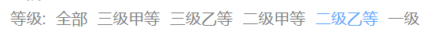

# 一、首页

## 接口地址

[医院接口](http://139.198.34.216:8201/swagger-ui.html)

[公共数据接口](http://139.198.34.216:8202/swagger-ui.html)

## 功能需求

1. 静态banner

2. 搜索框

3. 等级与地区组件

4. 医院卡片组件

5. 分页器

## 代码编写

### 静态数据

#### 1. 静态banner

1. 新建组件 `carousel` 

```vue title=".src/views/home/carousel/index.vue"
<script setup lang="ts">
  
</script>

<template>
    <el-carousel height="350px">
      <el-carousel-item v-for="item in 4" :key="item">
        
      </el-carousel-item>
    </el-carousel>
</template>

<style scoped lang="scss">
img{
  width: 100%;
  height: 350px;
}
</style>
```

2. 引入轮播图

```vue
// src/views/home/index.vue

<script setup lang="ts">
import Carousel from './carousel/index.vue'
</script>

<template>
  <div>
    <!-- 轮播图 -->
    <Carousel/>
  </div>
</template>

<style scoped lang="scss">

</style>
```


#### 2. 搜索框

1. 新建组件 `search` 

```vue
// src/views/home/search/index.vue

<script setup lang="ts">

import { Search } from '@element-plus/icons-vue'
</script>

<template>
  <div class="search">
    <el-autocomplete clearable placeholder="请你输入医院名称" />
    <el-button type="primary" size="default" :icon="Search"></el-button>
  </div>
</template>

<style scoped lang="scss">
.search {
  width: 100%;
  height: 50px;
  display: flex;
  justify-content: center;
  align-items: center;
  margin: 10px 0px;
}

::v-deep(.el-input__wrapper) {
  width: 600px;
  margin-right: 10px;
  ;
}
</style>
```

2. 引入组件 - 搜索框

```vue
// src/views/home/index.vue

<script setup lang="ts">
import Search from './search/index.vue'
</script>

<template>
	<div>
    ...
    <Search />
  </div>
</template>
```


#### 3. 等级与地区组件

##### 等级组件

1. 新建组件 `level` 

```vue
// src/views/home/level/index.vue

<script setup lang="ts">

</script>

<template>
  <div class="level">
    <h1>医院</h1>
    <div class="content">
      <div class="left">等级:</div>
      <ul class="hospital">
        <li class="active">全部</li>
        <li>三级甲等</li>
        <li>三级乙等</li>
        <li>三级甲等</li>
        <li>三级乙等</li>
        <li>三级甲等</li>
        <li>三级乙等</li>
      </ul>
    </div>
  </div>
</template>

<style scoped lang="scss">
.level {
  color: #7f7f7f;

  h1 {
    font-weight: 900;
    margin: 10px 0px;
  }

  .content {
    display: flex;

    .left {
      margin-right: 10px;
    }

    .hospital {
      display: flex;

      li {
        margin-right: 10px;

        &.active {
          color: #55a6fe
        }
      }

      li:hover {
        color: #55a6fe;
        cursor: pointer;
      }
    }
  }
}
</style>
```

2. 入口文件引用组件

```vue
// src/views/home/index.vue

<script setup lang="ts">
import Level from './level/index.vue'
</script>

<template>
	<div>
    <el-row :gutter="20">
  		<el-col :span="20">
  			<Level></Level>
  		</el-col>
      <el-col :span="4"></el-col>
  	</el-row>
  </div>
</template>
```

##### 地区组件

1. 新建组件 `region` 

```vue
<script setup lang="ts">

</script>

<template>
  <div class="region">
    <div class="content">
      <div class="left">地区:</div>
      <ul>
        <li class="active">全部</li>
        <li>昌平区</li>
        <li>昌平区</li>
        <li>昌平区</li>
        <li>昌平区</li>
        <li>昌平区</li>
        <li>昌平区</li>
        <li>昌平区</li>
        <li>昌平区</li>
        <li>昌平区</li>
        <li>昌平区</li>
        <li>昌平区</li>
        <li>昌平区</li>
        <li>昌平区</li>
        <li v-for="item in 10" :key="item">昌平据</li>
      </ul>
    </div>
  </div>
</template>

<style scoped lang="scss">
.region {
  color: #7f7f7f;
  margin-top: 10px;

  .content {
    display: flex;

    .left {
      margin-right: 10px;
      width: 38px;
      white-space: nowrap;
    }

    ul {
      display: flex;
      flex-wrap: wrap;

      li {
        margin-right: 10px;
        margin-bottom: 10px;

        &.active {
          color: #55a6fe
        }
      }

      li:hover {
        color: #55a6fe
      }
    }
  }
}
</style>
```

2. 入口文件引用组件

```vue
// src/views/home/index.vue

<script setup lang="ts">
import Region from './region/index.vue'
</script>

<template>
	<div>
    <el-row :gutter="20">
  		<el-col :span="20">
  			...
        <Region></Region>
  		</el-col>
      <el-col :span="4"></el-col>
  	</el-row>
  </div>
</template>
```

#### 4. 医院卡片组件

1. 新建组件 `Card` 

```vue
// src/views/home/card/index.vue

<script setup lang="ts">

</script>

<template>
  <el-card class="box-card" shadow="hover">
    <div class="content">
      <div class="left">
        <div class="hospital_name">
          北京医院
        </div>
        <div class="tip">
          <div class="level">
            <svg t="1705030461227" class="icon" viewBox="0 0 1024 1024" version="1.1" xmlns="http://www.w3.org/2000/svg"
              p-id="1610" width="16" height="16">
              <path
                d="M415.136 128.48c96.032 4.256 171.616 70.72 171.616 150.656 0 19.968-0.576 39.424-1.76 58.336l-1.408 18.784-1.664 17.216h186.016c72 0 114.72 51.232 111.872 128.064l-0.416 7.296-0.672 7.424-5.024 41.024c-10.944 86.88-22.24 160.48-34.144 222.176-18.272 70.912-77.568 114.048-155.264 116.864l-8.096 0.128H176a32 32 0 0 1-31.776-28.256l-0.224-3.744V405.504a32 32 0 0 1 28.256-31.776l3.744-0.224 110.784-0.032 2.144-2.08c17.952-18.944 41.952-64.96 57.632-114.016l2.88-9.248 7.712-26.88c7.68-25.152 16.704-49.728 27.296-73.696a32 32 0 0 1 30.688-19.072z m18.88 66.464l-4.32 11.264a611.2 611.2 0 0 0-11.328 33.76l-7.616 26.496c-20.704 70.304-56.352 136.864-90.752 162.496v403.456l356.192 0.032c48.96 0 83.52-20.992 97.44-56.256l1.92-5.408 1.6-5.344 4.832-26.176c8.096-45.056 16.032-97.152 23.84-156.16l4.672-36.192 4.64-37.888c5.056-46.944-10.176-69.536-42.656-71.392l-4.544-0.128h-222.496a32 32 0 0 1-31.584-36.992c5.92-37.6 8.896-78.048 8.896-121.376 0-35.296-31.232-69.12-77.76-81.696l-6.4-1.6-4.576-0.896zM208 437.472v394.976H256V437.44H208z"
                fill="#7f7f7f" p-id="1611"></path>
            </svg>
            <span>三级甲等</span>
          </div>
          <div class="time">
            <svg t="1705030532489" class="icon" viewBox="0 0 1024 1024" version="1.1" xmlns="http://www.w3.org/2000/svg"
              p-id="2911" width="16" height="16">
              <path
                d="M931.2 518.4c0-233.6-188.8-419.2-419.2-419.2-233.6 0-419.2 188.8-419.2 419.2 0 137.6 67.2 259.2 169.6 336l-57.6 51.2c-9.6 9.6-12.8 25.6-3.2 35.2 9.6 9.6 25.6 12.8 35.2 3.2l70.4-57.6c60.8 35.2 131.2 54.4 208 54.4 80 0 153.6-22.4 214.4-60.8 0 0 0 0 3.2 3.2l73.6 60.8c9.6 9.6 25.6 6.4 35.2-3.2 9.6-9.6 6.4-25.6-3.2-35.2l-64-54.4C867.2 774.4 931.2 652.8 931.2 518.4zM512 889.6c-204.8 0-371.2-166.4-371.2-371.2s166.4-371.2 371.2-371.2 371.2 166.4 371.2 371.2S716.8 889.6 512 889.6z"
                p-id="2912" fill="#7f7f7f"></path>
              <path
                d="M208 96c-9.6-9.6-25.6-9.6-35.2 0l-118.4 118.4c-9.6 9.6-9.6 25.6 0 35.2 9.6 9.6 25.6 9.6 35.2 0l118.4-118.4C217.6 121.6 217.6 105.6 208 96z"
                p-id="2913" fill="#7f7f7f"></path>
              <path
                d="M969.6 211.2l-118.4-115.2c-9.6-9.6-25.6-9.6-35.2 0-9.6 9.6-9.6 25.6 0 35.2l118.4 115.2c9.6 9.6 25.6 9.6 35.2 0C979.2 236.8 979.2 220.8 969.6 211.2z"
                p-id="2914" fill="#7f7f7f"></path>
              <path
                d="M707.2 300.8l-144 128c0 0 0 3.2-3.2 3.2-12.8-3.2-22.4-6.4-35.2-6.4-12.8 0-22.4 3.2-32 6.4 0-3.2-3.2-3.2-3.2-6.4l-92.8-83.2c-9.6-9.6-25.6-9.6-35.2 3.2-9.6 9.6-9.6 25.6 3.2 35.2l89.6 80c-16 19.2-28.8 41.6-28.8 70.4 0 54.4 44.8 102.4 102.4 102.4 54.4 0 102.4-44.8 102.4-102.4 0-25.6-9.6-48-25.6-67.2l140.8-124.8c9.6-9.6 9.6-25.6 3.2-35.2C732.8 294.4 716.8 294.4 707.2 300.8zM524.8 582.4c-28.8 0-51.2-22.4-51.2-51.2 0-28.8 22.4-51.2 51.2-51.2 28.8 0 51.2 22.4 51.2 51.2C576 556.8 553.6 582.4 524.8 582.4z"
                p-id="2915" fill="#7f7f7f"></path>
            </svg>
            <span>2023</span>
          </div>
        </div>
      </div>
      <div class="right">
        
      </div>
    </div>
  </el-card>
</template>

<style scoped lang="scss">
.content {
  display: flex;
  justify-content: space-between;

  .right {
    img {
      width: 50px;
      height: 50px;
    }
  }

  .left {
    width: 60%;

    .tip {
      color: #7f7f7f;
      margin-top: 20px;
      display: flex;
      justify-content: space-between;

      .level {
        display: flex;
        align-items: center;

        span {
          margin-left: 5px;
        }
      }

      .time {
        display: flex;
        align-items: center;

        span {
          margin-left: 5px;
        }
      }
    }
  }
}
</style>
```

2. 引用组件

```vue
// src/views/home/index.vue

<script setup lang="ts">
import Card from './card/index.vue'
</script>

<template>
	<div>
    <el-row :gutter="20">
  		<el-col :span="20">
  			...
        <div class="hospital">
        	<Card class="item" v-for="item in 10" :key="item"></Card>  
  			</div>
  		</el-col>
  	</el-row>
  </div>
</template>

<style scoped lang="scss">
.hospital {
  display: flex;
  flex-wrap: wrap;
  justify-content: space-between;

  .item {
    width: 48%;
    margin: 10px 0;
  }
}
</style>
```


#### 5. 分页器

1. 直接去 Element-Plus 官网复制分页器组件

```vue
// src/views/home/index.vue

<script setup lang="ts">
import { ref } from 'vue'
  
let pageNo = ref<number>(1)
let pageSize = ref<number>(10)
</script>

<template>
	<div>
    <el-row :gutter="20">
  		<el-col :span="20">
  			...
        <div class="hospital">
        	...
          <el-pagination
            v-model:current-page="pageNo"
            v-model:page-size="pageSize"
            :page-sizes="[10, 20, 30, 40]"
            layout="prev, pager, next, jumper, sizes, total"
            :total="13"
          />
  			</div>
  		</el-col>
  	</el-row>
  </div>
</template>
```


#### 5. 右边常见科室搭建

1. 首页引入Tip组件

```vue
// src/views/home/index.vue

<script setup lang="ts">
import Tip from './tip/index.vue'
</script>

<template>
	...
	<el-col :span="4">
  	<Tip></Tip>
  </el-col>
</template>
```

2. 编写静态组件

```vue
<script setup lang="ts"></script>

<template>
  <div class="tip">
    <!-- 科室结构 -->
    <div class="deparment">
      <div class="header">
        <div class="left">
          <svg
            t="1705543172675"
            class="icon"
            viewBox="0 0 1024 1024"
            version="1.1"
            xmlns="http://www.w3.org/2000/svg"
            p-id="4294"
            width="16"
            height="16"
          >
            <path
              d="M400.696008 129.093147c-17.248849 0-31.233352 13.984503-31.233352 31.233352l0 30.470989c0 17.248849 13.984503 31.233352 31.233352 31.233352s31.233352-13.984503 31.233352-31.233352l0-30.470989C431.92936 143.078673 417.944857 129.093147 400.696008 129.093147z"
              fill="#d81e06"
              p-id="4295"
            ></path>
            <path
              d="M623.647823 129.093147c-17.248849 0-31.233352 13.984503-31.233352 31.233352l0 30.470989c0 17.248849 13.985526 31.233352 31.233352 31.233352 17.248849 0 31.233352-13.984503 31.233352-31.233352l0-30.470989C654.881175 143.078673 640.896672 129.093147 623.647823 129.093147z"
              fill="#d81e06"
              p-id="4296"
            ></path>
            <path
              d="M425.695379 312.937269c11.209296 18.047028 41.974997 48.588625 86.152149 48.588625 43.958164 0 75.100442-30.308283 86.573751-48.223305 9.302877-14.528901 5.068436-33.846876-9.455349-43.149752-14.539134-9.307993-33.851992-5.063319-43.149752 9.455349-0.121773 0.198521-13.379729 19.449981-33.968649 19.449981-19.993357 0-32.428573-18.107403-33.271778-19.373233-9.17087-14.417361-28.28009-18.799158-42.829458-9.760295C421.089477 279.028994 416.591023 298.28557 425.695379 312.937269z"
              fill="#d81e06"
              p-id="4297"
            ></path>
            <path
              d="M564.242851 625.945145l-20.278859 0L543.963992 462.486306c0-17.253966-13.985526-31.233352-31.233352-31.233352-17.248849 0-31.233352 13.979386-31.233352 31.233352l0 163.457816-20.283975 0c-45.924959 0-83.289961 37.363979-83.289961 83.289961l0 103.024421c0 45.924959 37.363979 83.289961 83.289961 83.289961l103.029538 0c45.924959 0 83.289961-37.363979 83.289961-83.289961L647.532813 709.234083C647.532813 663.309124 610.168834 625.945145 564.242851 625.945145zM585.066109 812.258505c0 11.286044-9.537214 20.822235-20.822235 20.822235L461.214337 833.080739c-11.286044 0-20.822235-9.537214-20.822235-20.822235L440.392102 709.234083c0-11.286044 9.537214-20.822235 20.822235-20.822235l103.029538 0c11.286044 0 20.822235 9.537214 20.822235 20.822235L585.066109 812.258505z"
              fill="#d81e06"
              p-id="4298"
            ></path>
            <path
              d="M250.808256 625.945145l-17.482163 0 0-266.970354c0-35.483142 28.864398-64.35368 64.343447-64.35368 17.248849 0 31.233352-13.984503 31.233352-31.233352s-13.985526-31.233352-31.233352-31.233352c-69.924559 0-126.810151 56.890708-126.810151 126.820384l0 266.970354-23.079648 0c-45.924959 0-83.289961 37.363979-83.289961 83.289961l0 103.024421c0 45.924959 37.363979 83.289961 83.289961 83.289961l103.029538 0c45.924959 0 83.289961-37.363979 83.289961-83.289961L334.099241 709.234083C334.098217 663.309124 296.734238 625.945145 250.808256 625.945145zM271.630491 812.258505c0 11.286044-9.537214 20.822235-20.822235 20.822235L147.778718 833.080739c-11.286044 0-20.822235-9.537214-20.822235-20.822235L126.956484 709.234083c0-11.286044 9.537214-20.822235 20.822235-20.822235l103.029538 0c11.286044 0 20.822235 9.537214 20.822235 20.822235L271.630491 812.258505z"
              fill="#d81e06"
              p-id="4299"
            ></path>
            <path
              d="M876.565113 625.945145l-21.961174 0 0-266.970354c0-69.929676-56.890708-126.820384-126.815267-126.820384-17.248849 0-31.233352 13.985526-31.233352 31.233352s13.984503 31.233352 31.233352 31.233352c35.483142 0 64.348564 28.869514 64.348564 64.35368l0 266.970354-18.605753 0c-45.924959 0-83.289961 37.363979-83.289961 83.289961l0 103.024421c0 45.924959 37.363979 83.289961 83.289961 83.289961l103.034655 0c45.924959 0 83.289961-37.363979 83.289961-83.289961L959.856098 709.234083C959.854051 663.309124 922.490072 625.945145 876.565113 625.945145zM897.387347 812.258505c0 11.286044-9.537214 20.822235-20.822235 20.822235L773.530458 833.080739c-11.286044 0-20.822235-9.537214-20.822235-20.822235L752.708224 709.234083c0-11.286044 9.537214-20.822235 20.822235-20.822235l103.034655 0c11.286044 0 20.822235 9.537214 20.822235 20.822235L897.387347 812.258505z"
              fill="#d81e06"
              p-id="4300"
            ></path>
          </svg>
          <span>常见科室</span>
        </div>
        <div class="right">
          <span>全部</span>
          <svg
            t="1705543262964"
            class="icon"
            viewBox="0 0 1024 1024"
            version="1.1"
            xmlns="http://www.w3.org/2000/svg"
            p-id="5437"
            width="16"
            height="16"
          >
            <path
              d="M312.888889 995.555556c-17.066667 0-28.444444-5.688889-39.822222-17.066667-22.755556-22.755556-17.066667-56.888889 5.688889-79.644445l364.088888-329.955555c11.377778-11.377778 17.066667-22.755556 17.066667-34.133333 0-11.377778-5.688889-22.755556-17.066667-34.133334L273.066667 187.733333c-22.755556-22.755556-28.444444-56.888889-5.688889-79.644444 22.755556-22.755556 56.888889-28.444444 79.644444-5.688889l364.088889 312.888889c34.133333 28.444444 56.888889 73.955556 56.888889 119.466667s-17.066667 85.333333-51.2 119.466666l-364.088889 329.955556c-11.377778 5.688889-28.444444 11.377778-39.822222 11.377778z"
              fill="#7f7f7f"
              p-id="5438"
            ></path>
          </svg>
        </div>
      </div>
      <div class="content">
        <ul>
          <li>神经内科</li>
          <li>消化内科</li>
          <li>呼吸内科</li>
          <li>内科</li>
          <li>神经外科</li>
          <li>妇科</li>
          <li>产科</li>
          <li>儿科</li>
        </ul>
      </div>
    </div>
    <!-- 平台公告 -->
    <div class="notice">
      <div class="header">
        <div class="left">
          <svg
            t="1705544376168"
            class="icon"
            viewBox="0 0 1024 1024"
            version="1.1"
            xmlns="http://www.w3.org/2000/svg"
            p-id="2310"
            width="16"
            height="16"
          >
            <path
              d="M842.666667 810.666667h-6.4l-42.666667-42.666667c-2.133333-2.133333-2.133333-4.266667-2.133333-8.533333v-117.333334c74.666667-32 128-108.8 128-196.266666 0-117.333333-96-213.333333-213.333334-213.333334h-14.933333c-29.866667-74.666667-102.4-128-187.733333-128-100.266667 0-185.6 74.666667-200.533334 170.666667h-2.133333c-106.666667 0-192 85.333333-192 192 0 96 70.4 174.933333 160 189.866667v53.333333c0 2.133333 0 4.266667-2.133333 6.4l-64 91.733333c-27.733333 0-51.2 23.466667-51.2 53.333334-2.133333 32 21.333333 55.466667 51.2 55.466666s53.333333-23.466667 53.333333-53.333333c0-6.4-2.133333-10.666667-2.133333-17.066667l64-93.866666c8.533333-12.8 12.8-27.733333 12.8-42.666667V661.333333H405.333333v160c-12.8 10.666667-21.333333 25.6-21.333333 42.666667 0 29.866667 23.466667 53.333333 53.333333 53.333333s53.333333-23.466667 53.333334-53.333333c0-17.066667-8.533333-32-21.333334-42.666667V661.333333h106.666667v160c-12.8 10.666667-21.333333 25.6-21.333333 42.666667 0 29.866667 23.466667 53.333333 53.333333 53.333333s53.333333-23.466667 53.333333-53.333333c0-17.066667-8.533333-32-21.333333-42.666667V661.333333h64c6.4 0 14.933333 0 21.333333-2.133333v100.266667c0 19.2 8.533333 38.4 21.333334 53.333333l42.666666 42.666667v6.4c0 29.866667 23.466667 53.333333 53.333334 53.333333s53.333333-23.466667 53.333333-53.333333c0-27.733333-23.466667-51.2-53.333333-51.2z m-512-266.666667c-17.066667 0-32-14.933333-32-32s14.933333-32 32-32 32 14.933333 32 32-14.933333 32-32 32z m362.666666 0h-234.666666c-17.066667 0-32-14.933333-32-32s14.933333-32 32-32h234.666666c17.066667 0 32 14.933333 32 32s-14.933333 32-32 32z"
              p-id="2311"
              fill="#4F81BD"
            ></path>
          </svg>
          <span>平台公告</span>
        </div>
        <div class="right">
          <span>全部</span>
          <svg
            t="1705543262964"
            class="icon"
            viewBox="0 0 1024 1024"
            version="1.1"
            xmlns="http://www.w3.org/2000/svg"
            p-id="5437"
            width="16"
            height="16"
          >
            <path
              d="M312.888889 995.555556c-17.066667 0-28.444444-5.688889-39.822222-17.066667-22.755556-22.755556-17.066667-56.888889 5.688889-79.644445l364.088888-329.955555c11.377778-11.377778 17.066667-22.755556 17.066667-34.133333 0-11.377778-5.688889-22.755556-17.066667-34.133334L273.066667 187.733333c-22.755556-22.755556-28.444444-56.888889-5.688889-79.644444 22.755556-22.755556 56.888889-28.444444 79.644444-5.688889l364.088889 312.888889c34.133333 28.444444 56.888889 73.955556 56.888889 119.466667s-17.066667 85.333333-51.2 119.466666l-364.088889 329.955556c-11.377778 5.688889-28.444444 11.377778-39.822222 11.377778z"
              fill="#7f7f7f"
              p-id="5438"
            ></path>
          </svg>
        </div>
      </div>
      <div class="content">
        <ul>
          <li>关于延长北京大学国际医院放假的通知</li>
          <li>北京中医院大学东方医院部分科室医生门诊</li>
          <li>武警总医院号源暂停更新通知</li>
        </ul>
      </div>
    </div>
    <!-- 停诊公告 -->
    <div class="notice">
      <div class="header">
        <div class="left">
          <svg
            t="1705544850367"
            class="icon"
            viewBox="0 0 1024 1024"
            version="1.1"
            xmlns="http://www.w3.org/2000/svg"
            p-id="3463"
            width="16"
            height="16"
          >
            <path
              d="M512 512m-512 0a512 512 0 1 0 1024 0 512 512 0 1 0-1024 0Z"
              fill="#FF5533"
              p-id="3464"
            ></path>
            <path
              d="M731.591111 568.888889H292.408889a56.888889 56.888889 0 0 1 0-113.777778h439.182222a56.888889 56.888889 0 0 1 0 113.777778z"
              fill="#FFFFFF"
              p-id="3465"
            ></path>
          </svg>
          <span>停诊公告</span>
        </div>
        <div class="right">
          <span>全部</span>
          <svg
            t="1705543262964"
            class="icon"
            viewBox="0 0 1024 1024"
            version="1.1"
            xmlns="http://www.w3.org/2000/svg"
            p-id="5437"
            width="16"
            height="16"
          >
            <path
              d="M312.888889 995.555556c-17.066667 0-28.444444-5.688889-39.822222-17.066667-22.755556-22.755556-17.066667-56.888889 5.688889-79.644445l364.088888-329.955555c11.377778-11.377778 17.066667-22.755556 17.066667-34.133333 0-11.377778-5.688889-22.755556-17.066667-34.133334L273.066667 187.733333c-22.755556-22.755556-28.444444-56.888889-5.688889-79.644444 22.755556-22.755556 56.888889-28.444444 79.644444-5.688889l364.088889 312.888889c34.133333 28.444444 56.888889 73.955556 56.888889 119.466667s-17.066667 85.333333-51.2 119.466666l-364.088889 329.955556c-11.377778 5.688889-28.444444 11.377778-39.822222 11.377778z"
              fill="#7f7f7f"
              p-id="5438"
            ></path>
          </svg>
        </div>
      </div>
      <div class="content">
        <ul>
          <li>
            中国人民解放军总医院第六医学中心(原海军总医院)呼吸内科门诊停诊公告
          </li>
          <li>首都医科大学附属北京潞河医院老年医学科门诊停诊公告</li>
          <li>中日友好医院中西医结合心内科门诊停诊公告</li>
        </ul>
      </div>
    </div>
  </div>
</template>

<style scoped lang="scss">
.tip {
  color: #7f7f7f;
  .deparment {
    .header {
      display: flex;
      justify-content: space-between;
      .left {
        display: flex;
        span {
          margin-left: 5px;
        }
      }
    }
    .content {
      ul {
        font-size: small;
        display: flex;
        flex-wrap: wrap;
        justify-content: space-between;
        li {
          width: 40%;
          margin-top: 20px;
        }
      }
    }
  }
  .notice {
    margin-top: 20px;
    .header {
      display: flex;
      justify-content: space-between;
      span {
        margin-left: 5px;
      }
    }
    .content {
      ul {
        li {
          font-size: small;
          overflow: hidden;
          text-overflow: ellipsis;
          white-space: nowrap;
          margin-top: 20px;
        }
      }
    }
  }
}
</style>
```


### 数据渲染

#### 1. 医院卡片组件

1. 封装接口地址

```ts
// src/apis/home/index.vue

// 首页相关请求

import request from '@/utils/request'
import type { HospitalResponseData } from './type'

// 枚举管理首页模块接口地址
enum API {
  HOSPITAL_URL = '/hosp/hospital/'
}

export const reqHospital = (page: number, limit: number) =>
  request.get<any, HospitalResponseData>(API.HOSPITAL_URL + `${page}/${limit}`)
```

2. 渲染数据

```vue
// src/views/home/index.vue

<script setup lang="ts">
import { onMounted } from 'vue'
import type { Content, HospitalResponseData } from '@/apis/home/type'
  
let hasHospitalArr = ref<Content>([])
let total = ref<number>(0)
onMounted(() => {
  getHospitalInfo()
})
const getHospitalInfo = async () => {
  let result: HospitalResponseData = await reqHospital(pageNo.value, pageSize.value)
  if (result.data.code == 200) {
    hasHospitalArr.value = result.data.data.content
    total.value = result.data.data.totalElements
    console.log(hasHospitalArr.value)
  }
}
</script>

<template>
	<div>
    ...
    <el-row>
  		<el-col>
  			...
        <div>
          <Card
            class="item"
            v-for="(item, index) in hasHospitalArr"
            :key="index"
            :hospitalInfo="item"
          ></Card>
  			</div>
  		</el-col>
  	</el-row>
  </div>
</template>
```

```vue
// src/views/home/card/index.vue

<script setup lang="ts">
defineProps(['hospitalInfo'])
</script>

<template>
	<el-card class="box-card" shadow="hover">
  	<div class="content">
      <div class="left">
      	<div class="hospital_name">{{ hospitalInfo.hosname }}</div>
        <div class="tip">
          <div class="level">
            <svg>...</svg>
            <span>{{ hospitalInfo.param.hostypeString }}</span>
  				</div>
          <div class="time">
            <svg>...</svg>
            <span>每天 {{ hospitalInfo.bookingRule?.releaseTime }} 放号</span>
  				</div>
  			</div>
  		</div>
      <div class="right">
        
  		</div>
  	</div>
  </el-card>
</template>
```


#### 2. 分页器

1. 从后台拉取数据给分页器

```vue
// src/views/home/index.vue

<script setup lang="ts">
const currentChange = () => {
  getHospitalInfo()
}
const sizeChange = () => {
  getHospitalInfo()
}
</script>

<template>
	<div>
    ...
    <el-row :gutter="20">
  		<el-col :span="20">
  			...
        <!-- 分页器 -->
        <el-pagination
          v-model:current-page="pageNo"
          v-model:page-size="pageSize"
          :page-sizes="[10, 20, 30, 40]"
          :background="true"
          layout="prev, pager, next, jumper,->, sizes, total"
          :total="total"
          @current-change="currentChange"
          @size-change="sizeChange"
        />
  		</el-col>
  	</el-row>
  </div>
</template>
```


#### 3. 等级组件

1. 获取医院等级或医院地区的数据

```ts
// src/apis/home/index.ts

enum API {
  // 获取医院等级与地区接口
  HOSPITALLEVELANDREGION_URL = '/cmn/dict/findByDictCode/'
}

export const reqHospitalLevelAndRegion = (dictCode: string) =>
  request.get<any, HospitalLevelAndRegionResponseData>(
    API.HOSPITALLEVELANDREGION_URL + dictCode
  )
```

2. 补充TS类型

```ts
// src/apis/home/type.ts

export interface HospitalLevelAndRegion {
  id: number
  createTime: string
  updateTime: string
  isDeleted: number
  param: {}
  parentId: number
  name: string
  value: string
  dictCode: string
  hasChildren: boolean
}
export type HospitalLevelAndRegionArr = HospitalLevelAndRegion[]
export interface HospitalLevelAndRegionResponseData extends ResponseData {
  data: {
    code: number
    data: HospitalLevelAndRegionArr
  }
}
```

3. 渲染数据

```vue
// src/views/home/level/index.vue

<script setup lang="ts">
import { reqHospitalLevelAndRegion } from '@/apis/home'
import type { HospitalLevelAndRegionResponseData, HospitalLevelAndRegionArr } from '@/apis/home/type'
import { onMounted, ref } from 'vue'

let levelArr = ref<HospitalLevelAndRegionArr>([])
let activeFlag = ref<string>('')

onMounted(() => {
  getLevel()
})
const getLevel = async () => {
  let result: HospitalLevelAndRegionResponseData = await reqHospitalLevelAndRegion('Hostype')
  if (result.data.code == 200) {
    levelArr.value = result.data.data
  }
}
const changeLevel = (level: string) => {
  activeFlag.value = level
}
</script>

<template>
	<div class="level">
    ...
    <div class="content">
      ...
      <ul class="hospital">
      	<li :class="{ active: activeFlag == '' }" @click="changeLevel('')">全部</li>
        <li
          v-for="level in levelArr"
          :key="level.value"
          @click="changeLevel(level.value)"
          :class="{ active: activeFlag == level.value }"
        >
          {{ level.name }}
  			</li>
  		</ul>
  	</div>
  </div>
</template>
```



#### 4. 地区组件

1. 渲染数据

```vue
// src/views/home/region

<script setup lang="ts">
import { reqHospitalLevelAndRegion } from '@/apis/home'
import type { HospitalLevelAndRegionResponseData, HospitalLevelAndRegionArr } from '@/appis/home/type'
import { onMounted, ref } from 'vue'
  
let RegionArr = ref<HospitalLevelAndRegionArr>ref([])
let RegionFlag = ref<string>('')

onMounted(() => {
  getRegion()
})
const getRegion = async () => {
  let result: HospitalLevelAndRegionResponseData = await reqHospitalLevelAndRegion('Beijin')
  if (result.data.code == 200) {
    RegionArr.value = result.data.data
  }
}
const chcangeRegion = (region: string) => {
  RegionFlag.value = region
}
</script>

<template>
	<div class="region">
    <div class="content">
      ...
      <ul>
      	<li :class="{ active: RegionFlag == ''}" @click="changeRegion('')">全部</li>  
        <li
        	v-for="item in RegionArr"
          :key="item.value"
          @click="changeRegion(item.value)"
          :class="{ active: RegionFlag == item.value }"
        >
  				{{ item.name }}
  			</li>
  		</ul>
  	</div>
  </div>
</template>
```


#### 5. 根据等级与地区筛选医院

1. 更改接口文件

```ts
// src/apis/home/index.ts

export const reqHospital = (
  page: number,
  limit: number,
  hostype = '',
  districtCode = ''
) =>
  request.get<any, HospitalResponseData>(
    API.HOSPITAL_URL +
      `${page}/${limit}?hostype=${hostype}&districtCode=${districtCode}`
  )
```

2. 双向绑定等级子组件

```vue
// src/views/home/index.vue

<script setup lang="ts">
const getLevel = (level: string) => {
  hostype.value = level
  getHospitalInfo()
}
</script>

<template>
	<div>
    ...
    <Level @getLevel="getLevel"></Level>
  </div>
</template>
```

```vue
// src/views/home/level/index.vue

<script setup lang="ts">
const changeLevel = (level: string) => {
  activeFlag.value = level
  $emit('getLevel', level)
}
let $emit = defineEmits(['getLevel'])
</script>
```

3. 双向绑定地区子组件

```vue
// src/views/home/index.vue

<script setup lang="ts">
const getRegion = (region: string) => {
  districiCode.value = region
  getHospitalInfo()
}
</script>

<template>
	...
	<Region @getRegion="getRegion"></Region>
</template>
```


4. 有些数据页是空的，可以使用element-plus赋予空页面一些样式

```vue
<template>
	...
	<div class="hospital" v-if="hasHospitalArr.length > 0"> 
    ...
  </div>
	<el-empty v-else description="暂无数据"></el-empty>
</template>
```


#### 6. 根据关键字搜索医院

1. 补充搜索框TS类型

```ts
// src/apis/home/type.ts

export interface HospitalInfo extends ResponseData {
  data: Content
}
```

2. 在接口文件里面新增一个URL

```ts
// src/apis/home/index.ts

enum API {
  ...
  // 根据关键字医院的名字获取数据
  HOSPITALINFO_URL = '/hosp/hospital/findByHosname/'
}

// 根据关键字获取医院的数据进行展示
export const reqHospitalInfo = (hosname: string) =>
  request.get<any, HospitalInfo>(API.HOSPITALINFO_URL + hosname)
```

3. 列表显示数据且点击跳转详情页面

```vue
// src/views/home/search/index.vue

<script setup lang="ts">
import { ref } from 'vue'
import { reqHospitalInfo } from '@/apis/home'
import type { HospitalInfo } from '@/apis/home/type'
import { useRouter } from 'vue-router'
  
let hosname = ref<string>('')
let $router = useRouter()

const fetchData = async (keyword: string, cb: any) => {
  let result: HospitalInfo = await reqHospitalInfo(keyword)
  let showData = result.data.data.map((item) => {
    return {
      value: item.hosname,
      hoscode: item.hoscode
    }
  })
  cb(showData)
}

const goDetail = (item: any) => {
  $router.push({ path: '/hospital' })
}
</script>

<template>
	<div class="search">
    <el-autocomplete 
    	clearable
      placeholder="请你输入医院名称"
      v-model="hosname"
      :fetch-suggestions="fetchData"
      :trigger-on-focus="false"
      @select="goDetail"
    />
  </div>
</template>
```


4. 点击左上角标题返回首页

```vue
// src/components/hospital_top/index.vue

<script setup lang="ts">
import { useRouter } from 'vue-router'
let $router = useRouter()
const goHome = () => {
  $router.push({ path: '/home' })
}
</script>

<template>
	...
	<div class="left" @click="goHome">
    ...
  </div>
</template>
```

5. 点击卡片跳转详情页面

```vue
// src/views/home/card/index.vue

<script setup lang="ts">
import { useRouter } from 'vue-router'

let props = defineProps(['hospitalInfo'])
let $router = useRouter()

const goDetail = () => {
  $router.push({ path: '/hospital' })
}
</script>

<template>
	<el-card class="box-card" shadow="hover" @click="goDetail">
  	...
  </el-card>
</template>
```


