# 二、医院信息

## 接口

[医院接口](http://139.198.34.216:8201/swagger-ui.html)

[短信验证码接口](http://139.198.34.216:8204/swagger-ui.html)

[会员接口](http://139.198.34.216:8203/swagger-ui.html)

## 一、医院详情页

### 1. 页面左边静态组件布局

1. 搭建页面静态布局

```vue
// src/views/hospital/index.vue

<script setup lang="ts">
import {
  Document,
  Menu as IconMenu,
  InfoFilled,
  Setting,
  Search,
  HomeFilled
} from '@element-plus/icons-vue'
import { useRouter, useRoute } from 'vue-router'
let $router = useRouter()
let $route = useRoute()

const changeActive = (path: string) => {
  $router.push({ path })
}
</script>

<template>
  <div class="hospital">
    <!--左侧 -->
    <div class="menu">
      <div class="top">
        <el-icon><HomeFilled /></el-icon>
        <span> / 医院信息</span>
      </div>
      <el-menu :default-active="$route.path" class="el-menu-vertical-demo">
        <el-menu-item
          index="/hospital/register"
          @click="changeActive('/hospital/register')"
        >
          <el-icon><icon-menu /></el-icon>
          <span>预约挂号</span>
        </el-menu-item>
        <el-menu-item
          index="/hospital/detail"
          @click="changeActive('/hospital/detail')"
        >
          <el-icon><document /></el-icon>
          <span>医院详情</span>
        </el-menu-item>
        <el-menu-item
          index="/hospital/notice"
          @click="changeActive('/hospital/notice')"
        >
          <el-icon><setting /></el-icon>
          <span>预约通知</span>
        </el-menu-item>
        <el-menu-item
          index="/hospital/close"
          @click="changeActive('/hospital/close')"
        >
          <el-icon><InfoFilled /></el-icon>
          <span>停诊信息</span>
        </el-menu-item>
        <el-menu-item
          index="/hospital/search"
          @click="changeActive('/hospital/search')"
        >
          <el-icon><Search /></el-icon>
          <span>查询/取消</span>
        </el-menu-item>
      </el-menu>
    </div>
    <!-- 右侧 -->
    <div class="content">
      <router-view></router-view>
    </div>
  </div>
</template>

<style scoped lang="scss">
.hospital {
  display: flex;
  .menu {
    flex: 2;
    display: flex;
    flex-direction: column;
    align-items: center;
    .top {
      color: #7f7f7f;
    }
  }
  .content {
    flex: 8;
  }
}
</style>
```

2. 搭建路由

```ts
// src/router/index.ts

const router = createRouter({
  routes: [
    ...,
    {
    	path: '/hospital',
    	component: () => import('@/views/hospital/index.vue'),
      children: [
        {
          path: 'register',
          component: () => import('@/views/hospital/register/index.vue')
        },
        {
          path: 'detail',
          component: () => import('@/views/hospital/detail/index.vue')
        },
        {
          path: 'notice',
          component: () => import('@/views/hospital/notice/index.vue')
        },
        {
          path: 'close',
          component: () => import('@/views/hospital/close/index.vue')
        },
        {
          path: 'search',
          component: () => import('@/views/hospital/search/index.vue')
        }
      ]
    }
  ]
})
```

3. 点击卡片的时候要默认进入预约挂号

```vue
// src/views/home/card/index.vue

<script setup lang="ts">
const goDetail = () => {
  $router.push({
    path: '/hospital/register'
  })
}
</script>
```

4. 搜索框点击需要默认进入预约挂号

```vue
// src/views/home/search/index.vue

<script setup lang="ts">
const goDetail = (item: any) => {
  $router.push({ path: '/hospital/register' })
}
</script>
```

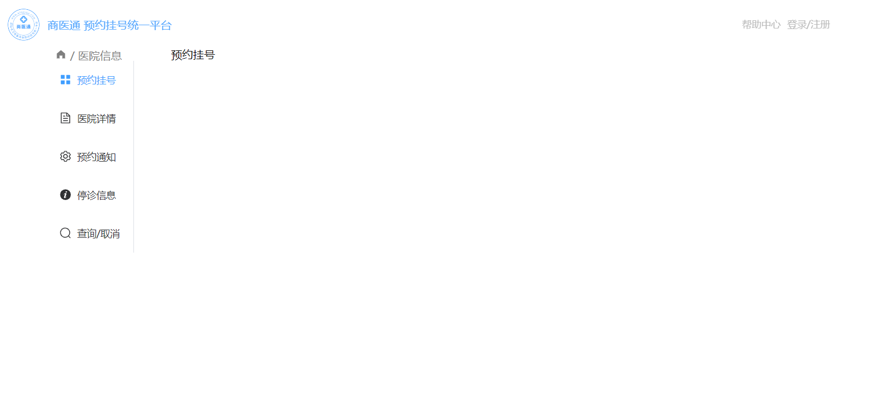

### 2. 详情业务前期准备工作

1. 点击卡片需要在地址栏传参

```vue
// src/views/home/card/index.vue

<script setup lang="ts">
const goDetail = () => {
  $router.push({
    path: '/hospital/register',
    query: { hoscode: props.hospitalInfo.hoscode }
  })
}
</script>
```

2. 点击搜索框需要在地址栏传参

```vue
// src/views/home/search/index.vue

<script setup lang="ts">
const goDetail = (item: any) => {
  $router.push({ path: '/hospital/register', query: { hoscode: item.hoscode } })
}
</script>
```

3. 编写对应API

```ts
// src/apis/hospital/index.ts

import request from '@/utils/request'
enum API {
  HOSPITALDETAIL_URL = '/hosp/hospital/'
}
export const reqHospitalDetail = (hoscode: string) =>
  request.get(API.HOSPITALDETAIL_URL + hoscode)
```

4. 编写详情模块数据TS类型

```ts
// 详情模块数据ts类型
export interface ResponseData {
  code: number
  message: string
  ok: boolean
}

// 医院详情数据
export interface HosPitalDetail {
  bookingRule: {
    cycle: number
    releaseTime: string
    stopTime: string
    quitDay: number
    quitTime: string
    rule: string[]
  }
  hospital: {
    id: string
    updateTime: string
    isDeleted: number
    param: {
      hostypeString: string
      fullAddress: string
    }
    hoscode: string
    hosname: string
    hostype: string
    provinceCode: string
    cityCode: string
    districtCode: string
    address: string
    logoData: string
    intro: null
    route: string
    status: number
    bookingRule: null
  }
}

// 医院详情返回数据ts
export interface HospitalDetail extends ResponseData {
  data: {
    code: number
    data: HosPitalDetail
  }
}
```

5. API 续写ts类型继承

```ts
// src/apis/hospital/index.ts

import type { HospitalDetail } from './type'

export const reqHospitalDetail = (hoscode: string) =>
  request.get<any, HospitalDetail>(API.HOSPITALDETAIL_URL + hoscode)
```

6. 新建仓库

```ts
// src/stores/modules/hospitalDetail.ts

import { defineStore } from 'pinia'

const useDetailStore = defineStore('Detail', {
  state: () => {
    return {}
  },
  actions: {},
  getters: {}
})

export default useDetailStore
```

7. 在一级路由发送一次请求即可

```vue
// src/views/hospital/index.vue

<script setup lang="ts">
import { onMounted } from 'vue'
import useDetailStore from '@/stores/modules/hospitalDetail'
  
let detailStore = useDetailStore()
onMounted(() => {
  const hoscode = $route.query.hoscode as string
  detailStore.getHospital(hoscode)
})
</script>
```

8. 获取医院详情方法

```ts
// src/stores/modules/hospitalDetail.ts

import { reqHospitalDetail } from '@/apis/hospital'
import type { HopsitalDetail } from '@/apis/hospital/type'

const useDetailStore = defineStore('Detail', {
  ...,
  actions: {
  	async getHospital(hoscode: string) {
  		let result: HopsitalDetail = await reqHospitalDetail(hoscode)
      if (result.data.code == 200) {
        this.hospitalInfo = result.data.data
      }
		}
	}
})
```

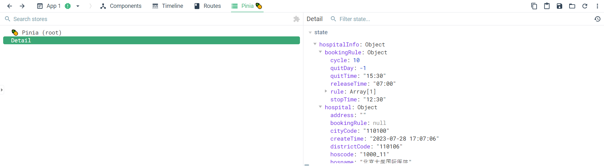

### 3. 预约挂号业务

1. 定义仓库 ts 类型

```ts
// src/stores/modulres/interface/index.ts

import type { HosPitalDetail } from '@/apis/hospital/type'

export interface DetailState {
  hospitalInfo: HosPitalDetail
}
```

```ts
// src/stores/modules/hospitalDetail.ts

import type { HosPitalDetail, HospitalDetail } from '@/apis/hospital/type'
import type { DetailState } from './interface'

const useDetailStore = defineStore('Detail', {
  state: (): DetailState => {
    return {
      hospitalInfo: {} as HosPitalDetail
    }
  }
})
```

2. 预约挂号布局渲染

```vue
// src/views/hospital/register/index.vue

<script setup lang="ts">
import useDetailStore from '@/stores/modules/hospitalDetail'
let hospitalStore = useDetailStore()
</script>

<template>
  <div class="register">
    <div class="top">
      <div class="title">
        {{ hospitalStore.hospitalInfo.hospital?.hosname }}
      </div>
      <div class="level">
        <svg
          t="1705916980681"
          class="icon"
          viewBox="0 0 1024 1024"
          version="1.1"
          xmlns="http://www.w3.org/2000/svg"
          p-id="4272"
          width="16"
          height="16"
        >
          <path
            d="M190.193225 471.411583c14.446014 0 26.139334-11.718903 26.139334-26.13831 0-14.44499-11.69332-26.164916-26.139334-26.164916-0.271176 0-0.490164 0.149403-0.73678 0.149403l-62.496379 0.146333c-1.425466-0.195451-2.90005-0.295735-4.373611-0.295735-19.677155 0-35.621289 16.141632-35.621289 36.114522L86.622358 888.550075c0 19.949354 15.96767 35.597753 35.670407 35.597753 1.916653 0 3.808746 0.292666 5.649674 0l61.022819 0.022513c0.099261 0 0.148379 0.048095 0.24764 0.048095 0.097214 0 0.146333-0.048095 0.24457-0.048095l0.73678 0 0-0.148379c13.413498-0.540306 24.174586-11.422144 24.174586-24.960485 0-13.55983-10.760065-24.441669-24.174586-24.981974l0-0.393973-50.949392 0 1.450025-402.275993L190.193225 471.409536z"
            fill="#d81e06"
            p-id="4273"
          ></path>
          <path
            d="M926.52241 433.948343c-19.283182-31.445176-47.339168-44.172035-81.289398-45.546336-1.77032-0.246617-3.536546-0.39295-5.380544-0.39295l-205.447139-0.688685c13.462616-39.059598 22.698978-85.58933 22.698978-129.317251 0-28.349675-3.193739-55.962569-9.041934-82.542948l-0.490164 0.049119c-10.638291-46.578852-51.736315-81.31498-100.966553-81.31498-57.264215 0-95.466282 48.15065-95.466282 106.126063 0 3.241834-0.294712 6.387477 0 9.532097-2.996241 108.386546-91.240027 195.548698-196.23636 207.513194l0 54.881958-0.785899 222.227314 0 229.744521 10.709923 0 500.025271 0.222057 8.746198-0.243547c19.35686 0.049119 30.239721-4.817726 47.803749-16.116049 16.682961-10.761088 29.236881-25.50079 37.490869-42.156122 2.260483-3.341095 4.028757-7.075139 5.106298-11.20111l77.018118-344.324116c1.056052-4.053316 1.348718-8.181333 1.056052-12.160971C943.643346 476.446249 938.781618 453.944769 926.52241 433.948343zM893.82573 486.837924l-82.983993 367.783411-0.099261-0.049119c-2.555196 6.141884-6.879688 11.596106-12.872169 15.427364-4.177136 2.727111-8.773827 4.351098-13.414521 4.964058-1.49812-0.195451-3.046383 0-4.620227 0l-477.028511-0.540306-0.171915-407.408897c89.323375-40.266076 154.841577-79.670527 188.596356-173.661202 0.072655 0.024559 0.124843 0.049119 0.195451 0.072655 2.99931-9.137101 6.313799-20.73423 8.697079-33.164331 5.551436-29.185716 5.258771-58.123792 5.258771-58.123792-4.937452-37.98001 25.940812-52.965306 44.364417-52.965306 25.304316 0.860601 50.263777 33.656541 50.263777 52.326762 0 0 5.600555 27.563776 5.649674 57.190537 0.048095 37.366026-4.6673 56.847729-4.6673 56.847729l-0.466628 0c-5.872754 30.879288-16.214287 60.138682-30.464849 86.964654l0.36839 0.342808c-2.358721 4.815679-3.709485 10.220782-3.709485 15.943111 0 19.922748 19.088754 21.742187 38.765909 21.742187l238.761895 0.270153c0 0 14.666024 0.465604 14.690584 0.465604l0 0.100284c12.132318-0.638543 24.221658 5.207605 31.100322 16.409738 5.504364 9.016351 6.437619 19.6045 3.486404 28.988218L893.82573 486.837924z"
            fill="#d81e06"
            p-id="4274"
          ></path>
          <path
            d="M264.827039 924.31872c0.319272 0.024559 0.441045 0.024559 0.295735-0.024559 0.243547-0.048095 0.367367-0.074701-0.295735-0.074701s-0.539282 0.026606-0.271176 0.074701C264.43409 924.343279 264.532327 924.343279 264.827039 924.31872z"
            fill="#d81e06"
            p-id="4275"
          ></path>
        </svg>
        <span>
          {{ hospitalStore.hospitalInfo.hospital?.param.hostypeString }}
        </span>
      </div>
    </div>
    <div class="content">
      <div class="left">
        
      </div>
      <div class="right">
        <div>挂号规则</div>
        <div class="time">
          预约周期: 10天 放号时间:{{
            hospitalStore.hospitalInfo.bookingRule?.releaseTime
          }}
          停挂时间: {{ hospitalStore.hospitalInfo.bookingRule?.stopTime }}
        </div>
        <div class="address">
          具体位置:{{ hospitalStore.hospitalInfo.hospital?.param.fullAddress }}
        </div>
        <div class="route">
          具体路线:{{ hospitalStore.hospitalInfo.hospital?.route }}
        </div>
        <div class="releasetime">
          退号时间: 就诊前一个工作日{{
            hospitalStore.hospitalInfo.bookingRule?.quitTime
          }}取消
        </div>
        <div class="rule">预约挂号规则</div>
        <div
          class="ruleInfo"
          v-for="(item, index) in hospitalStore.hospitalInfo.bookingRule?.rule"
          :key="index"
        >
          {{ item }}
        </div>
      </div>
    </div>
    <!-- 放置每一个医院的科室的数据 -->
  </div>
</template>

<style scoped lang="scss">
.register {
  .top {
    display: flex;
    .title {
      font-size: 30px;
      font-weight: 900;
    }
    .level {
      color: #7f7f7f;
      margin-left: 10px;
      height: 40px;
      text-align: center;
      line-height: 35px;
      span {
        margin-left: 5px;
      }
    }
  }
  .content {
    display: flex;
    margin-top: 20px;
    .left {
      width: 80px;
      img {
        width: 80px;
        height: 80px;
        border-radius: 50%;
      }
    }
    .right {
      flex: 1;
      font-size: 14px;
      margin-left: 20px;
      .time,
      .address,
      .route,
      .releasetime,
      .ruleInfo {
        margin-top: 10px;
        color: #7f7f7f;
        line-height: 20px;
      }
      .rule {
        margin: 10px 0;
      }
    }
  }
}
</style>
```

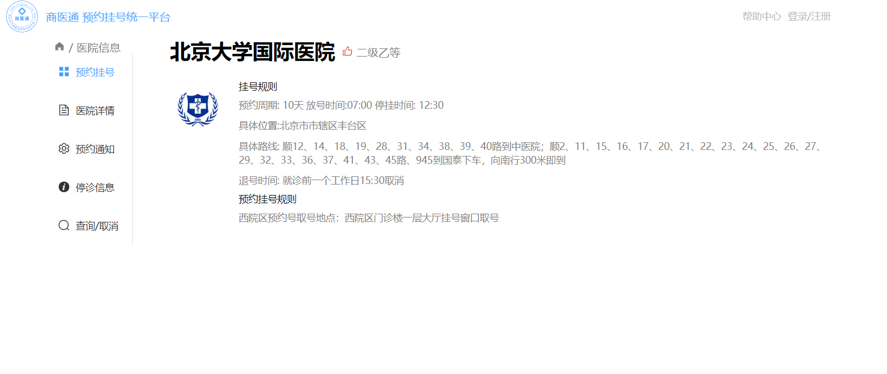

### 4. 医院详情业务

1. 搭建医院详情页面

```vue
// src/views/hospital/detail/index.vue

<script setup lang="ts">
import useDetailStore from '@/stores/modules/hospitalDetail'
let hospitalStore = useDetailStore()
</script>

<template>
  <div class="detail">
    <div class="top">
      <div class="name">{{ hospitalStore.hospitalInfo.hospital?.hosname }}</div>
      <div class="level">
        <svg
          t="1705916980681"
          class="icon"
          viewBox="0 0 1024 1024"
          version="1.1"
          xmlns="http://www.w3.org/2000/svg"
          p-id="4272"
          width="16"
          height="16"
        >
          <path
            d="M190.193225 471.411583c14.446014 0 26.139334-11.718903 26.139334-26.13831 0-14.44499-11.69332-26.164916-26.139334-26.164916-0.271176 0-0.490164 0.149403-0.73678 0.149403l-62.496379 0.146333c-1.425466-0.195451-2.90005-0.295735-4.373611-0.295735-19.677155 0-35.621289 16.141632-35.621289 36.114522L86.622358 888.550075c0 19.949354 15.96767 35.597753 35.670407 35.597753 1.916653 0 3.808746 0.292666 5.649674 0l61.022819 0.022513c0.099261 0 0.148379 0.048095 0.24764 0.048095 0.097214 0 0.146333-0.048095 0.24457-0.048095l0.73678 0 0-0.148379c13.413498-0.540306 24.174586-11.422144 24.174586-24.960485 0-13.55983-10.760065-24.441669-24.174586-24.981974l0-0.393973-50.949392 0 1.450025-402.275993L190.193225 471.409536z"
            fill="#d81e06"
            p-id="4273"
          ></path>
          <path
            d="M926.52241 433.948343c-19.283182-31.445176-47.339168-44.172035-81.289398-45.546336-1.77032-0.246617-3.536546-0.39295-5.380544-0.39295l-205.447139-0.688685c13.462616-39.059598 22.698978-85.58933 22.698978-129.317251 0-28.349675-3.193739-55.962569-9.041934-82.542948l-0.490164 0.049119c-10.638291-46.578852-51.736315-81.31498-100.966553-81.31498-57.264215 0-95.466282 48.15065-95.466282 106.126063 0 3.241834-0.294712 6.387477 0 9.532097-2.996241 108.386546-91.240027 195.548698-196.23636 207.513194l0 54.881958-0.785899 222.227314 0 229.744521 10.709923 0 500.025271 0.222057 8.746198-0.243547c19.35686 0.049119 30.239721-4.817726 47.803749-16.116049 16.682961-10.761088 29.236881-25.50079 37.490869-42.156122 2.260483-3.341095 4.028757-7.075139 5.106298-11.20111l77.018118-344.324116c1.056052-4.053316 1.348718-8.181333 1.056052-12.160971C943.643346 476.446249 938.781618 453.944769 926.52241 433.948343zM893.82573 486.837924l-82.983993 367.783411-0.099261-0.049119c-2.555196 6.141884-6.879688 11.596106-12.872169 15.427364-4.177136 2.727111-8.773827 4.351098-13.414521 4.964058-1.49812-0.195451-3.046383 0-4.620227 0l-477.028511-0.540306-0.171915-407.408897c89.323375-40.266076 154.841577-79.670527 188.596356-173.661202 0.072655 0.024559 0.124843 0.049119 0.195451 0.072655 2.99931-9.137101 6.313799-20.73423 8.697079-33.164331 5.551436-29.185716 5.258771-58.123792 5.258771-58.123792-4.937452-37.98001 25.940812-52.965306 44.364417-52.965306 25.304316 0.860601 50.263777 33.656541 50.263777 52.326762 0 0 5.600555 27.563776 5.649674 57.190537 0.048095 37.366026-4.6673 56.847729-4.6673 56.847729l-0.466628 0c-5.872754 30.879288-16.214287 60.138682-30.464849 86.964654l0.36839 0.342808c-2.358721 4.815679-3.709485 10.220782-3.709485 15.943111 0 19.922748 19.088754 21.742187 38.765909 21.742187l238.761895 0.270153c0 0 14.666024 0.465604 14.690584 0.465604l0 0.100284c12.132318-0.638543 24.221658 5.207605 31.100322 16.409738 5.504364 9.016351 6.437619 19.6045 3.486404 28.988218L893.82573 486.837924z"
            fill="#d81e06"
            p-id="4274"
          ></path>
          <path
            d="M264.827039 924.31872c0.319272 0.024559 0.441045 0.024559 0.295735-0.024559 0.243547-0.048095 0.367367-0.074701-0.295735-0.074701s-0.539282 0.026606-0.271176 0.074701C264.43409 924.343279 264.532327 924.343279 264.827039 924.31872z"
            fill="#d81e06"
            p-id="4275"
          ></path>
        </svg>
        <span>{{
          hospitalStore.hospitalInfo.hospital?.param.hostypeString
        }}</span>
      </div>
    </div>
    <div class="logo">
      <div class="left">
        
      </div>
      <div class="right">
        <div class="address">
          <svg
            t="1705974165472"
            class="icon"
            viewBox="0 0 1024 1024"
            version="1.1"
            xmlns="http://www.w3.org/2000/svg"
            p-id="4263"
            width="16"
            height="16"
          >
            <path
              d="M511.492567 260.820614q52.773043 0 98.949455 19.789891t80.681863 54.295342 54.295342 80.681863 19.789891 98.949455-19.789891 99.456888-54.295342 81.189296-80.681863 54.295342-98.949455 19.789891-98.949455-19.789891-80.681863-54.295342-54.295342-81.189296-19.789891-99.456888 19.789891-98.949455 54.295342-80.681863 80.681863-54.295342 98.949455-19.789891zM1018.925669 450.600595l0 127.873142-60.891972 0q-10.148662 75.100099-43.131814 141.066402t-84.233895 117.217047-116.709613 84.741328-140.558969 43.639247l0 58.86224-126.858276 0 0-58.86224q-75.100099-11.163528-140.051536-45.161546t-115.187314-84.741328-83.219029-116.20218-42.116947-140.558969l-64.951437 0 0-127.873142 65.966303 0q11.163528-73.070367 44.654113-136.499504t83.726462-113.157582 114.172448-82.204163 137.006938-43.639247l0-70.025768 126.858276 0 0 69.010902q74.085233 10.148662 138.529237 43.131814t115.187314 82.711596 84.233895 113.665015 44.654113 137.006938l62.921705 0zM511.492567 833.205154q65.966303 0 124.32111-24.864222t101.48662-68.503469 68.503469-101.994054 25.371655-124.32111-25.371655-124.32111-68.503469-101.48662-101.48662-68.503469-124.32111-25.371655-124.32111 25.371655-101.994054 68.503469-68.503469 101.48662-24.864222 124.32111 24.864222 124.32111 68.503469 101.994054 101.994054 68.503469 124.32111 24.864222z"
              p-id="4264"
              fill="#7f7f7f"
            ></path>
          </svg>
          <span
            >具体位置:
            {{ hospitalStore.hospitalInfo.hospital?.param.fullAddress }}</span
          >
        </div>
        <div class="route">
          规划路线: {{ hospitalStore.hospitalInfo.hospital?.route }}
        </div>
      </div>
    </div>
    <div class="footer">
      <h1>医院介绍</h1>
      <p>
        {{ hospitalStore.hospitalInfo.hospital?.intro }}
      </p>
    </div>
  </div>
</template>

<style scoped lang="scss">
.detail {
  .top {
    display: flex;
    align-items: center;
    .name {
      font-size: 30px;
      font-weight: 900;
    }
    .level {
      color: #7f7f7f;
      margin-left: 10px;
      span {
        margin-left: 5px;
      }
    }
  }
  .logo {
    display: flex;
    margin: 10px 0;
    .left {
      img {
        width: 80px;
        height: 80px;
        border-radius: 50%;
      }
    }
    .right {
      color: #7f7f7f;
      margin-left: 10px;
      line-height: 25px;
      div {
        margin: 10px 0;
      }
    }
  }
  .footer {
    color: #7f7f7f;
    p {
      margin-top: 10px;
      line-height: 25px;
    }
  }
}
</style>
```

### 5. 预约通知、停诊信息、查询/取消业务

1. 预约通知业务

```vue
// src/views/hospital/notice/index.vue

<script setup lang="ts">
import useDetailStore from '@/stores/modules/hospitalDetail'
let hospitalStore = useDetailStore()
</script>

<template>
  <div class="notice">
    <h1 class="hosname">
      {{ hospitalStore.hospitalInfo.hospital?.hosname }}预约挂号须知
    </h1>
    <div class="top">为了您早日就医康复，请您认真阅读预约挂号通知:</div>
    <div class="info">
      <div class="tip">一、预约实名制:</div>
      <div class="text">
        Lorem ipsum dolor sit amet consectetur, adipisicing elit. Dolores nihil
        officiis molestiae omnis odit? Quam illum, cum debitis asperiores nihil
        maxime, neque, ex inventore culpa voluptas dolor obcaecati
        exercitationem pariatur!Lorem ipsum dolor sit amet consectetur,
        adipisicing elit. Dolores nihil officiis molestiae omnis odit? Quam
        illum, cum debitis asperiores nihil maxime, neque, ex inventore culpa
        voluptas dolor obcaecati exercitationem pariatur!Lorem ipsum dolor sit
        amet consectetur, adipisicing elit. Dolores nihil officiis molestiae
        omnis odit? Quam illum, cum debitis asperiores nihil maxime, neque, ex
        inventore culpa voluptas dolor obcaecati exercitationem pariatur!
      </div>
    </div>
    <div class="info">
      <div class="tip">二、预约挂号:</div>
      <div class="text">
        Lorem ipsum dolor sit amet consectetur, adipisicing elit. Dolores nihil
        officiis molestiae omnis odit? Quam illum, cum debitis asperiores nihil
        maxime, neque, ex inventore culpa voluptas dolor obcaecati
        exercitationem pariatur!Lorem ipsum dolor sit amet consectetur,
        adipisicing elit. Dolores nihil officiis molestiae omnis odit? Quam
        illum, cum debitis asperiores nihil maxime, neque, ex inventore culpa
        voluptas dolor obcaecati exercitationem pariatur!
      </div>
    </div>
    <div class="info">
      <div class="tip">三、取消预约</div>
      <div class="text">
        Lorem ipsum dolor sit amet consectetur, adipisicing elit. Dolores nihil
        officiis molestiae omnis odit? Quam illum, cum debitis asperiores nihil
        maxime, neque, ex inventore culpa voluptas dolor obcaecati
        exercitationem pariatur!Lorem ipsum dolor sit amet consectetur,
        adipisicing elit. Dolores nihil officiis molestiae omnis odit? Quam
        illum, cum debitis asperiores nihil maxime, neque, ex inventore culpa
        voluptas dolor obcaecati exercitationem pariatur!
      </div>
    </div>
    <div class="info">
      <div class="tip">四、爽约处理:</div>
      <div class="text">
        Lorem ipsum dolor sit amet consectetur, adipisicing elit. Dolores nihil
        officiis molestiae omnis odit? Quam illum, cum debitis asperiores nihil
        maxime, neque, ex inventore culpa voluptas dolor obcaecati
        exercitationem pariatur!Lorem ipsum dolor sit amet consectetur,
        adipisicing elit. Dolores nihil officiis molestiae omnis odit? Quam
        illum, cum debitis asperiores nihil maxime, neque, ex inventore culpa
        voluptas dolor obcaecati exercitationem pariatur!Lorem ipsum dolor sit
        amet consectetur, adipisicing elit. Dolores nihil officiis molestiae
        omnis odit? Quam illum, cum debitis asperiores nihil maxime, neque, ex
        inventore culpa voluptas dolor obcaecati exercitationem pariatur!Lorem
        ipsum dolor sit amet consectetur, adipisicing elit. Dolores nihil
        officiis molestiae omnis odit? Quam illum, cum debitis asperiores nihil
        maxime, neque, ex inventore culpa voluptas dolor obcaecati
        exercitationem pariatur!
      </div>
    </div>
  </div>
</template>

<style scoped lang="scss">
.notice {
  .hosname {
    text-align: center;
    font-size: 30px;
  }
  .top {
    margin: 20px 0;
    color: #7f7f7f;
  }
  .info {
    .tip {
      color: #7f7f7f;
      font-weight: 900;
    }
    .text {
      color: #7f7f7f;
      margin: 20px 0;
      line-height: 25px;
    }
  }
}
</style>
```

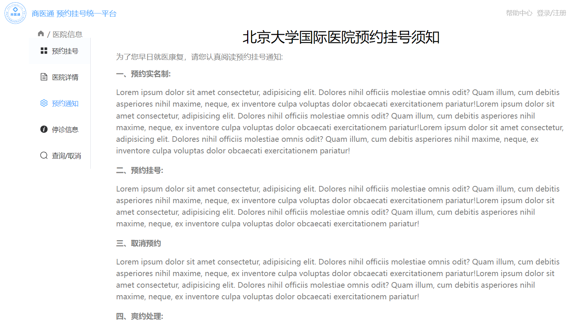

2. 停诊信息业务

```vue
// src/views/hospital/close/index.vue

<script setup lang="ts">
import useDetailStore from '@/stores/modules/hospitalDetail'
let hospitalStore = useDetailStore()
</script>

<template>
  <div>
    <div class="info">
      <h1>{{ hospitalStore.hospitalInfo.hospital?.hosname }}停诊信息</h1>
      <el-empty description="暂无信息" />
    </div>
  </div>
</template>

<style scoped lang="scss">
.info {
  h1 {
    text-align: center;
    font-size: 30px;
  }
}
</style>
```

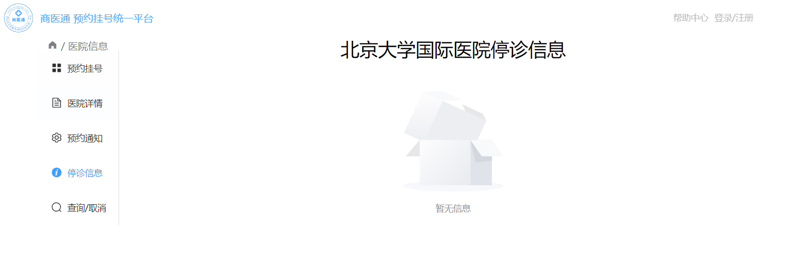

3. 查询/取消业务

```vue
// src/views/hospital/search/index.vue

<script setup lang="ts">
import useDetailStore from '@/stores/modules/hospitalDetail'
let hospitalStore = useDetailStore()
</script>

<template>
  <div>
    <div class="info">
      <h1>{{ hospitalStore.hospitalInfo.hospital?.hosname }}查询/取消信息</h1>
      <el-empty description="暂无信息" />
    </div>
  </div>
</template>

<style scoped lang="scss">
.info {
  h1 {
    text-align: center;
    font-size: 30px;
  }
}
</style>
```

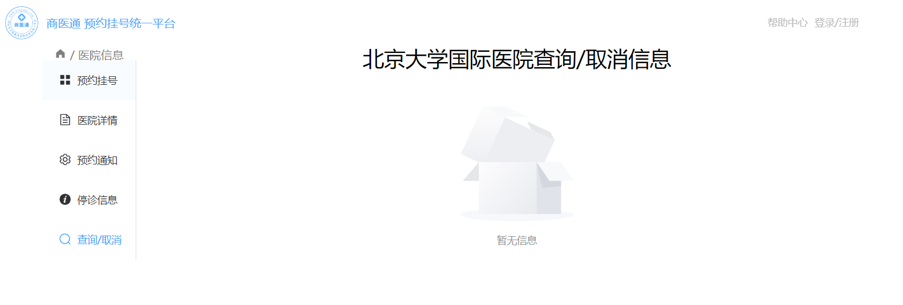

:::tip 小提示

其实这里面有一个小小的bug，就是没有能够持久化，是因为地址栏里面没有携带 hoscode，所以一刷新就会把undefined返回来了。可以在传参的时候把 hoscode 捎上，这样的话就可以持久化了。当然，用 pinia 的持久化插件也可以实现。

```vue
// src/views/hospital/index.vue

<script setup lang="ts">
...
const changeActive = (path: string) => {
  $router.push({ path, query: { hoscode: $route.query.hoscode }})
}
</script>
```

:::

### 6. 医院科室业务

1. 新增ts类型

```ts
// src/apis/hospital/type.ts

// 医院科室的数据
export interface Deparment {
  depcode: string
  depname: string
  children?: Deparment[]
}

// 存储科室数组类型
export type DeparmentArr = Deparment[]
// 获取科室接口返回的数据类型
export interface DeparmentResponseData extends ResponseData {
  data: DeparmentArr
}
```

2. 新增接口

```ts
// src/apis/hospital/index.ts

import type { HospitalDetail, DeparmentResponseData } from './type'

enum API {
  ...
  HOSPITALDEPARMENT_URL = '/hosp/hospital/department/'
}

// 这里不写hoscode是因为1000_0接口不知道被谁删除了，但是科室列表的1000_0又还有，所以只能写死端口
export const reqHospitalDeparment = (hoscode: string) =>
  request.get<any, DeparmentResponseData>(API.HOSPITALDEPARMENT_URL + '1000_0')
```

3. 定义仓库内部存储数据的ts类型

```ts
// src/stores/modules/interface/index.ts

import type { DeparmentArr } from '@/apis/hospital/type'

export interface DetailState {
  deparmentArr: DeparmentArr
}
```

4. 获取某一个医院科室的数据

```ts
// src/stores/modules/hospitalDetail.ts

import { reqHospitalDeparment } from '@/apis/hospital'
import type { DeparmentResponseData, DeparmentArr } from '@/apis/hospital/type'

const useDetailStore = defineStore('Detail', {
  state: (): DetailState => {
    return {
      ...
      deparmentArr: []
    }
  },
  actions: {
    ...,
    async getDeparment(hoscode: string) {
  		let result: DeparmentResponseData = await reqHospitalDeparment(hoscode)
			if (result.data.code == 200) {
        this.deparmentArr = result.data.data
      }
		}
  }
})
```

5. 挂载到 hospital 入口文件，这样只需要发一次就可以了

```vue
// src/views/hospital/index.vue

<script setup lang="ts">
onMounted(() => {
  ...
  detailStore.getDeparment(hoscode)
})
</script>
```

6. 渲染数据

```vue
// src/views/hospital/register/index.vue

<script setup lang="ts">
import { ref } from 'vue'
import useDetailStore from '@/stores/modules/hospitalDetail'

let hospitalStore = useDetailStore()
let currentIndex = ref<number>(0)

const changeIndex = (index: number) => {
  ...
  let allH1 = document.querySelectorAll('.cur')
  allH1[currentIndex.value].scrollIntoView({
    behavior: 'smooth',
    block: 'start'
  })
}
</script>

<template>
	...
	<div class="deparment">
    <div class="leftNav">
      <ul>
      	<li 
        	@click="changeIndex(index)"
          :class="{ active: index == currentIndex }"
          v-for="(deparment, index) in hospitalStore.deparmentArr"
          :key="deparment.depcode"
        >
  				{{ deparment.depname }}
  			</li>  
  		</ul>
  	</div>
    <div class="deparmentInfo">
      <div
      	class="showDeparment"
        v-for="deparment in hospitalStore.deparmentArr"
        :key="deparment.depcode"
      >
        <h1 class="cur">{{ deparment.depname }}</h1>
        <ul>
        	<li v-for="item in deparment.chidren" :key="item.depcode">
  					{{ item.depname }}
  				</li>  
  			</ul>
  		</div>
  	</div>
  </div>
</template>

<style scoped lang="scss">
  .register {
    ...
   .deparment {
      width: 100%;
      height: 500px;
      display: flex;
      margin-top: 20px;
      .leftNav {
        width: 80px;
        height: 100%;
        ul {
          width: 100%;
          height: 100%;
          background: rgb(248, 248, 248);
          display: flex;
          flex-direction: column;
          li {
            flex: 1;
            text-align: center;
            color: #7f7f7f;
            font-size: 14px;
            line-height: 40px;
            &.active {
              border-left: 2px solid red;
              color: red;
              background: white;
            }
          }
        }
      }
      .deparmentInfo {
        flex: 1;
        margin-left: 20px;
        height: 100%;
        overflow: auto;
        &::-webkit-scrollbar {
          display: none;
        }
        .showDeparment {
          h1 {
            background-color: rgb(248, 248, 248);
            color: #7f7f7f;
          }
          ul {
            display: flex;
            flex-wrap: wrap;
            li {
              width: 33%;
              color: #7f7f7f;
              line-height: 30px;
            }
          }
        }
      }
    }
  }
</style>
```

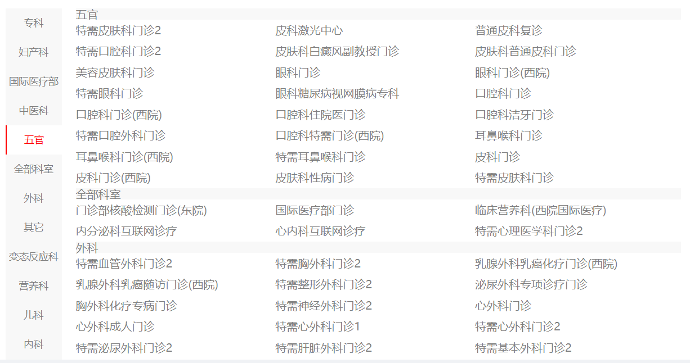

## 二、登录页面

### 1. 显示与隐藏对话框

1. 新建全局组件

```vue
// src/components/login/index.vue

<script setup lang="ts"></script>

<template>
  <div class="login_container">登录组件</div>
</template>

<style scoped lang="scss"></style>
```

2. 引用组件

```ts
// src/main.ts

import Login from '@/components/login/index.vue'

app.component('Login', Login)
```

```vue
// src/App.vue

<template>
	<div>
    ...
    <Login />
  </div>
</template>
```

3. 定义用户相关的仓库

```ts
// src/stores/modules/user.ts

import { defineStore } from 'pinia'

const useUserStore = defineStore('User', {
  state: () => {
    return {
      visiable: false // 用于控制显示框显示与隐藏
    }
  },
  actions: {},
  getters: {}
})
export default useUserStore
```

4. 添加组件并引用相关仓库

```vue
// src/components/login/index.vue

<script setup lang="ts">
import useUserStore from '@/stores/modules/user'
let userStore = useUserStore()
</script>

<template>
	<div class="login_container">
    <el-dialog title="用户登录" v-model="userStore.visiable">123123</el-dialog>
  </div>
</template>
```

5. 分配点击顶部 `登录/注册` 的时候弹出对话框

```vue
// src/components/hospital_top/index.vue

<script setup lang="ts">
import useuserStore from '@/stores/modules/user'
let userStore = useUserStore()
const login = () => {
  userStore.visiable = true
}
</script>

<template>
	...
	<p class="login" @click="login">登录/注册</p>
</template>
```

6. 分配点击科室的时候弹出对话框

```vue
// src/views/hospital/register/index.vue

<script setup lang="ts">
import useUserStore from '@/stores/modules/user'
  
let userStore = useUserStore()
const showLogin = () => {
  userStore.visiable = true
}
</script>

<template>
	...
	<div class="showDeparment">
    <li
      @click="showLogin"
      v-for="item in deparment.children"
      :key="item.depcode"
    >
      {{ item.depname }}
    </li>
  </div>
</template>
```

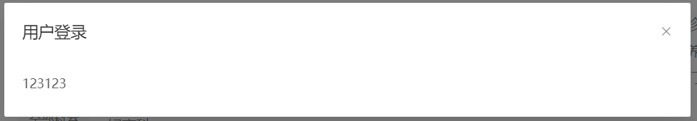

### 2. 搭建静态组件

1. 搭建组件并渲染数据

```vue
// src/components/login/index.vue

<script setup lang="ts">
import useUserStore from '@/stores/modules/user'
import { User, Lock } from '@element-plus/icons-vue'
import { ref } from 'vue'

let userStore = useUserStore()
let scene = ref<number>(0)

const changeScene = () => {
  scene.value = 1
}
</script>

<template>
  <div class="login_container">
    <el-dialog title="用户登录" v-model="userStore.visiable">
      <div class="content">
        <el-row>
          <el-col :span="12">
            <div class="login">
              <div v-show="scene == 0">
                <el-form>
                  <el-form-item>
                    <el-input
                      placeholder="请你输入手机号码"
                      :prefix-icon="User"
                    ></el-input>
                  </el-form-item>
                  <el-form-item>
                    <el-input
                      placeholder="请输入手机验证码"
                      :prefix-icon="Lock"
                    ></el-input>
                  </el-form-item>
                  <el-form-item>
                    <el-button>获取验证码</el-button>
                  </el-form-item>
                </el-form>
                <el-button style="width: 100%" type="primary" size="default">
                  用户登录
                </el-button>
                <div class="bottom" @click="changeScene">
                  <p>微信扫码登录</p>
                  <svg
                    t="1706058728985"
                    class="icon"
                    viewBox="0 0 1024 1024"
                    version="1.1"
                    xmlns="http://www.w3.org/2000/svg"
                    p-id="4269"
                    width="32"
                    height="32"
                  >
                    <path
                      d="M669.3 369.4c9.8 0 19.6 0 29.4 1.6C671 245.2 536.9 152 383.2 152 211.6 152 71 269.7 71 416.8c0 85 45.8 156.9 124.2 210.9l-31.1 93.2L273.6 667c39.2 8.2 70.3 16.3 109.5 16.3 9.8 0 19.6 0 31.1-1.6-6.5-21.3-9.8-42.5-9.8-65.4 0.1-135.7 116.2-246.9 264.9-246.9z m-168.4-85c24.5 0 39.2 16.3 39.2 39.2 0 22.9-16.3 39.2-39.2 39.2-24.5 0-47.4-16.4-47.4-39.2 0-24.5 24.6-39.2 47.4-39.2z m-216.3 73.1c-24.7 0-47.8-16.2-47.8-38.8 0-24.3 24.7-38.8 47.8-38.8s39.5 16.2 39.5 38.8c0.1 22.7-16.4 38.8-39.5 38.8z"
                      fill="#24DB5A"
                      p-id="4270"
                    ></path>
                    <path
                      d="M953.8 613c0-125.9-124.2-227.2-264.8-227.2-148.8 0-266.5 103-266.5 227.2 0 125.9 117.7 227.2 266.5 227.2 31.1 0 62.1-8.2 93.2-16.3l85 47.4-22.9-78.5c62.1-47.4 109.5-109.5 109.5-179.8z m-351.5-39.2c-14.7 0-31.1-14.7-31.1-31.1 0-14.7 16.3-31.1 31.1-31.1 22.9 0 39.2 16.3 39.2 31.1 0 16.4-14.7 31.1-39.2 31.1z m178-7.6c-14.8 0-31.3-14.6-31.3-30.7 0-14.6 16.5-30.7 31.3-30.7 23.1 0 39.5 16.2 39.5 30.7 0 16.2-16.4 30.7-39.5 30.7z"
                      fill="#24DB5A"
                      p-id="4271"
                    ></path>
                  </svg>
                </div>
              </div>
              <div class="webchat" v-show="scene == 1">微信扫码登录结构</div>
            </div>
          </el-col>
          <el-col :span="12">
            <div class="rightContent">
              <div class="top">
                <div class="item">
                  
                  <svg
                    t="1706058728985"
                    class="icon"
                    viewBox="0 0 1024 1024"
                    version="1.1"
                    xmlns="http://www.w3.org/2000/svg"
                    p-id="4269"
                    width="16"
                    height="16"
                  >
                    <path
                      d="M669.3 369.4c9.8 0 19.6 0 29.4 1.6C671 245.2 536.9 152 383.2 152 211.6 152 71 269.7 71 416.8c0 85 45.8 156.9 124.2 210.9l-31.1 93.2L273.6 667c39.2 8.2 70.3 16.3 109.5 16.3 9.8 0 19.6 0 31.1-1.6-6.5-21.3-9.8-42.5-9.8-65.4 0.1-135.7 116.2-246.9 264.9-246.9z m-168.4-85c24.5 0 39.2 16.3 39.2 39.2 0 22.9-16.3 39.2-39.2 39.2-24.5 0-47.4-16.4-47.4-39.2 0-24.5 24.6-39.2 47.4-39.2z m-216.3 73.1c-24.7 0-47.8-16.2-47.8-38.8 0-24.3 24.7-38.8 47.8-38.8s39.5 16.2 39.5 38.8c0.1 22.7-16.4 38.8-39.5 38.8z"
                      fill="#cdcdcd"
                      p-id="4270"
                    ></path>
                    <path
                      d="M953.8 613c0-125.9-124.2-227.2-264.8-227.2-148.8 0-266.5 103-266.5 227.2 0 125.9 117.7 227.2 266.5 227.2 31.1 0 62.1-8.2 93.2-16.3l85 47.4-22.9-78.5c62.1-47.4 109.5-109.5 109.5-179.8z m-351.5-39.2c-14.7 0-31.1-14.7-31.1-31.1 0-14.7 16.3-31.1 31.1-31.1 22.9 0 39.2 16.3 39.2 31.1 0 16.4-14.7 31.1-39.2 31.1z m178-7.6c-14.8 0-31.3-14.6-31.3-30.7 0-14.6 16.5-30.7 31.3-30.7 23.1 0 39.5 16.2 39.5 30.7 0 16.2-16.4 30.7-39.5 30.7z"
                      fill="#cdcdcd"
                      p-id="4271"
                    ></path>
                  </svg>
                  <p>微信扫一扫关注</p>
                  <p>"快速预约挂号"</p>
                </div>
                <div class="item">
                  
                  <svg
                    t="1706059373483"
                    class="icon"
                    viewBox="0 0 1024 1024"
                    version="1.1"
                    xmlns="http://www.w3.org/2000/svg"
                    p-id="5797"
                    width="16"
                    height="16"
                  >
                    <path
                      d="M820.409449 797.228346q0 25.19685-10.07874 46.866142t-27.716535 38.299213-41.322835 26.204724-50.897638 9.574803l-357.795276 0q-27.212598 0-50.897638-9.574803t-41.322835-26.204724-27.716535-38.299213-10.07874-46.866142l0-675.275591q0-25.19685 10.07874-47.370079t27.716535-38.80315 41.322835-26.204724 50.897638-9.574803l357.795276 0q27.212598 0 50.897638 9.574803t41.322835 26.204724 27.716535 38.80315 10.07874 47.370079l0 675.275591zM738.771654 170.330709l-455.559055 0 0 577.511811 455.559055 0 0-577.511811zM510.992126 776.062992q-21.165354 0-36.787402 15.11811t-15.622047 37.291339q0 21.165354 15.622047 36.787402t36.787402 15.622047q22.173228 0 37.291339-15.622047t15.11811-36.787402q0-22.173228-15.11811-37.291339t-37.291339-15.11811zM591.622047 84.661417q0-8.062992-5.03937-12.598425t-11.086614-4.535433l-128 0q-5.03937 0-10.582677 4.535433t-5.543307 12.598425 5.03937 12.598425 11.086614 4.535433l128 0q6.047244 0 11.086614-4.535433t5.03937-12.598425z"
                      p-id="5798"
                      fill="#cdcdcd"
                    ></path>
                  </svg>
                  <p>扫一扫下载</p>
                  <p>"预约挂号"APP</p>
                </div>
              </div>
            </div>
            <p class="tip">尚医通官方指定平台</p>
            <p class="tip">快速挂号 安全放心</p>
          </el-col>
        </el-row>
      </div>
      <template #footer>
        <el-button type="primary" size="default">关闭窗口</el-button>
      </template>
    </el-dialog>
  </div>
</template>

<style scoped lang="scss">
.login_container {
  ::v-deep(.el-dialog__body) {
    border-top: 1px solid #ccc;
    border-bottom: 1px solid #ccc;
  }
  .login {
    padding: 20px;
    border: 1px solid #ccc;
  }
  .bottom {
    display: flex;
    flex-direction: column;
    align-items: center;
    p {
      margin: 10px 0;
    }
  }
  .rightContent {
    .top {
      display: flex;
      justify-content: space-around;
      .item {
        display: flex;
        flex-direction: column;
        align-items: center;
        img {
          width: 130px;
          height: 130px;
        }
        p {
          margin: 5px 0;
        }
      }
    }
  }
  .tip {
    text-align: center;
    margin: 20px 0;
    font-size: 20px;
    font-weight: 900;
  }
}
</style>
```

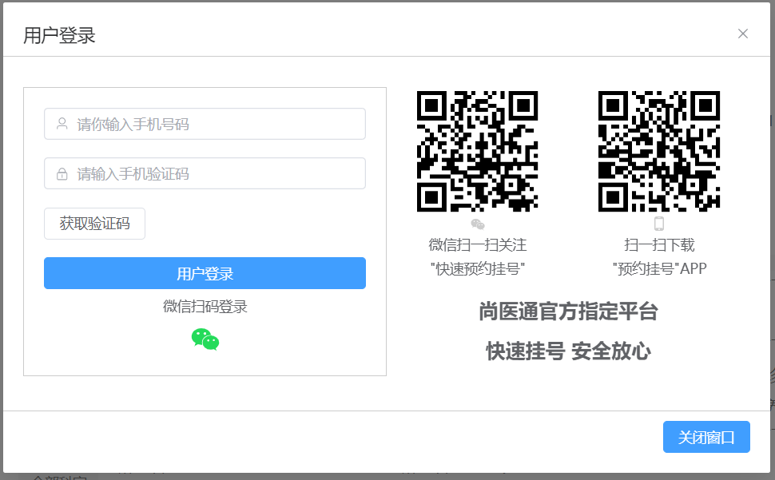

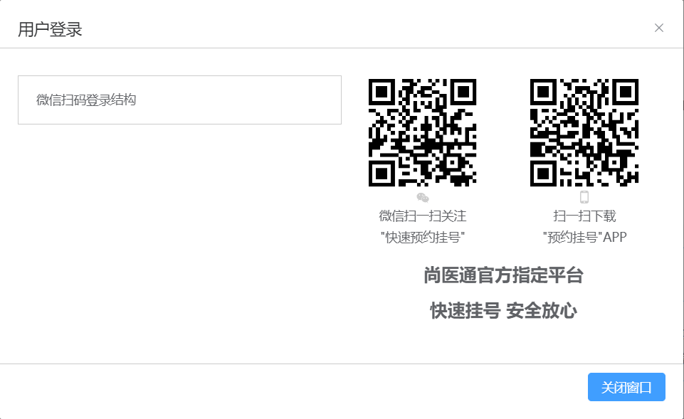

### 3. 根据用户手机号码获取验证码

1. 获取验证码接口

```ts
// src/apis/hospital/index.ts

enum API {
  ...
  // 获取验证码接口
  GETUSERCODE_URL = '/sms/send'
}

// 获取验证码接口
export const reqCode = (phone: string) => request.get<any, any>(API.GETUSERCODE_URL + phone)
```

2. 收集用户手机号码

```vue
// src/components/login/index.vue

<script setup lang="ts">
import { reactive } from 'vue'

let loginParam = reactive({
  phone: ''
})
</script>

<template>
	...
	<el-button
    v-model="loginParam.phone"
    style="width: 100%"
    type="primary"
    size="default"
  >
    用户登录
  </el-button>
</template>
```

3. 判断用户是否输入手机号码

```vue
// src/components/login/index.vue

<script setup lang="ts">
import { reactive, computed } from 'vue'
  
let loginParam = reactive({
  phone: ''
})
let isPhone = computed(() => {
  // 手机号码正则表达式
  const reg =
    /^1((34[0-8])|(8\d{2})|(([35][0-35-9]|4[579]|66|7[35678]|9[1389])\d{1}))\d{7}$/
  return reg.test(loginParam.phone)
})
</script>

<template>
	<el-input
		placeholder="请你输入手机号码"
		:prefix-icon="User"
		v-model="loginParam.phone"
	></el-input>
</template>
```

4. 在仓库定义相对应的方法

```ts
// src/stores/user.ts

import { reqCode } from '@/apis/hospital'

const useUserStore = defineStore('User', {
  state: () => {
    return {
      visiable: false,
      code: ''
    }
  },
  actions: {
    async getCode(phone: string) {
      let result: any = await reqCode(phone)
      if (result.data.code == 200) {
        this.code = result.data.data
        return 'ok'
      } else {
        reutrn Promise.reject(new Error(result.message))
      }
    }
  }
})
```

5. 获取验证码

```vue
// src/components/login/index.vue

<script setup lang="ts">
const getCode = async () => {
  try {
    // 通知pinia仓库存储验证码
    await userStore.getCode(loginParam.phone)
    loginParam.code = userStore.code
  } catch (error) {
    ElMessage({
      type: 'error',
      message: (error as Error).message
    })
}
</script>

<template>
	...
  <el-form>
    <el-form-item>
      <el-input
        placeholder="请你输入手机号码"
        :prefix-icon="User"
        v-model="loginParam.phone"
      ></el-input>
    </el-form-item>
    <el-form-item>
      <el-input
        placeholder="请输入手机验证码"
        :prefix-icon="Lock"
        v-model="loginParam.code"
      ></el-input>
    </el-form-item>
    <el-form-item>
      <el-button
        :disabled="!isPhone ? true : false"
        @click="getCode"
      >
        获取验证码
    	</el-button>
    </el-form-item>
  </el-form>
</template>
```

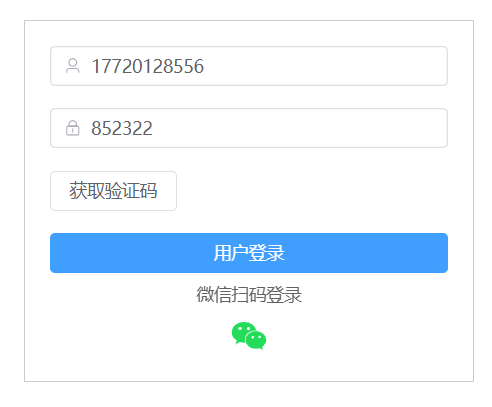

### 4. 5秒获取验证码

1. 新建一个倒计时组件

```vue
// src/components/countdown/index.vue

<script setup lang="ts">
import { ref, watch } from 'vue'
let time = ref<number>(10)
let props = defineProps(['flag'])
let $emit = defineEmits(['getFlag'])

watch(
  () => props.flag,
  () => {
    let timer = setInterval(() => {
      time.value--
      if (time.value === 0) {
        $emit('getFlag', false)
        clearInterval(timer)
      }
    }, 1000)
  },
  {
    immediate: true
  }
)
</script>

<template>
  <div>
    <span>获取验证码({{ time }}s)</span>
  </div>
</template>

<style scoped lang="scss"></style>
```

2. 调用组件，5秒的时候禁用按钮

```vue
// src/components/login/index.vue

<script setup lang="ts">
import CountDown from '../countdown/index.vue'
  
let flag = ref<boolean>(false)
const getCode = async () => {
  // 解决按钮禁用还能点击的问题
  if (!isPhone.value || flag.value) return
  flag.value = true
  ...
}
const getFlag = (val: boolean) => {
  flag.value = val
}
</script>

<template>
	<el-button :disabled="!isPhone || falg ? true : false">
  	<CountDown
    	v-if="flag"
      :flag="flag"
      @getFlag="getFlag"
    ></CountDown>
    <span v-else @click="getCode">获取验证码</span>
  </el-button>
</template>
```

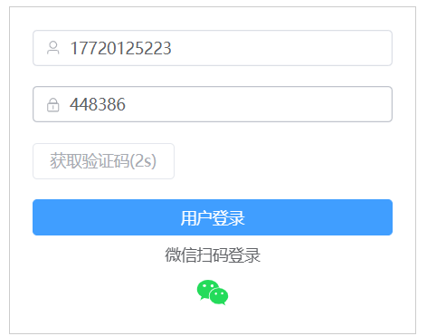

### 5. 用户登录

1. 定义接口TS类型

```ts
// src/apis/hospital/type.ts

// 用户登录接口需要携带参数类型
export interface LoginData {
  phone: string
  code: string
}

// 登录接口返回用户信息数据
export interface UserInfo {
  name: string
  token: string
}

// 登录接口返回的数据的ts类型
// 登录接口返回的数据的ts类型
export interface UserLoginResponseData extends ResponseData {
  data: {
    data: UserInfo
    code: number
  }
}
```

2. 增加接口

```ts
// src/apis/hospital/index.ts

import type { LoginData, UserLoginResponseData } from './type'

enum API {
  ...
  USERLOGIN_URL = '/user/login'
}

// 用户登录接口
export const reqUserLogin = (data: LoginData) =>
  request.post<any, UserLoginResponseData>(API.USERLOGIN_URL, data)
```

3. 判断手机号和验证码是否输入，未输入则禁用，输入了则开放给用户点击

```vue
// src/components/login/index.vue

<template>
	<el-button ... :disabled="!isPhone || loginParam.code.length < 6 ? true : false">
  	用户登录
  </el-button>
</template>
```

4. 定义用户仓库相关state数据的ts类型定义

```ts
// src/stores/modules/interface/index.ts
import type { UserInfo } from '@/apis/hospital/type'

export interface UserState {
  visiable: boolean
  code: string
  userInfo: UserInfo
}
```

5. 在仓库添加相对应的方法

```ts
// src/stores/modules/user.ts

import { reqCode, reqUserLogin } from '@/apis/hospital'
import type {
  LoginData,
  UserInfo,
  UserLoginResponseData
} from '@/apis/hospital/type'
import type { UserState } from './interface'

const useUserStore = defineStore('User', {
  state: (): UserState => {
    return {
      userInfo: {} as UserInfo
    }
  },
  actions: {
    ...
    async userLogin(loginData: LoginData) {
    let result: UserLoginResponseData = await reqUserLogin(loginData)
  	if (result.data.code == 200) {
 			this.userInfo = result.data.data
		}
  }
  }
})
```

6. 绑定方法

```vue
// src/components/login/index.vue

<script setup lang="ts">
// 点击用户登录按钮回调
const login = () => {
  // 发起登录请求
  // 登录请求成功: 顶部组件需要展示用户名字、对话框关闭
  // 登录请求失败: 弹出对应登录失败的错误信息
  userStore.userLogin(loginParam)
}
</script>

<template>
	<el-button ... @click="login">
  	用户登录
  </el-button>
</template>
```

7. 判断用户是否登录成功

```ts
// src/stores/modules/user.ts

const useUserStore = defineStore('User', {
  state: (): UserState => {...},
  actions: {
    ...
    async userLogin(loginData: LoginData) {
      ...
      if (result.data.code == 200) {
        ...
        return 'ok'
      } else {
        return Promist.reject(new Error(result.data.message))
      }
    }
  }
})
```

```vue
// src/components/login/index.vue

<script setup lang="ts">
const login = async () => {
  try {
    await userStore.userLogin(loginParam)
    userStore.visiable = false
  } catch (error) {
    ElMessage({
      type: 'error',
      message: (error as Error).message
    })
  }
}
</script>
```

8. 登录完成后，展示用户的名字

```vue
// src/components/hospital_top/index.vue

<script setup lang="ts">
import { ArrowDown } from '@element-plus/icons-vue'
</script>

<template>
	...
	<p class="login" @click="login" v-if="!userStore.userInfo.name">
  	登录/注册
  </p>
	<el-dropdown v-else>
  	<span class="el-dropdown-link">
  		{{ userStore.userInfo.name }}
      <el-icon class="el-icon--right">
  			<arrow-down />
  		</el-icon>
  	</span>
    <template #dropdown>
      <el-dropdown-menu>
        <el-dropdown-item>实名认证</el-dropdown-item>
        <el-dropdown-item>挂号订单</el-dropdown-item>
        <el-dropdown-item>就诊人管理</el-dropdown-item>
        <el-dropdown-item>退出登录</el-dropdown-item>
      </el-dropdown-menu>
    </template>
  </el-dropdown>
</template>
```

9. 用户名持久化

```ts
// src/utils/user.ts

// 本地存储操作用户信息的方法
export const SET_TOKEN = (userInfo: string) => {
  localStorage.setItem('USERINFO', userInfo)
}

export const GET_TOKEN = () => {
  return localStorage.getItem('USERINFO')
}
```

```ts
// src/stores/modules/user.ts

import { GET_TOKEN, SET_TOKEN } from '@/utils/user'

const useUserStore = defineStore('User', {
  state: (): UserState => {
    return {
      ...,
      userInfo: JSON.parse(GET_TOKEN() as string) || {}
    }
  },
  actions: {
  	...
    if (result.data.code == 200) {
  		...
      SET_TOKEN(JSON.stringify(this.userInfo))
		}
  }
})
```

### 6. 表单校验

1. 手机号与验证码进行表单校验且对两行进行验证才能发送请求

```vue
// src/components/login/index.vue

<script setup lang="ts">
let form = ref<any>()

const login = async () => {
  await form.value.validate()
  ...
}

const validatorPhone = (rule: any, value: any, callBack: any) => {
  const reg = /^1((34[0-8])|(8\d{2})|(([35][0-35-9]|4[579]|66|7[35678]|9[1389])\d{1}))\d{7}$/
  if (reg.test(value)) {
    callBack()
  } else {
    callBack(new Error('请输入正确的手机号码格式'))
  }
}

const validatorCode = (rule: any, value: any, callBack: any) => {
  const reg = /^\d{6}$/
  if (reg.test(value)) {
    callBack()
  } else {
    callBack(new Error('请输入正确的验证码格式'))
  }
}

const rules = {
  phone: [{ trriger: 'change', validator: validatorPhone }],
  code: [{ trriger: 'change', validator: validatorCode }]
}
</script>

<template>
	...
	<el-form :model="loginParam" :rules="rules" ref="form">
  	<el-form-item prop="phone">...</el-form-item>
    <el-form-item prop="code">...</el-form-item>
  </el-form>
</template>
```

### 7. 数据清空

1. 赋予“关闭窗口”关闭功能

```vue
// src/components/login/index.vue

<script setup lang="ts">
const closeDialog = () => {
  userStore.visiable = false
}
</script>

<template #footer>
	<el-button @click="closeDialog">关闭窗口</el-button>
</template>
```

2. 关闭窗口后，清空表单以及表单验证内容

```vue
// src/App.vue

<script setup lang="ts">
import useUserStore from './stores/modules/user'
let userStore = useUserStore()
</script>

<template>
	...
	<Login v-if="userStore.visiable" />
</template>
```

### 8. 退出登录

1. 先写一个清除本地存储用户相关数据的方法

```ts
// src/utils/user.ts

export const REMOVE_TOKEN = () => {
  localStorage.removeItem('USERINFO')
}
```

2. 在仓库定义相关方法

```ts
// src/stores/modules/user.ts

import { REMOVE_TOKEN } from '@/utils/user'

const useUserStore = defineStore('User', {
  ...
  actions: {
    ...
    logout() {
    	this.userInfo = { name: '', token: '' }
  		REMOVE_TOKEN()
  	}
  }
})
```

3. 为退出登录按钮添加逻辑

```vue
// src/vomponents/hospital_top/index.vue

<script setup lang="ts">
const logout = () => {
  userStore.logout()
  $router.push({ path: '/home' })
}
</script>

<template>
	...
	<el-dropdown-item @click="logout">退出登录</el-dropdown-item>
</template>
```

### 9. 微信扫码登录

#### 微信扫码登录

1. 在页面中引入JS文件

```html
// index.html

<head>
  ...
  <script src="http://res.wx.qq.com/connect/zh_CN/htmledition/js/wxLogin.js"></script>
</head>
```

2. 添加JS实例到登录页面组件

```vue
// src/components/login/index.vue

<script setup lang="ts">
const changeScene = () => {
  // @ts-ignore
  new WxLogin({
    self_redirect: true,
    id: 'login_container',
    appid: '',
    scope: 'snsapi_login',
    redirect_uri: '',
    state: '',
    style: 'black',
    href: ''
  })
}
</script>
```

3. 定义微信扫码登录返回的数据ts类型

```ts
// src/apis/hospital/type.ts

export interface WXLogin {
  redirectUri: string
  appid: string
  scope: string
  state: string
}

export interface WXLoginResponseData extends ResponseData {
  data: {
    data: WXLogin
    code: number
  }
}
```

4. 定义相对应的接口

```ts
// src/apis/hospital/index.ts

import type { WXLoginResponseData } from './type'

export const reqWxLogin = (wxRedirectUri: string) =>
  request.get<any, WXLoginResponseData>(
    API.WXLOGIN_URL + `?wxRedirectUri=${wxRedirectUri}`
  )
```

5. 回传相对应的参数

```vue
// src/components/login/index.vue

<script setup lang="ts">
import { reqWxLogin } from '@/apis/hospital'
import type { WXLoginResponseData } from '@/apis/hospital/type'
  
const changeScene = async () => {
  ...
  let redirect_URL = encodeURIComponent(window.location.origin + '/wxlogin')
  let result: WXLoginResponseData = await reqWxLogin(redirect_URL)
  
  // @ts-ignore
  new WxLogin({
    self_redirect: true,
    id: 'login_container',
    appid: result.data.data.appid,
    scope: 'snsapi_login',
    redirect_uri: result.data.data.redirectUri,
    state: result.data.data.state,
    style: 'black',
    href: ''
  })
}
</script>
```

#### 添加手机短信验证码按钮登录

```vue
// src/components/login/index.vue

<script>
const handler = () => {
  scene.value = 0
}
</script>

<template>
	<div class="webchat" v-show="scene == 1">
    ...
    <div class="phone" @click="handler">
      <p>手机短信验证码登录</p>
      <svg
           t="1706669976481"
           class="icon"
           viewBox="0 0 1024 1024"
           version="1.1"
           xmlns="http://www.w3.org/2000/svg"
           p-id="7321"
           width="16"
           height="16"
           >
        <path
              d="M191.6 83.4c-47.4 22.4-85.8 60.8-108.2 108.2L191.6 83.4z"
              fill="#4ADF9E"
              p-id="7322"
              ></path>
        <path
              d="M228.8 69.7C151.6 90.5 90.5 151.6 69.7 228.8L228.8 69.7z"
              fill="#49DF9E"
              p-id="7323"
              ></path>
        <path
              d="M258.2 63.9c-100.8 13-181.3 93.5-194.4 194.4L258.2 63.9z"
              fill="#48DF9F"
              p-id="7324"
              ></path>
        <path
              d="M283.6 62C162.5 63.9 63.9 162.5 62 283.6L283.6 62z"
              fill="#47E09F"
              p-id="7325"
              ></path>
        <path
              d="M307.2 62H287C163.3 62 62 163.3 62 287v20.2L307.2 62z"
              fill="#46E09F"
              p-id="7326"
              ></path>
        <path
              d="M330.7 62H287C163.3 62 62 163.3 62 287v43.7L330.7 62z"
              fill="#45E09F"
              p-id="7327"
              ></path>
        <path
              d="M354.2 62H287C163.3 62 62 163.3 62 287v67.2L354.2 62z"
              fill="#44E0A0"
              p-id="7328"
              ></path>
        <path
              d="M377.8 62H287C163.3 62 62 163.3 62 287v90.8L377.8 62z"
              fill="#43E0A0"
              p-id="7329"
              ></path>
        <path
              d="M401.3 62H287C163.3 62 62 163.3 62 287v114.3L401.3 62z"
              fill="#42E0A0"
              p-id="7330"
              ></path>
        <path
              d="M424.9 62H287C163.3 62 62 163.3 62 287v137.9L424.9 62z"
              fill="#41E0A0"
              p-id="7331"
              ></path>
        <path
              d="M448.4 62H287c-39.8 0-77.3 10.5-109.8 28.8l-86.4 86.4C72.5 209.7 62 247.2 62 287v161.4L448.4 62z"
              fill="#40E1A1"
              p-id="7332"
              ></path>
        <path
              d="M472 62H287c-23.7 0-46.5 3.7-68 10.6L72.6 219C65.7 240.5 62 263.3 62 287v185L472 62z"
              fill="#3FE1A1"
              p-id="7333"
              ></path>
        <path
              d="M495.5 62H287c-12.6 0-24.9 1.1-37 3.1l-185 185c-2 12-3.1 24.4-3.1 37v208.5L495.5 62z"
              fill="#3EE1A1"
              p-id="7334"
              ></path>
        <path
              d="M519.1 62H287c-3.6 0-7.1 0.1-10.6 0.3L62.3 276.4c-0.2 3.5-0.3 7-0.3 10.6v232.1L519.1 62z"
              fill="#3DE1A1"
              p-id="7335"
              ></path>
        <path
              d="M62 542.6L542.6 62H300.2L62 300.2z"
              fill="#3CE1A2"
              p-id="7336"
              ></path>
        <path
              d="M62 566.2L566.2 62H323.8L62 323.8z"
              fill="#3BE1A2"
              p-id="7337"
              ></path>
        <path
              d="M62 589.7L589.7 62H347.3L62 347.3z"
              fill="#3AE1A2"
              p-id="7338"
              ></path>
        <path
              d="M62 613.3L613.3 62H370.8L62 370.8z"
              fill="#39E2A2"
              p-id="7339"
              ></path>
        <path
              d="M62 636.8L636.8 62H394.4L62 394.4z"
              fill="#38E2A3"
              p-id="7340"
              ></path>
        <path
              d="M62 417.9v242.5L660.4 62H417.9z"
              fill="#37E2A3"
              p-id="7341"
              ></path>
        <path
              d="M62 441.5v242.4L683.9 62H441.5z"
              fill="#36E2A3"
              p-id="7342"
              ></path>
        <path
              d="M62 465v242.5L707.5 62H465z"
              fill="#35E2A3"
              p-id="7343"
              ></path>
        <path
              d="M62 488.6V731L731 62H488.6z"
              fill="#34E2A3"
              p-id="7344"
              ></path>
        <path
              d="M737 62H512.1L62 512.1V737c0 5.7 0.2 11.3 0.6 16.9L753.9 62.6c-5.6-0.4-11.2-0.6-16.9-0.6z"
              fill="#33E2A4"
              p-id="7345"
              ></path>
        <path
              d="M737 62H535.7L62 535.7V737c0 12.9 1.1 25.5 3.2 37.9L774.9 65.2c-12.4-2.1-25-3.2-37.9-3.2z"
              fill="#32E3A4"
              p-id="7346"
              ></path>
        <path
              d="M737 62H559.2L62 559.2V737c0 19.8 2.6 38.9 7.4 57.2L794.2 69.4C775.9 64.6 756.8 62 737 62z"
              fill="#31E3A4"
              p-id="7347"
              ></path>
        <path
              d="M737 62H582.8L62 582.8V737c0 26.3 4.6 51.6 13 75.2L812.2 75c-23.6-8.4-48.9-13-75.2-13z"
              fill="#30E3A4"
              p-id="7348"
              ></path>
        <path
              d="M737 62H606.3L62 606.3V737c0 32.7 7.1 63.8 19.8 92L829 81.8C800.8 69.1 769.7 62 737 62z"
              fill="#2FE3A5"
              p-id="7349"
              ></path>
        <path
              d="M844.7 89.6C812.6 72 775.9 62 737 62H629.9L62 629.9V737c0 38.9 10 75.6 27.6 107.7L844.7 89.6z"
              fill="#2EE3A5"
              p-id="7350"
              ></path>
        <path
              d="M859.4 98.5C824.1 75.4 782 62 737 62h-83.6L62 653.4V737c0 45 13.4 87.1 36.5 122.4L859.4 98.5z"
              fill="#2DE3A5"
              p-id="7351"
              ></path>
        <path
              d="M873.2 108.2C835.3 79.3 788.1 62 737 62h-60L62 677v60c0 51.1 17.3 98.3 46.2 136.2l765-765z"
              fill="#2CE3A5"
              p-id="7352"
              ></path>
        <path
              d="M886.1 118.8C846.3 83.5 794 62 737 62h-36.5L62 700.5V737c0 57 21.5 109.3 56.8 149.1l767.3-767.3z"
              fill="#2BE4A6"
              p-id="7353"
              ></path>
        <path
              d="M737 62h-12.9L62 724.1V737c0 63 26.3 120.2 68.4 161.1l767.8-767.8C857.2 88.3 800 62 737 62z"
              fill="#2AE4A6"
              p-id="7354"
              ></path>
        <path
              d="M62.2 747.4c3 64.8 33.7 122.7 80.5 161.9l766.6-766.6C870 95.9 812.2 65.2 747.4 62.2L62.2 747.4z"
              fill="#29E4A6"
              p-id="7355"
              ></path>
        <path
              d="M64.3 768.9c8.9 61.8 43.1 115.7 91.7 150.7L919.6 156c-35-48.6-88.9-82.8-150.7-91.7L64.3 768.9z"
              fill="#28E4A6"
              p-id="7356"
              ></path>
        <path
              d="M68 788.7c14 59.1 51.5 109.4 102.1 140.4l758.9-759c-30.9-50.5-81.2-88-140.4-102.1L68 788.7z"
              fill="#27E4A7"
              p-id="7357"
              ></path>
        <path
              d="M73.2 807c18.7 56.7 59.4 103.6 111.9 130.5l752.3-752.3c-26.8-52.5-73.7-93.3-130.4-112L73.2 807z"
              fill="#26E4A7"
              p-id="7358"
              ></path>
        <path
              d="M79.7 824.1c23.1 54.4 67 98.1 121.6 120.8l743.6-743.6c-22.7-54.6-66.3-98.6-120.8-121.6L79.7 824.1z"
              fill="#25E5A7"
              p-id="7359"
              ></path>
        <path
              d="M87.2 840.1c27.2 52.3 74.4 92.8 131.3 111.1l732.8-732.8C933 161.5 892.5 114.3 840.2 87.1l-753 753z"
              fill="#25E5A7"
              p-id="7360"
              ></path>
        <path
              d="M95.8 855.1c31.3 50.3 81.9 87.6 141.2 101.2L956.3 237c-13.6-59.4-50.8-110-101.2-141.2L95.8 855.1z"
              fill="#24E5A7"
              p-id="7361"
              ></path>
        <path
              d="M256.9 960L960 256.9c-8.4-62-42.3-116.3-90.8-151.6l-764 764c35.4 48.3 89.6 82.3 151.7 90.7z"
              fill="#23E5A8"
              p-id="7362"
              ></path>
        <path
              d="M278.6 961.8l683.3-683.3c-2.4-65.1-32.8-123.3-79.5-162.9L115.6 882.4c39.7 46.6 97.9 77 163 79.4z"
              fill="#22E5A8"
              p-id="7363"
              ></path>
        <path
              d="M962 287c0-62.5-25.8-119.3-67.3-160.1L126.9 894.7C167.7 936.2 224.5 962 287 962h14.9L962 301.9V287z"
              fill="#21E5A8"
              p-id="7364"
              ></path>
        <path
              d="M962 287c0-56.5-21.1-108.4-55.9-148L139 906.1c39.6 34.8 91.5 55.9 148 55.9h38.5L962 325.5V287z"
              fill="#20E5A8"
              p-id="7365"
              ></path>
        <path
              d="M962 287c0-50.6-16.9-97.4-45.3-135L152 916.7c37.7 28.4 84.5 45.3 135 45.3h62l613-613v-62z"
              fill="#1FE6A9"
              p-id="7366"
              ></path>
        <path
              d="M962 287c0-44.5-13.1-86.1-35.7-121.2L165.8 926.3c35 22.5 76.6 35.7 121.2 35.7h85.6L962 372.6V287z"
              fill="#1EE6A9"
              p-id="7367"
              ></path>
        <path
              d="M962 287c0-38.4-9.8-74.6-26.9-106.4L180.6 935.1c31.7 17.2 68 26.9 106.4 26.9h109.1L962 396.1V287z"
              fill="#1DE6A9"
              p-id="7368"
              ></path>
        <path
              d="M287 962h132.7L962 419.7V287c0-32.2-6.9-62.8-19.2-90.6L196.4 942.8c27.8 12.3 58.4 19.2 90.6 19.2z"
              fill="#1CE6A9"
              p-id="7369"
              ></path>
        <path
              d="M287 962h156.2L962 443.2V287c0-25.8-4.4-50.6-12.5-73.7L213.3 949.5c23.1 8.1 47.9 12.5 73.7 12.5z"
              fill="#1BE6AA"
              p-id="7370"
              ></path>
        <path
              d="M287 962h179.8L962 466.8V287c0-19.2-2.4-37.8-7-55.6L231.4 955c17.8 4.6 36.4 7 55.6 7z"
              fill="#1AE6AA"
              p-id="7371"
              ></path>
        <path
              d="M287 962h203.3L962 490.3V287c0-12.3-1-24.4-2.9-36.2L250.8 959.1c11.8 1.9 23.9 2.9 36.2 2.9z"
              fill="#19E6AA"
              p-id="7372"
              ></path>
        <path
              d="M287 962h226.9L962 513.9V287c0-5.1-0.2-10.1-0.5-15L272 961.5c4.9 0.3 9.9 0.5 15 0.5z"
              fill="#18E7AA"
              p-id="7373"
              ></path>
        <path
              d="M537.4 962L962 537.4V295L295 962z"
              fill="#17E7AB"
              p-id="7374"
              ></path>
        <path
              d="M561 962l401-401V318.5L318.5 962z"
              fill="#16E7AB"
              p-id="7375"
              ></path>
        <path
              d="M584.5 962L962 584.5V342.1L342.1 962z"
              fill="#15E7AB"
              p-id="7376"
              ></path>
        <path
              d="M608.1 962L962 608.1V365.6L365.6 962z"
              fill="#14E7AB"
              p-id="7377"
              ></path>
        <path
              d="M631.6 962L962 631.6V389.2L389.2 962z"
              fill="#13E7AB"
              p-id="7378"
              ></path>
        <path
              d="M655.2 962L962 655.2V412.7L412.7 962z"
              fill="#12E7AC"
              p-id="7379"
              ></path>
        <path
              d="M678.7 962L962 678.7V436.3L436.3 962z"
              fill="#11E8AC"
              p-id="7380"
              ></path>
        <path
              d="M702.2 962L962 702.2V459.8L459.8 962z"
              fill="#10E8AC"
              p-id="7381"
              ></path>
        <path
              d="M725.8 962L962 725.8V483.4L483.4 962z"
              fill="#0FE8AC"
              p-id="7382"
              ></path>
        <path
              d="M962 737V506.9L506.9 962H737c4.3 0 8.5-0.1 12.7-0.4l211.9-211.9c0.3-4.2 0.4-8.4 0.4-12.7z"
              fill="#0EE8AD"
              p-id="7383"
              ></path>
        <path
              d="M962 737V530.5L530.5 962H737c13.4 0 26.6-1.2 39.4-3.5l182.2-182.2c2.2-12.7 3.4-25.9 3.4-39.3z"
              fill="#0DE8AD"
              p-id="7384"
              ></path>
        <path
              d="M962 737V554L554 962h183c24.8 0 48.6-4.1 71-11.6L950.4 808c7.5-22.4 11.6-46.2 11.6-71z"
              fill="#0CE8AD"
              p-id="7385"
              ></path>
        <path
              d="M962 737V577.6L577.6 962H737c41.8 0 80.9-11.5 114.6-31.6l78.9-78.9c20-33.6 31.5-72.7 31.5-114.5z"
              fill="#0BE8AD"
              p-id="7386"
              ></path>
        <path
              d="M962 601.1L601.1 962H737c123.8 0 225-101.3 225-225V601.1z"
              fill="#0AE9AE"
              p-id="7387"
              ></path>
        <path
              d="M962 624.7L624.7 962H737c123.8 0 225-101.3 225-225V624.7z"
              fill="#09E9AE"
              p-id="7388"
              ></path>
        <path
              d="M962 648.2L648.2 962H737c123.8 0 225-101.3 225-225v-88.8z"
              fill="#08E9AE"
              p-id="7389"
              ></path>
        <path
              d="M962 671.8L671.8 962H737c123.8 0 225-101.3 225-225v-65.2z"
              fill="#07E9AE"
              p-id="7390"
              ></path>
        <path
              d="M962 695.3L695.3 962H737c123.8 0 225-101.3 225-225v-41.7z"
              fill="#06E9AF"
              p-id="7391"
              ></path>
        <path
              d="M962 718.8L718.8 962H737c123.8 0 225-101.3 225-225v-18.2z"
              fill="#05E9AF"
              p-id="7392"
              ></path>
        <path
              d="M961.9 742.5L742.5 961.9c119.4-2.9 216.5-100 219.4-219.4z"
              fill="#04E9AF"
              p-id="7393"
              ></path>
        <path
              d="M959.8 768.1L768.1 959.8c99-13.8 177.9-92.7 191.7-191.7z"
              fill="#03EAAF"
              p-id="7394"
              ></path>
        <path
              d="M953.6 797.9L797.9 953.6c75-21.3 134.4-80.7 155.7-155.7z"
              fill="#02EAB0"
              p-id="7395"
              ></path>
        <path
              d="M938.7 836.3L836.3 938.7c44.3-21.9 80.5-58.1 102.4-102.4z"
              fill="#01EAB0"
              p-id="7396"
              ></path>
        <path
              d="M386 269h252c19.9 0 36 16.1 36 36v414c0 19.9-16.1 36-36 36H386c-19.9 0-36-16.1-36-36V305c0-19.9 16.1-36 36-36z"
              fill="#F6FDFA"
              p-id="7397"
              ></path>
        <path
              d="M602 683H422c-19.9 0-36-16.1-36-36V350c0-19.9 16.1-36 36-36h180c19.9 0 36 16.1 36 36v297c0 19.9-16.1 36-36 36z"
              fill="#CAF6E1"
              p-id="7398"
              ></path>
        <path
              d="M512 719m-18 0a18 18 0 1 0 36 0 18 18 0 1 0-36 0Z"
              fill="#CAF6E1"
              p-id="7399"
              ></path>
  		</svg>
  	</div>
  </div>
</template>

<style scoped lang="scss">
  .login_container{
    ...
    .login {
      ...
      .webchat {
        display: flex;
        flex-direction: column;
        align-items: center;
        .phone {
          display: flex;
          flex-direction: column;
          align-items: center;
          p {
            margin: 10px 0;
          }
        }
      }
    }
  }
</style>
```

#### 扫码后续操作

1. 新建路由

```ts
// src/router/index.ts

const router = createRouter({
  ...
  routes: [
    ...
    {
      path: '/wxlogin',
      component: () => import('@/views/wxlogin/index.vue')
    }
  ]
})
```

```vue
// src/views/wxlogin/index.vue

<script setup lang="ts">
</script>

<template>
  <div></div>
</template>

<style scoped lang="scss"></style>
```

2. 新增查询微信扫码接口的方法

```ts
// src/stores/modules/user.ts

const useUserStore = defineStore('User', {
  ...
  actions: {
    ...
    queryState() {
    let timer = setInterval(() => {
  		if (GET_TOKEN()) {
  			this.visiable = false
  			this.userInfo = JSON.parse(GET_TOKEN() as string)
  			clearInterval(timer)
			}
		}, 1000)
  }
  }
})
```

3. 监听场景

```vue
// src/components/login/index.vue

<script setup lang="ts">
import { watch } from 'vue'
  
watch(
	() => scene.value,
  (val: number) => {
    if (val === 1) {
      userStore.queryState()
    }
  }
)
</script>
```

4. 设置逻辑

```vue
// src/views/wxlogin/index.vue

<script setup lang="ts">
import { useRoute } from 'vue-router'
import { SET_TOKEN } from '@/utils/user'
  
let $route = useRoute()
SET_TOKEN(JSON.stringify($route.query))
let html: any = document.querySelector('html')
html.style.display = 'none'
</script>
```

## 三、预约挂号

### 1. 预约挂号的路由搭建

1. 新增路由

```ts
// src/router/index.ts

const router = createRouter({
  ...
  routes: [
    ...
    {
      ...
      children: [
        ...
        {
          path: 'register_step1',
          component: () => import('@/views/hospital/register/register_step1.vue')
        }
      ]
    }
  ]
})
```

```vue
// src/views/hospital/register/index.vue

<script setup lang="ts"></script>

<template>
  <div>预约挂号的数据</div>
</template>

<style scoped lang="scss"></style>
```

2. 带着参数跳转到预约挂号页面

```vue
// src/views/hospital/register/index.vue

<script setup lang="ts">
- import useUserStore from '@/stores/modules/user'
- let userStore = useUserStore()
	const showLogin = () => {
-   userStore.visiable = true
  }
</script>
```

### 2. 页面静态搭建

```vue
// src/views/hospital/register/index.vue

<script setup lang="ts"></script>

<template>
  <div class="wrap">
    <!-- 顶部结构 -->
    <div class="top">
      <div class="hosname">北京XX医院</div>
      <div class="line"></div>
      <div>专科</div>
      <div class="dot">.</div>
      <div class="hosdeparment">多发性硬化专科门诊</div>
    </div>
    <div class="center">
      <h1 class="time">2024年1月31日</h1>
      <div class="container">
        <div class="item" v-for="item in 6" :key="item">
          <div class="top1">123</div>
          <div class="bottom">456</div>
        </div>
      </div>
      <el-pagination layout="prev, pager, next" :total="50" />
    </div>
  </div>
</template>

<style scoped lang="scss">
.wrap {
  .top {
    display: flex;
    color: #7f7f7f;
    .line {
      width: 5px;
      height: 20px;
      background: #7f7f7f;
      margin: 0 5px;
    }
    .dot {
      margin: 0 5px;
      color: #7f7f7f;
    }
  }
  .center {
    margin: 20px 0;
    display: flex;
    flex-direction: column;
    align-items: center;
    .time {
      font-weight: 900;
      color: #7f7f7f;
    }
    .container {
      width: 100%;
      display: flex;
      margin: 30px 0;
      .item {
        flex: 1;
        border: 1px solid skyblue;
        margin: 0 5px;
        display: flex;
        flex-direction: column;
        align-items: center;
        .top1 {
          background: #e8f2ff;
          height: 30px;
          width: 100%;
          text-align: center;
          line-height: 30px;
        }
        .bottom {
          width: 100%;
          height: 60px;
          text-align: center;
          line-height: 60px;
        }
      }
    }
  }
}
</style>
```

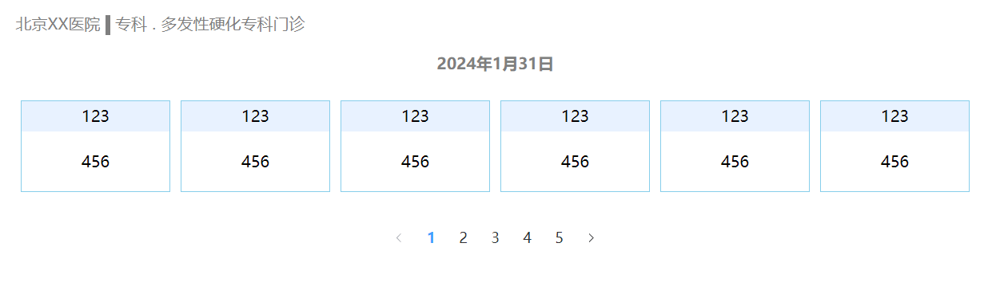

### 3. 展示预约挂号数据

1. 定义TS类型

```ts
// src/apis/hospital/type.ts

export interface BaseMap {
  workDataString: string
  releaseTime: string
  bigname: string
  stopTime: string
  depname: string
  hosname: string
}

export interface WorkData {
  workDate: string
  workDateMd: string
  dayOfWeek: string
  docCount: number
  reservedNumber: null
  availableNumber: number
  status: number
}

export type BookingSceduleList = WorkData[]

export interface HospitalWorkData extends ResponseData {
  data: {
    code: number
    data: {
      total: number
      bookingSceduleList: BookingSceduleList
      bashMap: BaseMap
    }
  }
}
```

2. 获取预约挂号的数据

```ts
// src/apis/hospital/index.ts

export const reqHospitalWork = (
  page: number,
  limit: number,
  hoscode: string,
  depcode: string
) =>
  request.get<any, HospitalWorkData>(
    // API.HOSPITALWORK_URL + `${page}/${limit}/${hoscode}/${depcode}`
    API.HOSPITALWORK_URL + `${page}/${limit}/1000_0/${depcode}`
  )
```

3. 获取相应的token，存储token才能获得数据

```ts
// src/utils/request.ts

import useUserStore from '@/stores/modules/user'

request.interceptors.request.use((config) => {
  ...
  if (userStore.userInfo.token) {
    config.headers.token = userStore.userInfo.token
  }
})
```

4. 渲染数据

```vue
// src/views/hospital/register/register_step1.vue

<script setup lang="ts">
import { onMounted, ref } from 'vue'
import { reqHospitalWork } from '@/apis/hospital'
import { useRoute } from 'vue-router'
import type { HospitalWorkData } from '@/apis/hospital/type'
  
let pageNo = ref<number>(1)
let limit = ref<number>(6)
let $route = useRoute()
let workData = ref<any>({})

onMounted(() => {
  fetchWorkData()
})
const fetchWorkData = async () => {
  let result: HospitalWorkData = await reqHospitalWork(
  	pageNo.value,
    limit.value,
    $route.query.hoscode as string,
    $route.query.depcode as string
  )
  if (result.data.code == 200) {
    workData.value = result.data
  }
}
</script>

<template>
  <div class="wrap">
    <!-- 顶部结构 -->
    <div class="top">
      <div class="hosname">{{ workData.bashMap?.hosname }}</div>
      <div class="line"></div>
      <div>{{ workData.baseMap?.bigname }}</div>
      <div class="dot">.</div>
      <div class="hosdeparment">{{ workData.baseMap?.depname }}</div>
    </div>
    <div class="center">
      <h1 class="time">{{ workData.baseMap?.workDateString }}</h1>
      <div class="container">
        <div
          class="item"
          v-for="item in workData.bookingScheduleList"
          :key="item"
          :class="{ active: item.status == -1 || item.availableNumber == -1 }"
        >
          <div class="top1">{{ item.workDate }} - {{ item.dayOfWeek }}</div>
          <div class="bottom">
            <div v-if="item.status == -1">停止挂号</div>
            <div v-if="item.status == 0">
              {{
                item.availableNumber == -1
                  ? '约满了'
                  : `有号(${item.availableNumber})`
              }}
            </div>
            <div v-if="item.status == 1">即将放号</div>
          </div>
        </div>
      </div>
      <el-pagination
        v-model:current-page="pageNo"
        @current-change="fetchWorkData"
        layout="prev, pager, next"
        :total="workData.total"
      />
    </div>
  </div>
</template>

<style scoped lang="scss">
	...
  .container{
    ...
    &.active {
      border: 1px solid #ccc;
      color: #7f7f7f;
      .top1 {
        background: #ccc;
      }
    }
  }
</style>
```

:::warning 注意

接口数据是有问题的，即使强行改 `src/apis/hospital/index.vue` 的挂号数据的 `hoscode` 为 `1000_0` 也是报数据异常的错误，应该是他们后台把 `1000_0` 的数据删除了才导致这样的结果。

:::

### 4. 底部上下午医生结构搭建

1. 静态搭建

```vue
// src/views/hospital/register/register_step1.vue

<template>
	<div class="wrap">
    ...
        <!-- 底部展示医生号源结构 -->
    <div class="bottom">
      <!-- 展示即将放号的时间 -->
      <div class="will">
        <span class="time">2024年2月1日08:30</span>
        <span class="willText">放号</span>
      </div>
      <!-- 展示医生的结构 -->
      <div class="doctor">
        <div class="morning">
          <div class="tip">
            <svg
              t="1706776567101"
              class="icon"
              viewBox="0 0 1024 1024"
              version="1.1"
              xmlns="http://www.w3.org/2000/svg"
              p-id="5278"
              width="32"
              height="32"
            >
              <path
                d="M904.101037 676.946871H118.670712c-15.461511 0-28.105271-12.535384-28.105271-28.033021 0-15.461511 12.643759-28.105271 28.105271-28.10527h785.430325c15.461511 0 28.105271 12.643759 28.105271 28.10527s-12.607634 28.033021-28.105271 28.033021z m-56.029916-324.980738c-11.018133 10.945883-28.719396 10.945883-39.665279 0-11.018133-10.945883-11.018133-28.755521 0-39.665279l39.665279-39.665279a27.97522 27.97522 0 0 1 39.593029 0 27.93187 27.93187 0 0 1 0 39.665279l-39.593029 39.665279z m-62.279545 212.776406c-26.082269-128.027094-138.683977-224.444789-274.441826-224.44479-135.649474 0-248.287307 96.417696-274.369576 224.44479H177.915755c21.602766-158.263741 162.454244-280.583081 333.433995-280.583081 171.088125 0 311.903478 122.31934 333.506244 280.583081h-59.064418z m-274.441826-336.612997c-15.461511 0-28.033021-12.535384-28.033021-28.10527V143.95823c0-15.461511 12.535384-28.105271 28.033021-28.10527 15.569886 0 28.105271 12.643759 28.10527 28.10527v56.029916c0 15.606011-12.535384 28.141396-28.10527 28.141396zM174.700628 351.966133L135.035349 312.264729c-10.945883-10.945883-10.945883-28.755521 0-39.665279 11.018133-10.945883 28.719396-10.945883 39.665279 0l39.665279 39.665279a27.93187 27.93187 0 0 1 0 39.665279c-10.909758 10.982008-28.647146 10.982008-39.665279 0.036125z m-28.033021 381.119029h729.40041c15.497636 0 28.033021 12.535384 28.03302 28.03302a28.033021 28.033021 0 0 1-28.03302 28.033021H146.667607c-15.497636 0-28.033021-12.535384-28.03302-28.033021 0.036125-15.497636 12.571509-28.033021 28.03302-28.03302z m84.171312 112.168207h561.093911c15.497636 0 28.033021 12.535384 28.033021 28.033021 0 15.569886-12.535384 28.105271-28.033021 28.10527H230.838919c-15.497636 0-28.033021-12.535384-28.03302-28.10527 0-15.497636 12.535384-28.033021 28.03302-28.033021z"
                fill="#4F81BD"
                p-id="5279"
              ></path>
            </svg>
            <span class="text">上午号源</span>
          </div>
          <div class="doc_info">
            <div class="left">
              <div class="info">
                <span>副主任医师</span>
                <span>|</span>
                <span>张三</span>
              </div>
              <div class="skill">内分泌常见病</div>
            </div>
            <div class="right">
              <div class="money">￥100</div>
              <el-button type="primary" size="default">100</el-button>
            </div>
          </div>
          <div class="doc_info">
            <div class="left">
              <div class="info">
                <span>副主任医师</span>
                <span>|</span>
                <span>张三</span>
              </div>
              <div class="skill">内分泌常见病</div>
            </div>
            <div class="right">
              <div class="money">￥100</div>
              <el-button type="primary" size="default">100</el-button>
            </div>
          </div>
        </div>
        <div class="morning">
          <div class="tip">
            <svg
              t="1706777951381"
              class="icon"
              viewBox="0 0 1024 1024"
              version="1.1"
              xmlns="http://www.w3.org/2000/svg"
              p-id="6966"
              width="32"
              height="32"
            >
              <path
                d="M956.67822 265.212314c0-16.954137-13.745049-30.699186-30.699186-30.699186H93.008812c-16.954137 0-30.699186 13.745049-30.699186 30.699186s13.745049 30.699186 30.699186 30.699186h149.107993C248.922814 356.451318 275.789719 412.512125 319.503313 456.226742c51.022047 51.021024 118.858038 79.119989 191.013405 79.119989S650.509099 507.247766 701.531146 456.226742c43.713594-43.714617 70.581522-99.775424 77.386508-160.315242h147.06138c16.954137 0 30.699186-13.745049 30.699186-30.699186z m-239.676731 30.699186c-14.888082 100.599186-101.811804 178.036859-206.484771 178.036859-104.671944 0-191.595666-77.438697-206.483748-178.036859h412.968519zM511.999488 587.553767c16.954137 0 30.699186 13.745049 30.699186 30.699185v141.216256c0 16.954137-13.745049 30.699186-30.699186 30.699186s-30.699186-13.745049-30.699186-30.699186v-141.216256c0-16.954137 13.745049-30.699186 30.699186-30.699185zM262.443759 493.174236c5.994528-5.994528 13.851473-8.991792 21.707395-8.991792s15.712867 2.997264 21.707394 8.991792c11.989055 11.988032 11.989055 31.425733 0 43.414789l-99.855242 99.855242c-11.989055 11.989055-31.426757 11.989055-43.415812 0-11.988032-11.989055-11.988032-31.426757 0-43.415812l99.856265-99.854219zM740.742193 484.182444c7.855922 0 15.71389 2.998287 21.707394 8.991792l99.855242 99.854219c11.989055 11.989055 11.989055 31.426757 0 43.414788-11.989055 11.990079-31.42778 11.990079-43.414788 0.001024l-99.855243-99.855242c-11.989055-11.988032-11.989055-31.425733 0-43.414789 5.995551-5.995551 13.849426-8.991792 21.707395-8.991792z"
                fill="#4F81BD"
                p-id="6967"
              ></path>
            </svg>
            <span class="text">下午号源</span>
          </div>
          <div class="doc_info">
            <div class="left">
              <div class="info">
                <span>副主任医师</span>
                <span>|</span>
                <span>张三</span>
              </div>
              <div class="skill">内分泌常见病</div>
            </div>
            <div class="right">
              <div class="money">￥100</div>
              <el-button type="primary" size="default">100</el-button>
            </div>
          </div>
          <div class="doc_info">
            <div class="left">
              <div class="info">
                <span>副主任医师</span>
                <span>|</span>
                <span>张三</span>
              </div>
              <div class="skill">内分泌常见病</div>
            </div>
            <div class="right">
              <div class="money">￥100</div>
              <el-button type="primary" size="default">100</el-button>
            </div>
          </div>
        </div>
      </div>
    </div>
  </div>
</template>

<style scoped lang="scss">
  .wrap{
    ...
    .bottom {
      .will {
          text-align: center;
          font-size: 30px;
          font-weight: 900;
          .time {
            color: red;
          }
          .willText {
            color: skyblue;
          }
        }
        .doctor {
          .morning {
            .tip {
              display: flex;
              align-items: center;
              .text {
                color: #7f7f7f;
                font-weight: 900;
              }
            }
            .doc_info {
              display: flex;
              justify-content: space-between;
              margin: 10px 0px;
              border-bottom: 1px solid #ccc;
              .left {
                .info {
                  color: skyblue;
                  margin: 10px 0;
                  span {
                    margin: 0 5px;
                    font-size: 18px;
                    font-weight: 900;
                  }
                }
                .skill {
                  margin: 10px 0;
                  color: #7f7f7f;
                }
              }
              .right {
                width: 150px;
                display: flex;
                justify-content: space-between;
                align-items: center;
                .money {
                  color: #7f7f7f;
                  font-weight: 900;
                }
              }
            }
          }
        }
      }
    }
  }
</style>
```

2. 渲染数据

```vue
// src/views/hospital/register/register_step1.vue

<script setup lang="ts">
import { computed } from 'vue'
import type { DocArr, Doctor } from '@/apis/hospital/type'
  
let docArr = ref<DocArr>([])

const changeTime = (item: any) => {
  workTime.value = item
  getDoctorWorkData()
}

let morningArr = computed(() => {
  return docArr.value.filter((doc: Doctor) => {
    return doc.workTime == 0
  })
})
let afterArr = computed(() => {
  return docArr.value.filter((doc: Doctor) => {
    return doc.workTime == 1
  })
})
</script>

<template>
	<div class=center>
    ...
    <div 
    	class="item" 
    	:class="{
      	...
        cur: item.workData == workTime.workDate
      }"
      @click="changeTime(item)"
    >
      ...
  	</div>
  </div>

	<div class="bottom"> 
    <div class="will" v-if="workTime.status == 1">...</div>
		<div class="doctor" v-else>
      <div class="morning">
  			...
        <div class="doc_info" v-for="doctor in morningArr" :key="doctor.id">
          <div class="left">
            <div class="info">
              <span>{{ doctor.title }}</span>
              <span>|</span>
              <span>{{ doctor.docname }}</span>
            </div>
            <div class="skill">{{ doctor.skill }}</div>
          </div>
          <div class="right">
            <div class="money">￥{{ doctor.amount }}</div>
            <el-button type="primary" size="default">{{ doctor.availableNumber }}</el-button>
          </div>
        </div>
      </div>
  	</div>
    <div class="morning">
      ...
      <div class="doc_info" v-for="doctor in afterArr" :key="doctor.id">
          <div class="left">
            <div class="info">
              <span>{{ doctor.title }}</span>
              <span>|</span>
              <span>{{ doctor.docname }}</span>
            </div>
            <div class="skill">{{ doctor.skill }}</div>
          </div>
          <div class="right">
            <div class="money">￥{{ doctor.amount }}</div>
            <el-button type="primary" size="default">{{ doctor.availableNumber }}</el-button>
          </div>
        </div>
  	</div>
  </div>
</template>

<style scoped lang="scss">
	...
  .item{
    ...
    transition: all 0.1s;
    ...
    &.cur {
      transform: scale(1.1)
    }
  }
</style>
```

#### 5. 就诊人搭建

1. 新建路由

```ts
// src/router/index.ts

const router = createRouter({
  ...
  routes: [
    ...
    {
      path: 'register_step2',
      component: () => import('@/views/hospital/register/register_step2.vue')
    }
  ]
})
```

2. 点击按钮进行路由跳转

```vue
// src/views/hospital/register/register_step1.vue

<script setup lang="ts">
import { useRouter } from 'vue-router'

let $router = useRouter()
const goStep2 = (doctor: Doctor) => {
  $router.push({
    path: '/hospital/register_step2',
    query: { docId: doctor.id }
  })
}
</script>

<template>
	...
	<div class="morning">
    ...
    <el-button @click="goStep2(doctor)">...</el-button>
  </div>
	<div class="morning">
    ...
    <el-button @click="goStep2(doctor)">...</el-button>
  </div>
</template>
```

3. 封装静态卡片组件

```vue
// src/views/hospital/register/visitor.vue

<script setup lang="ts">
import { Edit } from '@element-plus/icons-vue'
</script>

<template>
  <div class="visitor">
    <div class="top">
      <div class="left">
        <span class="free">医保</span>
        <span class="username">张三</span>
      </div>
      <div class="right">
        <el-button
          type="primary"
          size="default"
          :icon="Edit"
          circle
        ></el-button>
      </div>
    </div>
    <div class="bottom">
      <p>证件类型：身份证</p>
      <p>证件类型：身份证</p>
      <p>证件类型：身份证</p>
      <p>证件类型：身份证</p>
      <p>证件类型：身份证</p>
      <p>证件类型：身份证</p>
      <p>证件类型：身份证</p>
      <p>证件类型：身份证</p>
      <p>证件类型：身份证</p>
      <p>证件类型：身份证</p>
    </div>
  </div>
</template>

<style scoped lang="scss">
.visitor {
  box-shadow: 0px 0px 12px rgba(0, 0, 0, 0.12);
  .top {
    height: 60px;
    background: #e5e5e5;
    display: flex;
    justify-content: space-around;
    align-items: center;
    .left {
      .free {
        background: white;
        padding: 5px;
        font-size: 12px;
        margin-right: 5px;
        border-radius: 10px;
      }
      .username {
        color: #7f7f7f;
      }
    }
  }
  .bottom {
    padding: 10px 0px 10px 50px;
    p {
      line-height: 40px;
    }
  }
}
</style>
```

4. 静态搭建就诊人信息模块

```vue
// src/views/hospital/register/register_step2.vue

<script setup lang="ts">
import { User } from '@element-plus/icons-vue'
import Visitor from './visitor.vue'
</script>

<template>
  <div class="container">
    <h1 class="tip">确认挂号信息</h1>
    <!-- 展示就诊人信息 -->
    <el-card class="box-card">
      <template #header>
        <div class="card-header">
          <span>请选择就诊人</span>
          <el-button type="primary" size="default" :icon="User"
            >添加就诊人</el-button
          >
        </div>
      </template>
      <div class="user">
        <Visitor v-for="item in 4" :key="item" class="item" />
      </div>
    </el-card>

    <!-- 展示医生信息 -->
    <el-card class="box-card">
      <!-- 卡片头部 -->
      <template #header>
        <div class="card-header">
          <span>挂号信息</span>
        </div>
      </template>
      <!-- 卡片身体部分 -->
      <el-descriptions class="margin-top" :column="2" border>
        <el-descriptions-item>
          <template #label>
            <div class="cell-item">就诊日期：</div>
          </template>
          xxx
        </el-descriptions-item>
        <el-descriptions-item>
          <template #label>
            <div class="cell-item">就诊医院：</div>
          </template>
          xxx
        </el-descriptions-item>
        <el-descriptions-item>
          <template #label>
            <div class="cell-item">就诊科室：</div>
          </template>
          xxx
        </el-descriptions-item>
        <el-descriptions-item>
          <template #label>
            <div class="cell-item">医生姓名：</div>
          </template>
          xxx
        </el-descriptions-item>
        <el-descriptions-item>
          <template #label>
            <div class="cell-item">医生职称：</div>
          </template>
          xxx
        </el-descriptions-item>
        <el-descriptions-item>
          <template #label>
            <div class="cell-item">医生专长：</div>
          </template>
          xxx
        </el-descriptions-item>
        <el-descriptions-item>
          <template #label>
            <div class="cell-item">医生服务费：</div>
          </template>
          <span style="color: red">100</span>
        </el-descriptions-item>
      </el-descriptions>
    </el-card>

    <!-- 确定挂号按钮 -->
    <div class="btn">
      <el-button type="primary" size="default">确认挂号</el-button>
    </div>
  </div>
</template>

<style scoped lang="scss">
.container {
  .tip {
    font-weight: 900;
    color: #7f7f7f;
    font-size: 20px;
  }
  .box-card {
    margin: 20px 0;
    .card-header {
      display: flex;
      justify-content: space-between;
      align-items: center;
    }
    .user {
      display: flex;
      flex-wrap: wrap;
      .item {
        width: 32%;
        margin: 5px;
      }
    }
  }
  .btn {
    display: flex;
    justify-content: center;
    margin: 10px 0;
  }
}
</style>
```

5. 新增ts类型

```ts
// src/apis/hospital/type.ts

// 代表就诊人数据ts类型
export interface User {
  id: number
  createTime: string
  updateTime: string
  isDeleted: number
  param: {
    certificatesTypeString: string
    contactsCertificatesTypeString: string
    cityString: null
    fullAddress: string
    districtString: null
    provinceString: null
  }
  userId: number
  name: string
  certificatesType: string
  certificatesNo: string
  sex: number
  birthdate: string
  phone: string
  isMarry: number
  provinceCode: null
  cityCode: null
  address: string
  contactsName: string
  contactsCertificatesType: string
  contactsCertificatesNo: string
  contactsPhone: string
  isInsure: number
  cardNo: null
  status: string
}

export type UserArr = User[]
export interface UserResponseData extends ResponseData {
  data: {
    code: number
    data: UserArr
  }
}

```

6. 新增api

```ts
import type { UserResponseData } from './type'

enum API {
  ...
  // 获取某一个账号下就诊人的信息
  GETUSER_URL = '/user/patient/auth/findAll'
}

export const reqGetUser = () => request.get<any, UserResponseData>(API.GETUSER_URL)
```

7. 渲染就诊人信息数据

```vue
// src/views/hospital/register/register_setup2.vue

<script setup lang="ts">
import { onMounted, ref } from 'vue'
import type { UserResponseData, UserArr } from '@/apis/hospital/type'

let userArr = ref<UserArr>([])

onMounted(() => {
  fetchUserData()
})
const fetchUserData = async () => {
  // 先注册几个就诊人信息
  let result: UserResponseData = await reqGetUser()
  if (result.data.code == 200) {
    userArr.value = result.data.data
  }
}
</script>

<template>
	...
	<div class="user">
    <Visitor 
    	v-for="user in userArr"
      :key="user.id"
      class="item"
      :user="user"
    />
  </div>
</template>
```

```vue
// src/views/hospital/register/visitor.vue

<script setup lang="ts">
import { Edit } from '@element-plus/icons-vue'
defineProps(['user'])
</script>

<template>
  <div class="visitor">
    <div class="top">
      <div class="left">
        <span class="free">{{ user.isInsure == 1 ? '医保' : '自费' }}</span>
        <span class="username">{{ user.name }}</span>
    </div>
      <div class="right">
        <el-button
                   type="primary"
                   size="default"
                   :icon="Edit"
                   circle
                   ></el-button>
    </div>
    </div>
    <div class="bottom">
      <p>证件类型：{{ user.param.certificatesTypeString }}</p>
      <p>证件号码：{{ user.certificatesNo }}</p>
      <p>用户性别：{{ user.sex == 0 ? '女' : '男' }}</p>
      <p>出生日期：{{ user.birthdate }}</p>
      <p>手机号码：{{ user.phone }}</p>
      <p>婚姻状况：{{ user.isMarry == 0 ? '未婚' : '已婚' }}</p>
      <p>当前住址：{{ user.param.cityString }}</p>
      <p>详细地址：{{ user.param.fullAddress }}</p>
    </div>
  </div>
</template>
```

8. 定义挂号医生信息ts类型

```ts
// src/apis/hospital/type.ts

export interface DoctorInfoData extends ResponseData {
  data: {
    data: Doctor
    code: number
  }
}
```

9. 新增挂号医生信息接口

```ts
// src/apis/hospital/index.ts

import type { DoctorInfoData } from './type'

enum API {
  ...
	GETDOCTOR_URL = '/hosp/hospital/getSchedule/'
}

export const reqDoctorInfo = (scheduleId: string) => request.get<any, DoctorInfoData>(API.GETDOCTOR_URL + scheduleId)
```

10. 挂号医生信息数据渲染

```vue
// src/views/hospital/register/register_step2.vue

<script setup lang="ts">
import { reqDoctorInfo } from '@/apis/hospital'
import type { DoctorInfoData } from '@/apis/hospital/type'
import { useRoute } from 'vue-router'

let $route = useRoute()
let docInfo = ref<any>({})

onMounted(() => {
  ...
  fetchInfo()
})
  
const fetchInfo = async () => {
  let result: DoctorInfoData = await reqDoctorInfo($route.query.docId as string)
  if (result.data.code == 200) {
    docInfo.value = result.data.data
  }
}
</script>

<template>
	...
	<!-- 展示医生信息 -->
	<el-card class="box-card">
  	...
		<!-- 卡片身体部分 -->
    <el-descriptions class="margin-top" :column="2" border>
      <el-descriptions-item>
        <template #label>
          <div class="cell-item">就诊日期：</div>
				</template>
				{{ docInfo.workDate }}
			</el-descriptions-item>
      <el-descriptions-item>
        <template #label>
      <div class="cell-item">就诊医院：</div>
        </template>
        {{ docInfo.param?.hosname }}
      </el-descriptions-item>
      <el-descriptions-item>
        <template #label>
      <div class="cell-item">就诊科室：</div>
        </template>
        {{ docInfo.param?.depname }}
      </el-descriptions-item>
      <el-descriptions-item>
        <template #label>
      <div class="cell-item">医生姓名：</div>
        </template>
        {{ docInfo.docname }}
      </el-descriptions-item>
      <el-descriptions-item>
        <template #label>
      <div class="cell-item">医生职称：</div>
        </template>
        {{ docInfo.title }}
      </el-descriptions-item>
      <el-descriptions-item>
        <template #label>
      <div class="cell-item">医生专长：</div>
        </template>
        {{ docInfo.skill }}
      </el-descriptions-item>
      <el-descriptions-item>
        <template #label>
      <div class="cell-item">医生服务费：</div>
        </template>
        <span style="color: red">{{ docInfo.amount }}</span>
      </el-descriptions-item>
		</el-descriptions>
  </el-card>
</template>
```

#### 5. 底部就诊人确认

1. 先新建好静态

```vue
// src/views/hospital/register/visitor.vue

<template>
	...
	<div class="confirm">
    已选择
  </div>
</template>

<style scoped lang="ts">
	...
  .confirm {
    position: absolute;
    width: 200px;
    height: 200px;
    color: red;
    border-radius: 50%;
    border: 1px dashed red;
    text-align: center;
    line-height: 200px;
    left: 20%;
    top: 20%;
    opacity: 0.5;
    transform: rotate(35deg);
    font-weight: 900;
  }
</style>
```

2. 传递点击时候的参数

```vue
// src/views/hospital/register/register_step2.vue

<script setup lang="ts">
let currentIndex = ref<number>(-1)

const changeIndex = (index: number) => {
  currentIndex.value = index
}
</script>

<template>
	...
	<div class="user">
    <Visitor 
    	@click="changeIndex(index)"
      :index="index"
      :currentIndex="currentIndex"
    />
  </div>
</template>
```

3. 为盒子添加动画

```vue
// src/views/hospital/register/visitor.vue

<template>
	...
	<transition name="confirm">
  	<div class="confirm" v-if="index === currentIndex">
      已选择
  	</div>
  </transition>
</template>

<style scoped lang="scss">
	...
  .confirm-enter-form {
    transform: scale(1);
  }
  .confirm-enter-active {
    transition: all 0.3s;
  }
  .confirm-enter-to {
    transform: scale(1.2)
  }
</style>
```

4. 为确认按钮添加相对应的逻辑

```vue
// src/views/hospital/register/register_step2.vue

<template>
	...
	<div class="btn">
    <el-button
    	...
      :disabled="currentIndex == -1 ? true : false"
    >
  		确认挂号
  	</el-button>
  </div>
</template>
```