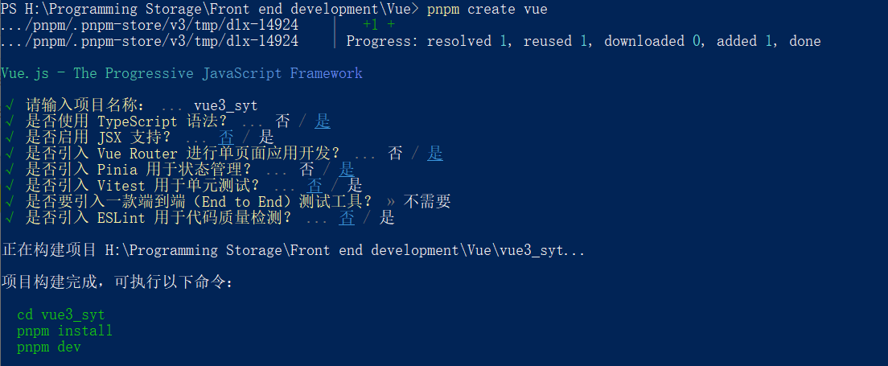
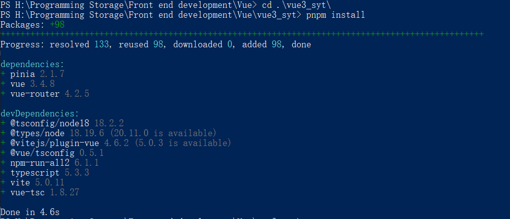
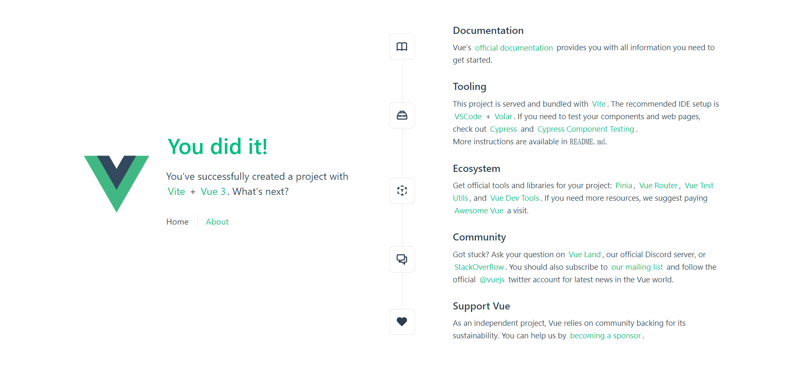
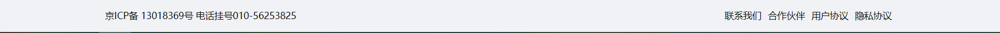
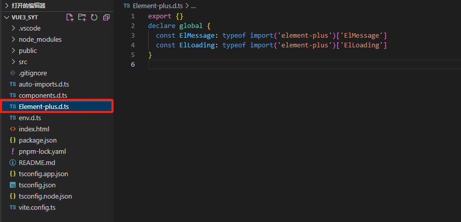
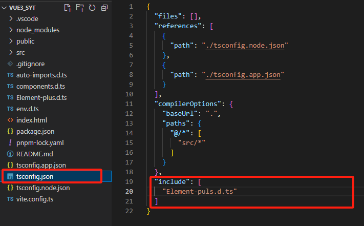
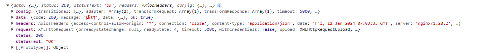

# 零、项目介绍与初始创建

[演示地址](http://syt.atguigu.cn/)

[医院接口](http://139.198.34.216:8201/swagger-ui.html)

[公共数据接口](http://139.198.34.216:8202/swagger-ui.html)

[会员接口](http://139.198.34.216:8203/swagger-ui.html)

[短信验证码接口](http://139.198.34.216:8204/swagger-ui.html)

[订单接口](http://139.198.34.216:8206/swagger-ui.html)

[文件上传接口](http://139.198.34.216:8205/swagger-ui.html)

[后台用户接口](http://139.198.34.216:8212/swagger-ui.html)

## 技术栈

+ Vue3
+ Vite
+ TypeScript
+ vue-router
+ Pinia
+ element-plus

## 能学习到什么

1. 二维码登录业务
2. 微信支付
3. svg矢量图
4. 路由鉴权
5. 封装通用组件
6. vue3组合式API

## 项目初始化

### 1. 创建项目

1. 创建项目

```bash
pnpm create vue
```



2. 安装依赖

```bash
cd vue3_syt
pnpm install
```



3. 运行

```bash
pnpm run dev
```



### 2. 调整目录

```txt
public
├── vite.svg
src
├── assets
│   └── vue.svg(删除)
├── components
│   └── .(删除)
├── App.vue(修改)
├── main.ts(修改)
index.html
```

+ `public/vite.svg` 站点图标
+ `index.html` 静态页面

```vue
// src/App.vue

<template>
	<div>
    app
  </div>
</template>
```

```ts
// src/main.ts

import { createApp } from 'vue'
import App from './App.vue'

const app = createApp(App)
app.mount('#app')
```

### 3. 调整项目配置

#### 3.1 设置浏览器自动打开

如果你每次输入 `pnpm run dev` 都需要手动点开链接的话，配置这个文件就可以让你输入命令后浏览器自动打开网页。

```json
// package.json

  "scripts": {
    "dev": "vite --open"
  }
```

这个设置看个人需求，反正我是不需要的 :smile:

#### 3.2 设置别名 @

有的时候在项目里面用 `../../` 很容易指错路径，因此可以给 `src` 起一个别名 `@` ，这样看起来就会很方便很整洁。

1. 安装依赖

```bash
pnpm i @types/node --save-dev
```

2. 修改配置

```ts
// vite.config.ts

import path from 'path'

export default defineConfig({
  ...
  resolve: {
  	alias: {
      "@": path.resolve(__dirname, 'src')
    }
	}
})
```

3. 让编辑器可以对路径进行智能提示

```json
// tsconfig.json

"compilerOptions": {
  ...
  "baseUrl": ".",
  "paths": {
    "@/*": ["src/*"]
}
```

### 4. 搭建静态资源

#### 4.1 把 `images` 文件夹放到 `src/assets` 下面

#### 4.2 清除默认样式

1. 百度搜索 `npm官网`
2. 进去以后搜索 `reset.scss` ，把代码复制下来，放到 `src/style/reset.scss` 里面
3. 安装依赖 

```bash
pnpm i sass
```

4. 引入样式清除默认样式

```ts
// src/main.ts

import '@/style/reset.scss'
```

#### 4.3 搭建静态组件 - 顶部

1. 新建文件 `src/components/hospital_top/index.vue` 

```vue
<script setup lang="ts">

</script>

<template>
  <div>
    
  </div>
</template>

<style scoped></style>
```

2. 引入全局组件

```ts
// src/main.ts

import HospitalTop from '@/components/hospital_top/index.vue'

app.component('HospitalTop', HospitalTop)
```

```vue
// src/App.vue

<template>
	<div class="container">
    <HospitalTop></HospitalTop>
    <div class="content">
      hhahah
    </div>
  </div>
</template>

<style scoped lang="scss">
.container{
  display: flex;
  flex-direction: column;
  align-items: center;
  .content{
    margin-top: 70px;
    width: 1200px;
    min-height: 700px;
  }
}
</style>
```

3. 查看网页，引入成功后，修改 `src/components/hospital_top/index.vue` 

```vue
<script setup lang="ts">

</script>

<template>
  <div class="top">
    <div class="content">
      <!-- 左侧 -->
      <div class="left">
        
        <p>商医通 预约挂号统一平台</p>
      </div>
      <div class="right">
        <p class="help">帮助中心</p>
        <p class="login">登录/注册</p>
      </div>
    </div>
  </div>
</template>

<style scoped lang="scss">
.top {
  position: fixed;
  z-index: 999;
  width: 100%;
  height: 70px;
  // background: #fff;
  display: flex;
  justify-content: center;
  .content{
    width: 1200px;
    height: 70px;
    background: white;
    display: flex;
    justify-content: space-between;
    .left{
      display: flex;
      justify-content: center;
      align-items: center;
      img{
        width: 50px;
        height: 50px;
        margin-right: 10px;
      }
      p{
        font-size: 20px;
        color: #55a6fe;
      }
    }
    .right{
      display: flex;
      align-items: center;
      justify-content: center;
      font-size: 14px;
      color: #bbb;
      .help{
        margin-right: 10px;
      }
    }
  }
}
</style>
```


#### 4.4 搭建静态组件 - 底部

1. 新建文件 `src/components/hospital_bottom/index.vue` 

```vue
// src/components/hospital_bottom/index.vue

<template>
	<div>
    底部
  </div>
</template>
```

2. 引入全局组件

```ts
// src/main.ts

import HospitalBottom from '@/components/hospital_bottom/index.vue'

app.component('HospitalBottom', HospitalBottom)
```

```vue
// src/App.vue

<template>
	<div class="container">
    ...
    <HospitalBottom></HospitalBottom>
  </div>
</template>
```

3. 引入成功后，修改 `hospital_bottom/index.vue` 的代码

```vue
<script setup lang="ts">

</script>

<template>
  <div class="bottom">
    <div class="content">
      <div class="left"> 京ICP备 13018369号 电话挂号010-56253825 </div>
      <div class="right">
        <span>联系我们</span>
        <span>合作伙伴</span>
        <span>用户协议</span>
        <span>隐私协议</span>
      </div>
    </div>
  </div>
</template>

<style scoped lang="scss">
.bottom {
  width: 100%;
  height: 50px;
  background: #f0f2f5;
  display: flex;
  justify-content: center;

  .content {
    width: 1200px;
    height: 100%;
    display: flex;
    justify-content: space-between;
    align-items: center;
    font-size: 14px;
    .right{
      span{
        margin: 0 5px;
      }
    }
  }
}
</style>
```



### 5. 路由搭建与滚动条到顶

1. 将原先的默认路由删除，更改路由内容

```ts
// src/router/index.ts

import { createRouter, createWebHistory } from 'vue-router'


const router = createRouter({
  history: createWebHistory(import.meta.env.BASE_URL),
  routes: [
    {
      path: '/home',
      component: () => import('@/views/home/index.vue')
    },
    {
      path: '/hospital',
      component: () => import('@/views/hospital/index.vue')
    },
    {
      path: '/',
      redirect: '/home'
    }
  ],
  scrollBehavior () {
    return {
      left: 0,
      top: 0
    }
  }
})

export default router
```

2. 全局引用路由

```ts
// src/main.ts

import router from '@/router'

app.use(router)
```

```vue
// src/App.vue

<template>
	<div class="container">
    ...
    <div class="content">
      <router-view></router-view>
  	</div>
  </div>
</template>
```

### 6. 引入 Element-Plus

1. 命令安装element-plus

```bash
pnpm add element-plus
```

2. 按需引入，安装插件

```ts
pnpm add -D unplugin-vue-components unplugin-auto-import
```

3. 配置文件实现自动导入

```ts
// vite.config.js

...
import AutoImport from 'unplugin-auto-import/vite'
import Components from 'unplugin-vue-components/vite'
import { ElementPlusResolver } from 'unplugin-vue-components/resolvers'

export default defineConfig({
  plugins: [
    ...
    AutoImport({
      resolvers: [ElementPlusResolver()]
    }),
    Components({
      resolvers: [ElementPlusResolver()]
    })
  ]
})
```

4. 设置中文

```ts
// src/main.ts

import ElementPlus from 'element-plus'
//@ts-ignore
import zhCn from 'element-plus/dist/locale/zh-cn.mjs'

app.use(ElementPlus, {
  locale: zhCn,
})
```

#### 6.1 解决按需导入时 ElMessage 在 ts 里面不能识别的问题

1. 在根目录下创建一个 Element-plus.d.ts 的文件（如果觉得名字不好，可以改，但要以**.d.ts**结束就行）

```ts
// Element-plus.d.ts

export {}
declare global {
  const ElMessage: typeof import('element-plus')['ElMessage']
}
```



2. 在 tsconfig.json 文件添加一行代码

```json
// tsconfig.json

{
  ...,
  "include": [
  	"Element-plus.d.ts"
  ]
}
```



至于为什么要这样设置，可以查看这篇文章：

[vite + vue + ts 自动按需导入 Element Plus组件，并如何解决按需引入后ElMessage与ElLoading 的问题（找不到名称“ElMessage”问题。）](https://blog.csdn.net/weixin_59916662/article/details/127334196?spm=1001.2101.3001.6661.1&utm_medium=distribute.pc_relevant_t0.none-task-blog-2~default~CTRLIST~Rate-1-127334196-blog-126390938.235^v38^pc_relevant_anti_t3&depth_1-utm_source=distribute.pc_relevant_t0.none-task-blog-2~default~CTRLIST~Rate-1-127334196-blog-126390938.235^v38^pc_relevant_anti_t3&utm_relevant_index=1)

### 7. Axios 二次封装

1. 安装axios

```bash
pnpm add axios
```

2. 封装 axios 模块

```ts
// src/utils/request.ts

import axios from 'axios'

const request = axios.create({
  baseURL: '/api',
  timeout: 5000
})

request.interceptors.request.use((config) => {
  return config
})

request.interceptors.response.use(
  (response) => {
    return response
  },
  (error) => {
    let status = error.response.status
    // console.log(error)

    if (status >= 400 && status <= 500) {
      ElMessage.error(error.message)
      return
    } else if (status >= 500) {
      ElMessage.error('服务器挂了')
      return
    }

    return Promise.reject(new Error(error.message))
  }
)

export default request
```

3. 配置跨域代理

```ts
// vite.config.ts

export default defineConfig({
  ...
  server: {
    proxy: {
      '/api': {
        target: 'http://syt.atguigu.cn',
        changeOrigin: true
      }
    }
  }
})
```

4. 可以测试一下 axios 有没有成功

```vue
// src/App.vue

<script setup lang="ts">
import request from '@/utils/request'
import { onMounted } from 'vue'
  
onMounted(() => {
  request.get('/hosp/hospital/1/10').then((res) => {
    console.log(res)
  })
})
</script>
```

控制台出现这段信息就证明 axios 配置成功，往后记得删除这段代码哦



### 8. Pinia

1. 在开始创建项目的时候已经引入 Pinia，因此直接初始化即可

```ts
// src/stores/index.ts

import { createPinia } from 'pinia'

export default createPinia()
```

```ts
// src/main.ts

import pinia from '@/stores'

app.use(pinia)
```

### 9. 路由鉴权 & 网页标题设置

根据学习进度的话这个环节是在所有课程最后一个环节

1. 下载 `nprogress` 

```bash
pnpm add nprogress
```

2. 新建 `src/permisstion.ts` 

```ts
// src/permisstion.ts

import router from './router'
import Nprogress from 'nprogress'
import 'nprogress/nprogress.css'

Nprogress.configure({ showSpinner: false })

router.beforeEach((to, from, next) => {
  Nprogress.start()
  next()
})

router.afterEach((to, from) => {
  Nprogress.done()
})
```

3. 在全局组件引入

```ts
// src/main.ts

import './permisstion'
```

4. 修改网页标题为 `尚医通 - xxx` 的形式

```ts
// src/router/index.ts

const router = createRouter({
  routes: [
    {
      path: '/home',
      component: () => import('@/views/home/index.vue'),
      meta: {
        title: '首页'
      }
    },
    {
      path: '/hospital',
      component: () => import('@/views/hospital/index.vue'),
      children: [
        {
          path: 'register',
          component: () => import('@/views/hospital/register/index.vue'),
          meta: {
            title: '预约挂号'
          }
        },
        {
          path: 'detail',
          component: () => import('@/views/hospital/detail/index.vue'),
          meta: {
            title: '医院详情'
          }
        },
        {
          path: 'notice',
          component: () => import('@/views/hospital/notice/index.vue'),
          meta: {
            title: '预约通知'
          }
        },
        {
          path: 'close',
          component: () => import('@/views/hospital/close/index.vue'),
          meta: {
            title: '停诊信息'
          }
        },
        {
          path: 'search',
          component: () => import('@/views/hospital/search/index.vue'),
          meta: {
            title: '查询与取消'
          }
        },
        {
          path: 'register_step1',
          component: () =>
            import('@/views/hospital/register/register_step1.vue'),
          meta: {
            title: '预约第一步'
          }
        },
        {
          path: 'register_step2',
          component: () =>
            import('@/views/hospital/register/register_step2.vue'),
          meta: {
            title: '预约第二步'
          }
        }
      ]
    },
    ...
    {
      path: '/user',
      component: () => import('@/views/user/index.vue'),
      children: [
        {
          path: 'certification',
          component: () => import('@/views/user/certification/index.vue'),
          meta: {
            title: '实名认证'
          }
        },
        {
          path: 'order',
          component: () => import('@/views/user/order/index.vue'),
          meta: {
            title: '挂号订单'
          }
        },
        {
          path: 'patient',
          component: () => import('@/views/user/patient/index.vue'),
          meta: {
            title: '就诊人管理'
          }
        },
        {
          path: 'profile',
          component: () => import('@/views/user/profile/index.vue'),
          meta: {
            title: '账号信息'
          }
        },
        {
          path: 'feedback',
          component: () => import('@/views/user/feedback/index.vue'),
          meta: {
            title: '信息反馈'
          }
        }
      ]
    }
  ]
})
```

```ts
// src/permisstion.ts

router.beforeEach((to, from, next) => {
  ...
  document.title = `尚医通 - ${to.meta.title}`
})
```

5. 修改路由鉴权，使得只有登录才能进入其他页面，否则只能进入有限的页面

```ts
// src/permisstion.ts

// 路由鉴权: 就是路由能不能被访问到权限 -> 全局守卫完成
import router from './router'
import Nprogress from 'nprogress'
import 'nprogress/nprogress.css'
import pinia from '@/stores'
import useUserStore from './stores/modules/user'

let userStore = useUserStore(pinia)
let whiteList = [
  '/home',
  '/hospital/register',
  '/hospital/detail',
  '/hospital/notice',
  '/hospital/close',
  '/hospital/search'
]

Nprogress.configure({ showSpinner: false })

router.beforeEach((to, from, next) => {
  Nprogress.start()
  document.title = `尚医通 - ${to.meta.title}`
  // 判断用户是否登录token
  let token = userStore.userInfo.token
  if (token) {
    next()
  } else {
    if (whiteList.includes(to.path)) {
      next()
    } else {
      userStore.visiable = true
      next({ path: '/home', query: { redirect: to.fullPath } })
    }
  }
})

router.afterEach((to, from) => {
  Nprogress.done()
})
```

```vue
// src/components/login/index.vue

<script setup lang="ts">
import { useRouter, useRoute } from 'vue-router'
  
let $router = useRouter()
let $route = useRoute()

const login = async () => {
  ...
  try {
    ...
    let redirect = $route.query.redirect
    if (redirect) {
      $router.push(redirect as string)
    } else {
      $router.push('/home')
    }
  } catch (error) { ... }
}
</script>
```

