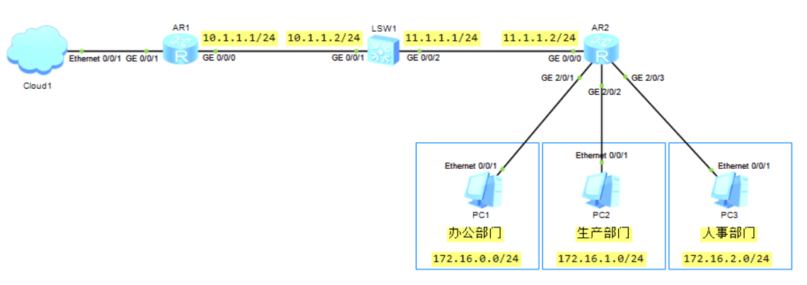
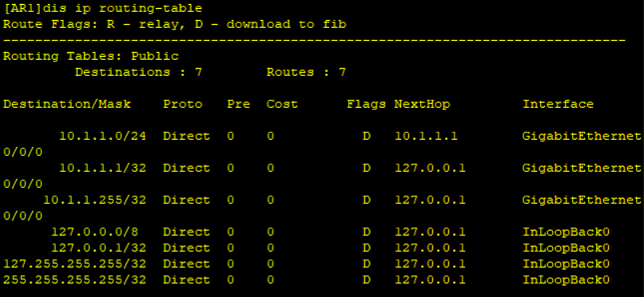
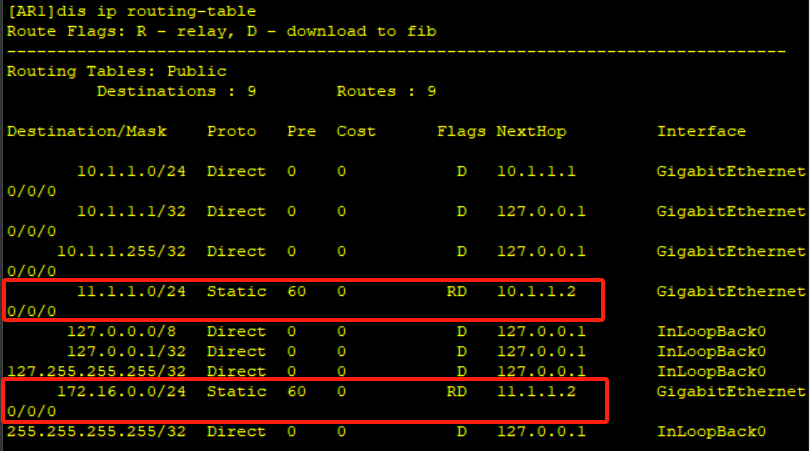
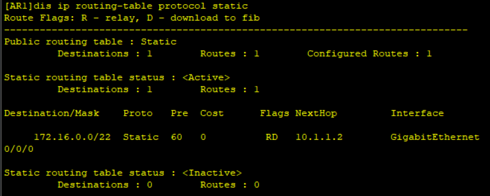
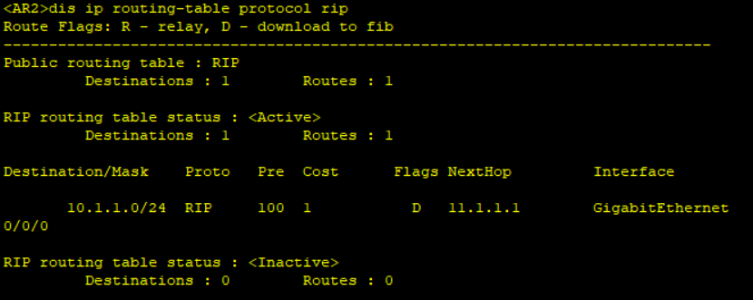
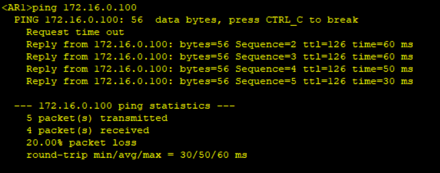
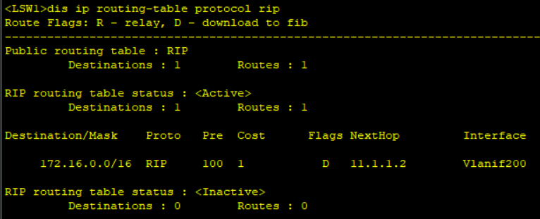
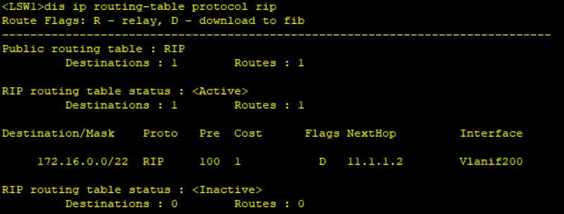
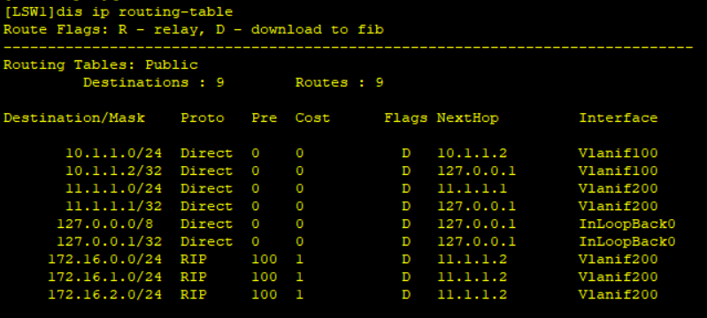
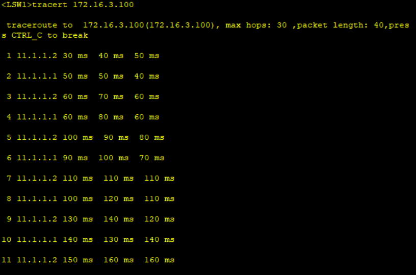

# 路由交换网络专题（1）



## 问题&解答

### 1. 保证 AR1 使用静态路由与办公部门、生产部分、人事部门通信的配置。 

```bash
[AR1] ip route-static 172.16.0.0 24 10.1.1.2
[AR1] ip route-static 172.16.0.0 24 10.1.1.2
[AR1] ip route-static 172.16.0.0 24 10.1.1.2
```

::: important 知识点

静态路由的配置

```bash
[Huawei] ip route-static 目的地址 目的地址掩码 下一跳地址
```

:::

### 2. 如果 AR1 与办公部门通信时，下一跳指向 AR2 的 G0/0/0 接口，则 AR1 需要进行什么查询方式，并且需要几次这样的查询，在路由表中如何体现该查询方式。

+ 需要进行递归查询
+ 2次
+ 在路由表中，Flag字段以“R”为标记

::: note 解析

其实，想要复现很简单。

首先，先把上一步的静态路由清除掉，然后增加一条静态路由，目的地址是`172.16.0.0/24`，下一跳地址是`11.1.1.2`，此时查看路由表

```bash
[AR1] ip route-static 172.16.0.0 24 11.1.1.2
```



会发现，根本就没有在路由表显示。

这是因为，对于AR1而言，它是不知道怎么去到`11.1.1.2`这个地址的，因此要让AR1知道的话，就还需要增加一条静态地址，目的地址是`11.1.1.2/24`，下一跳地址是`10.1.1.2`。

```bash
[AR1] ip route-static 11.1.1.2 24 10.1.1.2
```

这个时候AR1才会知道，哦~原来我要去`11.1.1.2`，就必须得经过`10.1.1.2/24`；然后我要去`172.16.0.0`，就得去`11.1.1.2/24`。



:::

### 3. 在不考虑路由环路与路由安全的前提下，AR1 保证和所有部门通信的，最少配置多少条静态路由（非默认路由）。

+ 最少配置1条

::: note 解析

在问题只是提到AR1与其他部门的通信，那么，可以把其他部门的IP汇聚成一条即可。

所有部门的IP汇聚成一条的话，既可以是`172.16.0.0/16`，如果需要更加精确一点的话就汇聚成`172.16.0.0/22`。

```bash
[AR1] ip rout-static 172.16.0.0 22 10.1.1.2
```



:::

### 4. AR1 使用静态路由的情况下，如果 AR2 运行 RIP 协议（版本 2），保证所有部门与 AR1 可以通信，则 AR2 配置 RIP 协议（版本 2）时需要宣告哪几个网段，可以传递多少条路由给自己的邻居。 

+ 宣告`172.16.0.0`网段和`11.0.0.0`网段
+ 传递3条路由

::: note 解析

因为根据RIP Version 2的原理，尽管宣告的是2个网段，但是传递路由的时候还是会传递`172.16.0.0`、`172.16.1.0`、`172.16.2.0`这三条路由。

```bash
[AR2] rip 1
[AR2-rip-1] version 2
[AR2-rip-1] network 172.16.0.0
[AR2-rip-1] network 11.0.0.0
```

:::

### 5. AR1 作为企业网边界，负责内外网通信，如果租用固定 IP 地址，则网络中那些设备需要配置默认路由。

+ AR1、AR2、LSW1

::: note 解析

只要访问外网，那么企业内部只要是三层节点都需要配置默认路由去外网。

:::

### 6. AR1 使用静态路由情况下，如果 AR2 运行 RIP 协议（版本 2），LSW1 是否需要运行 RIP 协议（版本 2）， 如果需要，请列举配置；如果不需要，请说明原因。 

+ 需要运行RIP协议

  ```bash
  [LSW1] rip 1
  [LSW1-rip-1] version 2
  [LSW1-rip-1] network 10.0.0.0
  [LSW1-rip-1] network 11.0.0.0
  ```

::: note 解析

目前，AR2配置了RIP协议，AR1配置的是静态路由，那么，AR2现在要学习AR1的网段，中间就势必查了一个网段，这个时候，中间的LSW1就需要运行RIP协议，这样AR2才能学习到AR1的路由。

当LSW1配置完成后，查看AR2的路由表。



这个时候AR1去pingPC，是能够ping通的



:::

### 7. AR2 在 RIP 进程下配置什么命令，可以使网络通信正常的情况下，LSW1 的路由条目减少。如果只在 LSW1 运行此命令，自身的路由表中存在的 RIP 路由条目是多少条。

+ 配置路由聚合
+ 3条

::: note 解析

1. 在AR2上，可以直接在RIP里面进行路由聚合

```bash
[AR2] rip
[AR2-rip-1] summary always
```



此时可以看到，AR2自动聚合成`172.16.0.0/16`的路由.

当然，如果想要更加精确的话，可以直接在G0/0/0的接口上手动聚合

```bash
[AR2] interface GigabitEthernet 0/0/0
[AR2-GigabitEthernet0/0/0] rip summary-address 172.16.0.0 255.255.252.0
```



2. 单单只是在LSW1上做聚合并没有什么用，因为RIP做聚合的意思是先聚合路由再发布出去，但是在LSW1上接收路由的设备做聚合，并不会影响自身的聚合，所以不能生效。

   

:::

### 8. 配置了用于减少 LSW1 路由条目的命令，并且配置了所有的默认路由后，管理员为了测试部门网络通信情况，登录 LSW1 上进行 ping 测试，但是不小心测试了一个不存在的网络地址（例如：172.16.3.100）， 网络会出现什么问题？如何解决？

+ 网络会出现数据转发环路。可以在AR2上配置一条静态的黑洞路由，直接把这条路由丢弃。

  ```bash
  [AR2] ip route-static 172.16.0.0 16 NULL 0
  ```

::: note 解析

想要更加直观的看到数据转发环路，可以使用如下命令：

```bash
<LSW1> tracert 172.16.3.100
```

此时会出现如图所示的情况



那是因为，AR2上有一条默认路由是直接去到外界网络的，下一跳是`11.1.1.1`，而LSW1也有一条汇聚路由。此时，在LSW1上ping一条不存在的路由，数据包到达AR2的时候，会发现，欸，根本就没有这个路由啊，咋办？此时，又因为AR2有一条默认路由，而默认路由有一个属性，就是当这个路由转发数据时发现没有任何路由可以到达这个目标网段，那么存在这个默认路由的话，AR2就会把这个默认路由当成救命稻草，把这个数据包发送给LSW1。

到了LSW1，虽然LSW1有默认路由，但是因为LSW1上是有一条汇聚路由`172.16.0.0/16`的，它又认为`172.16.3.100`是在这条汇聚路由，所以它不会用到最终决策的默认路由，因此还是根据这条汇聚路由发送出去。

:::