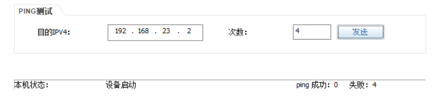

# 七、ACL配置

## 重要配置命令

```bash
# 1.基本 ACL
[Huawei] acl 2000 # 创建 ACL 2000
[Huawei] acl name linNB 2000 # 创建名为 linNB 的 ACL 2000
[Huawei-acl-basic-2000] rule 5 permit source 192.168.10.0 0.0.0.255 # 规则 5，放行源地址为 192.168.10.0/24
网段的数据通过
[Huawei-acl-basic-2000] rule 5 deny source 192.168.10.0 0.0.0.255 # 规则 5，拒绝源地址为 192.168.10.0/24
网段的数据通过
[Huawei-acl-basic-2000] rule 5 permit source any # 规则 5，放行任意源地址网段的数据通过
[Huawei-acl-basic-2000] rule 5 deny source any # 规则 5，拒绝任意源地址网段的数据通过
[Huawei-GigabitEthernet0/0/0] traffic-filter inbound acl 2000 # 在 g0/0/0 接口调用入方向 ACL 2000
[Huawei-GigabitEthernet0/0/0] traffic-filter outbound acl 2000 # 在 g0/0/0 接口调用出方向 ACL 2000

# 2.扩展 ACL
[Huawei] acl 3000 # 创建 ACL 3000
[Huawei-acl-adv-3000] rule deny tcp source 192.168.1.0 0.0.0.255 source-port eq 80 destination 192.168.2.0
0.0.0.255 destination-port eq 80 # 拒绝 192.168.1.0/24 网段 TCP 80 端口访问
192.168.2.0/24 网段 TCP 80 端口

# 3.时间 ACL
[Huawei] time-range A 9:00 to 17:00 working-day # 配置时间列表 A 为工作日的 9:00 至 17:00
[Huawei] time-range A from 0:00 2021/1/1 to 0:00 2022/1/1 # ACL 时间列表范围为 2021 年 1 月 1 日 0 点至 2022
年 1 月 1 日 0 点
[Huawei-acl-basic-2000] rule deny source 192.168.1.0 0.0.0.255 time-range A # 拒绝时间列表的 192.168.1.0/24
网段数据过
[Huawei-GigabitEthernet0/0/0] traffic-filter inbound acl 2000 # 在 g0/0/0 接口调用入方向 ACL 2000

# 4.IP 前缀列表
[Huawei] ip ip-prefix 1 index 5 permit 10.1.1.0 24 # 规则 5 匹配 10.1.1.0/24 网段
[Huawei] ip ip-prefix 1 index 5 deny 10.1.1.0 24 # 规则 5 不匹配 10.1.1.0/24 网段
[Huawei] ip ip-prefix 1 index 5 permit 10.1.1.0 24 greater-equal 26 less-equal 32 # 规则 5 匹配 10.1.1.0/24，26 到 32 掩码长度网段
```

## ACL配置

### 1. 基础ACL配置

#### 拓扑


#### 准备工作

| 设备名称 |      IP地址      |      网关       |
| :------: | :--------------: | :-------------: |
| Server1  | 192.168.100.1/24 | 192.168.100.254 |
|   PC1    |  192.168.1.1/24  |  192.168.1.254  |
|   PC2    |  192.168.2.1/24  |  192.168.2.254  |

#### 步骤

1. 先配置好AR1

```bash
[AR1] interface GigabitEthernet 0/0/0
[AR1-GigabitEthernet0/0/0] ip address 192.168.100.254 24
[AR1-GigabitEthernet0/0/0] interface GigabitEthernet 0/0/1
[AR1-GigabitEthernet0/0/1] ip address 192.168.1.254 24
[AR1-GigabitEthernet0/0/1] interface GigabitEthernet 0/0/2
[AR1-GigabitEthernet0/0/2] ip address 192.168.2.254 24
```

2. 在AR1上配置ACL

```bash
[AR1] acl 2000
[AR1-acl-basic-2000] rule 10 deny source 192.168.1.0 0.0.0.255
[AR1-acl-basic-2000] quit
[AR1] interface GigabitEthernet 0/0/0
[AR1-GigabitEthernet0/0/0] traffic-filter outbound acl 2000
```

3. 配置完成后，测试PC1、PC2和Server之间是否互相通

+ PC1 ping Server1 不通


+ PC2 ping Server 通


+ PC1 ping PC2 通


### 2.高级ACL配置

#### 拓扑


#### 准备工作

| 设备工作 |     IP地址     |     网关      |
| :------: | :------------: | :-----------: |
|  Client  | 192.168.1.1/24 | 192.168.1.254 |
|   PC1    | 192.168.2.1/24 | 192.168.2.254 |
|  Server  | 192.168.3.1/24 | 192.168.3.254 |

#### 步骤

1. 配置路由，让网络互通

```bash
# AR1
[AR1] interface GigabitEthernet 0/0/0
[AR1-GigabitEthernet0/0/0] ip address 192.168.12.1 24
[AR1-GigabitEthernet0/0/0] interface GigabitEthernet 0/0/1
[AR1-GigabitEthernet0/0/1] ip address 192.168.1.254 24
[AR1-GigabitEthernet0/0/1] quit
[AR1] ip route-static 0.0.0.0 0 192.168.12.2

# AR2
[AR2] interface GigabitEthernet 0/0/0
[AR2-GigabitEthernet0/0/0] ip address 192.168.12.2 24
[AR2-GigabitEthernet0/0/0] interface GigabitEthernet 0/0/1
[AR2-GigabitEthernet0/0/1] ip address 192.168.23.2 24
[AR2-GigabitEthernet0/0/1] interface GigabitEthernet 0/0/2
[AR2-GigabitEthernet0/0/2] ip address 192.168.2.254 24
[AR2-GigabitEthernet0/0/2] quit
[AR2] ip route-static 192.168.1.0 24 192.168.12.1
[AR2] ip route-static 192.168.3.0 24 192.168.23.3

# AR3
[AR3] interface GigabitEthernet 0/0/0
[AR3-GigabitEthernet0/0/0] ip address 192.168.23.3 24
[AR3-GigabitEthernet0/0/0] interface GigabitEthernet 0/0/1
[AR3-GigabitEthernet0/0/1] ip address 192.168.3.254 24
[AR3-GigabitEthernet0/0/1] quit
[AR3] ip route-static 0.0.0.0 0 192.168.23.2
```

2. 在AR1上配置ACL

```bash
[AR1] acl 3000
[AR1-acl-adv-3000] rule 10 permit tcp source 192.168.1.1 0 destination 192.168.3.1 0 destination-port eq www
[AR1-acl-adv-3000] rule 20 permit ip source 192.168.1.1 0 destination 192.168.2.0 0.0.0.255
[AR1-acl-adv-3000] rule 30 deny ip source 192.168.1.1 0 destination any
[AR1-acl-adv-3000] quit
[AR1] interface GigabitEthernet 0/0/1
[AR1-GigabitEthernet0/0/1] traffic-filter inbound acl 3000
```

3. 测试是否互通

+ Client 能够访问Server的web服务


+ Client1 可以ping 通 192.168.2.0/24 的主机


+ Client1 不能ping 通 server1 （192.168.3.1）


+ Client1 不能ping 通 192.168.12.1


+ Client1 不能ping 通 192.168.12.2


+ Client1 不能ping 通 192.168.23.2



+ Client1 不能ping 通 192.168.23.3


+ Client1 不能ping 通 192.168.3.254


### 3. VLAN与基础ACL配置

#### 拓扑


#### 准备工作

| 设备名称 | IP地址         | 网关          |
| -------- | -------------- | ------------- |
| PC1      | 192.168.1.1/24 | 192.168.1.254 |
| PC2      | 192.168.2.1/24 | 192.168.2.254 |
| Server1  | 192.168.3.1/24 | 192.168.3.254 |

#### 步骤

1. 配置路由，让网络互通

```bash
# AR1配置
[AR1] interface GigabitEthernet 0/0/0
[AR1-GigabitEthernet0/0/0] ip address 192.168.12.1 24
[AR1-GigabitEthernet0/0/0] interface GigabitEthernet 0/0/1
[AR1-GigabitEthernet0/0/1] ip address 192.168.1.254 24
[AR1-GigabitEthernet0/0/1] quit
[AR1] ip route-static 0.0.0.0 0 192.168.12.2

# AR2配置
[AR2] interface GigabitEthernet 0/0/0
[AR2-GigabitEthernet0/0/0] ip address 192.168.12.2 24
[AR2-GigabitEthernet0/0/0] interface GigabitEthernet 0/0/1
[AR2-GigabitEthernet0/0/1] ip address 192.168.2.254 24
[AR2-GigabitEthernet0/0/1] interface GigabitEthernet 0/0/2
[AR2-GigabitEthernet0/0/2] ip address 192.168.3.254 24
[AR2-GigabitEthernet0/0/1] quit
[AR2] ip route-static 192.168.1.0 24 192.168.12.1
```

测试，PC1、PC2和Server可以用互通

2. 配置交换机LSW1、LSW2

```bash
[LSW1] vlan 10
[LSW1-vlan10] interface GigabitEthernet 0/0/1
[LSW1-GigabitEthernet0/0/1] port link-type access
[LSW1-GigabitEthernet0/0/1] port default vlan 10
[LSW1-GigabitEthernet0/0/1] interface GigabitEthernet 0/0/2
[LSW1-GigabitEthernet0/0/2] port link-type access
[LSW1-GigabitEthernet0/0/2] port default vlan 10

[LSW2] vlan 20
[LSW2-vlan20] quit
[LSW2] port-group group-membet GigabitEthernet 0/0/1 GigabitEthernet 0/0/2
[LSW2-port-group] port link-type access
[LSW2-port-group] port default vlan 20
```

3. 在AR2中配置ACL

```bash
[AR2] acl 2000
[AR2-acl-basic-2000] rule 10 deny source 192.168.1.0 0.0.0.255
[AR2-acl-basic-2000] quit
[AR2] interface GigabitEthernet 0/0/2
[AR2-GigabitEthernet0/0/2] traffic-filter outbound acl 2000
```

4. 配置后测试互通性

+ PC1 ping Server 不通


+ PC2 ping Server 通


+ PC1 ping PC2 通


## 补充知识

路由有两个概念，控制层面与转发层面。`控制层面`可以理解为路由学习的过程。学习后，设备把学习到的路由条目进行数据发送的时候，依据路由条目发送到目的地，发送这个过程就叫做`转发层面`。

所以，ACL可以粗略的认为是在转发层面上进行操作，IP前缀列表配置是在控制层面上进行操作。