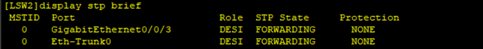

# 三、生成树实例&链路聚合

## 重要命令配置

生成树实例命令

```bash
[Huawei] stp mode stp # 配置生成树模式为 stp
[Huawei] stp root primary # 配置当前设备为根桥设备
[Huawei] stp root secondary # 配置当前交换设备为备份根桥设备
[Huawei] stp priority 0 # 配置设备生成树的优先级为 0
[Huawei-GigabitEthernet0/0/1] stp port priority 0 # 配置端口的优先级为 0
[Huawei-GigabitEthernet0/0/1] stp cost 1000 # 配置端口的路径开销为 1000
[Huawei] stp mode mstp # 配置生成树模式为 mstp
[Huawei] stp region-configuration # 进入 MST 域
[Huawei-mst-region] region-name SW # MST 域名为 SW
[Huawei-mst-region] instance 10 vlan 10 # 将 vlan10 映射进实例 10
[Huawei-mst-region] active region-configuration # 激活 MST 域配置
[Huawei-GigabitEthernet0/0/1] stp instance 10 cost 20000 # 配置端口在实例 10 中的路径开销为 1000
[Huawei-GigabitEthernet0/0/1] stp edged-port enable # 配置 g0/0/1 为边缘端口
```

链路聚合命令

```bash
[Huawei] interface Eth-Trunk 0 # 进入聚合端口 0
[Huawei-Eth-Trunk0] mode manual load-balance # 配置聚合端口模式为手工模式
[Huawei-Eth-Trunk0] trunkport GigabitEthernet 0/0/1 # 将 g0/0/1 端口加入聚合链路
[Huawei-Eth-Trunk0] trunkport GigabitEthernet 0/0/2 # 将 g0/0/1 端口加入聚合链路
[Huawei-Eth-Trunk0] mode lacp-static # 配置聚合端口模式为 LACP 协商模式
[Huawei-Eth-Trunk0] load-balance src-dst-ip # 配置聚合端口流量基于源目 IP 地址的负
```

## 拓扑


## 实验步骤

### 链路聚合

#### 手工模式

1. 在LSW1、LSW2上配置手工模式的链路聚合

```bash
# LSW1
[LSW1] interface Eth-Trunk 0
[LSW1-Eth-Trunk0] mode manual load-balance
[LSW1-Eth-Trunk0] trunkport GigabitEthernet 0/0/1
[LSW1-Eth-Trunk0] trunkport GigabitEthernet 0/0/2
# LSW2
[LSW2] interface Eth-Trunk 0
[LSW2-Eth-Trunk0] mode manual load-balance
[LSW2-Eth-Trunk0] trunkport GigabitEthernet 0/0/1
[LSW2-Eth-Trunk0] trunkport GigabitEthernet 0/0/2
```

使用`display eth-trunk 0`可以查看链路聚合是否配置成功


#### lacp 模式

要想实现lacp模式，得先把之前的配置删除掉

```bash
[LSW1-Eth-Trunk0] undo trunkport GigabitEthernet 0/0/1 to 0/0/2
[LSW2-Eth-Trunk0] undo trunkport GigabitEthernet 0/0/1 to 0/0/2
```

配置lacp模式

```bash
# LSW1
[LSW1-Eth-Trunk0] mode lacp-static
[LSW1-Eth-Trunk0] trunkport GigabitEthernet 0/0/1 to 0/0/2
# LSW2
[LSW2-Eth-Trunk0] mode lacp-static
[LSW2-Eth-Trunk0] trunkport GigabitEthernet 0/0/1 to 0/0/2
```

使用`display eth-trunk 0`查看配置是否成功


### 生成树实例

1. 通过`display stp brief`可以看到`LSW1`是根桥，`LSW3`的`g0/0/2`是阻塞端口。


2. 那么现在，可以手动配置LSW2为根桥设备，只需要在LSW2上配置即可

```bash
[LSW2] stp root primary
[LSW2] display stp brief
```

此时LSW2变为根桥设备




3. 想要逆转效果，可以使用如下命令

```bash
[LSW2] undo stp root
```

逆转成功


4. 现在想要LSW2的g0/0/3阻塞，只需要更改其cost值即可

```bash
[LSW2-GigabitEthernet0/0/3] stp cost 300000
```

