# 九、OSPF路由协议配置

## 重要配置命令

```bash
[Huawei] ospf 1 # 配置 ospf 协议进程 1
[Huawei-ospf-1] area 0 # 进入 arer 0 区域
[Huawei-ospf-1-area-0.0.0.0] network 12.0.0.0 0.0.0.255 # 宣告 12.0.0.0/24 网段

[Huawei-ospf-1-area-0.0.0.1] stub # 配置 area 1 区域为末节区域
[Huawei-ospf-1-area-0.0.0.1] stub no-summary # 配置 area 1 区域为完全末节区域
[Huawei-ospf-1-area-0.0.0.1] nssa # 配置 area 1 区域为非纯末节区域
[Huawei-ospf-1-area-0.0.0.1] nssa nssa no-summary # 配置 area 1 区域为非纯完全末节区域

[Huawei-ospf-1] preference 100 # 修改路由优先级为 100

[Huawei-GigabitEthernet0/0/0] ospf cost 10 # 修改 ospf 的接口 cost 为 10

[Huawei-ospf-1-area-0.0.0.1] abr-summary 192.168.0.0 255.255.252.0 # 配置域内聚合路由 192.168.0.0，掩码为255.255.252.0

[Huawei-ospf-1] asbr-summary 192.168.0.0 255.255.0.0 # 配置外部聚合路由 192.168.0.0，掩码为 255.255.0.0

[Huawei-ospf-1] default-route-advertise always cost 5 # 始终下发默认路由且 cost 值为 5

[Huawei-ospf-1] silent-interface GigabitEthernet 0/0/0 # 配置 g0/0/0 为抑制接口

[Huawei] acl 2000 # 创建 acl 2000
[Huawei-acl-basic-2000] rule deny source 192.168.1.0 0.0.0.255 # 丢弃源地址段为 192.168.1.0/24 的路由
[Huawei-ospf-1] filter-policy 2000 import # 调用 acl 2000 的接收路由方向的过滤列表

[Huawei-ospf-1-area-0.0.0.0] authentication-mode # 配置 area 0 区域认证（后续需带有参数）
[Huawei-GigabitEthernet0/0/0] ospf authentication-mode #（后续需带有参数）
# 注：ospf 认证参数包括认证模式为 simple、md5、hmac-sha256、keychain；口令模式为 plain：明文、cipher：密文
```

## 重点解释

（1）OSPF 只能在接收路由的方向执行路由过滤。 

（2）OSPF 只能在 ABR 进行域内路由聚合，在 ASBR 

## 拓扑


## 步骤

1. 先配置AR1的环回接口

```bash
[AR1] interface LoopBack 0
[AR1-LoopBack0] ip address 192.168.0.1 24
[AR1-LoopBack0] interface LoopBack 1
[AR1-LoopBack1] ip address 192.168.1.1 24
[AR1-LoopBack1] interface LoopBack 2
[AR1-LoopBack2] ip address 192.168.2.1 24
[AR1-LoopBack2] interface LoopBack 3
[AR1-LoopBack3] ip address 192.168.3.1 24
[AR1-LoopBack3] interface LoopBack 4
[AR1-LoopBack4] ip address 192.168.100.1 24
```

2. 配置各个路由器接口IP地址

```bash
[AR1] interface GigabitEthernet 0/0/0
[AR1-GigabitEthernet0/0/0] ip address 12.0.0.1 24

[AR2] interface GigabitEthernet 0/0/0
[AR2-GigabitEthernet0/0/0] ip address 12.0.0.2 24
[AR2-GigabitEthernet0/0/0] interface GigabitEthernet 0/0/1
[AR2-GigabitEthernet0/0/1] ip address 23.0.0.2 24

[AR3] interface GigabitEthernet 0/0/0
[AR3-GigabitEthernet0/0/0] ip address 23.0.0.3 24
[AR3-GigabitEthernet0/0/0] interface GigabitEthernet 0/0/1
[AR3-GigabitEthernet0/0/1] ip address 34.0.0.3 24
[AR3-GigabitEthernet0/0/1] interface GigabitEthernet 0/0/2
[AR3-GigabitEthernet0/0/2] ip address 35.0.0.3 24

[AR4] interface GigabitEthernet 0/0/0
[AR4-GigabitEthernet0/0/0] ip address 34.0.0.4 24
[AR4-GigabitEthernet0/0/0] interface LoopBack 0
[AR4-GigabitEthernet0/0/1] ip address 192.168.200.1 24

[AR5] interface GigabitEthernet 0/0/0
[AR5-GigabitEthernet0/0/0] ip address 35.0.0.5 24
```

3. 将AR1的LoopBack0、LoopBack1、LoopBack2、LoopBack3、LoopBack4宣告进OSPF，AR1的LoopBack4、AR4的LoopBack0宣告为RIP

```bash
[AR1] ospf
[AR1-ospf-1] area 1
[AR1-ospf-1-area-0.0.0.1] network 192.168.0.0 0.0.0.255
[AR1-ospf-1-area-0.0.0.1] network 192.168.1.0 0.0.0.255
[AR1-ospf-1-area-0.0.0.1] network 192.168.2.0 0.0.0.255
[AR1-ospf-1-area-0.0.0.1] network 192.168.3.0 0.0.0.255
[AR1-ospf-1-area-0.0.0.1] quit
[AR1-ospf-1] quit
[AR1] rip
[AR1-rip-1] version 2
[AR1-rip-1] network 192.168.100.0
[AR1-rip-1] quit
[AR1] ospf
[AR1-ospf-1] area 1
[AR1-ospf-1-area-0.0.0.1] network 12.0.0.0 0.0.0.255

[AR2] ospf
[AR2-ospf-1] area 1
[AR2-ospf-1-area-0.0.0.1] network 12.0.0.0 0.0.0.255
[AR2-ospf-1-area-0.0.0.1] quit
[AR2-ospf-1] area 0
[AR2-ospf-1-area-0.0.0.0] network 23.0.0.0 0.0.0.255

[AR3] ospf
[AR3-ospf-1] area 0
[AR3-ospf-1-area-0.0.0.0] network 23.0.0.0 0.0.0.255
[AR3-ospf-1-area-0.0.0.0] area 2
[AR3-ospf-1-area-0.0.0.2] network 34.0.0.0 0.0.0.255
[AR3-ospf-1-area-0.0.0.2] area 3
[AR3-ospf-1-area-0.0.0.3] network 35.0.0.0 0.0.0.255

[AR4] ospf
[AR4-ospf-1] area 2
[AR4-ospf-1-area-0.0.0.2] network 34.0.0.0 0.0.0.255
[AR4-ospf-1-area-0.0.0.2] quit
[AR4-ospf-1] quit
[AR4] rip
[AR4-rip-1] version 2
[AR4-rip-1] network 192.168.200.0

[AR5] ospf
[AR5-ospf-1] area 3
[AR5-ospf-1-area-0.0.0.3] network 12.0.0.0 0.0.0.255 
```

配置完成后，可以使用`display ospf peer brief`查看ospf的互联状态

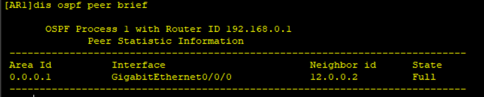

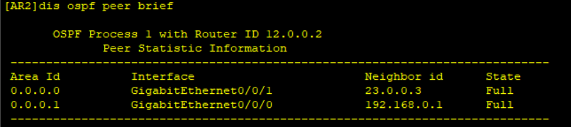

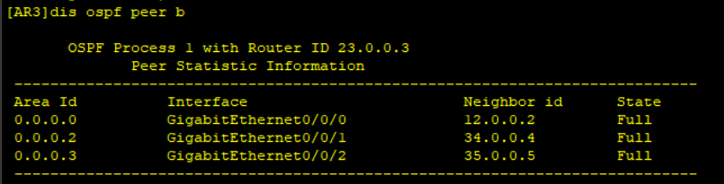

4. 现在AR3和AR5配置stub区域

```bash
# 配置stub区域
[AR3] ospf 1
[AR3-ospf-1] area 3
[AR3-ospf-1-area-0.0.0.3] stub
[AR5] ospf 1
[AR5-ospf-1] area 3
[AR5-ospf-1-area-0.0.0.3] stub
```

这个时候在AR5上发现多了一条默认路由

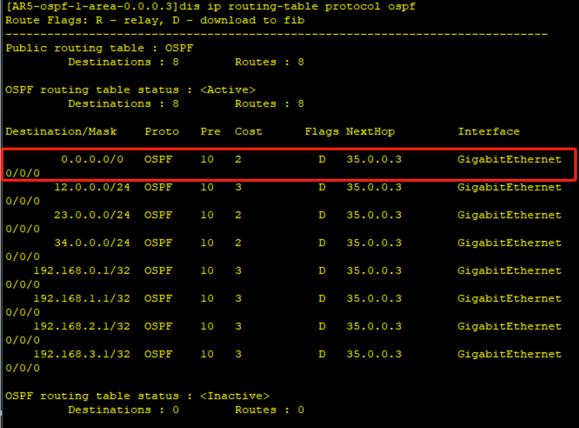

如果此时在AR3和AR5上配置`stub no-summary`，查看AR5的路由表，只剩下一条路由

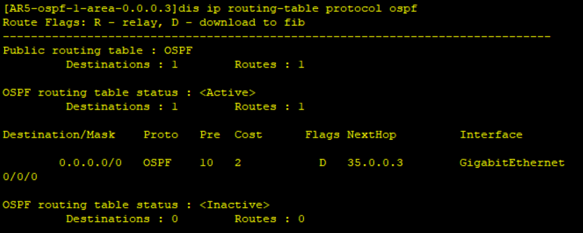

5. 现在在AR3和AR4配置nssa区域

```bash
# 配置ospf区域
[AR3] ospf
[AR3-ospf-1] area 2
[AR3-ospf-1-are-0.0.0.2] nssa
[AR4] ospf
[AR4-ospf-1] area 2
[AR4-ospf-1-are-0.0.0.2] nssa
```

此时查看AR4的路由表

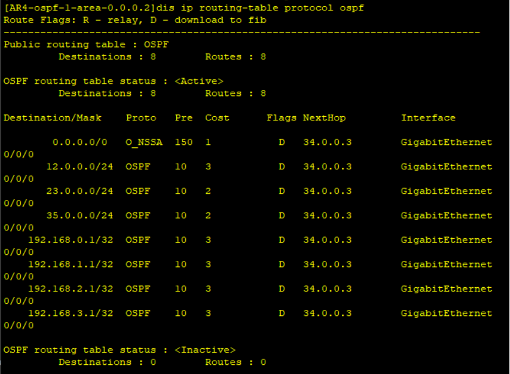

6. 聚合路由

```bash
[AR2] ospf
[AR2-ospf-1] area 2
[AR2-ospf-1-area-0.0.0.2] abr-summary 192.168.0.0 255.255.252.0
```

此时查看AR3的路由表，发现会少了很多路由信息

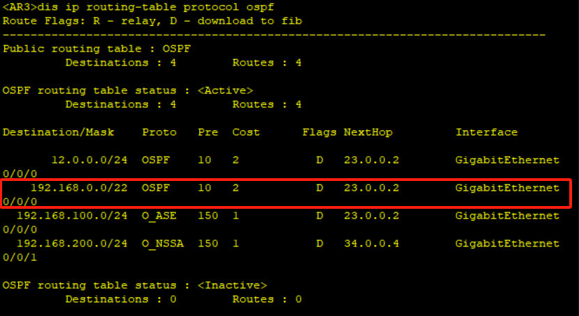

7. 在AR1上给所有设备下发默认路由

```bash
[AR1] ospf
[AR1-ospf-1] default-route-advertise always 
```

此时在AR2上查看路由表会多了一条默认路由

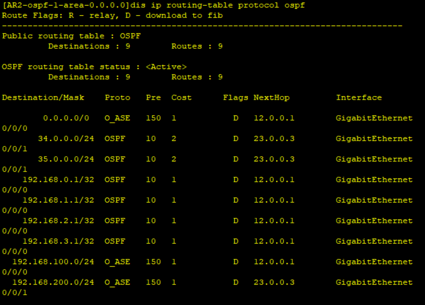

通过AR1下发的默认路由，是5类LSA

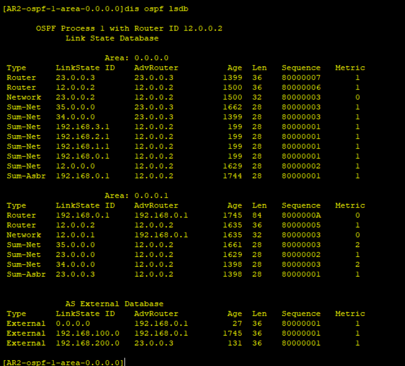

8. 路由过滤，过滤掉AR1上的192.168.100.0网段

```bash
[AR2] acl 2000
[AR2-acl-basic-2000] rule deny source 192.168.100.0 0.0.0.255
[AR2-acl-basic-2000] rule permit
[AR2-acl-basic-2000] quit
[AR2] ospf
[AR2-ospf-1] filter-policy 2000 import 
```

此时查看AR2的路由表，会发现上面已经没有192.168.100.0网段的路由了

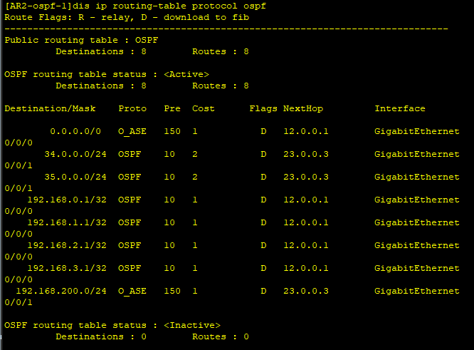

::: info 此时AR3上还能收到192.168.100.0网段的路由吗？

查看一下AR3的路由表

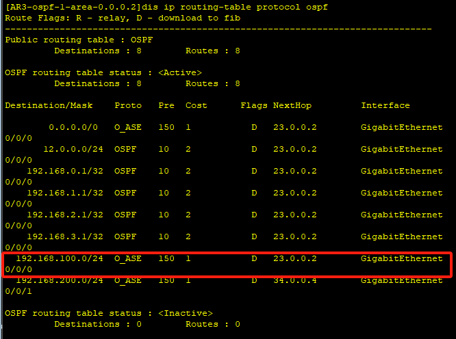

AR2只是在计算路由的时候过滤掉192.168.100.0网段，并不代表收不到LSA，此时192.168.100.0的网段转换成3类LSA再转发出去

:::

